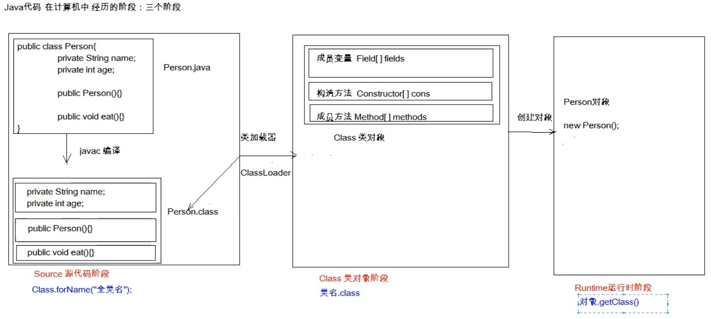
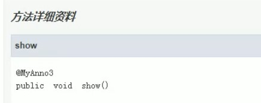
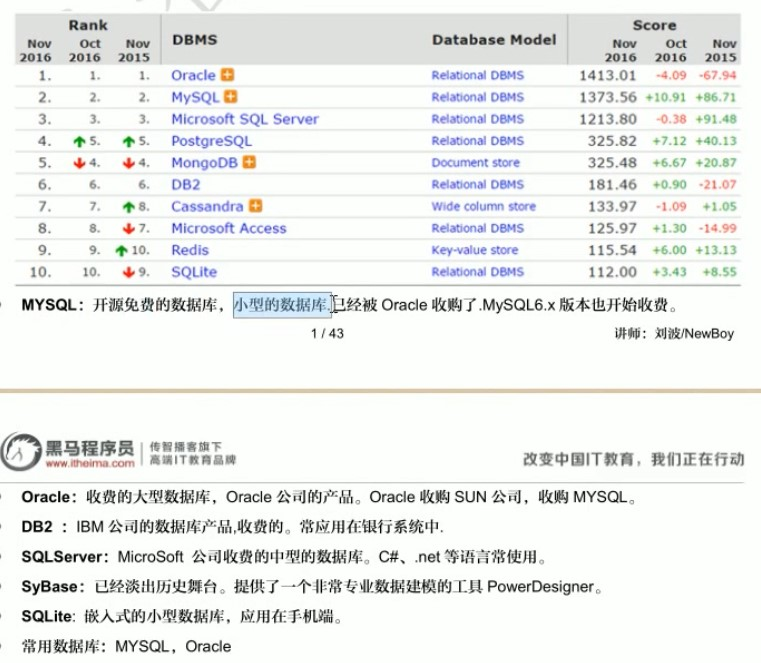
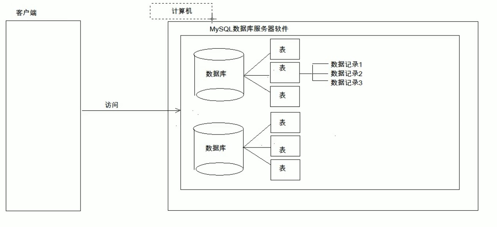

# 1. 反射：框架设计的灵魂
>也要看看代码，很重要

## 1.1. 基本知识
* 框架：半成品软件。在框架的基础上 进行软件开发，简化代码。开发框架用得到反射，但是使用框架并不太能用到，但能加深理解
* 反射：将类的各个组成部分封装为其他对象，这就是反射机制
    * 好处：
        1. 可以在程序运行的过程中操作这些对象。
        2. 可以降低程序耦合性，提高可扩展性
* 获取Class类对象的三种方式：
    1. 从第一个阶段：Class.forName("全类名")：将字节码文件加载近内存，返回Class对象
        * 多用于配置文件，将类名定义在配置文件中，读取文件加载类
    2. 从第二个阶段：通过类名的属性Class
        * 多用于参数的传递
    3. 从第三个阶段：对象.getClass()(封装到Object类中)
        * 多用于对象获取字节码的方式
    * 结论：同一个字节码文件（.class）在一次程序运行过程中，只会被加载一次，不论通过哪一种方式获取的class对象
* Class对象功能
    * 获取功能：
        1. 获取成员变量
            * Field	getDeclaredField(String name) 获取所有成员变量中，以name命名的成员变量
            * Field[]	getDeclaredFields() 获取所有的成员变量，包括private
            * Field	getField(String name) 指定名称的public修饰的成员变量
            * Field[]	getFields() 获取所有public修饰的成员变量
        2. 获取构造方法
            * Constructor<?>[] getConstructors()
            * Constructor<T> getConstructor(类<?>...parametertypes)
            * Constructor<T>  getDeclaredConstructor(类<?>...parametertypes)
            * Constructor<?>[]  getDeclaredConstructors()
        3. 获取成员方法
            * Method[] getMethods()
            * Method getMethod(String name,类<?>...parametertypes)
            * Method[] getDeclaredMethods()
            * Method getDeclaredMethod(String name,类<?>...parametertypes)
        4. 获取类名
            * getName()

* Field对象功能
    * 获取 Object	get(Object obj)
    * 设置 void	set(Object obj, Object value)
    * 忽略访问权限修饰符的安全检查 void	setAccessible(boolean flag)//Methods inherited from class java.lang.reflect.AccessibleObject

* Constructor：构造方法
    * 创建对象 newInstance(Object initargs)
    * 当要使用**无参**构造方法进行创建对象时，既可以通过Class对象获得构造器来获得，也可以通过Class类中的newInstance()来获得
* Method：成员方法
    * 执行方法 	invoke(Object obj, Object... args) 参数是对象以及方法参数列表
    * 获取方法名称 String getName()
* 案例：
    * 需求：写一个“框架”，可以帮我们创建任意类的对象并且执行任意方法
        * 实现：在不改变该类任意代码的前提下，但可以创建任意类对象并执行任意方法
            1. 配置文件
            2. 反射
        * 步骤：
            1. 将需要创建的对象的全类名和需要执行的方法定义在配置文件中
            2. 在程序中加载和读取配置文件
            3. 使用反射技术来加载类文件进入内存
            4. 创建对象
            5. 执行方法

## 1.2. 原理图解
 
>Field Constructor Method 都是类。Class类中有这三个类
# 2. 注解：

## 2.1. 基本概念
* 注解与注释
    * 注解概念：说明程序的，给电脑看。
        * 进一步：注解是一系列元数据，它提供数据用来解释程序代码，但是注解并非是所解释的代码本身的一部分。注解对于代码的运行效果没有直接影响。
    * 注释概念：用文字描述程序，给程序员看
## 2.2. 作用
1. 编译检查
    ```java
    @Override
    public String toString() {
      return name+"   "+age;
    }
    /*
    此处的overide用来检查toString是否是复写了父类的方法。
    */
    ```
2. 代码分析，通过代码里标识的注解对代码进行分析，（使用反射）
3. 编写文档：通过代码中标识的注解生成doc文档

## 2.3. java中预定义注解
* @Overrides :检测被该注解标注的方法是否重写父类方法(或实现接口接口)
* @Deprecated :将该注解标注的内容以过时，有更好的替代内容
* @SuppressWarnings :压制警告
    * 一般添加"all"参数，@SuppressWarnings("all")，放在类或者方法上面，使不显示警告
* @SafeVarargs：参数安全类型注解。它的目的是提醒开发者不要用参数做一些不安全的操作,它的存在会阻止编译器产生 unchecked 这样的警告。它是在 Java 1.7 的版本中加入的。
    ```java
    @SafeVarargs // Not actually safe!
        static void m(List<String>... stringLists) {
        Object[] array = stringLists;
        List<Integer> tmpList = Arrays.asList(42);
        array[0] = tmpList; // Semantically invalid, but compiles without warnings
        String s = stringLists[0].get(0); // Oh no, ClassCastException at runtime!
    }
    /* 上面的代码中，编译阶段不会报错，但是运行时会抛出 ClassCastException 这个异常，所以它虽然告诉开发者要妥善处理，但是开发者自己还是搞砸了。

    Java 官方文档说，未来的版本会授权编译器对这种不安全的操作产生错误警告。 */
    ```
* @FunctionalInterface：函数式接口注解，这个是 Java 1.8 版本引入的新特性。函数式编程很火，所以 Java 8 也及时添加了这个特性。函数式接口 (Functional Interface) 就是一个具有一个方法的普通接口。
    ```java
    @FunctionalInterface
    public interface Runnable {
        /**
         * When an object implementing interface <code>Runnable</code> is used
         * to create a thread, starting the thread causes the object's
         * <code>run</code> method to be called in that separately executing
         * thread.
         * <p>
         * The general contract of the method <code>run</code> is that it may
         * take any action whatsoever.
         *
         * @see     java.lang.Thread#run()
         */
        public abstract void run();
    }
    /* 我们进行线程开发中常用的 Runnable 就是一个典型的函数式接口，上面源码可以看到它就被 @FunctionalInterface 注解。

    可能有人会疑惑，函数式接口标记有什么用，这个原因是函数式接口可以很容易转换为 Lambda 表达式。这是另外的主题了，自己去查 */
    ```
## 2.4. 自定义注解
* 格式：
    元注解
    public @interface 注解名称{
        属性列表;
    }
* 本质：注解就是一个接口，该接口默认继承下面一个接口<br>
    public interface myAnnotation extends java.lang.annotation.Annotation{}
* 属性：
     * 定义：接口中可以定义的成员方法
     * 要求返回值类型只能以下几种   ：
        * 基本数据类型
        * String
        * 枚举
        * 注解
        * 以上数据类型的数组
     * 赋值：
        1. 定义了属性，在使用时需要给属性赋值，但也可以通过default关键字给属性默认初始化值，那么在使用注解时，就不必要进行赋值。
        2. 但如果只有一个属性值，那么在赋值时只要在括号中填入值即可
        3. 当为数组中只有一个值时，大括号可以省略。
        ```java
        @myAnnotation(age=2,name="Anna",anno=@myannno2,strs={"aa","bb"})
        @myAnnotation(2)
        ```
* 元注解：元注解是可以注解到注解上的注解，或者说元注解是一种基本注解，但是它能够应用到其它的注解上面。(前两个较常用)
    * @Target：用于描述注解能作用的位置,前三个重要,后面的6个可以自己查看源文档
        ```java
        摘自javadoc文档前三个：
            /** Class, interface (including annotation type), or enum declaration */
            TYPE,//类上

            /** Field declaration (includes enum constants) */
            FIELD,//成员变量上

            /** Method declaration */
            METHOD,//方法上

        全部：
            ElementType.ANNOTATION_TYPE 可以给一个注解进行注解
            ElementType.CONSTRUCTOR 可以给构造方法进行注解
            ElementType.FIELD 可以给属性进行注解
            ElementType.LOCAL_VARIABLE 可以给局部变量进行注解
            ElementType.METHOD 可以给方法进行注解
            ElementType.PACKAGE 可以给一个包进行注解
            ElementType.PARAMETER 可以给一个方法内的参数进行注解
            ElementType.TYPE 可以给一个类型进行注解，比如类、接口、枚举
        ```
    * @Retention:描述注解被保留的一个阶段
        * @Retention(value = RetentionPolicy.RUNTIME):当前描述的注解会保留到class字节码文件中并被jvm读取到,所以在程序运行时可以获取到它们。（一般是这个）
        * 如果是CLASS,那么会被加载到字节码文件中，但不会被jvm读取到
        * 如果是SOURCE,那么不会加载到字节码文件中。
    * @Documented：描述注解是否被抽取到doc文档中，如果在注解的定义中有标注@Documented，那么就会被加到doc文档中<br>
    * @Inherited：描述注解是否被子类继承。@myAnnotation被@Inherited描述，那么如果@myAnnotation描述一个类，那么这个类的子类也会从父类继承这个注解。
    * @Repeatable：表示注解中属性值可以取多个，其中要了解容器注解。
        ```java
        //什么是容器注解呢？就是用来存放其它注解的地方。它本身也是一个注解。
        @interface Persons {//容器注解
            Person[]  value();
        }


        @Repeatable(Persons.class)//括号中填入容器注解
        @interface Person{
            String role() default "";
        }


        @Person(role="artist")
        @Person(role="coder")
        @Person(role="PM")
        public class SuperMan{

        }
        ```

## 2.5. 使用（解析）注解

* 本质：获取注解中定义的属性值，把配置文件的工作交给注解来完成，简化配置操作。后期注解大多数用来替换配置文件。
* 步骤：
    1. 获取注解定义位置的对象（Class,Method,Field等）
    2. 获取指定的注解（getAnnotation）
    3. 调用注解中的抽象方法获取配置属性值

    ```java
     //摘抄部分代码，详情可以去看代码文件

     // 1 解析注解
        // 获取该类的字节码文件对象
        Class<AnnotationTest> annotationTestClsss = AnnotationTest.class;

        // 2获取上边的注解对象
        ProAnnotation pro = annotationTestClsss.getAnnotation(ProAnnotation.class);// 其实就是在内存中区生成了一个该注解接口的子类实现对相关
        /* 
        相当于：
        public class proImp1 implements ProAnnotation{
            public String className(){
                return "_1_java_base.base_strengthen.annotation.case_test.Person";
            }
            public String methodName(){
                return "eat";
            }
        }
        也就是说在调用getAnnotation时，就会把上面的那个类创建一个对象病返回给你，在通过接口接收
         */


        // 3调用注解对象中定义的抽象方法（也就是属性）获取返回值
        String className = pro.className();
        String methodName = pro.methodName();
    ```

## 2.6. 小结

* 以后大多数时候是使用注解而不是自定义注解
* 使用者：
    1. 编译器（检测程序是否编译正确，如@Override）
    2. 解析（测试）程序用（比如那个TestCheck,如果没有这个程序，注解毫无意义）。
        * 进一步：当开发者使用了Annotation修饰了类、方法、Field 等成员之后，这些 Annotation 不会自己生效，必须由开发者提供相应的代码来提取并处理 Annotation 信息。这些处理提取和处理 Annotation 的代码统称为 APT（Annotation Processing Tool)。
* 注解基本上认为不是程序的一部分，可以理解为相当于一个标签
* 本次这里有两个case，一个是通过注解代替配置文件，一个是通过注解检测是否有bug并输出到bug.txt


# 3. MySQL

## 3.1. 数据库基本概念
1. 英文名称：Database
2. 什么是数据库：
    * 用于存储和管理数据的仓库
3. 数据可特点：
    1. 持久化存储数据，其实数据库就是一个文件系统
    2. 方便存储和管理数据，使用了统一的方式操作数据库--SQL
4. 常用数据库软件：

## 3.2. 基本命令
* cmd->services.msc打开服务
* MySQL打开与关闭（cmd下）
    1. net start mysql 开启mysql（管理员权限打开cmd）
    2. net stop mysql 关闭mysql（管理员权限打开cmd）
* 登陆与退出（cmd下）
    * 本地：
        1. 登陆：mysql -uroot -proot 
            >-u:user，后面直接加用户名 -p:password,后面直接加密码
            >也可以写成--user=root --password=root
            >或者不直接加，只输入-p（即：mysql -uroot -p,之后输入密码会以*反显）
        2. 退出：exit
    * 远程：
        1. 登陆： mysql -h127.0.0.1 -uroot -proot
            >-h后直接加上ip地址，本机为127.0.0.1
        2. 退出：exit 或者 quit
        3. 登陆： mysql --host=127.0.0.1 --user=root --password=root
            >相当于全称，这里有两个-
## 3.3. 数据结构

* 安装目录
    * 配置文件 my.ini
* 数据目录
    * 计算机硬件和MySQL软件合称MySQL服务器
    * 数据库就是一个文件夹
    * 一个数据库中可以存放多张表，表对应文件夹中的.frm结尾文件
    * 每个表中存放多条数据记录