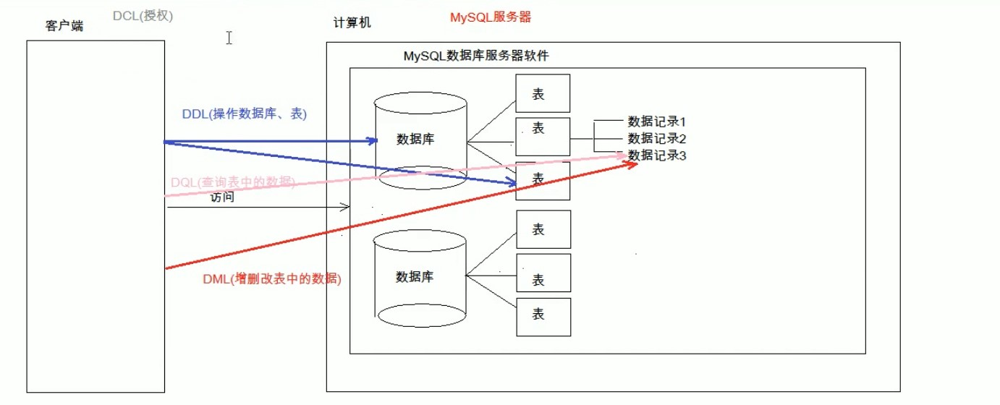
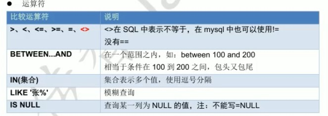
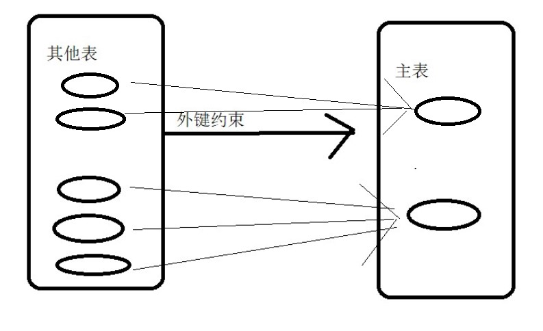

# 1. MySQL

## 1.1. 数据库基本概念

1. 英文名称：Database
2. 什么是数据库：
   - 用于存储和管理数据的仓库
3. 数据可特点：
   1. 持久化存储数据，其实数据库就是一个文件系统
   2. 方便存储和管理数据，使用了统一的方式操作数据库--SQL
4. 常用数据库软件：
   

## 1.2. 基本命令

- cmd->services.msc 打开服务
- MySQL 打开与关闭（cmd 下）
  1. net start mysql 开启 mysql（管理员权限打开 cmd）
  2. net stop mysql 关闭 mysql（管理员权限打开 cmd）
- 登陆与退出（cmd 下）

  - 本地：
    1. 登陆：mysql -uroot -proot
       > -u:user，后面直接加用户名 -p:password,后面直接加密码
       > 也可以写成--user=root --password=root
       > 或者不直接加，只输入-p（即：mysql -uroot -p,之后输入密码会以\*反显）
    2. 退出：exit
  - 远程：

    1. 登陆： mysql -h127.0.0.1 -uroot -proot

       > -h 后直接加上 ip 地址，本机为 127.0.0.1

    2. 退出：exit 或者 quit
    3. 登陆： mysql --host=127.0.0.1 --user=root --password=root

       > 相当于全称，这里有两个-

## 1.3. 数据结构


- 安装目录
  - 配置文件 my.ini
- 数据目录
  - 计算机硬件和 MySQL 软件合称 MySQL 服务器
  - 一个数据库就是一个文件夹
  - 一个数据库中可以存放多张表，表对应文件夹中的.frm 结尾文件
  - 每个表中存放多条数据记录

# 2. SQL 基础

## 2.1. 什么是 SQL

    Structured Query Language：结构话查询语言。
    其实就是操作所有关系型数据库(Relational DBMS)的规则
    每一种数据库操作方式存在不一样的地方，称为“方言”

## 2.2. 通用语法

1. SQL 可以单行或者多行书写，以分号结尾
2. 使用 table 制表符增强可读性
3. 数据库不区分大小写，但关键字推荐使用大写
  > **注意：linux中是字段名称是区分大小写的**
4. 3 种注释
   1. 单行注释：
      1. -- 内容（两个横杠和**一个空格**）
      2. #内容 （方言 MySQL 特有书写方式，不必要加空格）
   2. 多行注释：/_ 内容 _/

## 2.3. SQL 语句分类

1. DDL(data definition Language)
   用来定义数据库对象：数据库，表，列等。关键字：Creat，drop，alter 等
2. DML(Data Manipulation Language)
   用来对数据库中的数据进行增删。关键字：insert，delete，update 等。
3. DQL(Data Query Language)
   用来查询表中的记录（数据）。关键字 select，where 等
4. DCL(Data Control Language)
   数据控制语言，用来定义数据库访问权限和安全级别，及创建用户。关键字：GRANT，REVOKE 等
   


## 2.4. 数据类型


* 类型转换
  * 例：cast (department.budget to numeric(12,2))
* 从date/time/timestamp中提取部分时间
  * 例：extract(year from r.starttime)

</br>

* 操作数据类型
  * 创建数据类型
    * create type Dollars as numberic(12,2) final
      > 在人民币和美元都是数字，但有汇率的情况下可以创建数据类型帮助存储数据  
      > final无实意，是曾经标准所要求的，一些系统允许可以忽略,
  * 删除数据类型：delete
  * 修改数据类型：alter
* 操作域
  *  创建域
     * create domain DDollars as numberic not null;
* 数据类型和域的区别：
  * 域可以声明约束（not null,check等）
  * 域不是强类型，只要两个域中的数值类型相同，就能互相赋值；而数据类型不行


## 2.5. 语法

### 2.5.1. DDL(操作数据库)

- 对数据库整体

  1. C(Create) 创建

     - create database 数据库名

       > 重名时会报错

     - create database if not exists 数据库名

       > 当指定数据库名不存在时才创建，存在也不会报错

     - create database 数据库名 character set gbk

       > 以指定字符集创建数据库，这里为 gbk

  2. R(Retrieve) 查询

     - show databases;
       > 额外知识：
       > information_schema 用来 MySQL 中的一些信息，里面存放的是视图（以后才学），而不是表，并且并不对应物理文件
       > mysql 用来存放数据库中的核心数据
       > performance_schema 用来存放调整数据库性能的一些数据
       > 这是三个都最好不要改
     - show creat database 数据库名称

       > 查看某一个数据库字符集：查询某个数据库创建语句

  3. U(Update) 修改

     - alter database 数据库名称 character set 字符集名称

       > 修改某个数据库字符集（utf8，没有-）

  4. D(Delete) 删除

     - drop database 数据库名称

       > 一般不会做的操作

     - drop database if exists

       > 当数据库存在时才删除

  5. 使用数据库

     - select database()

       > 查询正在使用的数据库名称

     - use 数据库名称

       > 使用数据库，相当于进入数据库

- 对表整体

  1. C(Create) 创建

     - create table (if not exists) 表名(
       列名 1 数据类型 1,
       列名 2 数据类型 2,
       列名 3 数据类型 3,
       ......
       列名 n 数据类型 n;
       );
       > 创建表，注意小括号和逗号，最后一列没有逗号
       > 在声明字段后面加 defult 值1 可以用来设置默认值
       ```sql
       //常用数据类型例：
       age int
       score double(5,2)//最多有5位，小数点后保留两位
       riqi date 2000-12-12
       jjutiriqi datetime //格式举例：2000-12-12 12:12:12
       shijianchuo timestamp //格式举例：2000-12-12 12:12:12
       //时间戳：如果不给这个字段赋值，那么默认使用当前系统时间赋值
       name varchar(20)
       //字符串类型，最多20个字符
       ```
       ```sql
       //例：
       create table student(
           id int,
           name varchar(32),
           age int,
           score double(4,1),
           birthday date,
           inserttime timestamp
       );
       ```
     - create 新表 like 已经存在表

       > 创建一个新的表和已经存在的一个表结构相同，也就是赋值表

  2. R(Retrieve) 查询

     - show tables

       > 查询一个数据库中所有表的名称

     - desc 表名

       > 查询表结构

     - show create table 表名

       > 查询表的字符集

  3. U(Update) 修改<p id="DML_update"> </p>

     - alter table 表名 rename to 新表名;

       > 修改表名

     - alter table 表名 character set 字符集;

       > 修改表的字符集

     - alter table 表名 add 列名 数据类型;

       > 增加一列

     - alter table 表名 drop 列名;

       > 删除列

     - alter table 表名 change 旧列名 新列名 新列名类型

       > 修改列名称，类型

     - alter table 表名 modify 列名 新的类型

       > 只修改列的类型

  4. D(Delete) 删除

     - drop table (if exists) 表名

       > 删除表

     - truncate table 表名
       > 删除整个表再创建一个一模一样结构的表
       > 相当于一下两条语句整合
       > create 新表 like 已经存在表;
       > drop table 表名

### 2.5.2. DML(增删改表中数据)

1. 添加数据
   - insert into 表名(列名 1,列名 2.....列名 n) values(值 1,值 2...值 n),(值 1,值 2...值 n).....;
     > 往表中插入数据
     - 注意：
       1. 列名和值要一一对应
       2. 如果表名后没有写列名，那么默认给所有列添加值。但建议都写上，不要偷懒
       3. 除了数字类型，其他数据类型都要使用引号引起来，单引号双引号都行
2. 删除数据
   - delete from 表名 [where 条件]
     > 把满足条件的数据从指定表中删除。例： delete from student where id=1;
     - 注意：
       1. !!!!!如果不加条件，就会删除表中所有数据!!!!!!
       2. 但不推荐上述操作，因为会一条一条删除，效率太低，推荐使用 **truncate table 表名**;--删除整个表，然后再创建一个一模一样的空表
3. 修改数据
   - update 表名 set 列名 1=值 1,.....[where 条件];
     > 例：UPDATE student SET age=20,score=100 WHERE id=2;
     - 注意：
       1. 如果不加任何条件，就会把所有表中所有记录都修改，比如把 score 都改为 100
   - **case 结构使用**
     > 不同条件不同修改方式
     ```sql
     update
       student
     set
       score = case
               when score<60 then score+1 --没有逗号
               when score>95 then score-1
               else score*1.005
               end
     ```

### 2.5.3. DQL(表内数据查询)

- select \* from 表名

  > 查询表中所有数据

1. 整体语法： >所有语句都涉及到

   <pre>
       select 
           字段列表
       from
           表名列表
       where
           条件列表
       group by
           分组字段
       having
           分组之后的条件
       order by
           排序
       limit
           分页限定
   </pre>

2. 基础查询：

   1. 多个字段查询
      - select 字段名 from 表名;
        > 例：-- 查询姓名和年龄：SELECT NAME,age FROM student;
        > 一般不使用\*号，阅读性太差,也可以分分行，多加些注释
        > 
   2. 去除重复结果集

      - select distinct 字段名 from 表名;

        > 如果指定的多个字段名都相同，才可以去重

   3. 计算列
      - select 字段 1+字段 2 from 表名;
        > 计算两个字段相加结果,这里可以进行四则运算。
        > 例：SELECT id,score+age FROM student;
        > 
        > 如果有 null 参与的运算结果都是 null，因此有下面表达式：
      - select 字段 1+ifnull(表达式 1,表达式 2) from 表名;
        > 表达式 1：判断那个字段为 null。
        > 表达式 2：为 null 时的替换值。
        > 例：select id+ifnull(score,0) from student;
   4. 起别名
      - select 字段 1+字段 2 as 新名称 from 表名;
        > 将某个结果（列名字段或者表名）起一个别名用来显示出来,as 也能用**一个或者多个空格**表示。
        > 此时多分行比较好

3. 条件查询
   1. where 条件
   2. 运算符
      >  >
      > 例：select \* from student where age>15
      > 
   3. 注意：
      - null 不能使用=和<>来判断，应该使用 is 和 is not.
        > 例：select _ from student where age is null
        > select _ from student where age is not null <br>
        > 与 null 的任何比较运算（> < =）结果都为**unknown**(第三个逻辑值),并且：
        > true and unknownu=nknown
        > true or unknown:true
        > not unknown=unknown
   4. like：
      - \_:单个任意字符
      - %:多个任意字符
        > 例： select name from student where '李%'
        > 
4. 排序查询
   - select 字段 from 表名 order by 排序字段 1 排序方式 1,排序字段 2 排序方式 2....;
     > 排序方式：
     > ASC:升序（默认）
     > DESC:降序
     > 越靠后，排序优先度越低，只有靠第一种排序相同时，那么才考虑之后的排序方式
5. 聚合函数:将一列数据作为一个整体，进行**纵向**的计算。

   1. count:计算个数

      - 一般选择非空的列
      - 或者使用 count(\*)（不推荐）

        > count (distinct nam) 来去重（mysql 是否可用未证实）

   2. max:计算最大值
   3. min:计算最小值
   4. sum:计算和；
   5. avg:计算平均值

   - 注意：聚合函数计算会自动**排除 null 值**，可以通过 ifnull()来避免
   - 语法：select 函数(字段名) from 表名<br>select 函数(ifnull(字段名,值)) from 表名
     > 默认是保留重复元组进行计算，如果不想保留。可以写成：
     > 例：select count(distinct id) from student <br>
     > 如果为 null 按 1 算：
     > select count(ifnull(id,1)) from student) <br> > 

6. 分组查询
   > **任何没有出现在 group by 中的属性，如果要出现在 select 中的话，只能出现在聚集函数内部**
   - group by 分组字段;
     > 例：select sex,AVG(math),count(id) from student group by sex;
     > select 后有什么，后面就显示什么
     > <br>
     > 注意：分组之后查询字段：分组字段(比如 sex,如果用每个人都不同的字段分组，就没有意义了)，另外如果不进行分组就使用聚合函数的话，就相当于把整个表作为一个分组。
     > 例：<br>
   - 添加判断语句：
     > 普通 where 添加在前面，分组之后条件判断加载后面并且用 having 关键字
     > where 和 having 区别（**面试会考**）：
     1. where 在分组之前进行限定，不满足条件不参与分组， having 在分组之后进行限定，不满足条件不会被查询出来
     2. where 不可以进行聚合函数的判断，而 having 可以
        > [查看格式](#253-dql表内数据修改查询)
        > 例：
        > 
7. 分页查询

   - limit 开始的索引,每页查询的条数
     > 例：<br>select _from student limit 0,3;-- 从 0 开始查，显示三条记录。（第一页）
     > select _ from student limit 3,3;-- 从 3 开始，显示 3 条，（第二页）
     > 开始索引=（当前页码-1）\*每页显示条数
   - limit 这个语法是 SQL 的一个**方言**

8. 集合运算
   > 作用于两个关系，两关系中的属性类型要相同
   - (--查询语句 1，返回一个表)union(--查询语句 2，返回一个表)
     > 并运算。如果要保留所有重复，必须用 union all 替换掉 union
   - (--查询语句 1，返回一个表)intersect(--查询语句 2，返回一个表)
     > 交运算。如果要保留所有重复，必须用 intersect all 替换掉 intersect
   - (--查询语句 1，返回一个表)except(--查询语句 2，返回一个表)
     > 差运算.如果要保留所有重复，必须用 except all 替换掉 except

### 2.5.4. DCL

[跳转](#611-dcl)

## 2.6. 约束

### 2.6.1. 概念

> 对表中的数据进行限定，保证数据的正确性，有效性和完整性

### 2.6.2. 分类

- 主键约束 pramary key
- 非空约束 not null
- 唯一约束 unique
- 外键约束 foreign key

### 2.6.3. 非空约束

1. 在创建表是添加约束
   - 在数据定义后面加 空格+not null
     例：
     `SQL creat table stu{ id int, name varchar(20) not null -- name为非空约束 };`
2. 删除非空约束(就是修改表的一个字段)
   - alter table 表名 modify 字段名 字段类型
     > 也就是说后面什么都不加，就取消掉了约束
     > [跳转到列数据类型修改](#DML_update)
3. 创建表后添加非空约束

   - alter table 表名 modify 字段名 字段类型 not null

     > 和上面同理

### 2.6.4. 唯一约束

- 注意：MySQL 中唯一约束限定的列的值可以有多个 null

1. 创建表是添加唯一约束
   - 在数据定义后面加 空格和 unique
   - 在表的定义后面加上 unique(属性 1,属性 2,...) 括号里的属性构成候选码
     ```SQL
     creat table ste{
         id int,
         phont_number varchar(20) unique
     };
     ```
2. 删除唯一约束
   - alter table 表名 drop index 字段名
     > 唯一约束有时候也称为唯一索引，所有有 drop index
     > [跳转到列数据类型修改](#DML_update)
3. 创建表后添加唯一约束

   - alter table 表名 modify 字段名 字段类型 unique

     > 和非空约束添加同理，但当添加时，该列数据必须不能有重复的，否则会报错

### 2.6.5. 主键约束

- 含义：非空且唯一。是表中记录的唯一标识
- 限制：一张表只能有一个字段为主键

1. 创建表时添加主键约束

   - 后面加 primary key 即可

     ```SQL
     creat table stu(
         id int primary key,
         name varchar(20)
     );

     -- 约束格式也可以写成这样：
     creat table stu(
         id int,
         name varchar(20),
         primary key (id)
     );
     ```

2. 删除主键约束

   - alter table 表名 drop primary key;

     > 主键只有一个，所以不需要指定

3. 创建表后添加主键

   - alter table 表名 modify 字段名 字段类型 primary key;

     > 不能有重复数据以及空数据。

4. 自动增长
   - 概念：如果某一列是数值类型的，使用 auto_increment 可以完成值的自动增长
   - 基本上都是和主键一起使用，但也可以分开使用，但是这种情况很少
   - 语法：
     ```SQL
     creat table stu(
         id int primary key auto_increment,
         name varchar(20)
     );
     ```
     > 也可以手动设置，但每次增长是上次数据+1（也就是等价于最大值+1）

### 2.6.6. check 约束和断言

> 用来保证属性值满足指定的条件，实际上创建了一个强大的类型系统，类似于枚举

```sql
-- 例：
create table student(
  name varchar(32),
  id int(16),
  gender varchar(32),
  primary key(id),
  age int(16)
  check(gender in ('male','female') and age>10) -- in后面的也可以是select语句，但是有些数据库不支持
)

```

> 断言是一个谓语，表明希望数据库满足一个条件

### 2.6.7. 外键约束

- 情景
  > 有时数据会有冗余
  > 例：
  > 
  > 每个部门就在一个地方，不需要每条员工信息都记一次
  > <br>解决办法：
  > 创建两张表
  > 一张表记员工信息（employee 表），一张表记部门所在地（department 表）
  >  
  > 此时如果删除一个部门，另一张表中还有人对应那个部门，显然不合理。应该先删除人员。
- 为解决上述问题使用外键约束，即让表与表之间产生关系，从而确保数据的正确性。

1. 添加表时添加外键

   ```SQL
   creat table 表名(
       ...
       外键列
       constraint 外键名称(自己起名，不能重复) foreign key 外键列名称 references 主表名称(主表列名称)
       -- 一般都关联主键列，当然也能关联其他列
       -- 主表必须先存在，此处主表为部门表
       -- 必须先删除关联表记录，再删除主表记录
       -- 在多的一方建立外键，指向一的一方的主键
       -- contraint 外键名称 这部分也可以不写，系统会自动分配外键名称
   )

   -- 例：
   creat table employee(
       ...
       dep_id int, -- 外键对应主表的主键   --注意，此时该句不是最后一句，要加逗号
       constraint emp_dept foreign key (dep_id) references  department(id)
   )
   ```

   大致图解：
   

   > 此时若其他表记录与主表记录相互关联，那么就不能对该条主表记录进行删除
   > 同样，新加的其他表记录也必须与主表关联记录的所有数据中来取。例如这里新建员工体条目 dep_id 只能取 1 和 2 或者保留为 null

2. 删除外键

   - alter table 其他表的名 drop foreign key 外键名（自己起的那个）

3. 创建表之后，添加外键

   - alter table 其他表的名 add constraint 外键名称（自己起名，不能重复） foreign key 外键列名称 references 主表名称(主表列名称)

     > 中文括号是备注，英文括号中需要填东西

4. 级联操作

   - 情景

     > 当修改主表中的记录时，必须先修改与之关联的记录。为了方便修改数据，就有了级联操作。也就是修改一的同时自动修改多

   - 概念：当修改主表中的记录时，其他表中的记录也会跟着修改（使用一定要谨慎）

     > 比如这里修改 department 表中的一个 id 为 5，employee 表中对应 dep_id 也会修改为 5

   - 添加级联更新：

     - 在添加外键语句后 加上：on update cascade

   - 添加级联删除：

     - 在添加外键语句后 加上：on delete cascade

       例：

     ```SQL
     -- 先取消键的关联
     alter table employee drop foreign key emp_dept
     -- 再重新加上外键，此时添加级联更新语句和级联删除语句
     alter table employee add constraint emp_dept foreign key dem_id references department(id) on
     e
     ```

## 2.7. 数据库设计

### 2.7.1. 多表间关系

1. 多表间关系：

   - 一对一（了解）：

     - 如人的身份证

       > 一个人只能有一个身份证

   - 一对多（多对一）：
     - 如部门和部门
       > 一个部门能有多个员工
       > 一个员工只能在一个部门
   - 多对多
     - 如大学生选择课程
       > 一个学生能选多门课程，
       > 一个课程能被多个学生选择

2. 实现关系：
   - 一对多（多对一）
     - 实现方式：在多的一方建立外键，指向一的一方的主键
       
   - 多对多
     - 实现方式：通过中间表
       
   - 一对一（实际开发基本不会使用）
     - 实现方式：
     - 基本上会合成一张表，如果必须要用两张表的话：
     1. <br> 
     2. 使两表主键（id）相同

### 2.7.2. 范式

- 概念：在设计数据库是需要遵循的规范，要遵循后面的范式要求，必须要遵循前面所有范式。
  范式（数据库设计范式，数据库的设计范式）是符合某一种级别的关系模式的集合。构造数据库必须遵循一定的规则。在关系数据库中，这种规则就是范式。关系数据库中的关系必须满足一定的要求，即满足不同的范式。
- 分类(一般前三个就足够)：

  1. 第一范式（1NF）：每一列都是不可分割的原子数据项

     > 即每列不可分割。所有的表创建出来后都满足该范式

  2. 第二范式（2NF）：在 1NF 的基础上，非码属性必须依赖于候选码（在 1NF 基础上消除非主属性对主码的部分函数依赖）

     - 函数依赖：通过 A 的属性的值，可以确定唯一 B 的属性的值（A-->B），则称 B 依赖于 A。
     - 属性组：如果（A,B）-->C，则（A,B）称为一个属性组，合称为 D。
     - 完全函数依赖：如果 D 是一个**属性组**，通过 D 中所有属性才能确定 B 属性的唯一值，那么则称 B 完全依赖于 D
     - 部分函数依赖：如果 D 是一个**属性组**，通过 D 中部分属性便可以确定 B 属性的唯一的值，那么称 B 部分依赖于 D
     - 传递函数依赖：A-->B,B-->C(A,是属性或者属性组，B,C 是属性)，则称属性 C 函数传递依赖于 A
     - 码：如果一个属性或者属性组在一张表中被其他所有属性完全依赖，则称该属性或属性组为该表的**码**。比如学号和课程名称组合可以称为码
       _ 主属性：码属性组中的所有属性
       _ 非主属性：除码属性组中的所有属性

       > 即消除部分函数依赖

  3. 第三范式（3NF）：在 2NF 的基础上，任何非主属性不依赖于其他非主属性。（在 2 范式的基础上消除传递依赖。）
  4. Boyce-Codd 范式（BCNF）
  5. 第四范式（4NF）
  6. 第五范式（5NF）

- 情景举例：
  1. 第一范式所存在问题：
     
  2. 通过分表实行第二范式，解决第一个问题：
     
  3. 通过分表实行第三范式，解决第二三个问题。
     

## 2.8. 数据库备份和还原

> 其实就是将所有数据还原为命令行

1. 命令行
   - 备份（不用登陆）： mysqldump -u 用户名 -p 密码 指定数据库 > 保存的路径
   - 还原：
     1. 登陆数据库
     2. 创建数据库
     3. 使用数据库
     4. 执行文件：source 文件路径
2. 直接右键备份还原。

## 2.9. 多表查询

### 2.9.1. 小知识点

- 单表查询语法回顾：

    <pre>
        select 
            字段列表
        from
            表名
        where
            条件列表
        group by
            分组字段
        having
            分组之后的条件
        order by
            排序
        limit
            分页限定
    </pre>

- 多表查询查询出来的内容称为**笛卡尔积**
  > 即多个表的所有记录的所有组合，个数为 n*m *.....
  > 要完成多表查询，需要消除无用的数据

### 2.9.2. 多表查询分类

#### 2.9.2.1. 内连接查询

> **内连接中**on 和 where 其实可以互换，但也可以同时使用 on 和 where，on 来表示连接条件，where 表示筛选条件，阅读性 3 更好
> 默认就是内连接 inner 可以不写

- 自然连接查询
  > 作用于两个关系，并产生一个关系作为结果。将所有元祖进行笛卡尔积，并且只取共同属性值相同的组合。
  - select 字段列表 from 表名 1 natural join 表名 2

1. 隐式内连接

   - from 后有多个表，使用 where 条件消除无用的数据。表名.'列名' 来表示某表某列，单引号加不加都行

     > 例：emp.'dept_id'=dept.'id'

     ```SQL
     -- 例：
     select
         t1.name,
         t1.sex,
         t2.name  -- 2
     from
         employee t1,
         department t2   -- 1 先起别名，避免表名过长过于麻烦
     where
         t1.id=t2.id -- 3
     -- 格式仿照这样写，多分行方便加注释
     ```

2. 显式内连接

   - select 字段列表 from 表名 inner join 表名 2 on 条件

     > 通过 on 进行记录筛选。效果与隐式内连接相同
     > 显式连接可以减少字段的扫描，有更快的执行速度。这种速度优势在 3 张或更多表连接时比较明显

     ```SQL
     -- 例：
     select
         *
     from
         employee t1
     [inner] join
         department t2
     on
         t1.id=t2.id;
     ```

- 内连接查询注意：
  1. 从哪些表中查数据
  2. 查询条件是什么
  3. 查询那些字段

#### 2.9.2.2. 外连接查询

> 外连接在结果中会给某些元组中的属性赋空值从而保留本应在连接中丢失的元组
> **其次外连接中 on 和 where 作用不同**。on 后面是连接条件，并且对不满足条件的进行补空值，然后再通过 where 对连接结果进行筛选。
> 内连接中因为没有补空值这种操作所以 on 和 where 作用相同

1. 左外连接：
   - select 查询字段列表 from 表 1 left [outer] join 表 2 on 条件
   - 查询的是左表(语句中表的位置)所有记录与笛卡尔积中满足条件记录的和，不满足条件的左表记录，对应其他表数据会以 null 显示。
     
   ```SQL
   -- 例：
   select
       t1.*,t2.name
   from
       employee t1
   left join
       department t2
   on
       t1.id=t2.id  --如果不写这个的话可以在left前加一个natural
   ```
2. 右外连接：
   - select 查询字段列表 from 表 1 right [outer] join 表 2 on 条件
   - 查询的是右表中所有记录与笛卡尔积中满足条件记录的和，不满足条件的右表记录，对应其他表的数据会以 null 显示

- 可以注意到，只要掌握一个即可，把两个表换换位置就能从左变右，从右变左

3. 全外连接
   - full join
     > 保留出现在两个表中的所有元组

#### 2.9.2.3. 子查询

##### 2.9.2.3.1. 嵌套子查询

- 概念：查询中嵌套查询，称嵌套查询为子查询。

  ```SQL
  -- 如计算工资最高的人的姓名：
  select max(salary) from employee
  select * from employee where salary=9000 -- 不一定是9000，看上一条语句执行结果

  --上两条语句整合为：
  select * from employee where employee.'salary'=(select max(salary) from employee)
  -- 括号内为子查询
  -- 单个表时在列字段前面加不加表限定都行
  ```

- 不同情况

  1. 子查询结果是单行单列（**标量子查询**）

     - 这样的子查询可以放到 select 中，并且可以直接使用使用进行相等或者其他比较

       > 例：上面

  2. 子查询结果是多行单列

     - 使用运算符 in 来进行所有值的 or 操作(也有 not in 操作)：

       ```SQL
       -- 格式不知道是否规范！

       -- 查询两个部门对应的所有员工的信息
       select
           *
       from
           employee
       where
           id
       in
           (
           select
               id
           from
               department
           where
               name='财务部'
               or name='市场部'
           )
       ```

  3. 子查询结果是多行多列
     - 将子查询得到的结果也作为一个表来进行处理
       ```SQL
       -- 查询入职日期是2000-2-22之后的员工的信息
       -- 普通内连接
       select
           *
       from
           employee t1,
           department t2
       where
           t1.dept_id=t2.id
           and t1.join_date>'2000-2-22'
       -- 子表查询
       select
           *
       from
           employee t1,
           (
               select
                   *
               from
                   employee
               where
                   employee.join_date>'2000-2-22'
           ) t2
       where
           t1.id=t2.id
       ```

- 多表查询练习，再看下视频？

  - 自关联映射（不会的话看 30 分钟处）

##### 2.9.2.3.2. with 字句查询

> 进行临时定义关系，只对下面挨着的 select 语句有效

```sql
-- 镶嵌
select
     *
 from
     employee
 where
     id
 in
     (
     select
         id
     from
         department
     where
         name='财务部'
         or name='市场部'
     )

-- 等价with

with
  idtable(id) -- 表名(字段名1,字段名2....) 要和下面括号里select查询向对应
as
  (
    select
         id
     from
         department
     where
         name='财务部'
         or name='市场部'
  )   -- 此处还可以写个逗号，继续写  ...as... 定义多个临时表
select
  *
from
  depatment
where
  id
in
  idtable;

```

### 2.9.3. 表间关系

- 集合的比较
  - some
    > <some =some >some >=some <>some <=some 都可
    ```sql
    -- 找出年龄至少大于一个女生的男生
    select
      name
    from
      student
    where
     age>some (select
                age
              from
                student
              where
                sex='female')
    and
      sex='male'
    ```
  - all
    > <all =all >all <>all >=all <=all 都行
    ```sql
    -- 找出年龄大于所有女生的男生
    select
      name
    from
      student
    where
     age>all(select
                age
              from
                student
              where
                sex='female')
    ```
- exists:空关系测试

  ```sql
  -- 寻找2018级里当助教的学生
  select
    name
  from
    student s
  where
    year=2018
  and
    exists(
      select
        *
      from
        teacher T
      where
        S.id=T.id
    )
  -- **含义解析**：
  -- 在Student表中的每行数据，都去teacher表中找找有没有与之id相同的。
  -- 有的话返回true，没有的话就是false
  ```

  - unique：重复元组存在性测试(也有 not unique)
    > 如果子查询不存在与之重复的元组，将返回 true。也就是说
    > 尚未被广泛实现
    ```sql
    -- mysql中没有此语句的使用
    ```

## 2.10. 事务

### 2.10.1. 基本介绍

- 概念：
  - 如果一个包含多个步骤的业务操作，被事务管理，那么这些操作会同时成功或者同时失败
    
    > 拿 java 类比：
    > 被事务管理：编译。如果有语法错误，整个类都不会被编译
    > 不被事务管理：异常。出现异常后停止执行后面代码，前面代码已经执行
- 操作：

  1. 开启事务 start transaction
  2. 回滚 rollback
  3. 提交 commit

  ```SQL
  -- 例：张三给李四转500

  -- 0 开启事务
      start transaction;

  -- 1 张三账户-500
      update account set balance=balance-500 where name='zhangsan';

  --  **假设此处可能出错**

  -- 2 李四账户+500
      update account set balance=balance+500 where name='lisi';

  -- 中间没有发生错误，进行提交
      commit;

  -- 发现有错误，回滚.此时会回滚到开启事务之前
  -- 也可以说提交后没有事务开启了，此时rollback什么也不会发生
      rollback;
  ```

- 提交
  - 提交方式：
    1. mysql 默认是自动提交的，一条 DML（增删改）语句会自动提交一次.（oracle 是默认手动提交事务）
    2. 当开启事务后，就不会自动提交了，如果不进行手动提交数据不会被修改
  - 查看默认提交方式：
    > select @@autocommit;
    > 结果为 1 代表自动提交，0 代表手动提交<br>
    > set @@autocommit =0
    > 关闭自动提交

### 2.10.2. 四大特征

1. 原子性：是不可分割的最小操作单位，要么同时成功，要么同时失败
2. 持久性：如果事务一旦提交或者回滚，数据库会持久更新数据。
3. 隔离性：多个事务之间相互独立。但一般会相互影响。
4. 一致性：表示事务操作前后数据总量不变。

### 2.10.3. 隔离等级（了解）

- 概念：多个事务之间，是相互独立的。但如果多个事务操作**同一批数据**，也就是并发操作，则会引发一些问题，设置不同的隔离级别就可以解决这些问题
- 存在问题：
  1. 脏读：一个事务读取到另一个事务中没有提交的数据
  2. 不可重复读（虚读）：同一个事务中，两次读取的数据不一样
  3. 幻读：一个事务操作（DML）数据表中所有记录，而此时另一个事务添加了一条数据，导致第一个事务查询不到自己的修改（MySQL 中并不存在该问题）
- 隔离级别：
  - 隔离级别从小到大安全性越来越高，效率越来越低
  1. read uncommitted:读未提交（事务 1 修改的数据未提交时，事务 2 会读到修改后的数据）
     - 产生问题：脏读，不可重复读，幻读
  2. read committed:读已提交（事务 1 只有提交了修改数据，事务 2 才可以读到已经修改改的数据，否则只会读到修改前数据）（oracle 默认）
     - 产生问题：不可重复读，幻读
  3. repeatalbe read:可重复读（事务 1 只有提交了修改数据，事务 2 也提交后，才可以读到已修改数据，否则只会读到修改前数据）（MySQL 默认）
     - 产生问题：幻读
  4. serializable（只有事务 1 提交后才可以读到数据，否则事务 2 会一直等待，不会读取任何数据）:串行化
     - 可以解决所有问题
- 隔离级别设置与查询：

  ```SQL
  -- 查询：
  select @@tx_isolation

  -- 设置：
  set global transaction isolation level 级别字符串
  -- 设置后必须重新关闭打开数据库才能生效
  ```

## 2.11. DCL

- 注意：
  基本上不常用，因为会有 DBA（数据库管理员）专门管一个公司的数据库，并且分配给职员账户，所以 DCL 了解即可

- 管理用户

  1. 添加用户

     - creat user '用户名'@'主机名' identified by '密码'

       > 主机名可以写 localhost 和%等

  2. 删除用户

     - drop user '用户名'@'主机名'

  3. 修改用户密码

     1. 普通修改密码

        - update user set password=password('新密码') where user='用户名'

          > password()是 MySQL 密码加密函数

        - set password for '用户名'@'主机名'=password('新密码')

          > 同样效果，DCL 特有方式。

     2. 当忘记 root 账户密码

        1. cmd --> net stop mysql

           > 停止 MySQL 服务

        2. mysqld --skip-grant-tables

           > 使用无验证方式打开 MySQL 服务，此时光标会卡住

        3. 打开一个新的 cmd，输入 mysql 回车，登录成功
        4. 通过命令行修改密码，关闭两个窗口

           - update user set password=password('新密码') where user='root'

        5. 打开任务管理器，手动结束 mysqld.exe 这一进程
        6. 打开新 cmd，正常登陆

  4. 查询用户：
     mysql 数据库-->user 表
     
     localhost 是本地主机，%是通配符，表示任意主机，可以用来远程登陆
     数据库中密码会进行加密

- 权限管理

  - 查询权限

    - show grants for '用户名'@'主机名';

  - 授予权限
    - grant 权限列表 on 数据库名.表名 to '用户名'@'主机名';
      > 所有权限关键字：all
      > 所有数据库和表：_ ._ ><br>所有权限分类：SELECT, INSERT, UPDATE, DELETE, CREATE, DROP, RELOAD, SHUTDOWN, PROCESS, FILE, REFERENCES, INDEX, ALTER, SHOW DATABASES, SUPER, CREATE TEMPORARY TABLES, LOCK TABLES, EXECUTE, REPLICATION SLAVE, REPLICATION CLIENT, CREATE VIEW, SHOW VIEW, CREATE ROUTINE, ALTER ROUTINE, CREATE USER
  - 撤销权限

    - revoke 权限列表 on 数据库名.表名 from '用户名'@'主机名';

## 2.12. 视图

> 视图相当于存储一个 sql 查询语句，而不是一个查询结果，当使用视图时便会执行查询。确保了实时性
> 视图的查询使用和表的查询相同
> 视图在限定条件下才可进行删除，插入，更新操作。不同数据库条件可能不同

- create view 视图名称(属性名称 1，属性名称 2) as 查询语句
  > 创建视图。小括号属性名称并不必要。
