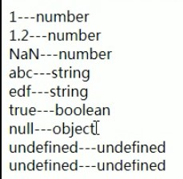

# javascript 简介

-   概念：一门客户端脚本语言
    > 运行在客户端浏览器中，每一个浏览器都有 javascript 的解析引擎
    > 脚本语言：不需要进行编译操作，直接被浏览器执行
-   功能：
    
    -   增强用户与 html 界面的交互，可以控制 html 元素，增强交互与添加效果
- 发展史

  1. 1992 年，Nombase 公司，开发出第一门客户端脚本语言，专门用于表单检验，命名为：C--。后更名为 ScriptEase
  2. 1995 年，Netscape 公司，开发出一门客户端教门语言，：LiveScript。后来请 SUN 公司进行修改，更名为 JavaScript
  3. 1996 年，微软抄袭 javascript 开发 JScript 语言
      
      > 此时针对不同浏览器就要写不同语言版本的脚本语言
  4. 1997 年，ECMA（欧洲计算机制造协会）。ECMAscript 就是所有客户端脚本语言标准

  -   JavaScript=ECMAscript+JavaScript 独有的(DOM+BOM)

-   ECMAscript：客户端脚本语言标准

# 基本语法

## 与 html 结合方式

> 任意位置。但注意但会**影响执行顺序**

形式：

1. 内部块
    ```html
    <script>
        /* javascript内容 */
    </script>
    ```
2. 内部行内
    ```html
    <input type="button" value="按钮" onclick="alter('hello world')" />
    ```
3. 外部

    ```html
    <script src=""></script>
    ```

## 注释

> 同 java

## 数据类型

1. 原始数据类型 5 种：也就相当于 java 中的基本数据类型
    1. number:数字。
        
        > 整数/小数/NaN(not a number 一个不是数字的数字类型)
    2. string：字符串。
        
        > 字符/字符串 "abc" "a" 'abc'，没有字符概念
    3. boolean
        
        > true/false
    4. null
        
        > 一个对象为空的占位符
    5. undefined
        
        > 未定义，如果一个变量没有被初始化，就会被赋值为 undefined
2. 引用数据类型：也就相当于 java 中的对象

## 变量

> typeof()
> typeof 返回变量类型对应的字符串
> 
> 其中有一个 bug 至今仍没有解决，被 ECMAscript 沿用了。就是 null 返回的数据类型为 object，而不是 null。但现在 null 被认为时对象的占位符，从而解决了这一矛盾

-   变量：一小块存储数据的内存空间，通过变量名称访问数据
-   java 是强类型的语言，而 javaScript 是弱类型的语言
    > 强类型：当开辟变量存储空间时，会给该块空间指定好数据类型，该块空间只能存储指定的数据类型
    > 弱类型开辟变量存储空间时不会指定好空间的数据类型，该空间里放什么都行
    ```javascript
    var a = 3;
    a = "abc";
    ```
-   语法：
    
    -   var 变量名[= 值];

## 运算符

-   一元运算符
    
    > ++,--, +（正），-（负）
-   算术运算符
    
    > +，-，\*，/,%
-   赋值运算符
    
    > =,-=,+=,.....
-   比较运算符
    
    > <,>,>=,<=,== ,===(全等于)
-   逻辑运算符
    
    > &&,||,,!
-   三元运算符
    
    > ? :

**与 java 区别：**

1. 在 js 中，如果运算数不是运算符所要求的类型，那么 js 引擎会自动将运算数进行类型转换。

    - 其他类型转 number
        - 字符串转 number（比如在字符串前加正号时）
            - 为数字字符串：按照字面值转换
            - 不是数字字符串：转为 NaN
        - boolean 转 number：
            - true 转为 1，flase 转为 0
        - 其它类型转为 number 都是 NaN
    - 其他类型转 boolean

        - number 转 boolean:
            
            - 0 和 NaN 为 false，其他为 true
        - string 转 boolean
            
            - 除了空字符串，其他的都时 true
    - null&undefined:都是 false
        - 所有非 null 对象：true
        
            ```js
            if (obj) {
                /* 防止空指针异常，同时当obj为字符串时也会自动判断
                      是否为空字符串 */
            }
            ```

2. 比较运算：
    - 当类型相同时直接比较
    - 当类型不同时先进行类型转换，然后再去比较
    - ===（全等于）会先判断数据类型是否相同，再判断数值是否相同

## 特殊语法

> 可能不知道更好

-   语句以分号结尾，但如果一行只有一条语句，则分号可以省略，但不建议
-   定义变量可以使用 var 关键字，但也可以不写
    -   区别：
        -   用：定义的变量时局部变量
        -   不用：定义的变量时全局变量（不建议，干脆在外边使用 var 变量）

## 流程控制语句

1. if else
2. switch

    > java:byte int short char 枚举(1.5) String(1.7)

    - 在 javascript 中，可以接收的数据类型：所有类型

        ```javascript
        var a = "aaa";
        switch (a) {
            /* 相当于使用全等于，不会进行数据类型的转换 */
            case 1: {
            }
            case "aaa": {
            }
            case true: {
            }
            case null: {
            }
            case undefined: {
            }
        }
        ```

3. while
4. do...while
5. for

    ```javascript
    //if,for和while语法和java基本一样
    for (var a = 0; a < 10; a++) {}
    ```

# 基本对象

> [手册地址](https://www.w3school.com.cn/jsref/index.asp)
> 大多数方法自己查吧，这里只有小部分

-   Boolean
    
    -   基本就是一个基本数据类型包装类，不多讲了
-   Number：基本数据类型包装类
-   String：基本数据类型包装类

- Function：函数对象

  1. 创建
      1. var fun=new Function(形式参数列表,方法体);
          ```js
          var fun1 = new Function("a", "b", "alter(a)");
          fun1(3, 4);
          ```
          > 好了，这个看看就行，忘了吧
      2. function 方法名称(形式参数列表) {方法体}
          ```js
          function sum(a, b) {
              /* 不用写参数类型或var */
              alter(a + b);
          }
          ```
      3. var 方法名=function(){}
          ```js
          var sum = function(a, b) {
              alter(a + b);
          };
          ```
  2. 方法
  3. 属性
      
      1. length:形式参数个数
  4. 注意

      - 方法定义时形式参数列表中不用写参数类型或 var ，也不用谢返回值类型
          ```js
          function fun1(a, b) {
              return a + b;
          }
          var sum = fun1(1, 2);
          alter(sum);
          ```

      * 与 java 不同，因为 js 中方法是对象，所以和 java 不同，可以重复定义方法，不会报错，而会覆盖
          ```javascript
          function fun1(a, b) {
              alter(a + b);
          }
          function fun1(a, b) {
              alter(a - b);
          }
          fun1(1, 2); /* 不会报错，结果是-1 */
          ```
          ```javascript
          function fun2(a, b) {
              alter(a);
          }
          var fun2 = function(a, b) {
              alter(b);
          };
          fun2(1, 2);
          /* 结果是2,不会报错 */
          ```

      - 不管方法定义时形式参数是多少个，调用时传多少个都没问题，也就是说调用哪个方法，只和方法名有关。没有重载那种说法

          > 从左到右依次匹配，没有赋值的参数为 undefined，多的实参没有用
          > 但实际上，方法声明时会有一个内置隐藏的对象（数组），**arguments**，封装所有实际参数

          ```js
          function fun1() {
              var sum=0;
              for(var i=0;i<arguments.length;i++>){
                  sum+=arguments[i];
              }
              return sum;
          }

          fun1(1,2,3,4);
          fun(1);/* 都可以正确执行 */
          ```

-   Array

    -   创建

        1. var arr=new Array(元素列表);
        2. var arr=new Array(默认长度);
        3. var arr=[ 元素列表];

        ```js
        var arr1 = new Array(1, 2, 3);
        var arr2 = new Array(3);
        var arr3 = [1, 2, 3];

        var arr4 = new Array(); /* 创建空数组 */
        ```

    -   方法（一大堆）
        -   join():按照给定字符作为分隔符，默认为 ,
        -   push():在数组后面添加一个或多个新的元素，并返回新的长度
    -   属性
    -   特点
        -   数组中元素的类型是可变的
            ```js
            var arr = [1, "abc", null, true];
            document.write(arr);
            ```
        -   数组的长度是可变的（类似 java 中的集合）,会自动扩容，未赋值元素值为 undefined。
            ```js
            var arr = [1, 2];
            alter(arr[3]); /* 弹出undefined */
            ```

-   Date
    1. 创建：
        - var date=new Date();
            
            > 打印时会返回打印时刻的时间，而不是对象创建的时间
    2. 方法：
        - toLocalString()：返回当前 Date 对象对应的时间的本地字符串格式（根据操作系统和语言）
        - getTime():返回 1970 年 1 月 1 日零点到现在的毫秒数。作为时间戳使用
-   Math
    1. 创建
        
        - Math 对象不用创建，直接使用。和 java 类似
    2. 方法：
        - rondom()返回 0 到 1 之间的随机数（含头不含尾，有 0 没 1）
        - floor()：向下取整
        - ceil()：向上取整
        - round()：四舍五入
            > [ 1,100]00 随机正整数:
            > Math.floor(Math.rondom()\*100)+1
    3. 属性：
        
        - PI：圆周率
-   RegExp:正则表达式对象
    1. 创建：
        1. var reg=new RegExp("正则表达式");
        2. var reg=/正则表达式/;（js 中比较常用形式）
            
            > 两个斜杠间，不要加双引号
    2. 方法：
        
        1. test()：验证是否符合正则表达式，返回 boolean
-   Global
    1. 特点：全局对象。
        
        >这个Global中封装的方法不需要对象就可以直接调用。直接：方法名()。
    2. 方法：
        >url编码：
        >在传输数据时，并不支持中文，所以要将中文编码为url
        >url是http协议默认编码方式
        >例：“编程”编码为： %E7%BC%96%E7%A8%8B
        >utf-8中一个汉字三个字节，每个字节可以用两个16进制位表示。而每个字节前都有一个%
        1. encodeURI():把字符串编码为URI
        2. decodeURI():解码url
        3. encodeURIComponent():编码url
        4. decodeURIComponent():解码url
            >encodeURIComponent()编码的字符更多
            >例如：要编码字符串"http://www.baidu.com?wd=编程"
            >encodeURI会只编码 “编程” 两字
            >而encodeComponent()则会编码所有
            ~~~js
            var encode=encodeURI("编程");
            document.write(encode);
            var str=decodeURI(encode);
            document.write(str);
            ~~~
        5. parseInt():字符串转换为数字
            >逐一判断每一个字符是否为数字，直到不是数字为止，将前面数字部分转为number
            >比如："123abc"会被转为123
        6. isNaN():判断一个值是否为NaN
            
            >NaN六亲不认，NaN参与的==运算都为false，所以有这个方法来判断
            >通过转为数字是否为NaN决定输出
            >结果分别为：
            >null:false
            >true/false:false
            >undefined:true
            >'a':true
            >'1':false
            >'1a':true
            >1:false
            >NaN:true
        7. eval():将javascript字符串转换为javascript脚本来运行
            ~~~js
            var js="alter("123")";
            eval(js);/* 此处会执行 */
            ~~~
# BOM

# DOM
