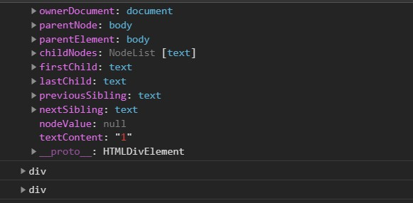
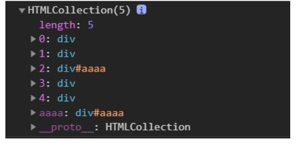
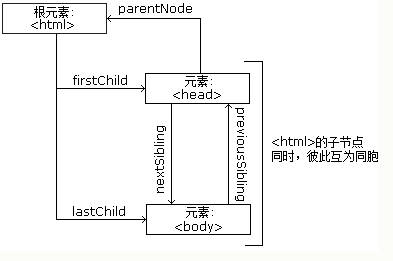

---
学习目标:
  - 掌握API和Web API的概念
  - 掌握常见浏览器提供的API的调用方式
  - 能通过Web API开发常见的页面交互功能
  - 能够利用搜索引擎解决问题
typora-copy-images-to: media
---

# 1. Web API

## 1.1. Web API 介绍

### 1.1.1. API 的概念

API（Application Programming Interface,应用程序编程接口）是一些预先定义的函数，目的是提供应用程序与开发人员基于某软件或硬件得以访问一组例程的能力，而又无需访问源码，或理解内部工作机制的细节。

- 任何开发语言都有自己的 API
- API 的特征输入和输出(I/O)
  - var max = Math.max(1, 2, 3);输入参数，输出返回值
- API 的使用方法(console.log('adf'))

### 1.1.2. Web API 的概念

浏览器提供的一套操作浏览器功能和页面元素的 API(BOM 和 DOM)

此处的 Web API 特指浏览器提供的 API(一组方法)，Web API 在后面的课程中有其它含义

### 1.1.3. 掌握常见浏览器提供的 API 的调用方式

[MDN-Web API](https://developer.mozilla.org/zh-CN/docs/Web/API)

### 1.1.4. JavaScript 的组成


#### 1.1.4.1. ECMAScript - JavaScript 的核心

定义了 JavaScript 的语法规范

JavaScript 的核心，描述了语言的基本语法和数据类型，ECMAScript 是一套标准，定义了一种语言的标准与具体实现无关

#### 1.1.4.2. BOM - 浏览器对象模型

一套操作浏览器功能的 API

通过 BOM 可以操作浏览器窗口，比如：弹出框、控制浏览器跳转、获取分辨率等

#### 1.1.4.3. DOM - 文档对象模型

一套操作页面元素的 API

DOM 可以把 HTML 看做是文档树，通过 DOM 提供的 API 可以对树上的节点进行操作

## 1.2. DOM

### 1.2.1. DOM 的概念

文档对象模型（Document Object Model，简称 DOM），是[W3C](https://baike.baidu.com/item/W3C)组织推荐的处理[可扩展标记语言](https://baike.baidu.com/item/%E5%8F%AF%E6%89%A9%E5%B1%95%E7%BD%AE%E6%A0%87%E8%AF%AD%E8%A8%80)的标准[编程接口](https://baike.baidu.com/item/%E7%BC%96%E7%A8%8B%E6%8E%A5%E5%8F%A3)。它是一种与平台和语言无关的[应用程序接口](https://baike.baidu.com/item/%E5%BA%94%E7%94%A8%E7%A8%8B%E5%BA%8F%E6%8E%A5%E5%8F%A3)(API),它可以动态地访问程序和脚本，更新其内容、结构和[www](https://baike.baidu.com/item/www/109924)文档的风格(目前，HTML 和 XML 文档是通过说明部分定义的)。文档可以进一步被处理，处理的结果可以加入到当前的页面。[DOM](https://baike.baidu.com/item/DOM/50288)是一种基于树的[API](https://baike.baidu.com/item/API/10154)文档，它要求在处理过程中整个文档都表示在[存储器](https://baike.baidu.com/item/%E5%AD%98%E5%82%A8%E5%99%A8)中。

DOM 又称为文档树模型


- 文档：一个网页可以称为文档
- 节点：网页中的所有内容都是节点（标签、属性、文本、注释等）
- 元素（Element）：网页中的标签
- 属性（Attribute）：标签的属性

### 1.2.2. DOM 经常进行的操作

- 获取元素
- 对元素进行操作(设置其属性或调用其方法)
- 动态创建元素
- 事件(什么时机做相应的操作)

## 1.3. 获取页面元素

### 1.3.1. 为什么要获取页面元素

例如：我们想要操作页面上的某部分(显示/隐藏，动画)，需要先获取到该部分对应的元素，才进行后续操作

### 1.3.2. 根据 id 获取元素

```javascript
var div = document.getElementById("main")
console.log(div)

console.dir(div) //不会对对象进行处理，直接打印对象

//获得的对象类型为HTMLDivElement

// 获取到的数据类型 HTMLDivElement，对象都是有类型的
```

注意：由于 id 名具有唯一性，部分浏览器支持直接使用 id 名访问元素，但不是标准方式，不推荐使用。

注意：下载文档前面部分不会获得元素，要注意代码执行顺序。一般写在 </ body>上面

### 1.3.3. 根据标签名获取元素

```javascript
var divs = document.getElementsByTagName("div")
for (var i = 0; i < divs.length; i++) {
  var div = divs[i]
  console.log(div)
}
```



### 1.3.4. 根据 name 获取元素\*

```javascript
var inputs = document.getElementsByName("hobby")
for (var i = 0; i < inputs.length; i++) {
  var input = inputs[i]
  console.log(input)
}
/**
 * 返回一个 伪数组集合，里面包含获得的所有元素，可以通过数组的方式取出
 * ，当有元素有id时，同时也包含 id:元素 的键值对
 *
 */
```

- 注意：与 getElementById 不同，获取到的集合是动态集合。当网页文档内容发生改变时，该集合中的元素也会改变
  

### 1.3.5. 根据类名获取元素\*

```javascript
var mains = document.getElementsByClassName("main")
for (var i = 0; i < mains.length; i++) {
  var main = mains[i]
  console.log(main)
}
```

### 1.3.6. 根据选择器获取元素\*

```javascript
//传入合法的css选择器
/*
返回HTML文档里第一个没有type属性或者有值为“text/css”的type属性的<style>元素:
let el = document.body.querySelector("style[type='text/css'], style:not([type])"); 
 */
var text = document.querySelector("#text") //仅仅返回一个元素
console.log(text)

/*
用法同上，但是会返回所有满足条件的元素
 */
var boxes = document.querySelectorAll(".box")
for (var i = 0; i < boxes.length; i++) {
  var box = boxes[i]
  console.log(box)
}
```

- 总结

```
注：除了getElementById，并不是只有document对象能使用这些方法，HTMLDivElement等对相也能使用些方法
掌握
	getElementById()//document对象独享
	getElementsByTagName()
  //以上两个方法没有兼容性问题。常用
了解
	getElementsByName()//不推荐 有兼容性问题，不同浏览器返回值不同
	getElementsByClassName()//ie9以后才支持

  //下面两个方法ie8以后支持
	querySelector()//根据选择器查找元素
	querySelectorAll()
```

## 1.4. 事件

事件：触发-响应机制

### 1.4.1. 事件三要素

- 事件源:触发(被)事件的元素
- 事件名称: click 点击事件
- 事件处理程序:事件触发后要执行的代码(函数形式)

### 1.4.2. 事件的基本使用

```javascript
var box = document.getElementById("box")
box.onclick = function() {
  console.log("代码会在box被点击后执行")
}
```

### 1.4.3. 案例

- 点击按钮弹出提示框
- 点击按钮切换图片

## 1.5. 属性操作

### 1.5.1. 非表单元素的属性

href、title、id、src、className

```javascript
var link = document.getElementById("link")
console.log(link.href)
console.log(link.title)

var pic = document.getElementById("pic")
console.log(pic.src) //注意：不管网页中赋值如何，返回的都是绝对路径
```

**案例**：

1. 点击按钮显示隐藏 div

```js
<script>
    var btn = document.getElementById("btn1");
    var div1 = document.getElementById("div1");
    var trun = true;
    btn.onclick = function() {
        if (trun) {
          //因为class是js中的关键字，所以通过className来表示标签中的class属性
            div1.className = "hidden";
            this.value = "显示";//事件处理函数中的this指向事件源
        } else {
            div1.className = "show";
            this.value = "隐藏";
        }
        trun = !trun;
    };
</script>
```

2. 画廊

```js
/**
 * 获取a标签(a标签用来添加点击事件，img标签没有)
 * 给所有标签注册事件
 * 取消a默认行为 （ a标签在onclick函数最后后写一个return false;可以防止网页跳转调整）
 * 切换图片
 */

<script>
    var div = document.getElementById("gallery");
    var links = div.getElementsByTagName("a");
    var show=document.getElementById('show');
    for (var i = 0; i < links.length; i++) {
        var link=links[i];
        links[i].onclick = function() {
            // show.src=link.querySelector('img:first-of-type').src;
            /**
             * 当循环结束后，link指向最后一个标签，这会导致点那一个都指向最后一个
             * 因此要使用this
             */
            show.src=this.querySelector('img:first-of-type').src;
            return false;
        };
    }
        </script>

```

### 1.5.2. this 各种情况

1. 一般函数中：全局 window
2. 对象的函数中：对象本身
3. 构造函数中：创建出的隐式新对象
4. 事件处理函数中：引发事件的事件源

- innerHTML 和 innerText

```javascript
var box = document.getElementById("box")
box.innerHTML = "我是文本<p>我会生成为标签</p>"
console.log(box.innerHTML)
box.innerText = "我是文本<p>我不会生成为标签</p>"
console.log(box.innerText)
```

- HTML 转义符

```
"		&quot;
'		&apos;
&		&amp;
<		&lt;   // less than  小于
>		&gt;   // greater than  大于
空格	   &nbsp;
©		&copy;
```

- innerHTML 和 innerText 的区别
  - 都是获取开始标签到结束标签间的内容
  - innerHTML 获取内容的时候，如果内容中有标签，会把标签页获取到。即原封不动
  - innerText 获取内容时如果内容中有标签，会把标签过滤掉，只会获取标签中的内容。会压缩空白和去掉换行
  - innerText 赋值为"< b> < /b>"的话，这个内容会**显示出来**,也就是转换为转义符，而不会进行样式渲染
  - 当设置纯文本的内容时，推荐使用 innerText，因为 innerHTML 会解析字符串，查看是否存在标签，速度较慢。element.innerText='内容';
    > 例：
    >
    > ```html
    > <body>
    >   <div id="box">
    >     div内容
    >     <span>span内容</span>
    >   </div>
    >   <script>
    >     var div = document.getElementById("box")
    >     console.dir(div)
    >   </script>
    > </body>
    > <!-- 
    > 属性结果：
    > innerHTML: "↵            div内容↵               ><span>span内容</span>↵        "
    > innerText: "div内容 span内容"
    > outerHTML: "<div id="box">↵            div内容    >↵            <span>span内容</span>↵        </   >div>"
    > outerText: "div内容 span内容"
    > -->
    > ```
- innerText 的兼容性处理
  - 问题：
    - innerText 和 textContent 获取的内容相同，但有兼容性
  - 浏览器支持：
    - chrome：两个都支持
    - 火狐：新版两个都支持，旧版只支持 textContent
    - IE：新版两个都支持，旧版只支持 innerText
  - 处理原理：
    > 以后会有兼容性处理的库，不用自己写，这里只是了解下
    >
    > ```js
    > function getinnerText(element) {
    > //使用typeof 当属性不存在时，返回undefined。当存在时，返回类型
    > if (typeof element.innerText === "string") {
    >   return element.innnerText;
    > } else {
    >   return element.textContent;
    > }
    >
    > ```

### 1.5.3. 表单元素属性

- value 用于大部分表单元素的内容获取(option 除外)
- type 可以获取 input 标签的类型(输入框或复选框等)
- disabled 禁用属性

```js
/* 当标签的值只有一个时，那么在dom中对应的是boolean类型，这里的后三个就是这样 */
btn.onclick = function() {
  txt.disable = true
}
```

- checked 复选框选中属性
- selected 下拉菜单选中属性

### 1.5.4. 案例

- 点击按钮禁用文本框
- 给文本框赋值，获取文本框的值，并通过 | 来分隔
  <!-- /* 字符串频繁拼接会导致速度很慢 ，可以通过array.join('|')*/ -->
- 检测用户名是否长度大于 6，如果不是就高亮并且无法提交

  > ```html
  > <!-- Demo11 -->
  > <body>
  >   <input type="text" name="" id="txtPassword" placeholder="请输入密码" />
  >   <br />
  >   <input type="button" value="提交" disabled="disabled" id="summitbutton" />
  >   <script>
  >     var txtPassword = document.getElementById("txtPassword")
  >     var summitbutton = document.getElementById("summitbutton")
  >     console.dir(summitbutton)
  >     txtPassword.oninput = function() {
  >       if (this.value.length > 6) {
  >         summitbutton.disabled = false
  >         this.className = "ok"
  >       } else {
  >         summitbutton.disabled = true
  >         this.className = "warn"
  >       }
  >     }
  >   </script>
  > </body>
  > ```

- 设置下拉框中的选中项随机选中

  > ```html
  > <!-- Demo12 -->
  > <body>
  >   <input type="button" value="设置" id="btn" />
  >   <select name="" id="select1">
  >     <option value="1">11</option>
  >     <option value="2">22</option>
  >     <option value="3">33</option>
  >     <option value="4">44</option>
  >     <option value="5">55</option>
  >   </select>
  >   <script>
  >     var select1 = document.getElementById("select1")
  >     var options = select1.getElementsByTagName("option")
  >     var option
  >     var btn = document.getElementById("btn")
  >     btn.onclick = function() {
  >       option = options[Math.floor(Math.random() * options.length)]
  >       option.selected = true
  >     }
  >   </script>
  > </body>
  > ```

- 搜索文本框。通过 js 完成类似 placeholder 的功能
  - 通过'element.onfocus'来设置聚焦
  - 通过'element.onblur'来设置失去焦点
- 全选反选

### 1.5.5. 自定义属性操作

- getAttribute() 获取标签行内属性（自定义或已有）
  > ```html
  > <!-- 大多数浏览器不能通过 . 来获取自定义属性的值 -->
  > <body>
  >   <div age="18" id="div1"></div>
  > </body>
  > <script>
  >   var div = document.getElementById("div1")
  >   console.log(div.getAttribute("age"))
  > </script>
  > ```
- setAttribute() 设置标签行内属性（自定义或已有）

  > ```html
  > <script>
  >   div.setAttribute("class", "leiming")
  >   div.setAttribute("age", "18")
  > </script>
  > ```

- removeAttribute() 移除标签行内属性（自定义或已有）
- 与 element.属性的区别: 上述三个方法用于获取任意的行内属性。

### 1.5.6. 样式操作

- 使用 style 方式设置的样式显示在标签行内

```javascript
var box = document.getElementById("box")
box.style.width = "100px"
box.style.height = "100px"
box.style.backgroundColor = "red"
```

- 注意

  通过样式属性设置宽高、位置的属性类型是字符串，需要加上 px

### 1.5.7. 类名操作

- 修改标签的 className 属性相当于直接修改标签的类名

```javascript
var box = document.getElementById("box")
box.className = "show"
```

### 1.5.8. 案例

- 开关灯
- 点击按钮改变 div 的背景颜色
- 图片切换二维码案例
- 当前输入的文本框高亮显示
- 点击按钮改变 div 的大小和位置
- 列表隔行变色、高亮显示
  > ```html
  > <body>
  >  <ul id="mv">
  >    <li>西施</li>
  >    <li>貂蝉</li>
  >    <li>王昭君</li>
  >    <li>杨玉环</li>
  >    <li>芙蓉姐姐</li>
  >  </ul>
  >  <script>
  >    // 1 隔行变色
  >    // 获取到所有的li，判断奇数行和偶数行
  >    var mv = document.getElementById('mv');
  >    var lists = mv.getElementsByTagName('li');
  >
  >    for (var i = 0; i < lists.length; i++) {
  >      var li = lists[i];
  >      // 判断当前的li 是奇数行 还是偶数行
  >      if (i % 2 === 0) {
  >        // i是偶数 ， 但是当前是奇数行
  >        // 设置奇数行的背景颜色
  >        li.style.backgroundColor = 'red';
  >      } else {
  >        // 设置偶数行的背景颜色
  >        li.style.backgroundColor = 'green';
  >      }
  >    }
  >
  >
  >
  >    // 2 鼠标放上高亮显示
  >    //
  >    // 2.0 给所有的li 注册事件  鼠标经过和鼠标离开的两个事件
  >    for (var i = 0; i < lists.length; i++) {
  >      var li = lists[i];
  >       // 2.1 鼠标放到li上，高亮显示当前的li
  >       var bg;
  >       li.onmouseover = function () {
  >         // 鼠标放到li上的时候，应该记录li当前的颜色
  >         bg = this.style.backgroundColor;
  >
  >         this.style.backgroundColor = 'yellow';
  >       }
  >       // 2.2 鼠标离开li，还原原来的颜色
  >       li.onmouseout = function () {
  >         // 鼠标离开，还原原来的颜色
  >         this.style.backgroundColor = bg;
  >       }
  >    }
  >
  >
  > ```
- tab 选项卡切换
  > ```html
  > <!-- Demo13 -->
  > ```

## 1.6. 节点

### 节点操作

```javascript
var body = document.body
var div = document.createElement("div")
body.appendChild(div)

var firstEle = body.children[0]
body.insertBefore(div, firstEle)

body.removeChild(firstEle)

var text = document.createElement("p")
body.replaceChild(text, div)
```

### 1.6.1. 节点属性

- nodeType 节点的类型
  - 1 元素节点
  - 2 属性节点
  - 3 文本节点
- nodeName 节点的名称(标签名称)
- nodeValue 节点值
  - 元素节点的 nodeValue 始终是 null

### 1.6.2. 模拟文档树结构


```javascript
function Node(option) {
  this.id = option.id || ""
  this.nodeName = option.nodeName || ""
  this.nodeValue = option.nodeValue || ""
  this.nodeType = 1
  this.children = option.children || []
}

var doc = new Node({
  nodeName: "html"
})
var head = new Node({
  nodeName: "head"
})
var body = new Node({
  nodeName: "body"
})
doc.children.push(head)
doc.children.push(body)

var div = new Node({
  nodeName: "div",
  nodeValue: "haha"
})

var p = new Node({
  nodeName: "p",
  nodeValue: "段落"
})
body.children.push(div)
body.children.push(p)

function getChildren(ele) {
  for (var i = 0; i < ele.children.length; i++) {
    var child = ele.children[i]
    console.log(child.nodeName)
    getChildren(child)
  }
}
getChildren(doc)
```

### 1.6.3. 节点层级



```javascript
var box = document.getElementById("box")
console.log(box.parentNode)
console.log(box.childNodes)
console.log(box.children)
console.log(box.nextSibling)
console.log(box.previousSibling)
console.log(box.firstChild)
console.log(box.lastChild)
```

- 注意

  childNodes 和 children 的区别，childNodes 获取的是子节点，children 获取的是子元素

  nextSibling 和 previousSibling 获取的是节点
  获取元素对应的属性是 nextElementSibling 和 previousElementSibling 获取的是元素

  > nextElementSibling 和 previousElementSibling 在 ie8 都有兼容性问题。处理方法，见文档。或者以后都会用脚本库，里面都处理好了

  ​ nextElementSibling 和 previousElementSibling 有兼容性问题，IE9 以后才支持

- 总结

```
节点操作，方法（详细在下一节。）
	appendChild()
	insertBefore()
	removeChild(child)
	replaceChild()
节点层次，属性
	parentNode
	childNodes
	children
	nextSibling/previousSibling
	firstChild/lastChild
```

### 1.6.4. 子节点(详细补充，兄弟节点类似)


- 回顾文档结构
  - 文档：一个网页可以称为文档
  - 节点：网页中的所有内容都是节点（标签、属性、文本、注释等）
    - 元素（Element）：网页中的标签。
    - 属性（Attribute）：标签的属性。
    - 文本节点
    - 注释节点
- 节点相关属性：
  - nodeName
  - nodeType
    - 元素节点：1
    - 属性节点：2
    - 文本节点：3
    - 注释节点：8
  - nodeValue:
    - 元素节点：始终为 null
    - 属性节点：属性的值
    - 文本节点：文本内容
- 子节点
  > 查文档吧查文档
  - 方法
    - hasChildNode()
  - 属性
    - childrenNode;为 Nodelist 类型。
      > 为子节点,包含元素节点,文本节点,元素节点,属性节点
      > 一般不使用这个
    - children 返回一个既是更新的集合（HTMLCollection）。（伪数组，和 getElementsByTagName()返回类型相同）
      > 只包括元素节点
      > 一般使用这个
      > 在 ie8-6 中，有可能错误得获取到注释节点
    - childrenElementCount
      > 有兼容性问题
    - firstChild lastChild
      > 包含文本及注释节点等，返回第一个和最后一个子节点
      > Gecko 内核的浏览器会在源代码中标签内部有空白符的地方插入一个文本结点到文档中.
      > 因此,使用诸如 Node.firstChild 和 Node.previousSibling 之类的方法可能会引用到一个空白符文本节点, 而不是使用者所预期得到的节点.
    - firstElementChild lastElementChild
      > 获取第一个和最后一个元素节点
      > 没有子元素返回 null
      > 有兼容问题，ie9 之后才支持
      >
      > ```js
      > /* 兼容性处理 ，部分语法要在之后js高级中学，之后再看也行*/
      > // Overwrites native 'firstElementChild' prototype.
      > // Adds Document & DocumentFragment support for IE9 & Safari.
      > // Returns array instead of HTMLCollection.
      > ;(function(constructor) {
      >   if (
      >     constructor &&
      >     constructor.prototype &&
      >     constructor.prototype.firstElementChild == null
      >   ) {
      >     Object.defineProperty(constructor.prototype, "firstElementChild", {
      >       get: function() {
      >         var node,
      >           nodes = this.childNodes,
      >           i = 0
      >         while ((node = nodes[i++])) {
      >           if (node.nodeType === 1) {
      >             /* nodeType===1也就是为元素节点时 */
      >             return node
      >           }
      >         }
      >         return null
      >       }
      >     })
      >   }
      > })(window.Node || window.Element)
      > ```

### 1.6.5. void 运算符

```html
<!--
  javascript加：  表示一种协议，比如http:
  如果js代码有返回值，就会把值输出到界面上来（非undefined返回值时？？）
-->
<a href="javascript:alter(内容)"></a>

<a href="javascript:void(0)"></a>
<!--
  void是一种哦运算符，会执行后面的表达式，并始终返回undefined
  void(0)等同于void 0

 -->
 <!-- js文档中： -->
 <a href="javascript:void(0);">
  这个链接点击之后不会做任何事情，如果去掉 void()，
  点击之后整个页面会被替换成一个字符 0。
</a>
<p> chrome中即使<a href="javascript:0;">也没变化，firefox中会变成一个字符串0 </p>
<a href="javascript:void(document.body.style.backgroundColor='green');">
  点击这个链接会让页面背景变成绿色。
</a>
<!-- 注意，虽然这么做是可行的，但利用 javascript: 伪协议
来执行 JavaScript 代码是不推荐的，推荐的做法是为链接元素绑定事件，最后写个return false。 -->
```

## 1.7. 创建元素的三种方式

### 1.7.1. document.write()

> 该方法会把文档原来内容都覆盖掉。
> 用得很少。有的花钱购买在线客服服务的网站，在线客服公司会用这个，弹出一个窗口后再添加元素

```javascript
document.write("新设置的内容<p>标签也可以生成</p>")
```

### 1.7.2. innerHTML

> 在元素内部写入内容。
> 创建较简单结构时推荐

```javascript
var box = document.getElementById("box")
box.innerHTML = "新内容<p>新标签</p>"
/* 等号是覆盖内容，如果想要拼接的话使用 += */
```

> 当 DOM 修改时，浏览器都会进行重新绘制
> 优化 1：因此应该将所有需要添加的字符串拼接完成后，再添加到 DOM
> 优化 2：然后使用数组替代字符串拼接。array.join()

```js
// 优化2
    var datas = ['西施', '貂蝉', '凤姐', '芙蓉姐姐'];
    var btn = document.getElementById('btn');
    btn.onclick = function () {
      var box = document.getElementById('box');

      // 使用数组替代字符串拼接
      var array = [];
      array.push('<ul>');

      // 遍历数据
      for (var i = 0; i < datas.length; i++) {
        var data = datas[i];
        array.push('<li>' + data + '</li>');
      }
      array.push('</ul>');

      box.innerHTML = array.join('');
      // 当li 生成到页面之后，再从页面上查找li 注册事件

```

### 1.7.3. document.createElement()

> 推荐写法
> 尤其是比较复杂元素（如表格）以及
> 需要添加元素并绑定事件时

```javascript
var div = document.createElement(
  "div"
) /* 在内存中创建对象，此时还没有显示在页面上 */
/*
现在可以添加样式，以及绑定事件
 */
document.body.appendChild(
  div
) /* 放到DOM树上。这里是追加到body上。当然也能element.appendChild() */
```

### 1.7.4. 性能问题

- innerHTML 方法由于会对字符串进行解析，需要避免在循环内多次使用。
- 可以借助字符串或数组的方式进行替换，再设置给 innerHTML
- 优化后与 document.createElement 性能相近
  > 1000 个 div 时间比较：
  > doucment.wirte()需要 1.5 秒左右
  > innerHTML 优化 2 需要 5 毫秒左右
  > document.creatElemnt 需要 6 毫秒左右

### 1.7.5. 常用操作元素方法

- createElement(string)
- appendChild(element)
  - 注意：如果 element 已经存在于某个位置，那么会先从文档中移除，再添加到指定位置
  - 如果不想这样的话可以使用 cloneChild(element)
  - 组建移动方法：
    - 通过 appendChild()
    - 通过直接 innerHTML 赋值，再通过 oldElemnet.InnerHTML=''来清空
      > 前者可以在带有事件的情况下转移组件
      > 而后者只能转移组件，不会保留事件。如果有事件存在的话，
      > 会发生内存泄漏（事件一直存在，但不会被使用，也不会被释放。而 removeChild 会清除组件和事件）
- removeChild(element)
- insertBefore(newNode, referenceNode)
  - 把元素插入到指定元素之前
- replace(newChild, oldChild)
  - 把元素进行替换

### 1.7.6. 案例

- 动态创建列表，高亮显示

- 根据数据动态创建表格

```html
<script>
  var btn = document.getElementById("btn")
  btn.onclick = function() {
    var datas = [
      { name: "zs", subject: "语文", score: 90 },
      { name: "ls", subject: "数学", score: 80 },
      { name: "ww", subject: "英语", score: 99 },
      { name: "zl", subject: "英语", score: 100 },
      { name: "xs", subject: "英语", score: 60 },
      { name: "dc", subject: "英语", score: 70 }
    ]
    var headDatas = ["姓名", "学科", "分数"]
    var div = document.createElement("div")
    var table = document.createElement("table")
    var thead = document.createElement("thead")
    var tbody = document.createElement("tbody")
    var temptr, temptd

    /* thead */
    temptr = document.createElement("tr")
    for (var i = 0; i < headDatas.length; i++) {
      temptd = document.createElement("td")
      temptd.innerText = headDatas[i]
      // setInnerText(temptd, headDatas[i]);
      temptr.appendChild(temptd)
    }
    thead.appendChild(temptr)

    /* tbody */
    for (var n = 0; n < datas.length; n++) {
      temptr = document.createElement("tr")
      for (var temp in datas[n]) {
        temptd = document.createElement("td")
        setInnerText(temptd, datas[n][temp])
        temptr.appendChild(temptd)
      }
      tbody.appendChild(temptr)
    }
    table.append(thead, tbody)
    div.appendChild(table)
    document.getElementById("div").appendChild(div)
  }
</script>
```

- 选择水果

```html
<body>
  <select id="all" multiple="multiple">
    <option>苹果</option>
    <option>橘子</option>
    <option>梨</option>
    <option>西瓜</option>
    <option>水蜜桃</option>
  </select>

  <input type="button" value=">>" id="btn1" />
  <input type="button" value="<<" id="btn2" />
  <input type="button" value=">" id="btn3" />
  <input type="button" value="<" id="btn4" />

  <select id="select" multiple="multiple"> </select>

  <script src="common.js"></script>
  <script>
    var all = my$("all")
    var select = my$("select")

    all.children[0].onclick = function() {
      alert("hello")
    }

    // 1 全部选择
    my$("btn1").onclick = function() {
      // 先获取子元素的个数，将来再发生变化不会受影响
      // 现在len的值始终是当前获取到的all.children.length 当前个数5
      // var len = all.children.length;
      // for (var i = 0; i < len; i++) {
      //   var option = all.children[0];
      //   select.appendChild(option);
      // }
      //
      //
      // 使用这种方式移动子元素的话，如果子元素有事件，移动之后元素的事件丢失
      select.innerHTML = all.innerHTML
      // 当我们是用innerHTML 清空子元素的时候
      // 如果子元素有事件，此时会发生内存泄漏
      all.innerHTML = "" // 清空标签之间的内容
    }

    // 3 移动选中的水果
    my$("btn3").onclick = function() {
      // 找到所有选中的option
      var array = [] // 存储选中的option
      for (var i = 0; i < all.children.length; i++) {
        var option = all.children[i]
        if (option.selected) {
          array.push(option)
          // 移动过去会有选中的效果存在，因此要去掉当前option的选中效果
          option.selected = false
        }
      }

      // 把数组中的option移动到第二个select中
      for (var i = 0; i < array.length; i++) {
        var option = array[i]
        select.appendChild(option)
      }
    }
  </script>
</body>
```

## 1.8. 事件详解

- 情景：
  > 当有多个程序员给一个组件定义了 onclick 事件时，后定义的会把先定义的覆盖掉，只能执行一组代码
  > 为了解决这个问题，也就是一个组件能够注册多个事件并按照文档中的位置相继运行

### 1.8.1. 注册/移除事件的三种方式

> 以后会用别人写的库。
> 这里知只是了解一下
> 诶嘿。

1. 注册事件
   1. element.onclick=function(){}
      1. 不可以重复注册事件处理函数
   2. element.addEventListener(type,fucntion(){},\[false/true\])
      1. 第三个参数默认是 false
      2. 可以重复注册事件处理函数。并且按照文档位置顺序执行
      3. 但有浏览器兼容问题。ie 是 9 以后才支持
      4. 是标准方法，现在基本上都支持
   3. element.attachEvent(typeWithOn,function(){})
      1. 和 addEventListener()功能相同
      2. ie 老版本**特有**方法。直到 ie10 支持，之后不支持
2. 移除事件
   1. element.onclick=null;
   2. element.removeEventListener(type,function(){},\[false/true\])
      1. 可见，如果想要移除事件，那么声明时就不能使用匿名函数
      2. 是标准方法，现在基本上都支持
   3. detachEvent(typeWithOn,function(){});
      1. 可见，如果想要移除事件，那么声明时就不能使用匿名函数
      2. ie 老版本**特有**方法。直到 ie10 支持，之后不支持

> 例：

```javascript
var box = document.getElementById("box")
box.onclick = function() {
  console.log("点击后执行")
}
box.onclick = null

box.addEventListener("click", eventCode, false)
box.removeEventListener("click", eventCode, false)

box.attachEvent("onclick", eventCode)
box.detachEvent("onclick", eventCode)

function eventCode() {
  console.log("点击后执行")
}
```

* addEventListener函数第三个参数作用

### 1.8.2. 兼容代码

```javascript
function addEventListener(element, type, fn) {
  if (element.addEventListener) {
    element.addEventListener(type, fn, false)
  } else if (element.attachEvent) {
    element.attachEvent("on" + type, fn)
  } else {
    element["on" + type] = fn
  }
}

function removeEventListener(element, type, fn) {
  if (element.removeEventListener) {
    element.removeEventListener(type, fn, false)
  } else if (element.detachEvent) {
    element.detachEvent("on" + type, fn)
  } else {
    element["on" + type] = null
  }
}
```

### 1.8.3. 事件的三个阶段

1. 捕获阶段

2. 当前目标阶段

3. 冒泡阶段

   事件对象.eventPhase 属性可以查看事件触发时所处的阶段

### 1.8.4. 事件对象的属性和方法

- event.type 获取事件类型
- clientX/clientY 所有浏览器都支持，窗口位置
- pageX/pageY IE8 以前不支持，页面位置
- event.target || event.srcElement 用于获取触发事件的元素
- event.preventDefault() 取消默认行为

#### 1.8.4.1. 案例

- 跟着鼠标飞的天使
- 鼠标点哪图片飞到哪里
- 获取鼠标在 div 内的坐标

### 1.8.5. 阻止事件传播的方式

- 标准方式 event.stopPropagation();
- IE 低版本 event.cancelBubble = true; 标准中已废弃

### 1.8.6. 常用的鼠标和键盘事件

- onmouseup 鼠标按键放开时触发
- onmousedown 鼠标按键按下触发
- onmousemove 鼠标移动触发
- onkeyup 键盘按键按下触发
- onkeydown 键盘按键抬起触发

## 1.9. BOM

### 1.9.1. BOM 的概念

BOM(Browser Object Model) 是指浏览器对象模型，浏览器对象模型提供了独立于内容的、可以与浏览器窗口进行互动的对象结构。BOM 由多个对象组成，其中代表浏览器窗口的 Window 对象是 BOM 的顶层对象，其他对象都是该对象的子对象。

我们在浏览器中的一些操作都可以使用 BOM 的方式进行编程处理，

比如：刷新浏览器、后退、前进、在浏览器中输入 URL 等

### 1.9.2. BOM 的顶级对象 window

window 是浏览器的顶级对象，当调用 window 下的属性和方法时，可以省略 window
注意：window 下一个特殊的属性 window.name

### 1.9.3. 对话框

- alert()
- prompt()
- confirm()

### 1.9.4. 页面加载事件

- onload

```javascript
window.onload = function() {
  // 当页面加载完成执行
  // 当页面完全加载所有内容（包括图像、脚本文件、CSS 文件等）执行
}
```

- onunload

```javascript
window.onunload = function() {
  // 当用户退出页面时执行
}
```

### 1.9.5. 定时器

#### 1.9.5.1. setTimeout()和 clearTimeout()

在指定的毫秒数到达之后执行指定的函数，只执行一次

```javascript
// 创建一个定时器，1000毫秒后执行，返回定时器的标示
var timerId = setTimeout(function() {
  console.log("Hello World")
}, 1000)

// 取消定时器的执行
clearTimeout(timerId)
```

#### 1.9.5.2. setInterval()和 clearInterval()

定时调用的函数，可以按照给定的时间(单位毫秒)周期调用函数

```javascript
// 创建一个定时器，每隔1秒调用一次
var timerId = setInterval(function() {
  var date = new Date()
  console.log(date.toLocaleTimeString())
}, 1000)

// 取消定时器的执行
clearInterval(timerId)
```

案例：

```
定时器
简单动画
```

### 1.9.6. location 对象

location 对象是 window 对象下的一个属性，使用的时候可以省略 window 对象

location 可以获取或者设置浏览器地址栏的 URL

#### 1.9.6.1. location 有哪些成员？

- 使用 chrome 的控制台查看

- 查 MDN

  [MDN](https://developer.mozilla.org/zh-CN/)

- 成员

  - assign()/reload()/replace()
  - hash/host/hostname/search/href……

#### 1.9.6.2. URL

统一资源定位符 (Uniform Resource Locator, URL)

- URL 的组成

```
scheme://host:port/path?query#fragment
http://www.itheima.com:80/a/b/index.html?name=zs&age=18#bottom
scheme:通信协议
	常用的http,ftp,maito等
host:主机
	服务器(计算机)域名系统 (DNS) 主机名或 IP 地址。
port:端口号
	整数，可选，省略时使用方案的默认端口，如http的默认端口为80。
path:路径
	由零或多个'/'符号隔开的字符串，一般用来表示主机上的一个目录或文件地址。
query:查询
	可选，用于给动态网页传递参数，可有多个参数，用'&'符号隔开，每个参数的名和值用'='符号隔开。例如：name=zs
fragment:信息片断
	字符串，锚点.
```

#### 1.9.6.3. 作业

解析 URL 中的 query，并返回对象的形式

```javascript
function getQuery(queryStr) {
  var query = {}
  if (queryStr.indexOf("?") > -1) {
    var index = queryStr.indexOf("?")
    queryStr = queryStr.substr(index + 1)
    var array = queryStr.split("&")
    for (var i = 0; i < array.length; i++) {
      var tmpArr = array[i].split("=")
      if (tmpArr.length === 2) {
        query[tmpArr[0]] = tmpArr[1]
      }
    }
  }
  return query
}
console.log(getQuery(location.search))
console.log(getQuery(location.href))
```

### 1.9.7. history 对象

- back()
- forward()
- go()

### 1.9.8. navigator 对象

- userAgent

## 1.10. 特效

### 1.10.1. 偏移量

- offsetParent 用于获取定位的父级元素
- offsetParent 和 parentNode 的区别

```javascript
var box = document.getElementById("box")
console.log(box.offsetParent)
console.log(box.offsetLeft)
console.log(box.offsetTop)
console.log(box.offsetWidth)
console.log(box.offsetHeight)
```


### 1.10.2. 客户区大小

```javascript
var box = document.getElementById("box")
console.log(box.clientLeft)
console.log(box.clientTop)
console.log(box.clientWidth)
console.log(box.clientHeight)
```


### 1.10.3. 滚动偏移

```javascript
var box = document.getElementById("box")
console.log(box.scrollLeft)
console.log(box.scrollTop)
console.log(box.scrollWidth)
console.log(box.scrollHeight)
```


### 1.10.4. 案例

- 拖拽案例
- 弹出登录窗口
- 放大镜案例
- 模拟滚动条
- 匀速动画函数
- 变速动画函数
- 无缝轮播图
- 回到顶部

## 1.11. 附录

### 1.11.1. 元素的类型


