# 1. JVM 与 java 体系结构

## 1.1. 基础知识

- java与jvm
  - java：跨平台的语言
    > 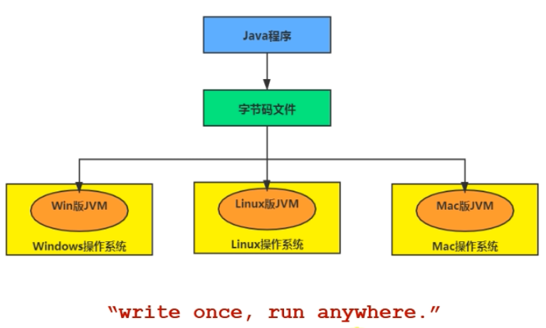
    - 一次编译，到处运行。
  - jvm：跨语言的平台
    > 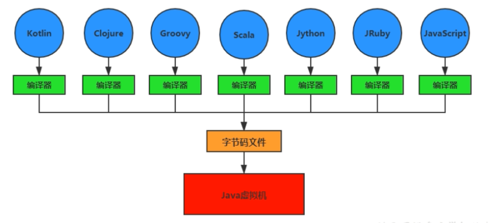
    - jvm 只关心字节码文件
    - 不局限于编程语言
    - 只要提供编译器，可以编译为字节码文件，便可在虚拟机上运行

---

- 多语言混合编程趋势：
  - java 平台上多语言混合编程成为趋势
  - 通过特定领域的语言解决特定领域的问题
    - 并行处理；Cloure
    - 展示层；JRuby/Rails
    - 中间层：java
  - 各语言间因为运行在同一个虚拟机上，交互十分方便

---

- 字节码：
  - 不同语言的不同编译器，可能编译出相同的字节码文件
  - jvm 和 java 语言没有必然联系，它只与特定二进制文件 Class 文件格式所关联
  - Class 文件中包含了 java 虚拟机指令集(或称为字节码，Bytecodes)和符号表，还有一些其他辅助信息

---

- java 历史事件

  > 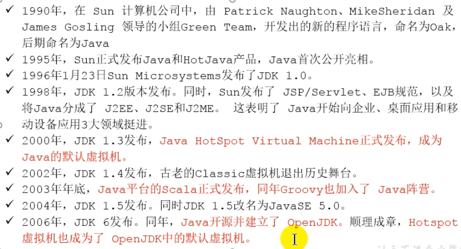
  > 

## 1.2. 架构相关

- 虚拟机：
  - 系统虚拟机，比如 vmware。是对物理计算机的仿真，提供了一个可运行完整操作系统的平台
  - 程序虚拟机：比如 jvm。专门为执行单个计算机程序而设计。java 虚拟机中的指令为 java 字节码指令

---

- java 虚拟机
  - 说明：
    - 运行 java 字节码的虚拟机，拥有独立的运行机制。java 字节码不一定由 java 语言编译而成
    - jvm 平台各种语言都可以共享 java 虚拟机带来的跨平台性，垃圾回收机制以及各种可靠的即时编译器
    - java 技术的核心就是 java 虚拟机。所有 java 程序都运行在 java 虚拟机内部
  - 作用
    - java 虚拟机就是二进制字节码的运行环境。负责装在字节码到虚拟机内部，再解释/编译为 对应平台上的机器指令执行
  - 特点：
    - 一次编译，到处运行
    - 自动内存管理
    - 自动垃圾回收
  - 位置：
    > 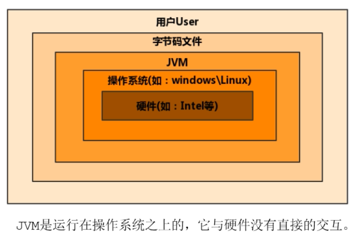
  - 整体结构:
    > 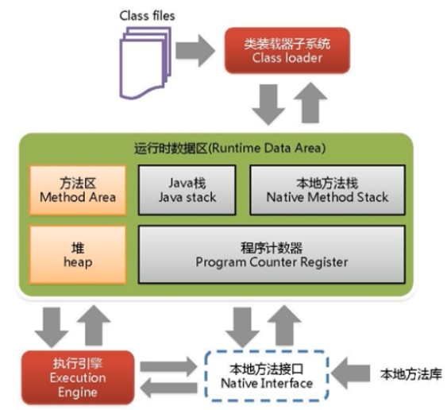
    - 上层：
      - 将字节码文件通过 Class Loader 加载到 jvm 内存中
      - 生成一个 class 对象
    - 中层：
      > Runtime 类。（单例模式）
      - 运行时数据区。
      - 方法区和堆多线程共享
      - 其他的各自有一份
    - 下层：执行引擎
      > 解释执行(编译器)和即时编译(JIT编译器)并存
      - 解释器:保证响应时间，逐行对字节码指令进行解释执行
      - JIT 编译器：针对热点代码，将热点代码编译为机器代码，并缓存起来
        - java-->class file:编译器前端
        - class 字节码-->机器指令:编译器后端
      - 垃圾回收器

---

- java执行流程
  > 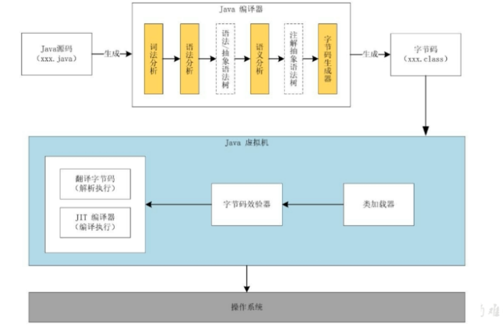  

---

- jvm架构模型
  > Java编译器输入的指令流基本上是一种基于栈的指令集架构，另外一种指令集架构则 是基于寄存器的指令集架构。
  - 基于栈式架构的特点
    > HotSpot就是基于栈
    - 占用资源少。设计和实现更简单，适用于资源受限的系统；
    - 避开了寄存器的分配难题：使用零地址指令方式分配。
    - 指令流中的指令大部分是零地址指令，其执行过程依赖于操作栈。指令集更小，编译器容易实现。
    - **不需要硬件支持，可移植性更好，更好实现跨平台**
    - 性能差一些
  - 基于寄存器架构的特点
    > 比如传统的PC以及Android的Davlik虚拟机。
    - 典型的应用是x86的二进制指令集
    - 指令集架构则**完全依赖硬件，可移植性差**
    - **性能优秀和执行更高效**；
    - 花费更少的指令去完成一项操作。
    - 在大部分情况下，基于寄存器架构的指令集往往都以一地址指令、二地址指令 和三地址指令为主，而基于栈式架构的指令集却是以零地址指令为主。为难学的

## 1.3. jvm生命周期

- 启动：
  - 通过引导类加载器(bootstrap class loader)创建一个初始类(initial class)来完成。
  - 不同的虚拟机该类有不同的实现
- 执行
  - 程序执行的时候jvm才执行，程序结束jvm也结束
  - 执行一个java程序的时候，真正执行的是 java虚拟机 这个进程
- 退出
  - 程序正常结束
  - 遇到异常或错误
  - 操作系统错误
  - System.exit。Runtime.halt
  - JNI(java Native Interface)加载和卸载java虚拟机

## 1.4. 历史版本虚拟机

> 详细看pdf课本<br />

> 具体JVM的内存结构，其实取决于其实现，不同厂商的JVM,或者同一厂商发布的不同版本，都有可能存在一定差异。<br />
> 此处主要以Oracle HotSpot VM为默认虚拟机。

- Sun Classic VM
  - 早在1996年Java1.0版本的时候，Sun公司发布了一款名为Sun Classic VM的Java虚拟机，它同时也是世界上第一款商用Java虚拟机，JDK1.4时 完全被淘汰。
  - 这款虚拟机内部只提供解释器。
  - 如果使用JIT编译器，就需要进行外挂。但是一旦使用了JIT编译器，JIT就 会接管虚拟机的执行系统。解释器就不再工作。解释器和编译器不能配合工 作。
  - 现在hotspot内置了此虚拟机。

- Exact VM
  - 为了解决上一个虚拟机问题，jdk1.2时，sun提供了此虚拟机。
  - Exact Memory Management:准确式内存管理
    - 也可以叫Non-Conservative/Accurate Memory Management
    - 虚拟机可以知道内存中某个位置的数据具体是什么类型。
  - 具备现代高性能虚拟机的维形
    - 热点探测
    - 编译器与解释器混合工作模式
  - 只在Solaris平台短暂用，其他平台上还是classic vm
    - 但也没用在其他平台，终被Hotspot虚拟机替换


- HotSpot VM
  > 商用三大虚拟机之一
  - 历史
    - 最初由一家名为“Longview Technologies"的小公司设计
    - 1997年，此公司被Sun收购；2009年，Sun公司被甲骨文收购。
    - JDK1.3时，HotSpot VM成为默认虚拟机
  - 目前Hotspot占有绝对的市场地位，称霸武林。
    - 不管是现在仍在广泛使用的JDK6,还是使用比例较多的JDK8中，默认的虚拟机都是 HotSpot
    - Sun/Oracle JDK和OpenJDK的默认虚拟机
    - 因此本课程中默认介绍的虚拟机都是HotSpot,相关机制也主要是指HotSpot的GC机 制。（比如其他两个商用虚拟机都没有方法区的概念）
  - 从服务器、桌面到移动端、嵌入式都有应用。
  - 名称中的HotSpot指的就是它的热点代码探测技术。
    - 通过计数器找到最具编译价值代码，触发即时编译或栈上替换
    - 通过编译器与解释器协同工作，在最优化的程序响应时间与最佳执行性能中取得平衡

- BEA的JRockit
  > 商用三大虚拟机之一
- 专注于服务器端应用
  - 它可以**不太关注程序启动速度**，因此JRockit内部不包含解析器实现，全部代码 **都靠即时编译器**编译后执行。
- 大量的行业基准测试显示，JRockit JVM是世界上最快的JVM。
  - 使用JRockit产品，客户已经体验到了显著的性能提高（一些超过了70号）和
  - 硬件成本的减少（达50%)。
- 优势：全面的Java运行时解决方案组合
  - JRockit面向延迟敏感型应用的解决方案JRockit Real Time提供以毫秒或 微秒级的JVM响应时间，适合财务、军事指挥、电信网络的需要
  - MissionControl服务套件，它是一组以极低的开销来监控、管理和分析生产环境中的应用程序的工具。
- 2008年，BEA被Oracle收购。
- Oracle表达了整合两大优秀虚拟机的工作，大致在JDK8中完成。
  - 整合的方式是在 HotSpot的基础上，移植JRockit的优秀特性。
  - 两者架构差别很大，整合有限
  - 但JRockit占优势地位

- IBM的J9
  > 商用三大虚拟机之一
  - 全称：IBM Technology for Java Virtual Machine,简称IT4J,内 部代号：J9
  - 市场定位与HotSpot接近，服务器端、桌面应用、嵌入式等多用途VM
  - 广泛用于IBM的各种Java产品。
  - 目前，有影响力的三大商用虚拟机之一，也号称是世界上最快的Java虚拟机(主要是针对在IBM自己产品和平台上)
  - 2017年左右，IBM发布了开源J9 VM,命名为OpenJ9,交给Eclipse基金 会管理，也称为Eclipse OpenJ9

- KVM和CDC/CLDC HotSpot
  - Oracle在Java ME产品线上的两款虚拟机为：CDC/CLDC HotSpot Implementation VM
  - KVM(Kilobyte)是CLDC-HI早期产品
  - 目前移动领域地位尴尬，智能手机被Android和ios二分天下。
  - KVM简单、轻量、高度可移植，面向更低端的设备上还维持自己的一片 市场
    - 智能控制器、传感器
    - 老人手机、经济欠发达地区的功能手机

- Azul VM
  > 高性能Java虚拟机
  - 前面三大“高性能Java虚拟机”使用在通用硬件平台上
  - 这里Azul VM和BEA Liquid VM是与**特定硬件平台绑定、软硬件配合的专有虚拟机**
  - Azul VM是Azul systems公司在HotSpot基础上进行大量改进，运行于 Azul systems公司的专有硬件Vega系统上的Java虚拟机。
  - **每个Azu1 VM实例都可以管理至少数十个CPU和数百GB内存的硬件资源，并 提供在巨大内存范围内实现可控的GC时间的垃圾收集器、专有硬件优化的线 程调度等优秀特性。**
  - 2010年，Azul Systems公司开始从硬件转向软件，发布了自己的Zing JVM,可以在通用x86平台上提供接近于Vega系统的特性。

- Liquid VM
  > 高性能Java虚拟机中的战斗机。
  - BEA公司开发的，直接运行在自家Hypervisor系统上
  - Liquid VM即是现在的JRockit VE(Virtual Edition),Liquid VM不需要操作系统的支持，或者说它自己本身实现了一个专用操作系统 的必要功能，如线程调度、文件系统、网络支持等。
    > 避免了用户态和内核态的切换，大大提高了执行速度 
  - 随着JRockit虚拟机终止开发，Liquid VM项目也停止了。

- Apache Harmony
  - Apache也曾经推出过与JDK1.5和JDK1.6兼容的Java运行平台 Apache Harmony。
  - 它是IBM和Inte1联合开发的开源JVM,受到同样开源的OpenJDK的压制， Sun坚决不让Harmony获得JCP认证，最终于2011年退役，IBM转而参与 OpenJDK
  - 虽然目前并没有Apache Harmony被大规模商用的案例，但是它的Java 类库代码吸纳进了Android SDK。

- Microsoft VM
  - 微软为了在IE3浏览器中支持Java Applets,开发了Microsoft JVM。
  - 只能在window平台下运行。但确是当时Windows下性能最好的Java VM。
  - 1997年，Sun以侵犯商标、不正当竞争罪名指控微软成功，赔了sun很多 钱。微软在WindowsXP SP3中抹掉了其VM。现在windows上安装的jdk 都是HotSpot。


- Taobao JVM
  - 由AliJVM团队发布。阿里，国内使用Java最强大的公司，覆盖云计算、金融、物流、 电商等众多领域，需要解决高并发、高可用、分布式的复合问题。有大量的开源产品。
  - 基于OpenJDK开发了自己的定制版本AlibabaJDK,简称AJDK。是整个阿里Java体 系的基石。
  - 基于OpenJDK HotSpot VM发布的国内第一个优化、深度定制且开源的高性能服务器 版Java虚拟机。
    - 创新的GCIH(GC invisible heap)技术实现了off-heap,即将生命周期 较长的Java对象从heap中移到heap之外，并且GC不能管理GCIH内部的Java对 象，以此达到降低GC的回收频率和提升GC的回收效率的目的。
    - GCIH中的对象还能够在多个Java虚拟机进程中实现共享
    - 使用crc32指令实现JVMintrinsic降低JNI的调用开销
    - PMU hardware 的Java profiling tool 和诊断协助功能
    - 针对大数据场景的ZenGC
  - taobao vm应用在阿里产品上性能高，硬件严重依赖intel的cpu,损失了兼容性，但提高了性能
    - 目前已经在淘宝、天猫上线，把oracle官方JVM版本全部替换了。

- Dalvik VM
  - 谷歌开发的，应用于Android系统，并在Android2.2中提供了JIT,发展迅猛。
  - Dalvik VM只能称作虚拟机，而**不能称作Java虚拟机**，它没有遵循Java 虚拟机规范
  - 不能直接执行 Java 的 Class 文件
  - 基于**寄存器架构**，不是jvm的栈架构。
  - 执行的是编译以后的dex(Dalvik Executable)文件。执行效率比较高。
    - 它执行的dex(Dalvik Executable)文件可以通过class文件转化而来， 使用Java语法编写应用程序，可以直接使用大部分的Java API等。
  - Android 5.0 使用支持提前编译（Ahead Of Time Compilation,AOT)的 ART VM替换Dalvik VM。

- Graal VM
  > 最有可能替代HotSpot的虚拟机，现在依旧处于实验性质

# 2. 内存与垃圾回收

## 2.1. 上层 类加载子系统概述

> 注意，详细内容会放在字节码与类的加载篇，现在首先有个初步认识

### 2.1.1. 架构回顾

- 架构简图：
  > 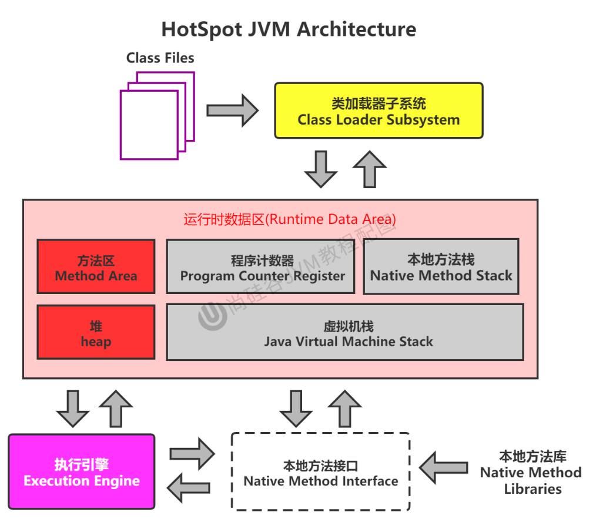
  - 第一部就是通过Class Loader 将类加载到内存中
- 架构详细图：
  > 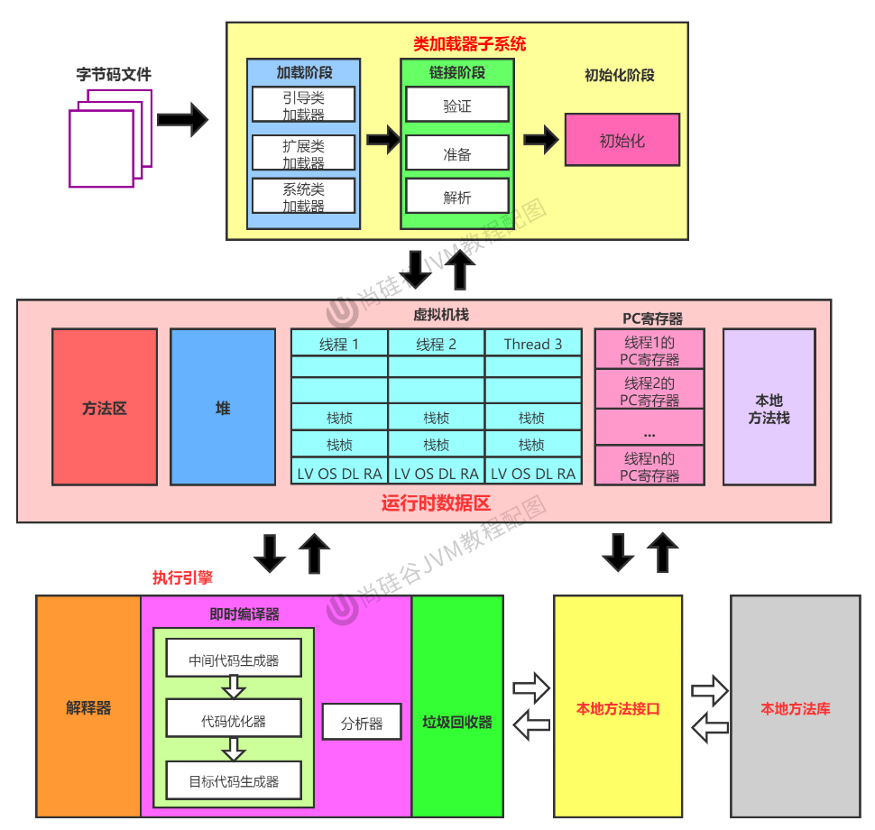 
  - 类加载环节：
    >  注意，上面加载是指整个宏观过程。只是下面三步中，第一步也叫加载
    - 加载。三个类加载器
      - 引导类加载器
      - 扩展类加载器
      - 系统类加载器
    - 链接
      - 验证
      - 准备
      - 解析
    - 初始化
  - 加载到内存后的运行时数据区
    - 每个线程一个pc寄存器
    - 每个线程一个栈。栈由多个栈帧组成
    - 堆：共享，最大的一块空间
    - 方法区：存放类的信息，常量，方法信息等
      > 只有hotspot有
  - 执行引擎
    - 解释器:保证响应时间，逐行对字节码指令进行解释执行
    - JIT 即时编译器：针对热点代码，将热点代码编译为机器代码，并缓存起来
    - 垃圾回收器

### 2.1.2. 作用

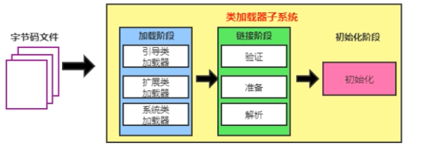

- 加载源：
  - 本地文件系统
  - 网络

- 类加载器子系统负责从文件系统或者网络中加载Class文件。**class文件在文件开头有特定的文件标识。**
  - java规范中有规定文件标识
  - 在验证阶段进行验证
- ClassLoader只负责class文件的加载，至于它是否可以运行，则由Execution Engine决定。
- 加载的类信息存放于一块称为方法区的内存空间。
  - 除了类的信息外，方法区中还会存放运行时常量池信息
    - 运行时常量池对应class中的常量池
    - javap 反编译 class可以发现常量池:
      >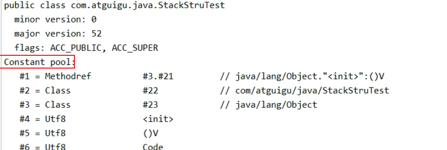 
    - 运行时会把常量池加载到内存，成为运行时常量池
  - 可能还包括字符串字面量和数字常量（这部分常量信息是Class文件中常量池部分的内存映射）

### 2.1.3. 类加载器充当的角色

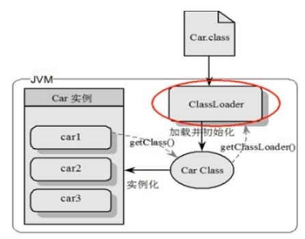

- Car.class 字节码文件保存在硬盘上
- 通过类加载器可以加载到内存中，存放在方法区中。
  - 其中加载包括三部分（上面架构图中的），之后会具体讲
- 此时加载到内存的为 **DNA元数据模版**,即内存中的Car Class
  - Car Class 调用 getClassLoader方法可以获取类加载器
- 调用 Car Class 的构造方法可以在堆空间中创建对象
  - 对象调用 getClass 方法，可以获取 DNA元数据模版，即类本身

### 2.1.4. 类的加载过程※

#### 2.1.4.1. 大致图解

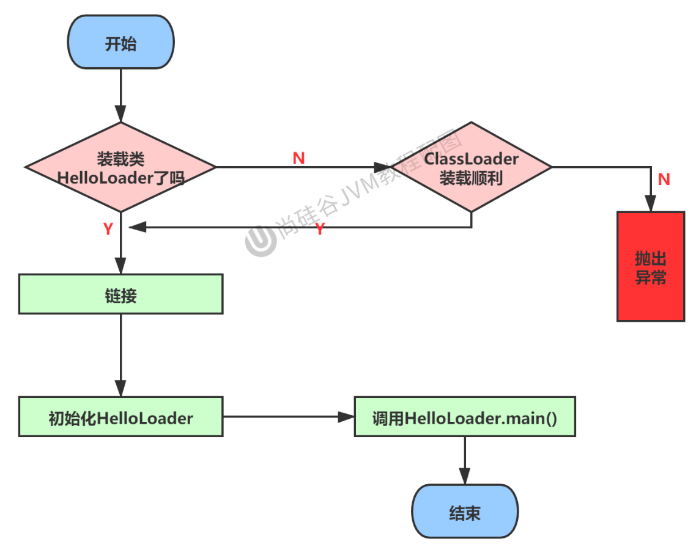

#### 2.1.4.2. loading

- 说明：
  - 通过一个类的全限定类名获取定义此类的二进制字节流
  - 将这个字节流所代表的静态存储结构转化为方法区的运行时数据结构
  - **在内存中生成一个代表这个类的java.lang.Class对象**，作为方法区这个类的各种数据的访问入口

- 补充：加载.class文件的方式
  - 从本地系统中直接加载
  - 通过网络获取，典型场景：Web Applet
  - 从zip压缩包中读取，成为日后jar、war格式的基础
  - 运行时计算生成，使用最多的是：动态代理技术
  - 由其他文件生成，典型场景：JSP应用
  - 从专有数据库中提取.class文件，比较少见
  - 从加密文件中获取，典型的防class文件被反编译的保护措施

#### 2.1.4.3. linking

- 验证（Verify):
  - 目的在于确保class文件的字节流中包含信息符合当前虚拟机要求，保证被加载类的正确性， 不会危害虚拟机自身安全。
    - 使用 BinaryViewer打开可以发现，
    - 给java虚拟机使用的class文件开头都为 **CA FE BA BE**
      > 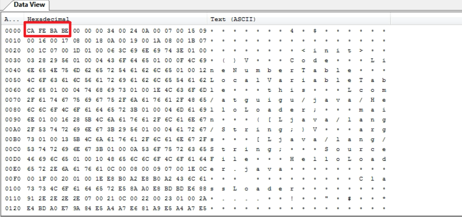 
  - 主要包括四种验证，文件格式验证，元数据验证，字节码验证，符号引用验证。
- 准备（Prepare):
  - 类变量初始化：为**类变量**分配内存并且设置该类变量的 **默认初始值**，即零值。
  - 例子：
    ```
    private static int a = 1

    准备阶段会为 a 开辟内存，然后并赋值为0
    在initial阶段才会赋值为1
    ```
  - 扩展
    - 其他变量初始化：
      - 这里**不包含用final修饰的static**,因为**final在编译的时候就会分配了**，**准备阶段会显式初始化**；
      - **这里不会为实例变量分配初始化**，
        - 实例变量也有 **默认值**
        - 会在堆中进行默认赋值
      - 局部变量在使用前必须要进行显式赋值，否则编译不通过
    - 变量内存中的位置
      - 类变量会分配在方法区中
      - 而实例变量是会随着对象一起分配到Java堆中。
      - 局部变量则在栈中
- 解析（Resolve):
  > 该部分内容放到 字节码与类的加载 一章进行讲解
  - 事实上，**解析操作往往会伴随着JVM在执行完初始化之后再执行**。
  - 将常量池内的符号引用转换为直接引用的过程。
    - 符号引用就是一组符号来描述所引用的目标。符号引用的字面量形式明确定义在《java虚拟机 规范》的class文件格式中。
    - 直接引用就是直接指向目标的指针、相对偏移量或一个间接定位 到目标的句柄。
  - 解析动作主要针对类或接口、字段、类方法、接口方法、方法类型等。对应常量池中的 CONSTANT_Class_info、CONSTANT_Fieldref_info、CONSTANT_Methodref_info等。
  - 扩展
    - 之后的**方法调用**一节 就涉及符号引用转化为直接引用（于 学到虚方法表时 添加）
    - 在此阶段还会创建虚方法表（于 学到虚方法表时 添加）


#### 2.1.4.4. initialization

- 过程
  - 初始化阶段就是执行类构造器方法`<clinit>`()的过程。
    > 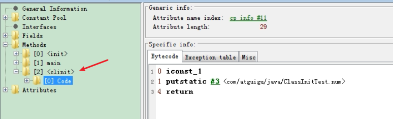
    - 此方法不需定义，
    - 是 javac 编译器自动收集
      - **类中的所有类变量的赋值动作**
      - **类中的所有静态代码块中的语句**
    - 然后合并
    - 如果没有静态变量和静态代码块，该方法就不会存在
  - 构造器方法中指令按语句在源文件中出现的顺序执行。
  - `<cinit>`()不同于类的构造器。
    - 构造器是`<init>`
  - 若该类具有父类，JVM 会保证子类的`<clinit>`()执行前，父类的`<clinit>`() 已经执行完毕。
  - 虚拟机必须保证一个类的`<clinit>`()方法在多线程下被同步加锁。
    - 一个类的`<clinit>`()只会被加载一次
    - 在加载过程中会加锁
    - 应该注意，避免导致死锁

- 测试
  - 使用 jclasslib 或者idea中的该插件 打开字节码文件
    ```java
    public class ClassInitTest{
      public static int a = 1;
      static{
        a = 2
        b = 20
        // System.out.println(b)  //报错，注意，可以赋值但不可以调用
      }
      public static int b = 10;// linking中已经给 b 赋值为0，已经被加载到内存
                                // 然后initial阶段，按代码上下顺序执行代码
                                // 因为上面的static，会赋值为20
                                // 再因为该条语句，会赋值为10
                                // 可以想成：
                                  // linking阶段:  int b = 0
                                  // initial阶段: b = 20; b=10
                                  // 具体用jclasslib看更清晰
      public static void main(){
        System.out.println(Hello.a);
      }
    }
    ```
  - 左侧 Methods 下有 `<clinit>`，可以自行查看
    > 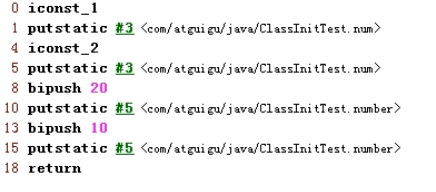 

### 2.1.5. 类加载器

#### 2.1.5.1. 分类

- 通常会分成三个类加载器：
  - BootStrap ClassLoader
  - Extension  ClassLoader
  - AppClassLoader  ClassLoader

---

- 但从java虚拟机规范上讲。JVM支持两种类加载器：
  - 引导类加载器（Bootstrap ClassLoader）
    - c/c++编写
  - 自定义类加载器（User-Defined ClassLoader）
    > java编写
    - 从概念上将，自定义类加载器为开发人员自定义的一类类加载器
    - 但是java规范上定义为：所有派生于抽象类ClassLoader的类加载器都为自定义类加载器
      > 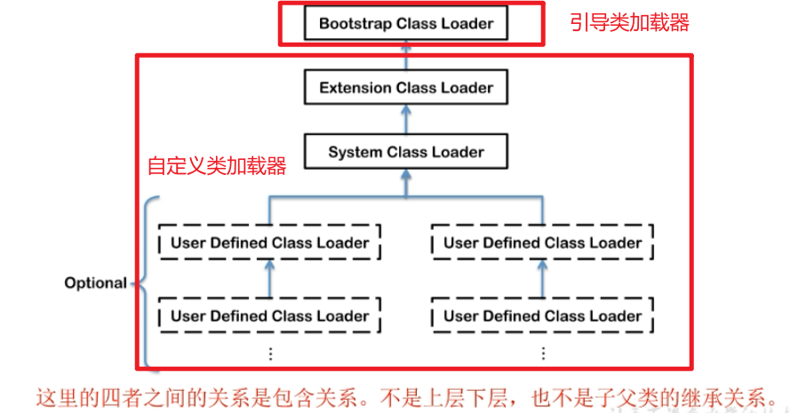 

---

- 一些类加载器的继承关系
  > 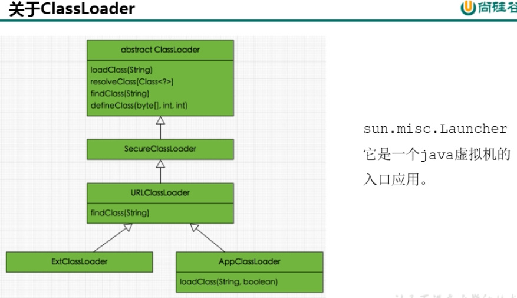 <br />
  > 自定义类加载器是无法获取到核心类加载器（Bootstrap ClassLoader）的<br />
  > 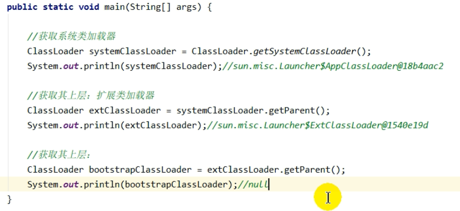 <br />
  > 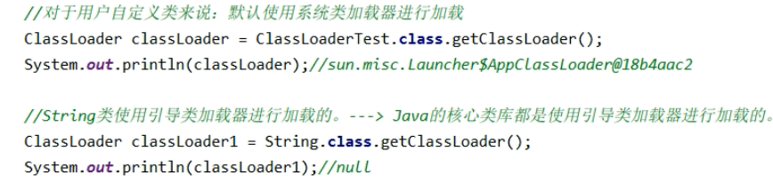 

#### 2.1.5.2. 常见的三个

##### 2.1.5.2.1. BootStrap ClassLoader

- 启动类加载器（引导类加载器，Bootstrap ClassLoader)
  - 编写：这个类加载使用**C/C++语言**实现的，嵌套在JVM内部。
  - 父类：并不继承自java.lang.ClassLoader,没有父加载器。
  - 子类：加载扩展类和应用程序类加载器，并指定为他们的父类加载器。
  - 加载：它用来加载Java的核心库（`JAVA_HOME/jre/lib/rt.jar、 resources.jar或sun.boot.class.path`路径下的内容）,用于提供 JVM自身需要的类
    - 出于安全考虑，Bootstrap启动类加载器只加载包名为java、javax、 sun等开头的类
    - 获取能够加载api的路径：
      ```java
      sun.misc.Launcher.getBootstrapClassPath().getURLs();

      // 随便找一个输出目录中的类，查看类的加载器
      System.out.println(provider.class.getClassLoader());// null 。引导类加载器用c/c++编写，获取不到
      // java.lang.String 获取的也是null
      ```

##### 2.1.5.2.2. Extension ClassLoader


- 扩展类加载器
  - 编写：**Java语言编写**，由`sun.misc.Launcher$ExtClassLoader`实现
  - 父类：**派生于ClassLoader类**。 父类加载器为启动类加载器
  - 加载：从java.ext.dirs系统属性所指定的目录中加载类库，
    - 或从JDK的安装目录的`jre/lib/ext`子目录（扩展目录）下加载类库。
    - **如果用户创建的JAR放在此目录下，也会自动由扩展类加载器加载**。
    - 获取扩展类加载器加载的api
      ```java
      System.getProperty("java.ext.dirs").split(";");

      // 随便找一个输出目录中的类，查看类的加载器
      System.out.println(CurveDB.class.getClassLoader()); // 获得扩展类加载器
      ```

##### 2.1.5.2.3. AppClassLoader

- 应用程序类加载器（系统类加载器，AppClassLoader)
  - 编写：java语言编写，由`sun.misc.Launcher$AppClassLoader`实现
  - 父类：派生于ClassLoader类。 父类加载器为扩展类加载器
  - 加载：它负责加载环境变量classpath或系统属性java.class.path指 定路径下的类库
  - 其他：
    - 该类加载是程序中默认的类加载器，一般来说，Java应用的类都是由它来完成加载
    - 通过ClassLoader.getSystemClassLoader()方法可以获取到该类加载器

#### 2.1.5.3. 自定义类加载器

- 为什么要自定义类加载器
  - 隔离加载类
    > 主流框架都自定义了类加载器
    - 比如在使用某些框架时,需要使用中间件
    - 为了避免jar包冲突(比如全类名相同)
    - 所以要将中间件和应用模块隔离
  - 修改类的加载方式
    - BootStrap ClassLoader 必须要加载
    - 但其他类加载器加载的api并不一定必须
    - 使用自定义类加载器可以在需要的时候实现动态加载
  - 扩展加载源
    - 比如从数据库中加载
  - 防止源码泄漏
    - 加密字节码文件
    - 为了解密，就需要自定义类加载器

---

- 步骤简介
  > 具体过程在第二篇
  1. 开发人员可以通过继承抽象类java.lang.ClassLoader类的方式，实现 自己的类加载器，以满足一些特殊的需求
  2. 在JDK1.2之前，在自定义类加载器时，总会去继承ClassLoader类并重 写1oadClass()方法，从而实现自定义的类加载类，但是在JDK1.2之后 已不再建议用户去覆盖1oadClass()方法，而是建议把自定义的类加载逻 辑写在findClass()方法中
  3. 在编写自定义类加载器时，如果没有太过于复杂的需求，可以直接继承 URLClassLoader类，这样就可以避免自己去编写findClass()方法及 其获取字节码流的方式，使自定义类加载器编写更加简洁。


#### 2.1.5.4. 抽象类ClassLoader

- 简介：除了Bootstrap ClassLoader，所有的类加载器都继承该类
- 方法：
  > 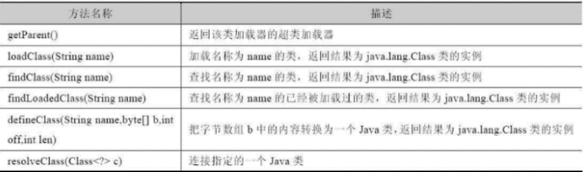 
  - 这些方法都不是抽象方法

- 继承结构
  > 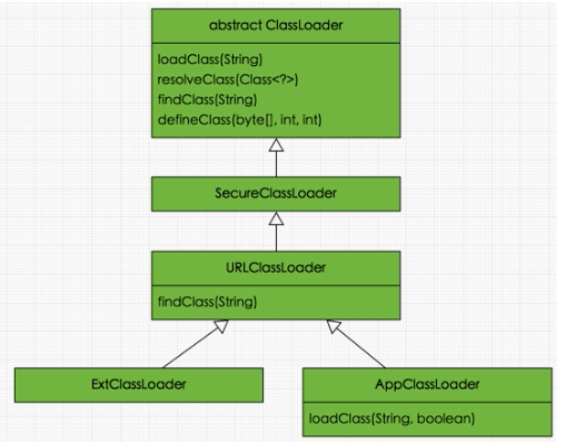 
  
- sun.misc.Launcher 是一个虚拟机的入口应用 
  - 如：
  - `sun.misc.Launcher$ExtClassLoader`
  - `sun.misc.Launcher$AppClassLoader`

- 获取classloader的方式
  - class.getClassLoader()
    > 获取指定类的类加载器
  - Thread.currentThread().getContextClassLoader()
    > 获取当前线程执行的main方法所在类的类加载器
  - ClassLoader.getSystemClassLoader()
    > 获取系统的类加载器
  - DriverManager.getCallerClassLoader()
    > 获取调用者的类加载器 

### 2.1.6. 双亲委派机制※

#### 2.1.6.1. 原理

> 面试经常被问

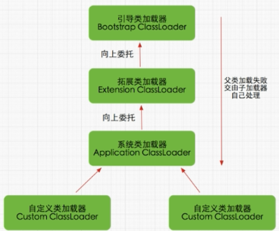


- java虚拟机对class文件加载方式：
  - 按需加载
    - 当需要时才会将class文件加载到内存生成class对象
  - 加载某个类时，使用的是双亲委派模式
    - 即把请求交由父类处理
    - 是一种任务委派模式

---

- 问题引入：
  - 问题：在工程下创建`java.lang.String`类。 那么加载的是自定义的String，还是java自带的String。
  - 结果：java自带的String

---

- 解释：
  - 如果一个类加载器收到了类加载请求，
  - 它不会自己先去加载
  - 而是请求向上委托给父类的加载器去执行
  - 如果父类加载器也存在父类加载器
  - 就会一直向上委派
  - 直到到达最顶层的启动类加载器
  - 判断
    - 如果父类加载器可以完成类的加载任务
      - 就成功返回
    - 如果不能正常完成
      - 子加载器才会向下依次尝试自己加载

---

- 示例1：
  - 情景：
    - 创建一个工程，新建java.lang.String类
    - 在里面写main方法，执行的话会报错。
      > 在类java.Lang.String中找不到main方法
  - 解释：
    - 加载自定义的java.lang.String类时，根据双亲委派机制，会把java.lang.String类交给BootStrap ClassLoader
    - 因为是以java开头，所有BootStrap ClassLoader 可以加载
    - 所以加载的是java自带的java.lang.String
    - 因为只有自定义的java.lang.String中有main方法，而java自带的java.lang.String中没有，所以就会报错


- 示例2:
  > 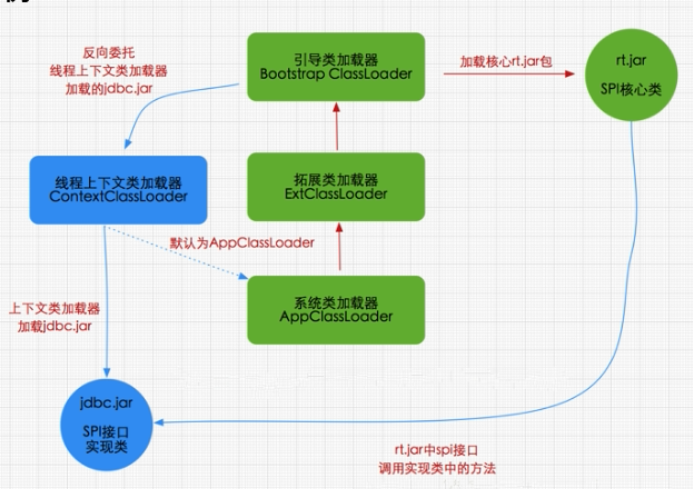
  - 假设要使用spi核心类，接口和第三方接口实现类
  - 首先通过双亲委派机制到达引导类加载器
  - 引导类加载器会加载SPI核心类和接口
  - 接口的实现类会由引导类加载器反向委派到系统类加载器（getContextClassLoader()获取，一般就是系统类加载器）
  - 系统类加载器就会加载接口的实现类

---

- 例外：由三个打破双亲委派机制的案例。下一篇讲

#### 2.1.6.2. 优势

- 避免类的重复加载
  > 一旦有父加载器加载了，就不会委托给子加载器加载
- 保护程序安全，防止核心api被随意篡改
  - 尝试：自定义类java.lang.String
    > 看上方举例
  - 尝试：自定义类java.lang.TestTest
    > 报错：Prohibited package name，禁止使用该包名

#### 2.1.6.3. 沙箱安全机制

> 自定义java.lang.String等出现报错就是沙箱安全机制的一种体现。<br />
> 具体可以自行查阅资料

- 字节码校验器（bytecode verifier）:
  - 确保Java类文件遵循Java语言规范。
  - 这样可以帮助Java程序实现内存保护。但并不是所有的类文件都会经过字节码校验，比如核心类。
- 类装载器（class loader）:其中类装载器在3个方面堆Java沙箱起作用：
  - 防止恶意代码去干涉善意的代码；//双亲委派机制
  - 守护了被新人的类库边界；
  - 将代码归入保护域，确定了代码可以进行哪些操作。
- 存取控制器（access controller）：存取控制器可以控制核心API堆操作系统的存取权限，而这个控制的策略设定，可以由用户指定。
- 安全管理器（security manager）: 是核心API和操作系统之间的主要接口。实现权限控制，比存取控制器优先级高。
- 安全软件包（security package）：java.security下的类和扩展包下的类。允许用户为自己的应用增加新的安全特性，包括：
  - 安全提供者
  - 消息摘要
  - 数字签名 keytools
  - 加密

### 2.1.7. 其他

- jvm 中判断两个class对象是否为同一个类判断条件：
  - 类的完整类名必须一致，包括包名
  - 加载这个类的ClassLoader（指ClassLoader实例对象）必须相同
  - 也就是说即使两个Class对象来自于同一个class文件，被一个虚拟机所加载，如果两个类的ClassLoader实例对象不同，那么这两个类对象也是不相等的。
 
- JVM必须知道一个类型是由启动加载器加载的还是由自定义类加载器加载的。
  - 如果一个类型是由自定义类加载器加载的，那么**JVM会将这个类加载器的一个引用作为类型信息的一部分保存在方法区中**。
  - 当解析一个类型到另一个类型的引用的时候，JVM需要保证这两个类型的类加载器是相同的。
    > 之后动态链接那里涉及


- jvm对类的使用方式
  > 字节码和类的加载篇会详细说
  - 主动使用
    - 创建类的实例
    - 访问某个类或接口的静态变量，或者对该静态变量赋值
    - 调用类的静态方法
    - 反射（比如：Class.forName("com.atguigu.Test"))
    - 初始化一个类的子类
    - Java虚拟机启动时被标明为启动类的类
    - JDK 7 开始提供的动态语言支持：
      ```
      java.lang.invoke.MethodHandle实例的解析结果
      REF_getStatic、REF_putStatic、REF_invokeStatic句柄又
      应的类没有初始化，则初始化
      ```
  - 被动使用
    - 除了上面的7种方式的其他方式
    - 都**不会导致类的初始化**（即：类加载过程中的 初始化 阶段）

## 2.2. 中层 运行时数据区

### 2.2.1. 概述

#### 2.2.1.1. 运行时数据区

- JVM内存布局规定了java再运行过程中内存的申请，分配，管理的策略，保证了JVM的高效稳定的运行
- 不同JVM对内存的划分方式和管理机制都存在着差异
  - 比如JRockit和J9都不存在方法区

- 经典布局
  > 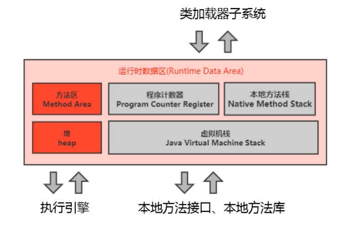 
  - 红色：**每个进程，或者每个虚拟机实例各自对应一份**。线程间共享。包括堆和方法区
    - 重点优化的就是堆和方法区
    - 95%垃圾回收在堆区
    - 5%垃圾回收在方法区
    - 其他区域没有垃圾回收
  - 灰色：**每个线程对应一份。包括程序计数器，栈，本地栈**
  - java.lang.RunTime 对象
    - 该对象的创建是单例模式
    - 每个jvm都会有一个Runtime对象
    - 该对象就对应一个运行时数据区
- 详细布局(阿里手册)
  > 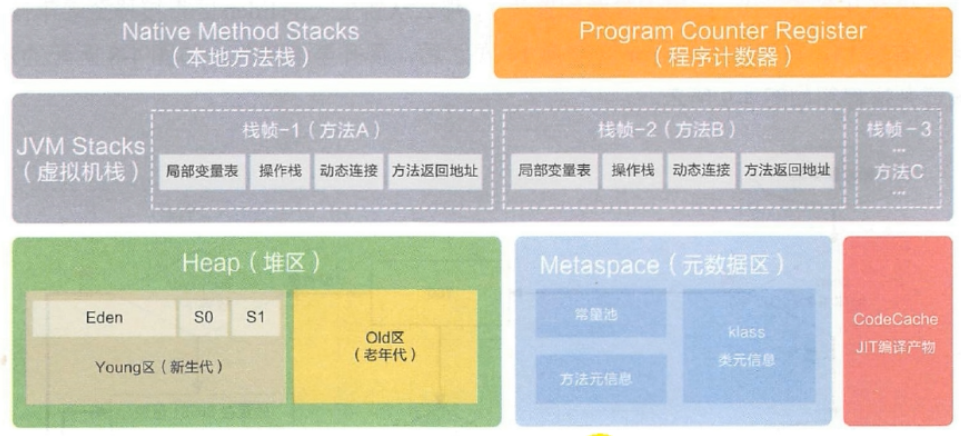 
  - CodeCache，有的会将其归在元空间中，有的则单独放出来
  - 也有将 元空间+CodeCache 称为 方法区
  - 只要知道CodeCache是存放在堆内存之外即可

  ```
  jdk8以后方法区改为元空间，使用本地内存，或者称为堆外内存

  也有将 元空间+CodeCache 并称为 方法区
  ```
#### 2.2.1.2. 线程

- 线程是一个程序里的运行单元。JVM允许一个应用有多个线程并行的执行。
- 在Hotspot JVM里，**每个线程都与操作系统的本地线程直接映射**。
  - 当一个Java线程准备好执行以后
    - 准备内容：线程自己的程序计数器，栈结构，缓存分配等等
  - 此时一个操作系统的本地线程也同时创建。
- 操作系统负责所有线程的安排调度到任何一个可用的CPU上。一旦本 地线程初始化成功，它就会调用Java线程中的run()方法。
- Java线程执行终止后，本地线程也会回收。
  - 正常结束:
    - 情景：
      - 正常执行完
      - 出现异常后通过异常处理机制处理。
    - 处理：
      - java线程和本地线程都会被回收
  - 非正常结束
    - 情景
      - 出现未捕获异常没有处理
    - 处理：
      - java线程终止
      - 本地线程决定jvm是否终止
        - 如果还有普通线程，就不终止
        - 如果只剩下守护线程，就终止

- 后台线程：
  > jconsole的使用等详细会放在调优部分。这里
  - 如果你使用jconsole或者是任何一个调试工具，都能看到在后台有许多线程 在运行。这些后台线程不包括调用public static void main(string[]) 的main线程以及所有这个main线程自己创建的线程。
  - 这些主要的后台系统线程在Hotspot JVM里主要是以下几个：
    >  了解下即可，开发中并不会涉及
    - 虚拟机线程：这种线程的操作是需要JVM达到安全点(后面会讲)才会出现。
      - 这些操作必须在不同的线程中发生的原因是他们都需要JVM达到安全点，这样堆才不会变化。
      - 这种线程的执行类型包括"stop-the-world"的垃圾收集，线程栈收集，线程挂起以及 偏向锁撤销。
    - 周期任务线程：这种线程是时间周期事件的体现（比如中断）,他们一般用于周期性 操作的调度执行。
    - GC线程：这种线程对在JVM里不同种类的垃圾收集行为提供了支持。
    - 编译线程：这种线程在运行时会将字节码编译成到本地代码。
    - 信号调度线程：这种线程接收信号并发送给JVM,在它内部通过调用适当的方法进 行处理。

### 2.2.2. 程序计数器

#### 2.2.2.1. 介绍

- 介绍：
  - 它是一块很小的内存空间，几乎可以忽略不记。也是运行速度最快的存储区域。
  - 生命周期：
    - 在JVM规范中，每个线程都有它自己的程序计数器，是线程私有的，生命周期与线程的生命周期保持一致。
  - 取值：
    - 任何时间一个线程都只有一个方法在执行，也就是所谓的**当前方法**。
    - 程序计数器会存储当前线程正在执行的Java方法的JVM指令地址；
    - 或者，如果是在执行native方法，则是未指定值（undefned)。
      > 本地方法在本地方法栈中。jvm层面无法显示
  - 作用：
    - 它是程序控制流的指示器，分支、循环、跳转、异常处理、线程恢复等基础 功能都需要依赖这个计数器来完成。
    - 字节码解释器工作时就是通过改变这个计数器的值来选取下一条需要执行白 字节码指令。
  - 特殊点：
    - 它是唯一一个在Java 虚拟机规范中没有规定任何OutOtMemoryError(OOM,即内存溢出)情况的区域。
    - 栈，堆，方法区等都可能发生内存溢出
    - （复习：垃圾回收发生在那几个区域）

- 关于命名：
  - Register的命名源于CPU的寄存器，寄存器存储指令相关的现场信息。CPU只有把数据装载到寄存器才能够运行。
  - 这里，并非是广义上所指的物理寄存器，或许将其翻译为PC计数器（或指令计数器）会更加贴 切（也称为程序钩子）,并且也不容易引起一些不必要的误会。
- 实际：JVM中的PC寄存器是对物理PC 寄存器的一种**抽象模拟**。

- 作用：pc寄存器用来存储指向下一条指令的地址，也就是即将要执行的指令代码，由执行引擎来读取下一条指令
  > 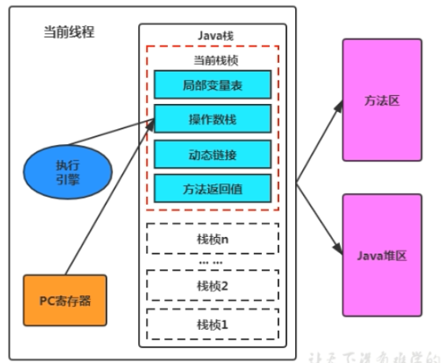 
  - 每个线程由一份pc寄存器
  - 指令会分配到栈的栈帧（一个栈帧对应一个方法，之后会讲）中。
  - 每一条指令都有对应的地址。
  - pc寄存器中保存着下一条指令的地址
  - 执行引擎会访问pc寄存器，根据地址去读并执行指令


#### 2.2.2.2. 手动尝试

```java
public static void main(String[] args){
  int i = 10;
  int j = 20;
  int k = i+j;
}
```

- 进行反编译：`javap -verbose RigisterTest.class`
  > 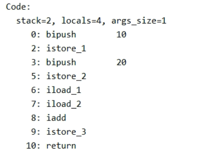
  - 说明：
    - 第一列：指令地址/偏移地址
    - 第二列：操作指令
  - 流程：
    - bipush 10 :取数值10
    - istore_1 保存到索引为1的位置（也就是该指令地址为2的原因）
    - ....(指令具体内容会在后面说)

- 整体顺序（用的不是上面的反编译结果）
  > 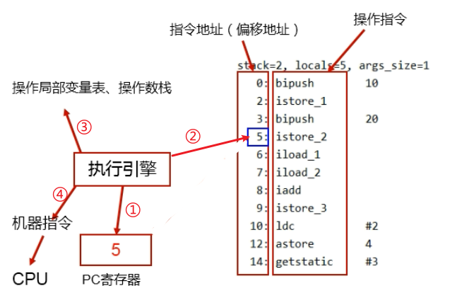 
  > 3,4步先有个大致印象。之后会具体展开来说

#### 2.2.2.3. 面试问题

- 问题一:
  - 问法：
    - 使用pc寄存器存储字节码指令地址有什么用?
    - 为什么使用PC寄存字器记录当当前线程的执行地址?
  - 答案
    ```
      因为pc寄存器是每个线程都有一份。
      CPU需要不停的切换各个线程，这时候
    切换回来以后，就得知道接着从哪开始继续
    执行。
      JVM的字节码解释器就需要通过改变PC寄存
    器的值来明确下一条应该执行什么样的字节
    码指令。
    ```
- 问题二：
  - 问法：
    - pc寄存器为什么被设定为线程私有
  - 答案
    ```
      我们都知道所谓的多线程在一个特定的时间段内只会执行其中某一个线程的方法，CPU
    会不停地做任务切换，这样必然导致经常中断或恢复，如何保证分毫无差呢？为了能够
    准确地记录各个线程正在执行的当前字节码指令地址，最好的办法自然是为每一个线
    都分配一个PC寄存器，这样一来各个线程之间便可以进行独立计算，从而不会出现相互
    干扰的情况。

    由于cpu时间片轮限制，众多线程在并发执行过程中，任何一个确定的时刻，一个处理
    器或者多核处理器中的一个内核，只会执行某个线程中的一条指令。

    这样必然导致经常中断或恢复，如何保证分毫无差呢？每个线程在创建后，都会产生自
    己的程序计数器和栈帧，程序计数器在各个线程之间互不影响。
    ```

- 相关：
  > 之后垃圾回收会用到。这里因为涉及线程的切换所以提一下。
  - 串行：依次执行。
  - 并行：同时执行。多核
  - 并发：一个核快速切换多个线程

### 2.2.3. 虚拟机栈(重要)

回忆架构：
 

> c 和 c++ 内存中，基本只有堆和栈两个。而java要更多。见上图

#### 2.2.3.1. 概述

- 背景：
  - 由于跨平台性的设计，Java的指令都是根据栈来设计的。不同平台CPU架 构不同，所以不能设计为基于寄存器的。
  - 优点是跨平台，指令集小，编译器容易实现，缺点是性能下降，实现同样 的功能需要更多的指令。
    > 前面也有提到基于寄存器的虚拟机，具体可以查看前面第一章

- 栈和堆：
  - 栈是运行时的单位。栈解决程序的运行问题，即程序如何执行，或者说如何处理数据。
    > 栈也可以放数据，比如一些基本类型的局部变量
  - 而堆是存储的单位。堆解决的 是数据存储的问题，即数据怎么放、放在哪儿。

- 基本内容
  - Java虚拟机栈是什么？
    - Java虚拟机栈（Java Virtual Machine Stack),早期也叫Java栈。
    - 每个线程在创建时都会创建一个虚拟机栈，其内部保存一个个的栈帧 (Stack Frame),**对应着一次次的Java方法调用**。
    - 是线程私有的
  - 生命周期
    - 生命周期和线程一致。
  - 作用
    - 主管Java程序的运行，它保存方法的局部变量、部分结果，并参与方法的调用和返回。
    - 其中局部变量包括：
      - 8种基本数据类型
      - 对象的引用地址（对象会放到堆中）

- 优点
  - 栈是一种快速有效的分配存储方式，访问速度仅次于程序 计数器。
  - JVM直接对Java栈的操作只有两个：
    - 每个方法执行，伴随着进栈（入栈、压栈）
    - 执行结束后的出栈工作
  - 对于栈来说不存在垃圾回收问题。但有OOM(out of memory)问题

- java中设置栈的大小：
  - `-Xss`选项

- 异常：
  - 如果线程请求的栈深度大于虚 拟机所允许的深度，将抛出StackOverflowError异常；
  - 如果Java虚拟机栈容量可以动态扩展，当栈扩展时无法申请到足够的内存会抛出OutOfMemoryError异常。

- 示例说明
  > 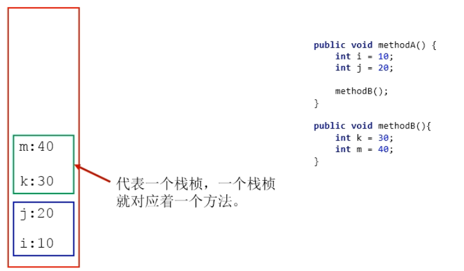 
  - 现在methodB在栈顶，则methodB为当前方法
  - 如果methodB执行完，绿色框栈帧出栈
  - 蓝色框(methodA)栈帧在栈顶，当前方法变为methodA

#### 2.2.3.2. 栈帧运行原理

- 栈帧：
  - 栈中的数据都是以栈帧（stack frame）的格式存在的
  - 在线程上正在执行的每个方法都各自对应一个栈帧。**一一对应**
  - 不同线程中所包含的栈帧是不允许存在相互引用的，即不可能在一个栈帧之中引用 另外一个线程的栈帧。
  - 栈帧是一个内存区块，是一个数据集，维系着方法执行过程中的各种数据信息

- 对jvm栈的两个操作:
  - 栈帧的入栈
  - 栈帧的出栈

- 当前栈帧/活动栈帧
  > 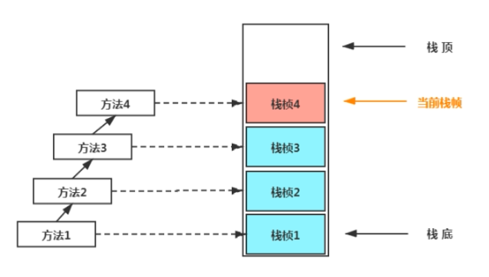
  > 图中为方法1调用方法2，方法2调用方法3....。每次调用都会放入新的栈帧
  - 在一条活动线程中，一个时间点上，只会有一个活动的栈帧。
  - 即只有当前正在执行的方法的栈帧（栈顶栈帧）是有效的，这个栈帧被称为当前栈帧 (Current Frame),
  - 与当前栈帧相对应的方法就是当前方法（Current Method)
  - 定义这个方法的类就是当前类（Current Class)。
  - 执行引擎运行的所有字节码指令只针对当前栈帧进行操作。

- idea debug 可以显示栈帧结构
  > 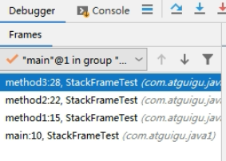 

- 运行原理-栈帧弹出
  - 如果当前方法调用了其他方法，方法返回之际，当前栈帧会传回此方法的执行结果给前一个栈帧
  - 接着，虚拟机会丢弃当前栈帧，使得前一个栈帧重新成为当前栈帧。
  - Java方法有两种返回函数的方式，不管使用哪种方式，都会导致栈帧被弹出。
    - 一种是正常的函数返回，使用return指令；
    - 另外一种是抛出异常。
      > 在此处深入理解异常抛出，以之前的图为例，假如方法4出现异常没有处理，方法4栈帧抛出异常，然后对应栈帧弹出<br />
      > 方法3接收到异常，如果依旧没有处理，继续抛出，方法3对应栈帧弹出。直到处理了异常使程序正常进行或者因为异常弹出全部栈帧导致程序停止。

- 栈的溢出：
  - 方法的嵌套调用导致栈帧的增加
  - 当嵌套调用的所有方法对应所有栈帧的总大小加起来大于栈大小时，就会报stackoverflow异常
  - 这也是使用递归时常见的异常

#### 2.2.3.3. 栈帧内部组成

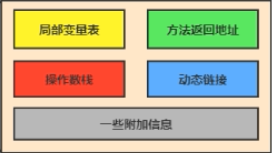

- **局部变量表**（Local Variables)
- **操作数栈**（operand stack)(或表达式栈）
- 帧数据区(有些书将以下三个部分并称为帧数据区)
  - 动态链接（Dynamic Linking)(或称为 指向运行时常量池的方法引用）
  - 方法返回地址（Return Address)(或称为 方法正常退出或者异常退出的定义）
  - 一些附加信息

#### 2.2.3.4. 栈帧内部-局部变量表

##### 2.2.3.4.1. 主要内容

> 又称为局部变量数组或者本地变量表

- 作用：
  - 主要用于存储**方法参数**和定义在方法体内的**局部变量**
  - 在方法执行时，虚拟机通过使用局部变量表完成参数值到参数变量列表的传递过程。
  - 当方法调用结束后，随着方法栈帧的销毁，局部变量表也会随之销毁。

- slot（变量槽）
  - 定义：是局部变量表 **最基本的存储单元**
  - 使用：32位以内的类型只需要占1个slot。64位类型占用两个slot

- 存储数据类型：
  - 定义为一个一维 **数字** **数组**
    - byte,short,char,float存储前被 **转换成int**，boolean也会转换为int
    - long和double则占据两个Slot
  - 这些数据类型包括各类基本数据类型、对象引用（reference),以及 returnAddress 类型。

- 内存分配
  - 主要影响栈帧大小的就是局部变量表
  - 局部变量表所需的内存空间在 **编译期间**完成分配。并保存在方法的 Code 属性的 maximum local variables 数据项中。
  - 当进入一个方法时，这个方法需要在栈帧中分配多大的局部变量空间是完全确定的
  - 在方法运行期间不会改变局部变量表的大小。
    ```
    这里说的 大小 是指变量槽的数量，
    虚拟机真正使用多大的内存空间（譬如按照1个变量槽占用32个比特、64个比特，或者更多）来实现一
    个变量槽，这是完全由具体的虚拟机实现自行决定的事情。
    ```
  - 示例：
    > 反编译（javap）一个测试类的字节码文件 <br />
    > 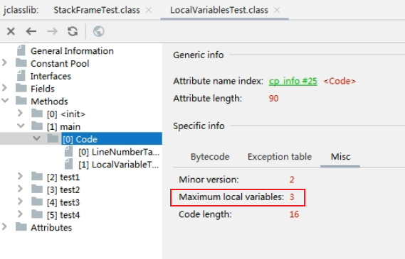 <br />
    > 使用javap指令也可以查看。只是使用jclasslib结构更清晰<br />

- 安全问题：
  - 局部变量表中的变量只在当前线程的当前方法调用中有效
  - 由于局部变量表是建立在线程的栈上，是线程的私有数据，因此**不存在数据安全问题**

- 字节码结构相关：
  - 字节码行号与java代码行号对应关系
    > 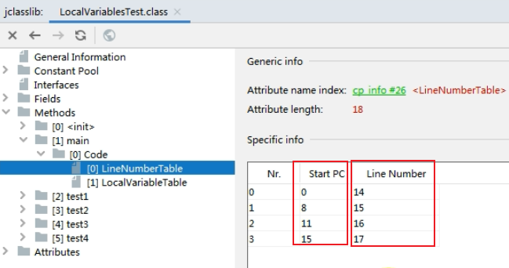 
  - 临时变量列表与作用范围：
    > 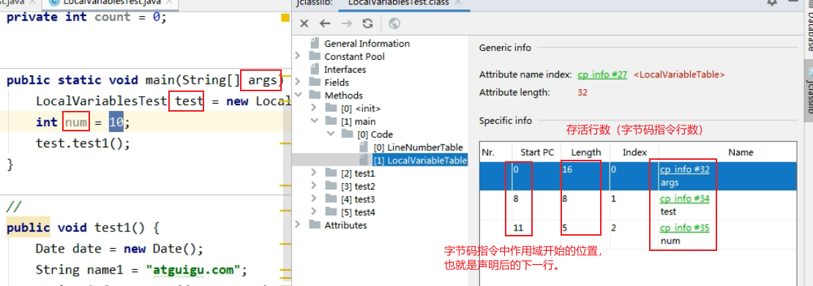 
    > 可以发现 开始行号+作用长度 相同，也就是临时变量都是到方法最后才销毁

##### 2.2.3.4.2. slot

- slot 深入
  > 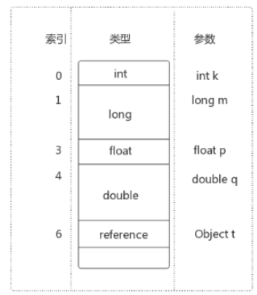
  - 访问：
    - JVM 会为局部变量表中的每一个 slot 都分配一个访问索引
    - 通过这个索引即可成功访 问到局部变量表中指定的局部变量值
    - **如果是 64 位数据类型的话，访问第一个 slot 的索引即可**
      > 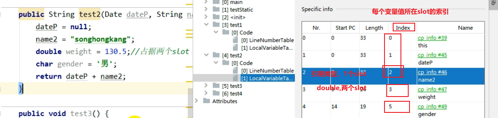 
  - 存储顺序：
    - 当一个实例方法被调用的时候，它的**方法参数**和方法体内部定义的**局部变量**将会 **按照顺序**被复制到局部变量表中的每一个 slot 上
  - 注意：
    > 改点可以用来解释为什么静态方法中不能使用 this，而构造方法和实例方法中可以使用
    - 对象：
      - 构造方法
      - 实例方法（非静态方法）
    - 现象：
      - 因为没有静态声明
      - **该对象的引用 this 会存放在 index 为 0 的 slot 处**
      - 其余都会按顺序存放
- slot的重复利用：
  - 栈帧中的局部变量表中的槽位是可以重用的，
  - 如果一个局部变量过了其作用域，那么在其用域之后申明的新的局部变量就很有可能会复用过期局部变量的槽位
  - 从而达到节省资源的目的。
  - 示例
    > 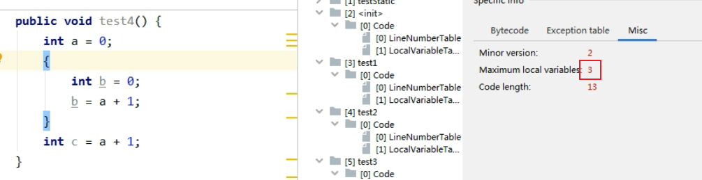 
    - this,a,b,c有4个
    - 但是这里长度为3。这是因为slot的重复利用
    > 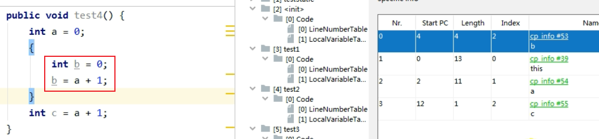 
    - 变量b作用域只有大括号里面。4+4=8
    - 变量c使用变量已经销毁的变量b的位置

##### 2.2.3.4.3. 补充

- 局部变量不赋值直接使用报错：
  ```java
  public void test1(){
    int i;
    System.out.print(i);
    // 会报错
  }
  ```
  - 编译阶段会生成字节码指令
  - 字节码指令中有调用局部变量i
  - 但局部变量表中并没有i的值
  - 编译报错

- 在栈帧中，与性能调优关系最为密切的部分就是前面提到的局部变量表。
  - 局部变量表占栈帧的大部分空间
  - 垃圾回收：
    > **局部变量表中的变量也是重要的垃圾回收根节点，只要被局部变量表中直 接或间接引用的对象都不会被回收。**
    - 栈帧中局部变量表中的引用会指向堆空间中的对象
    - 通过判断是否有引用指向对中的对象判断是否需要回收空间

#### 2.2.3.5. 栈帧内部-操作数栈


- 作用： **主要用于保存计算过程的中间结果，同时作为计算过程中变量临时的存储空间。**
- 流程：
  - 当一个方法开始执行的时候，一个栈帧就会被创建出来。这个栈帧里的操作数栈一开始是**空的**。当然，空的并不意味着长度为0
    > 同局部变量表一样，操作数栈的最大深度也在编译的时候被写入到Code属性的**max_stacks**数据项之中。<br/>
    > 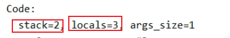 <br/>
    > 左边为操作数栈深度，右边为诶局部变量表深度。<br/>
    > 操作数栈的每一个元素都可以是包括long和double在内的任意Java数据类型。32位数据类型所占的栈容量为1，64位数据类型所占的栈容量为2。<br/>
    > Javac编译器的数据流分析工作保证了在方法执行的任 何时候，操作数栈的深度都不会超过在max_stacks数据项中设定的最大值。
  - 在方法的执行过程中，根据字节码指令，往操作数栈中写入数据或提取数据，**注意：不是采用索引方式访问数据，而是出栈入栈**
    > 我们说Java虚拟机的解释引擎是基于栈的执行引擎，其中的栈指的就是操作数栈。
  - 某些字节码指令将值压入操作数栈，其余的字节码指令将操作数取出栈。使用它们后再把结果压入栈。
    - 比如：执行复制、交换、求和，调用方法后返回值
    - 示例：
      > 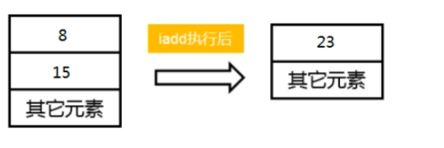 
  - 在更新pc寄存器中下一条需要执行的字节码指令

- 代码示例**（重要）**：
  > 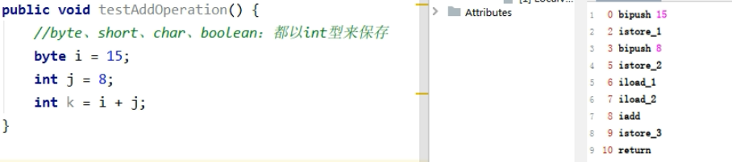 <br/>
  > java代码以及编译后的字节码指令（执行时执行引擎会将字节码指令翻译为机器指令）
  > 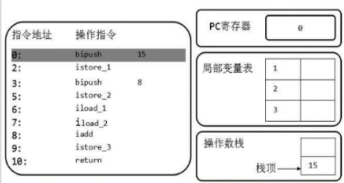 <br/>
  > **push是把字节码中的数据放入操作数栈**。bipush是指byte的push，sipush是指short的push。**对于数字类型，会自动根据数值大小选择push类型为byte,short,int中的一种** <br/>
  > 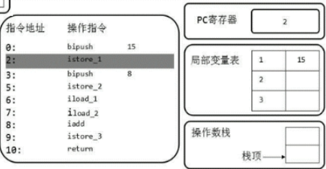 <br/>
  > istore_1是指让操作数栈的第一个数出栈，放入局部变量表index=1处。（局部变量表index为0的地方放this。）（如果是double类型的话，就是dstore）<br/>
  > 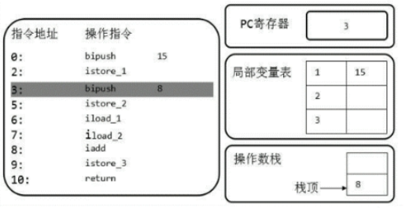 <br/>
  > 把8放入操作数栈 <br/>
  > 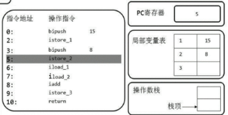 <br/>
  > istore_2是指让操作数栈的第一个数出栈，放入局部变量表index=2处。（局部变量表index为0的地方放this。）<br/>
  > 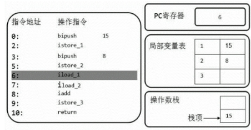 <br/>
  > **load是指把局部变量表中（或者返回值）的数据压入操作数栈**，把局部变量表中索引为1位置的数据压入操作数栈<br/>
  > 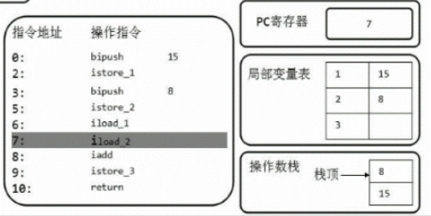 <br/>
  > 把局部变量表中索引为2位置的数据压入操作数栈<br/>
  > 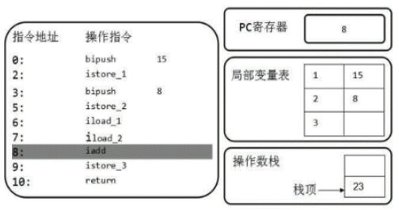<br/> 
  > 把操作数栈中的前两个数据**出栈**，然后进行相加，把结果再**入栈**<br/>
  > 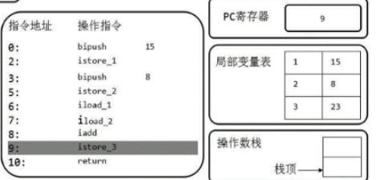 <br/>
  > 将操作数栈中的第一个数出栈，存放在局部变量表index为3的位置<br/>


#### 2.2.3.6. 栈顶缓存技术

> top of stack cashing<br/>
> 该技术为hotspot设计者提出，还没有进行应用

- 背景
  - 基于栈式架构的虚拟机所使用的**零地址**指令更加紧凑
    > 上面的操作就只涉及出栈入栈，并没有涉及地址
  - 但完 成一项操作的时候必然需要使用更多的入栈和出栈指令，
  - 这同时也就意味着将需要更多的指令分派（instruction dispatch)次数和内存读/写次数。
- 目的：为了解决以上问题
- 说明：将**栈顶元素**全部缓存在**物理CPU**的**寄存器**中，以此降低对内存的读/写次数，提升执行引擎的 执行效率。


#### 2.2.3.7. 栈帧内部-动态链接

- 帧数据区：附加信息，动态连接，方法返回地址
  > 某些书上会有该概念

- 补充知识
  > 方法区在之后会细讲
  - 编译后的字节码文件中会有常量池
    > 常量池的作用就是提供一些符号和常量，便于指令识别<br />
    > 同时也减小了文件大小，重复部分可以直接使用引用指向
  - 加载到内存后为运行时常量池
  - 存在于方法区
  > 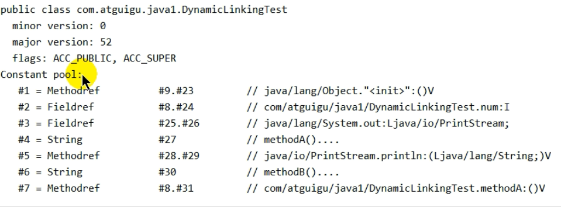 

- 说明：
  - 在Java源文件被编译到字节码文件中时，所有的**变量**和**方法引用**都作为**符号引用（Symbolic Reference)**保存在class文件的**常量池**里。
    > 每个方法的符号引用，通过其他的符号引用构成。（符号引用详细会留到下一篇）<br />
    >  <br />
    > 比如这里的方法引用通过类符号引用.方法名称符号引用:返回值类型符号引用构成(// 后为解析完成后的结果)
    - 这些符号引用一部分会在类加载阶段或者第一次使用的时候就被转化为直接引用，这种转化被称为**静态解析**。
    - 另外一部分将在每一次运行期间都转化为直接引用，这部分就称为**动态链接**
  - 每一个**栈帧内部**都包含一个**指向运行时常量池中该栈帧所属方法对应符号引用**的**引用**
  - 比如：
    - 描述一个方法调用了另外的其他方法时，就是通过常量池中指向方法的符号引用来表示的。
    - 为了找到该方法，就会访问被调用方法栈帧中的  那个指向符号引用的引用
    > 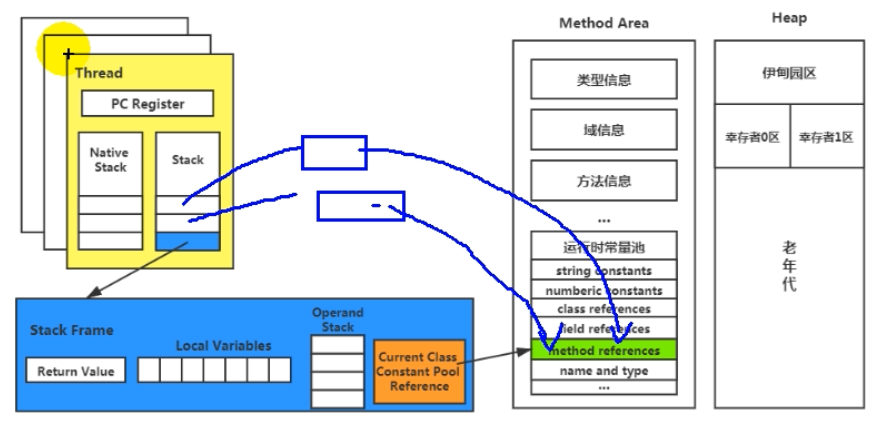 
  - 作用:就是为了将这些符号引用转换为调用方法的直接引用。

- 原理：
  - 包含这个引用的目的就是为了支持当前方法的代码能够实现动态链接 (Dynamic Linking)。比如：invokedynamic指令

#### 2.2.3.8. 方法的调用：解析和分派

> 对动态链接进行深入讲解

##### 2.2.3.8.1. 绑定与链接

- 绑定： 绑定是一个字段、方法或者类在符号引用被替换为 直接引用的过程，这仅仅发生一次。
  - 早期绑定（Early Binding) 。对应指令 invokespecial, invokestatic
    ```
    早期绑定就是指被调用的目标方法如果在编译期可知，且运行期保持不变时，
    即可将这个方法与所属的类型进行绑定，这样一来，由于明确了被调用的目
    标方法究竟是哪一个，因此也就可以使用静态链接的方式将符号引用转换为
    直接引用。
    ```
  - 晚期绑定 (Late Binding)。对应指令 invokevirtual，invokeinterface
    ```
    如果被调用的方法在编译期无法被确定下来，只能够在程序运行期根据实际
    的类型绑定相关的方法，这种绑定方式也就被称之为晚期绑定。
    ```
- 链接：
  > 分别对应上面的两个绑定
  - 静态链接：在编译期间，被调用的方法就已经确定下来，并已经把符号引用转换为了调用方法的直接引用。
  - 动态链接：被调用的方法在编译期间无法确定下来，只能在运行期间将调用方法的符号引用转换为直接引用

- 示例：
  - 示例1
    ```java
    // eat 是一个接口，有eat()方法
    // animal 是一个类。
    // cat,dog 两个类继承animal，实现该eat接口
    class Cat{
      public cat(){
        super()  // 此处编译时就是调用animal的构造方法。为早期绑定
      }
    }
    public class AnimalTest{
      public void animalEat(eat e){
        e.eat() // 此处编译时就无法得知调用哪一个实现类的方法。为晚期绑定
      }
    }
    ```
  - 示例2：用final修饰就是使用早期绑定

##### 2.2.3.8.2. 非虚方法与虚方法

> 分别对应上面的早期绑定与晚期绑定。

- 语言的发展与动态链接
  ```
  随着高级语言的横空出世，类似于Java一样的基于面向对象的编程语言如今
  越来越多，尽管这类编程语言在语法风格上存在一定的差别，但是它们彼此
  之间始终保持着一个共性，那就是都支持封装、继承和多态等面向对象特性，
  既然这一类的编程语言具备多态特性，那么自然也就具备早期绑定和晚期绑
  定两种绑定方式。

  Java中任何一个普通的方法其实都具备虚函数的特征，它们相当于C++语言
  中的虚函数（C++中则需要使用关键字virtual来显式定义）。如果在Java
  程序中不希望某个方法拥有虚函数的特征时，则可以使用关键字final来标
  记这个方法。
  ```
- 分类
  - 非虚方法:
    - 如果方法在编译期就确定了具体的调用版本，这个版本在运行时是不可变的。这样的方法称为非虚方法。
    - **静态方法、私有方法、final方法、构造器、父类方法(使用super显式调用)**都是非虚方法。
  - 虚方法:其他方法称为虚方法。
    - Java中任何一个成员方法都是虚方法。在子类中可以重写父类方法。

##### 2.2.3.8.3. 相关指令

> 下方前四条指令固化在虚拟机内部，方法的调用执行不可人为干预，而invokedynamic指令则支持由用户确定方法版本。<br />
> **其中invokestatic指令和invokespecial指令调用的方法称为： 虚方法，其余的（final修饰的除外）称为虚方法。**

- 普通调用指令
  - 调用非虚方法
    - invokestatic:调用静态方法，解析阶段确定唯一方法版本
    - invokespecial:调用`<init>`方法、私有及父类方法，解析阶段确定唯一方法版本
  - 调用虚方法(final除外)
    - invokevirtual:调用所有虚方法
      - 注意：
        - 如果隐式调用父类方法，不管父类方法有没有加final，**都会编译成invokevirtual**，
          - **也就是说包含父类方法不为虚函数，调用时边编译出invokevirtual的情况**
        - 只有显式调用父类方法`super.fatherMethod()`，才会编译成invokespecial。
    - invokeinterface:调用接口方法
- 动态调用指令：
  - invokedynamic:动态解析出需要调用的方法，然后执行

- 代码示例
  ```java
  package com.atguigu.java2;

  /**
  * 解析调用中非虚方法、虚方法的测试
  *
  * invokestatic指令和invokespecial指令调用的方法称为非虚方法
  * @author shkstart
  * @create 2020 下午 12:07
  */
  class Father {
      public Father() {
          System.out.println("father的构造器");
      }

      public static void showStatic(String str) {
          System.out.println("father " + str);
      }

      public final void showFinal() {
          System.out.println("father show final");
      }

      public void showCommon() {
          System.out.println("father 普通方法");
      }
  }

  public class Son extends Father {
      public Son() {
          //invokespecial
          super();
      }
      public Son(int age) {
          //invokespecial
          this();
      }
      //不是重写的父类的静态方法，因为静态方法不能被重写！
      public static void showStatic(String str) {
          System.out.println("son " + str);
      }
      private void showPrivate(String str) {
          System.out.println("son private" + str);
      }

      public void show() {
          //invokestatic
          showStatic("atguigu.com");
          //invokestatic
          super.showStatic("good!");
          //invokespecial
          showPrivate("hello!");
          //invokespecial
          super.showCommon();

          //invokevirtual
          showFinal();//因为此方法声明有final，不能被子类重写，所以也认为此方法是非虚方法。

          // 虚方法
          // 没有显示加super.，子类可能重写了该方法，也可能没有，分别对应调用子类和父类方法的情况 
          //invokevirtual
          showCommon();
          info();

          MethodInterface in = null;
          // 虚方法
          //invokeinterface，一定会调用实现类的方法
          in.methodA();
      }

      public void info(){

      }

      public void display(Father f){
          f.showCommon();
      }

      public static void main(String[] args) {
          Son so = new Son();
          so.show();
      }
  }

  interface MethodInterface{
      void methodA();
  }
  ```

- invokedynamic详解
  - 出现：jvm字节码指令集一直较为稳定，一直到java7中才添加了一个invokedynamic
    ```
    Java7中增加的动态语言类型支持的本质是对Java虚拟机规范的修改，而不
    是对Java语言规则的修改，这一块相对来讲比较复杂，增加了虚拟机中的方
    法调用，最直接的受益者就是运行在Java平台的动态语言(比如python,js)的编译器(第一张提到的，跨语言的平台)
    ```
  - 目的:**实现 动态类型语言支持**，保证了能在jvm上运行python，js等动态语言
  - 生成：
    - java7
      - 但是在Java7中并没有提供直接生成invokedynamic指令的方法，需要借助ASM这种底层字节码工具来产生invokedynamic指令。直到Java8中lambda的出现
    - java8
      - 由于lambda的出现，java中有了invokedynamic的直接生成方式

  - 示例代码
  ```java
  @FunctionalInterface
  interface Func {
      public boolean func(String str);
  }

  public class Lambda {
      public void lambda(Func func) {
          return;
      }

      public static void main(String[] args) {
          Lambda lambda = new Lambda();

          // 在此处就会调用invokedynamic指令
          // Func就是一个接口，
          // 接收右侧实现类。
          // 类似于python中，通过等号右边判断左侧标识符的类型。
          Func func = s -> {
              return true;
          };

          lambda.lambda(func);

          lambda.lambda(s -> {
              return true;
          });
      }
  }
  ```

##### 2.2.3.8.4. 方法重写本质

- 虚方法调用流程：
  - 当调用一个对象的方法的时候，会将对象压入操作数栈。
    - 再根据字节码指令（通常为为invokevirtual，即调用对象方法）调用方法。根据该指令会操作数栈顶寻找
    - 找到操作数栈顶的第一个元素所执行的对象的实际类型，记作C。
  - 再在类型C中寻找与常量中的描述符和简单名称都相符的方法
    - 如果找到了
      - 则进行**访问权限校验**，
        - 如果通过则返回这个方法的直接引用，查找过程结束；
        - 如果不通过，则返回java.lang.IllegalAccessError异常。
          ```
          程序试图访问或修改一个属性或调用一个方法，这个属性或方法，你没有权限访问。一般
          的，这个会引起编译器异常。这个错误如果发生在运行时，就说明一个类发生了不兼容的
          改变。

          该Error比较难排错。
          maven管理依赖时，jar包冲突就有可能引起该异常
          ```
    - 如果没找到，按照继承关系从下往上依次对C的各个父类进行第2步的搜索和验证过程。
      - 如果始终没有找到合适的方法，则抛出java.lang.AbstractMethodError异常。
        > 该异常也就是指调用的方法没被重写或实现过

##### 2.2.3.8.5. 虚方法表

> virtual method table

- 出现原因：每次调用虚方法都会重复上述过程，过于浪费时间，影响效率
- 作用：存放虚方法，存放各个虚方法的实际入口。
  > 非虚方法不会出现在表中，因为在编译期间已经确定下来，不需要花费时间寻找方法入口
- 建立位置：方法区
- 建立时期：
  - 在链接阶段被创建并开始初始化，
  - 类的变量初始值准备完成之后，JVM会把该类的方法表也初始化完毕

- 示例：
  - 例1：Father和Son两个类的虚方法表
    > 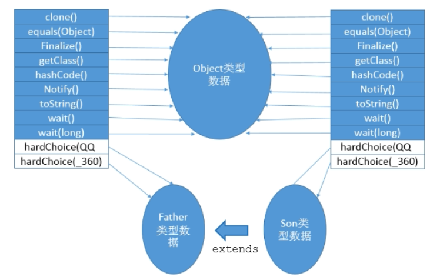 
  - 例2：
    > 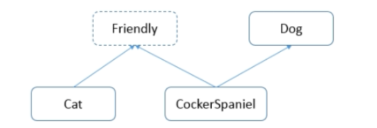 <br />
    > 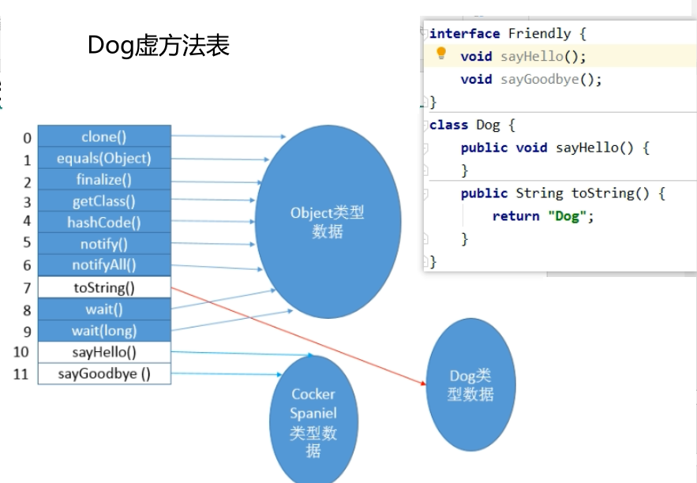 <br />
    > 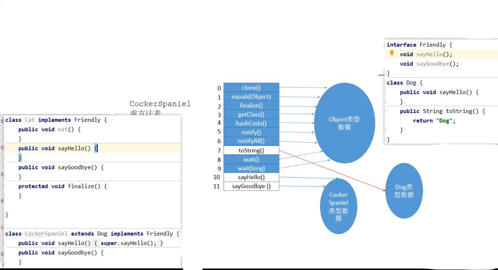 <br />
    > 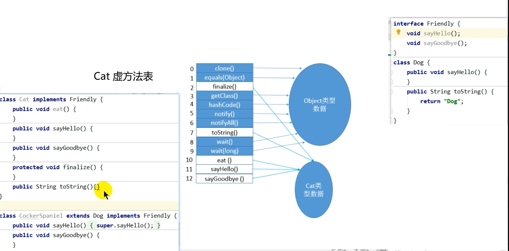 


<br/> <br/> <br/>
疑问：如何解释上转类型和下转类型的多态

#### 2.2.3.9. 栈帧内部-方法返回地址

- 该结构存储的数据：调用该方法时，pc寄存器（或者程序计数器）中的值


- 过程讲解：
  - 正常退出
    - A调用B方法。此时程序计数器中值为3
    - B方法对应栈帧入栈，此时该栈帧中 方法返回地址 的值为3
    - B方法执行完，执行引擎读取B方法中的 方法返回地址 的值3,读取后B方法的栈帧出栈
    - 执行引擎把3放入程序计数器，继续执行下一条指令
  - 异常退出
    - 返回地址要通过**异常表**来确定，栈帧中不会保存这部分信息。

- 两种退出方式：
  > 线程一节也有提到
  - 正常退出
    - 会执行方法返回的字节码指令（return），返回值会返回给上层调用者
    - 根据不同的返回值类型会使用不同的返回指令
      - ireturn:返回值为boolean,byte,char,short,int
      - lreturn:返回值为long
      - freturn:返回值为float
      - dreturn:返回值为double
      - areturn:返回值为引用
      - return:返回值为void的方法，实例初始化方法，类和接口的初始化方法
  - 异常退出
    - 通过异常退出的不会给他的上层调用者产生任何的返回值
    - 如果在抛出异常的地方使用try-catch捕获异常并进行处理，就会有一个**异常处理表**(和上面的异常表不同)
      > 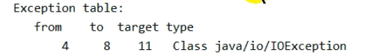 <br />
      > 第一行：如果是字节码指令4-8行出现的java.io.IOException异常，就在字节码指令第11行进行处理

#### 2.2.3.10. 栈帧内部--附加信息

栈帧中还允许携带与Java虚拟机实现相关的一些附加信息。例如， 对程序调试提供支持的信息。 

并不一定有

#### 2.2.3.11. 面试题

- 栈中可能出现的异常
  > Java 虚拟机规范允许Java栈的大小是动态的或者是固定不变的。
  ```
  如果采用固定大小的Java虚拟机栈，那每一个线程的Java虚拟机栈容量
  可以在线程创建的时候独立选定。如果线程请求分配的栈容量超过Java
  虚拟机栈允许的最大容量，Java虚拟机将会抛出一个
  StackoverflowError异常。

  演示：main(args)，递归。
  ```
  ```
  如果Java虚拟机栈可以动态扩展，并且在尝试扩展的时候无法申请到足
  够的内存，或者在创建新的线程时没有足够的内存去创建对应的虚拟机栈，
  那Java虚拟机将会抛出一个OutOfMemoryError异常。
  ```
  ```
  扩展：
  HotSpot虚拟机的栈容量是不可以动态扩展的，以前的Classic虚拟机倒是可以。所以在HotSpot虚拟
  机上是不会由于虚拟机栈无法扩展而导致OutOfMemoryError异常——只要线程申请栈空间成功了就不
  会有OOM，但是如果申请时就失败，仍然是会出现OOM异常的
  ```

- i++和++i的区别。从字节码，局部变量表，操作数栈层面解释
  ```java
  // 第一类问题
  int i1 = 10;
  i1++;

  int i2 = 10;
  ++i2

  // 第二类问题
  int i3 = 10;
  int i4 = i3++;

  int i5 = 10;
  int i6 = +i5+;

  // 第三类问题
  int i7 = 10;
  i7 = i7++;

  int i8 = 10;
  i8 = i8++;

  // 第四类问题
  int i9 = 10;
  int i10 = i9++ + ++i9
  ```

- 举例栈溢出的情况？(StackOverflowError)
  ```
  通过 -Xss设置栈的大小
  栈的大小有两种：
    固定大小
    动态变化。当内存空间不足，无法扩容时，出现OOM异常
  ```
- 调整栈大小，就能保证不出现溢出吗？
  ```
  不能，
  比如递归的话，尤其是死循环，肯定会溢出
  ```
- 分配的栈内存越大越好吗？
  ```
  不是。
  可以拖延StackOverflowError的出现，但是不能避免出现StackOverFlow的出现
  同时因为栈大小变大了，每个线程占用内存就会变多，最大线程数也会变少，留给其他结构的内存也会变少
  ```
- 垃圾回收是否会涉及到虚拟机栈？
  ```
  不会。
  95%垃圾回收在堆，5%在方法区
  (之前提到过)
  ```
- 方法中定义的局部变量是否线程安全？
  ```
  具体问题，具体分析
  线程安全：
    如果有一个线程操作一个数据，则必是线程安全
    如果有多个线程操作一个数据，且没有考虑了同步，就会存在线程安全问题

  如果通过形参传入的变量，如果也有其他线程在方法外部操作，则是线程不安全的

  如果是方法内部定义的局部变量，最后return出去了(也就是之后讲的  逃逸分析)，如果return出的数据会被多个线程访问。该线程也是不安全的
  例：
    //s1的操作：是线程不安全的
    public static StringBuilder method3(){
        StringBuilder s1 = new StringBuilder();
        s1.append("a");
        s1.append("b");
        return s1;
    }
    //s1的操作：是线程安全的
    //但返回的String是线程不安全的
    public static String method4(){
        StringBuilder s1 = new StringBuilder();
        s1.append("a");
        s1.append("b");
        return s1.toString();
    }
  ```


### 2.2.4. 本地方法接口+库(非运行时数据区结构)

> 为运行时数据区中的本地方法栈做准备

```
可以调用其他语言函数的特征并非Java所特有，很多其它的编程语言都有这一机制，比如在C++中，
你可以用extern"C"告知C++编译器去调用一个c的函数。
```

- 本地方法接口(Native Method): 
  - 定义：一个Native Method就是一个Java调用非Java代码的接口。
  - 特点：该方法的实现由非Java语言实现，比如 C。
  - 实现：
    ```
    在定义一个native method时，并不提供实现体（有些像定义一个Java
    interface),因为其实现体是由非java语言在外面实现的。
    本地接口的作用是融合不同的编程语言为Java所用，它的初衷是融合C/C++程序。

    Thread类中的很多方法都是native method
    ```
    ```java
    public class IHaveNatives {
        // 注意：native 和 abstract 不能公用。
          // native 表示 该方法有方法体，但是是用别的语言实现的
          // abstract 表示该方法就没有方法体
        public native void Native1(int x);
        public native static long Native2();
        private native synchronized float Native3(Object o);
        native void Native4(int[] ary) throws Exception;
    }
    ```
- 目的
  ```
  java有无法解决的问题：
    有些层次的任务用java实现起来不容易
    有些地方对效率要求很高
  ```
  - 具体目的：
    - 与java环境外交互
      > 主要原因
      ```
      你可以想想Java需要与一些底层系统，如操作系统或某些硬件交换信息时的
      情况。本地方法正是这样一种交流机制：它为我们提供了一个非常简洁的接口，
      而且我们无需去了解Java应用之外的繁琐的细节。
      ```
    - 与操作系统交互
      ```
      JVM支持着Java语言本身和运行时库，它是Java程序赖以生存的平台，它由一个解释
      器（解释字节码）和一些连接到本地代码的库组成。然而不管怎样，它毕竟不是一个
      完整的系统，它经常依赖于一些底层系统的支持。这些底层系统常常是强大的操作系
      统。通过使用本地方法，我们得以用Java实现了jre的与底层系统的交互，甚至JVM
      的一些部分就是用c写的。还有，如果我们要使用一些Java语言本身没有提供封装的
      操作系统的特性时，我们也需要使用本地方法。
      ```
    - Sun's java
      ```
      Sun的解释器是用c实现的，这使得它能像一些普通的c一样与外部交互。jre大部分是
      用Java实现的，它也通过一些本地方法与外界交互。例如：类java.lang.Thread
      的 setpriority()方法是用Java实现的，但是它实现调用的是该类里的本地方法
      setpriorityo()。这个本地方法是用c实现的，并被植入JVM内部，在Windows 95
      的平台上，这个本地方法最终将调用win32 setPriority()API。这是一个本地方
      法的具体实现由JVM直接提供，更多的情况是本地方法由外部的动态链接库
      (external dynamic link library)提供，然后被JVM调用。
      ```
- 现状
  ```
  目前native method使用的越来越少了，除非是与硬件有关的应用，比如通过
  Java程序驱动打印机或者Java系统管理生产设备，在企业级应用中已经
  比较少见。因为现在的异构领域间的通信很发达，比如可以使用Socket
  通信，也可以使用web Service等等，不多做介绍。
  ```

### 2.2.5. 本地方法栈

- 说明：
  - java虚拟机栈用于管理java方法的调用
  - 而本地方法栈用于管理本地方法的调用
- 范围：线程私有
- 大小：
  > 和jaa虚拟机栈相同
  - 固定大小
    > 如果线程请求分配的栈容量超过本地方法栈允许的最大容量，Java虚拟机将会抛出一个StackOverflowError 异常
  - 可扩展内存大小
    > 如果本地方法栈可以动态扩展，并且在尝试扩展的时候无法申请到足够的内存， <br />
    > 或者在创建新的线程时没有足够的内存去创建对应的本地方法栈，那么Java虚拟机将会抛出一个 OutofMemoryError异常。
- 执行：
  >  待完善 ※
  - 在本地方法栈中登记Native方法。
  - 在 Execution Engine 执行时加载本地方法库

- 注意：
  - 当某个线程调用一个本地方法时，**线程会进入了一个全新的并且不再受虚拟机限制的环境。它和虚拟机拥有同样的权限**。
    - 本地方法可以通过本地方法接口来**访问虚拟机内部的运行时数据区**。
    - 它甚至可以直接使用本地处理器中的寄存器
    - 直接从本地内存的堆中分配任意数量的内存。
  - 并不是所有的JVM都支持本地方法。
    - 因为Java虚拟机规范并没有明确要求 本地方法栈的使用语言、具体实现方式、数据结构等。
    - 如果JVM产品不打 算支持native方法，也可以无需实现本地方法栈。
  - 在Hotspot JVM中，直接将本地方法栈和虚拟机栈合二为一。
    - 比如A方法中，会调用本地方法B
    - 调用A时，就会把方法A对应栈帧压入栈
    - A在调用B时，就会使用动态链接的方式直接指向本地方法
    - 再由执行引擎进行执行

### 2.2.6. 堆(重要)

#### 2.2.6.1. 概述

- 介绍：一个jvm实例只存在一个堆内存，堆也是java内存管理的核心区域
- 创建时机：在jvm启动时被创建，创建后其内存大小也就确定了，时jvm管理的最大一块的内存空间 
  > 堆的大小是可以调节的

- 示例
  - 参数
    - -Xms 10m:设置堆起始为10m
    - -Xmx 10m:设置堆最大为10m
  - 代码
    ```java
    public class HeapDemo {
        public static void main(String[] args) {
            System.out.println("start...");
            try {
                Thread.sleep(1000000);
            } catch (InterruptedException e) {
                e.printStackTrace();
            }

            System.out.println("end...");
        }
    }
    ```
  - 监控：
    - jdk自带工具：`jvisualvm`
    - 可以查看**当前或远程操作系统**上运行的java进程（即jvm）的资源使用情况
  - 结果
    > 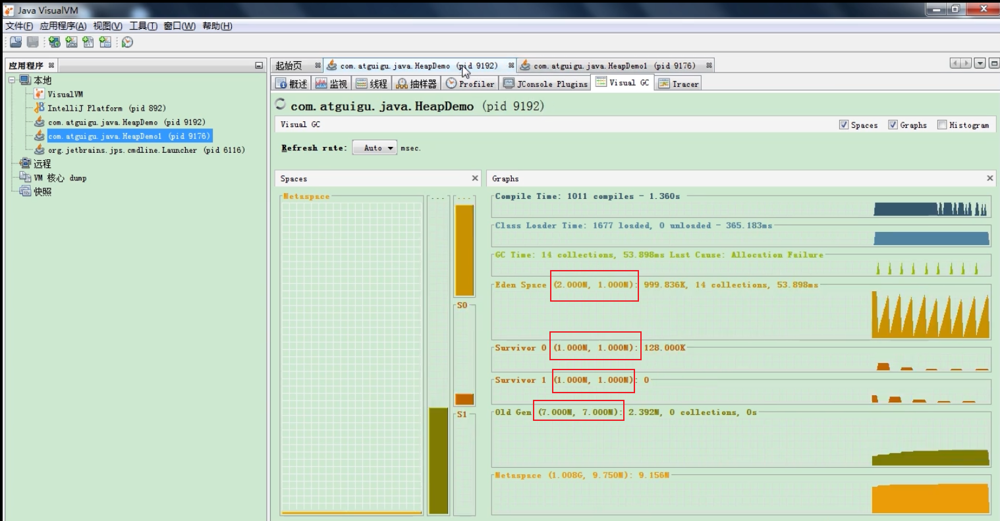
    - 加起来就是通过参数选项设置的堆的大小

#### 2.2.6.2. 核心概述

- 堆是共有的
  - 一个JVM实例只存在一个堆内存，堆也是Java内存管理的核心区域。
  - 所有的线程共享Java堆，
  - 注意：在这里还可以划分线程**私有**的缓冲区（Thread Local Allocation Buffer, TLAB)。
    > 因为共享数据存在线程安全问题。如果通过并发进行处理的话，并发性又会下降<br />
    > 为了加快速度，会在堆空间中给每个线程分一个缓冲区
- 堆的创建：
  - Java堆区在JVM启动的时候即被创建，其空间大小也就确定了。是JVM 管理的最大一块内存空间。
  - 堆内存的大小是可以调节的。
- 堆在内存中的分布：
  - 堆可以处于**物理上不连续**的内存空间中，但在 **逻辑上它应该被视为连续的。**
    ```
    这点就像我们用磁盘空间去存储文件一样，并不要求每个文件都连续存放。但对于大
    对象（典型的如数组对象），多数虚拟机实现出于实现简单、存储高效的考虑，很可能会要求连续的
    内存空间。
    ```
- 对象示例的分配
  - 所有的对象实例以及数组都应当在运行时全部分配在堆上。
    > 注意：因为之后jvm也有了新的特性，在讲到后面的时候，**全部**应该替换为**几乎**<br />
  - 数组和对象可能永远不会存储在栈上，因为栈帧中保存引用，这个引用指向对象或者数组在堆中的位置。
    > 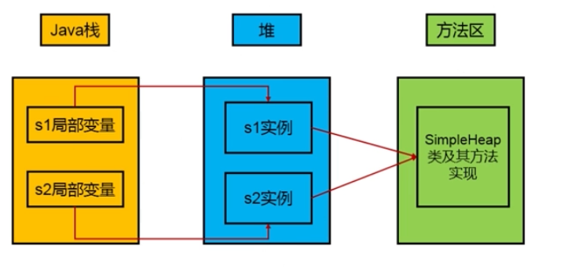 <br />
    > 注意，这个到了后面也会被推翻
  - 方法结束后，堆中的对象不会马上被移除，**仅仅在垃圾回收的时候才会被移除**
  - 堆是垃圾回收的重点区域

- 代码示例
  > 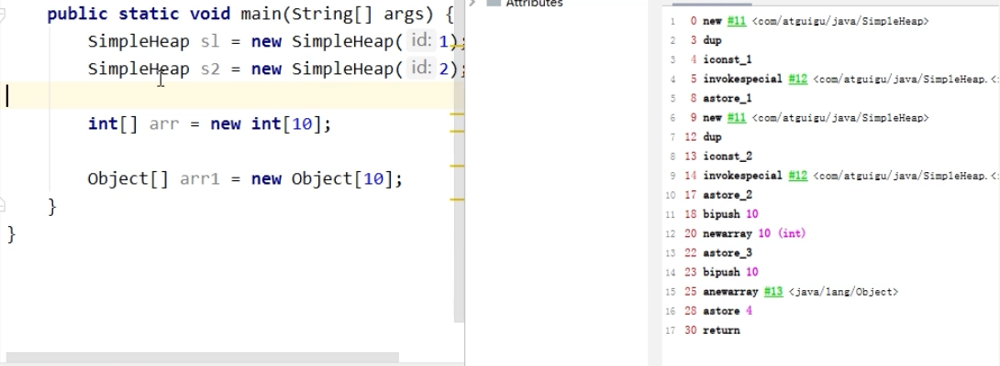 

- 堆空间的细分
  - 两个jdk,7和8是一个分水岭
    - jdk7
      > 新生区+养老区+永久区
      - Young Generation Space 新生区/新生代/年轻代等等。
        - Eden
        - Survivor0(或称为from区)
        - Survivor1(或称为to区)
      - Tenure Generation Space 养老区
      - Permanent Space 永久区
    - jdk8
      > 新生区+养老区+元空间
      - Young Generation Space 新生区
        - Eden
        - Survivor0(或称为from区)
        - Survivor1(或称为to区)
      - Tenure Generation Space 养老区
      - Meta Space 元空间
  - 图解
    > 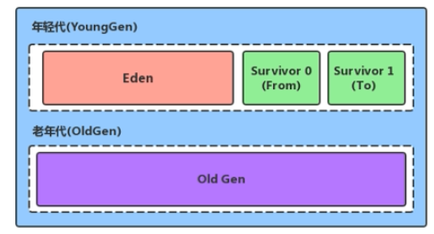<br />
    > 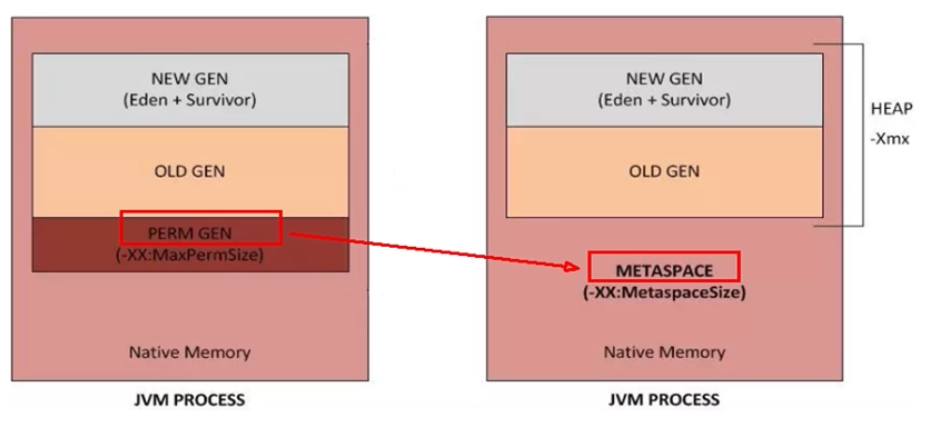 <br />
    > 可以发现-Xmx参数只可以设置前两个区域<br />
    > 而永久代和元数据区都需要通过其他参数进行设置
  - 动手
    - 写个hellow world，添加参数`-Xms10m -Xmx10m -XX:+PrintGCDetails`，
      - 在jdk7下运行查看输出
      - 在jdk8下运行查看输出
    - 写个一直sleep的程序，添加参数`-Xms10m -Xmx10m`，用JVisualVM查看垃圾回收情况
      > 验证-Xmx参数只可以设置前两个区域<br />
      > 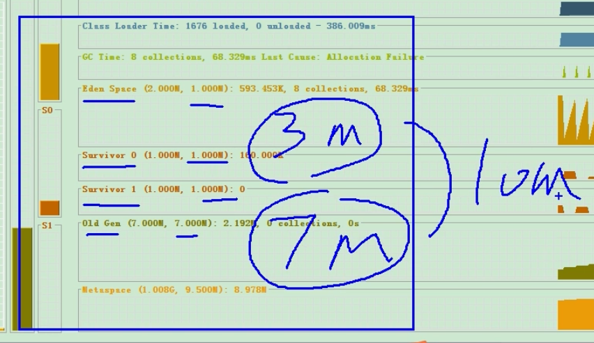 
  - 面试题相关：
    - jdk7到jdk8的虚拟机结构有那些变化
      ```
      永久区-->元空间
      基于以上变化，还发生变化的有(后面会详细讲):
        stringTable(字符串常量池)
        静态的域
      ```

#### 2.2.6.3. 设置堆的大小

> 具体参数细节，参数构成会在调优篇重点介绍以及阅读 [参数文档](https://docs.oracle.com/javase/8/docs/technotes/tools/unix/java.html)

> （堆区的内存在jvm启动时就已经确定好了）

- 默认情况
  - 初始内存：物理内存大小的1/64
  - 最大内存：物理内存大小的1/4

- 设置堆区(年轻代+老年代)的起始内存:`-Xms`(默认单位为字节),或者`-XX::InitialHeapSize`
  - -X:jvm的运行参数
  - ms:memory start
- 设置堆区(年轻代+老年代)的最大内存:`-Xmx`,或者`-XX:MaxHeapSize`
  > **开发中建议将初始堆内存和最大的堆内存设置成相同的值。**<br />
  > 否则会因为频繁的扩容和释放会造成不必要的系统的压力(GC释放内存，堆空间减小。运行占用内存，堆空间扩容。频繁进行)
  - -X:jvm的运行参数
  - mx:memory

- 测试(重要)
  ```java
  /**
  * 1. 设置堆空间大小的参数
  * -Xms 用来设置堆空间（年轻代+老年代）的初始内存大小
  *      -X 是jvm的运行参数
  *      ms 是memory start
  * -Xmx 用来设置堆空间（年轻代+老年代）的最大内存大小
  *
  * 2. 默认堆空间的大小
  *    初始内存大小：物理电脑内存大小 / 64
  *             最大内存大小：物理电脑内存大小 / 4
  * 3. 手动设置：-Xms600m -Xmx600m
  *     开发中建议将初始堆内存和最大的堆内存设置成相同的值。
  *
  * 4. 查看设置的参数：方式一： jps   /  jstat -gc 进程id
  *                  方式二：-XX:+PrintGCDetails
  */
  public class HeapSpaceInitial {
      public static void main(String[] args) {

          //返回Java虚拟机中的堆内存总量
          long initialMemory = Runtime.getRuntime().totalMemory() / 1024 / 1024;
          //返回Java虚拟机试图使用的最大堆内存量
          long maxMemory = Runtime.getRuntime().maxMemory() / 1024 / 1024;

          System.out.println("-Xms : " + initialMemory + "M");// 575M
          System.out.println("-Xmx : " + maxMemory + "M");// 575M
          // 只有575M是因为Survivor0和Survivor1区只有一个区域(二选一)可以存放对象
          // 设计垃圾回收的算法

          // System.out.println("系统内存大小为：" + initialMemory * 64.0 / 1024 + "G");
          // System.out.println("系统内存大小为：" + maxMemory * 4.0 / 1024 + "G");

          try {
              Thread.sleep(1000000);
          } catch (InterruptedException e) {
              e.printStackTrace();
          }
      }
  }
  ```
  - 查看堆的状态
    - 方式一： `jps`   ,  `jstat -gc 进程id`
      > 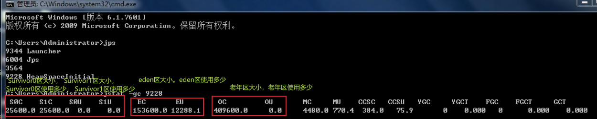 
    - 方式二：`-XX:+PrintGCDetails`
      > 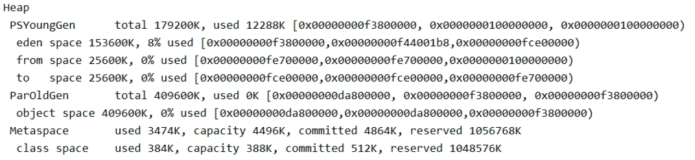 <br />
      > 新生代的计算大小为：eden + from或to中的一个<br />
      > 具体原因见代码中

#### 2.2.6.4. OOM

> 注意面试时。狭义上的 ‘异常’(就要对Exception和Error进行区分)，和广义上的‘异常’（包括Exception和Error）<br  />
> 面试官问内存方面的异常时，基本上都是OOM相关的，要答一些高级的OOM的Error。这里的异常时广义上的

- 代码示例
  > 打开jvisualvm，实际看看GC区的变化
  ```java
  /**
  * -Xms600m -Xmx600m
  */
  public class OOMTest {
      public static void main(String[] args) {
          ArrayList<Picture> list = new ArrayList<>();
          while(true){
              try {
                  Thread.sleep(20);// 为了降低程序执行速度，查看GC变化
              } catch (InterruptedException e) {
                  e.printStackTrace();
              }
              list.add(new Picture(new Random().nextInt(1024 * 1024)));
          }
      }
  }

  class Picture{
      private byte[] pixels;

      public Picture(int length) {
          this.pixels = new byte[length];
      }
  }
  ```
- 结果
  > 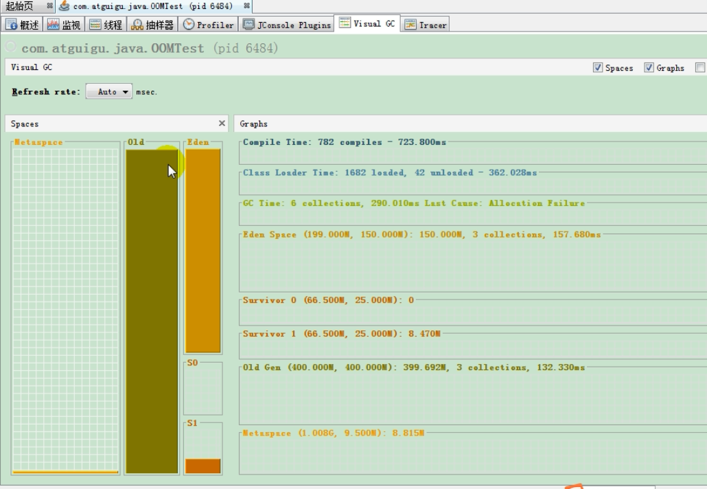 <br />
  > old区满了，无法进行GC <br />
  > 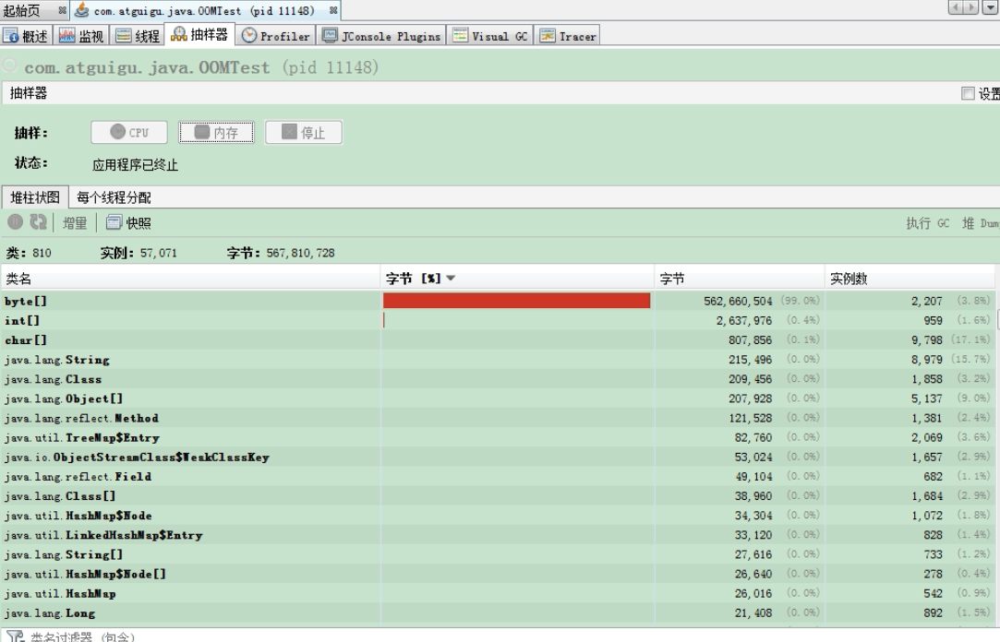 <br />
  > 通过查看抽样器中的信息可以判断内存溢出的原因


#### 2.2.6.5. 年轻代和老年代

- jvm中的对象分类
  - 生命周期较短的瞬时对象，该类对象的创建和消亡都非常迅速
  - 生命周期很长的对象（比如一些连接的对象），某些极端情况下还能够与jvm的声明周期保持一致。
- 堆的结构回顾
  > <br />
- 大致流程：
  > 详细看下一节
  - 对象创建在eden中
  - 回收时，如果依旧存活，放入Survivor中（from 和 to 会来回交换。详细看下一节）
  - 一定时间后还存活，就会放入old gen区
- 内存占比
  >  
  - 新生代和老年代在对结构的占比：
    - 默认 -XX:NewRatio=2,表示新生代占1，老年代占2。也就是新生代占1/3
    - -XX:NewRatio=4,表示新生代占1，老年代占4。也就是新生代占1/5
    - **注意：一般不会调。如果很多对象生命周期较长的话，可以把老年代调大一些**
  - Eden和两个Survivor区占比：
    - 文档中写的默认是`-XX:SurvivorRatio`,即8:1:1
      - **但是，实际操作下来时6:1:1**
        > 面试的时候可以说下
        > 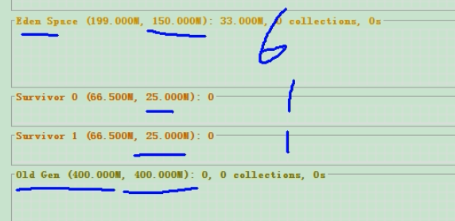>
      - 尽管关闭自适应比例的情况下，即加上 `-XX:-UseAdaptiveSizePolicy`。也没有用
      - **必须**要设置`-XX:SurvivorRatio=8`才能成为8:1:1的比例
- 对象的创建： **几乎**所有对象都是在eden中创建的
  ```
  '几乎'是指从实现角度来看，随着Java语言的发展，
  现在已经能看到些许迹象表明日后可能出现值类型的支持，即使只考虑现在，由于即时编
  译技术的进步，尤其是逃逸分析技术的日渐强大，栈上分配、标量替换优化手段已经导致一些微妙
  的变化悄然发生，所以说Java对象实例都分配在堆上也渐渐变得不是那么绝对了
  ```
- 对象的销毁:绝大多数对象的销毁都在新生代进行。
  > IBM公司的专门 研究表表名，新生代中80%的对象都是'朝生夕死'的
- 设置新生代的大小:`-Xmn`。该参数的优先级要大于`-XX:NewRatio`的优先级。**但一般不设置具体数值，而是设置比例**

#### 2.2.6.6. 对象分配过程

> 重要！面试和垃圾回收算法都用得到

```
为新对象分配内存是一件非常严谨和复杂的任务，JVM的设计者们不仅需要考虑内存如何分
配、在哪里分配等问题，并且由于内存分配算法与内存回收算法密切相关，所以还需要考
虑GC执行完内存回收后是否会在内存空间中产生内存碎片。
```
- 具体流程
  - new的对象先放伊甸园区。此区有内存大小
  - 当伊甸园的空间填满时，程序又需要创建对象，JVM的垃圾回收器将对伊甸园区进行垃圾回收（Minor GC),将伊甸园区中和幸存者区中的不再被其他对象所引用的对象进行销毁。再加载新的对象放到伊甸园区
    - **注意：会回收两个区，eden和survivor区。survivor区是被动回收**
    - 回收后，eden就会被清空。垃圾被清理，非垃圾被放到survivor区
  - 然后将伊甸园中的剩余没被垃圾回收的对象移动到幸存者0区。
  - 如果再次触发垃圾回收，此时上次幸存下来的放到幸存者0区的对象如果还是没有回收，就会复制到幸存者1区。再将0区的对象删除
  - 如果再次经历垃圾回收，此时会重新复制回幸存者0区，再将1区对象删除
    > 空的survivor区为to区
    - 不断迭代。迭代一次年龄加1。年龄到达阀值后就会移入到老年区
    - 默认是15次。后去养老区。 通过设置参数调节：`-XX:MaxTenuringThreshold=<N>`进行设置。
    - **注意：survivor区满了的话不会触发**。除了年龄到达阀值，也有特殊情况使Survivor区中的对象移入到老年区。具体看下面
  - 在养老区，相对悠闲。当养老区内存不足时，再次触发GC:Major GC,进行养老区的内存清理。
  - 若养老区执行了Major GC之后发现依然无法进行对象的保存，就会产生OOM异常

- 图解
  > 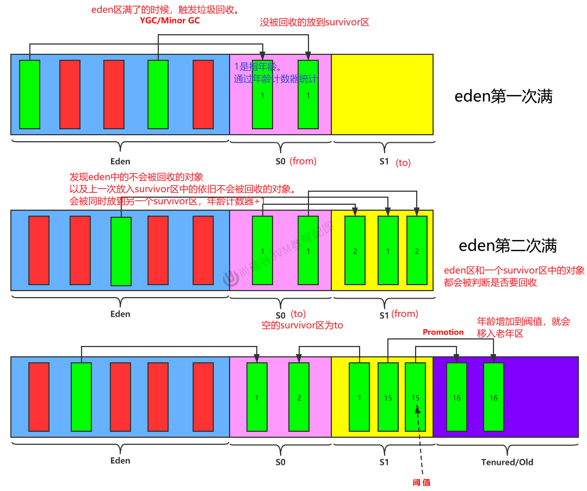
  - 针对幸存者se,s1区的总结：复制之后有交换，谁空谁是to.
  - 关于垃圾回收：频繁在新生区收集，很少在养老区收集，几乎不在永久区/ 元空间收集。

- 内存分配特殊情况
  > 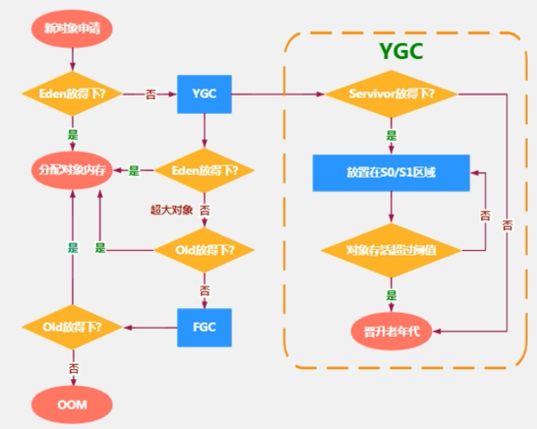 
  - new 的对象如果在eden中放不下，就会进行YGC
    - 如果要放入survivor的to区时，survivor的to区也不够了，就会直接放到老年区(**特殊情况1**)
  - 如果垃圾回收后，新new的对象eden区依旧放不下。就会直接放到old区(**特殊情况2**)
  - 如果old区还是放不下，就会进行FGC(**特殊情况3**)
    - FGC后放的下就会放
    - FGC后放不下就是报OOM异常
      > 不允许jvm动态调整新生代和老年代时
  - 测试：
    > 实际运行代码，通过jvisualvm进行查看
    ```java
    public class HeapInstanceTest {
        byte[] buffer = new byte[new Random().nextInt(1024 * 200)];

        public static void main(String[] args) {
            ArrayList<HeapInstanceTest> list = new ArrayList<HeapInstanceTest>();
            while (true) {
                list.add(new HeapInstanceTest());
                try {
                    Thread.sleep(10);
                } catch (InterruptedException e) {
                    e.printStackTrace();
                }
            }
        }
    }
    ```

#### 2.2.6.7. 常用调优工具

> 列出现阶段学习过程中可能用到的工具。具体使用将放到调优篇

- jdk命令行
  - jps
  - jinfo
  - jstat
  - javap
  - jmap
- jclasslib
- Eclipse Analyzer Tool
- Jconsole
- JVisualVM
- JProfiler
- Java Flight Recorder
- GCVierwer
- GC Easy

#### 2.2.6.8. Minor GC,Major GC,Full GC

> 该节主要是为了区分概念，详细的垃圾回收会放在后面<br />
> 面试会问到 三个GC的区别

- 线程分类：
  - 用户线程：用来执行代码
  - GC线程：用来进行垃圾回收
    > 垃圾回收过程中会有Stop the World(STW)，也就是垃圾回收时用户线程会暂停。导致程序执行效率下降<br />


- 针对 HotSpot VM的实现，它的GC按照回收区域分为两类：
  > JVM 进行GC时，并非每次都对三个区域（新生代，老年代，方法区）一起回收，大多数回收的都是新生代。
  - 部分收集（Partial GC）:不是完整得收集整个java堆的垃圾收集。其中可以分为：
    - 新生代收集（Minor GC/Young GC）:只针对新生代的垃圾收集
    - 老年代收集（Major GC/Old GC）:只针对老年代的垃圾收集
      - 只有GMS垃圾回收器会有单独收集老年代的行为
      - **注意：很多时候Major GC会和Fu11 GC混淆使用，需要具体分辨是老年代 回收还是整堆回收。**
        > 原因是hotspot虚拟机发展时间很长，外界对它的解读有些混乱<br />
        > 面试时可以向面试官主动提问下他问的到底是哪个<br />
        > 准确地还是按照这里的分类较好
    - 混合收集（Mixed GC）：收集整个新生代和老年代
      - 目前只有G1回收器会有这种行为
        > 原因是因为G1是按照region进行堆空间的划分(后面再详细说)
  - 整堆收集（Full GC）:收集整个java堆(新生代+老年代)和方法区的垃圾收集

- 触发机制
  - 年轻代GC（Minor GC）
    - 当年轻代空间不足时，就会触发Minor GC,这里的年轻代满指的是 Eden代满，**Survivor满不会引发GC**。（每次Minor GC会清理年轻 代的内存。）
      > 上面说过，Survivor区满了的话会晋升到老年代。Survivor的回收是被动的，是由eden区触发回收时同时进行回收
    - 因为 Java 对象大多都具备朝生夕灭的特性，所以 Minor GC 非常频繁，一般回收速度也比较快。这一定义既清晰又易于理解。
    - Minor GC会引发STW,暂停其它用户的线程，等垃圾回收结束，用户线程才恢复运行。
  - 老年代GC（Major GC/Full GC）
    - 出现了Major GC,经常会伴随至少一次的Minor GC(但非绝对的，在Parallel Scavenge收集器的收集策略里就有直接进行Major GC的策略选择过程）。
      > 也就是在老年代空间不足时，会先尝试触发Minor GC。如果之后空间还不足，则触发Major GC
    - **Major GC的速度一般会比Minor GC慢10倍以上，STW的时间更长。**
    - 如果Major GC后，内存还不足，就报OOM了。
  - Full GC触发方式：
    > 之后性能调优会更详细得说
    - (1)调用System.gc()时，系统建议执行Fu11 GC,但是不必然执行
    - (2)老年代空间不足
    - (3)方法区空间不足
    - (4)通过Minor GC后进入老年代的平均大小大于老年代的可用内存
    - (5)由Eden区、survivor spacee(From Space)区向survivor space1(To Space)区复制时，对象大小大于To Space可用内存，则把该对象转存到老年代，且 老年代的可用内存小于该对象大小
    > 开发和调优中应该尽量避免full GC，降低用户线程暂停时间(STW)

- 代码测试：
  > 也可以通过jvisualvm等实时监测。这里是添加参数输出GC日志
  ```java
  /**
  * 测试MinorGC 、 MajorGC、FullGC
  * -Xms9m -Xmx9m -XX:+PrintGCDetails
  */
  public class GCTest {
      public static void main(String[] args) {
          int i = 0;
          try {
              List<String> list = new ArrayList<>();
              String a = "atguigu.com";
              while (true) {
                  list.add(a);
                  a = a + a;
                  i++;
              }

          } catch (Throwable t) {
              t.printStackTrace();
              System.out.println("遍历次数为：" + i);
          }
      }
  }
  ```
  - from 和 to 区不同是因为自适应的原因。关闭自适应后就相同了
    > 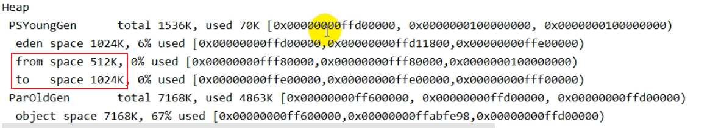 
  - 回收日志分析
    > 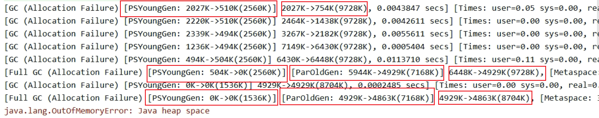 
    - GC(第一行)：
      - 前者为：回收前年轻代内存占用->回收后年轻代内存占用。
      - 后者为：回收前整个堆的内存占用-> 回收后整个堆的内存占用(堆的全部内存大小)
        > 因为是第一YGC，老年区还没有数据，所以年轻代的内存占用和整个堆的内存占用相同
    - Full GC
      - 分别是：年轻代回收情况，老年代回收情况，整个堆回收情况
    - 在最后一个Full GC后，可以发现老年区内存没有回收多少，然后在下一次代码执行添加数据时导致堆空间不足，出现OOM

#### 2.2.6.9. 堆的分代思想

- 分代原因：
  - 不同的对象生命周期不同，70%-99%的对象都是临时对象
  - 其实不分代依旧可以，分代的唯一理由就是**优化GC性能**。
    - 不必对放入老年代的对象进行频繁的检测和回收
      > 之前也提到了，Full GC 是Minor GC 花费时间的10倍

#### 2.2.6.10. 内存分配策略/对象提升(promotion)规则

> 为对象分配过程的总结

- 优先分配到Eden
- 大对象直接分配到老年代
  - 也就是eden区放不下的情况
  - 尽量避免程序中出现过多的大对象。
    - 创建大对象后，如果eden没有足够空间，eden就会GC
    - 如果eden内存还不够，就会往堆中放
    - 堆中也没足够空间，又会进行GC
    - 两次GC浪费时间，并且如果该对象是临时对象，就得不偿失了
- 长期存活的对象分配到老年代。（为了降低GC频率）
- 动态对象年龄判断
  ```
  如果survivor区中相同年龄的所有对象大小的总和大于Survivor空
  间的一半，年龄大于或等于该年龄的对象可以直接进入老年代，无须等到
  MaxTenuringThreshold中要求的年龄。

  是一种优化，否则两个Survivor区中数据的转移可能会浪费过多时间
  ```
- 空间分配担保
  > 将Survivor区无法存放的对象放到老年代
  - XX:HandlePromotionFailure
    > 后面会详细说

- 大对象直接分配到堆演示：
  ```java
  /** 测试：大对象直接进入老年代
  * -Xms60m -Xmx60m -XX:NewRatio=2 -XX:SurvivorRatio=8 -XX:+PrintGCDetails
  */
  public class YoungOldAreaTest {
      public static void main(String[] args) {
          byte[] buffer = new byte[1024 * 1024 * 20];//20m

      }
  }
  ```
  > 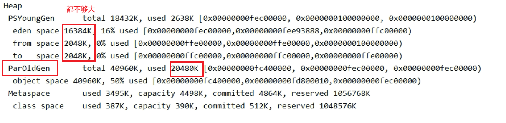 


#### 2.2.6.11. TLAB：为对象分配内存

- TLAB(Thread Local Allocation Buffer)出现原因：
  - 堆区是线程共享区域，任何线程都可以访问到堆区中的共享数据
  - 由于对象实例的创建在JVM中非常频繁，因此在并发环境下从堆区中划分内 存空间是线程不安全的
  - 为避免多个线程操作同一地址，需要使用加锁等机制，进而影响分配速度。
- TLAB介绍：
  - 从内存模型而不是垃圾收集的角度，对Eden区域继续进行划分，JVM**为每个线程分配了一个私有缓存区域**，它包含在Eden空间内。
    > 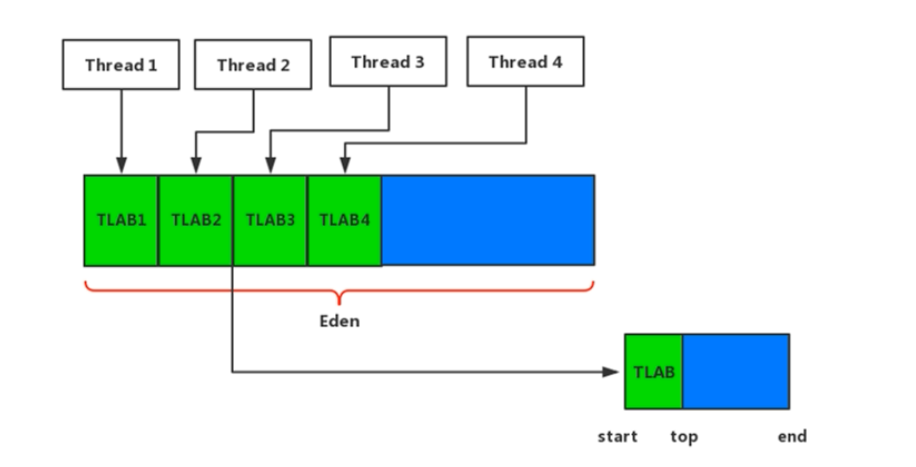 
    - 每个线程在往eden中存储对象时，会首先往TLAB中存储数据
    - 当TLAB用完后，再往eden中的共有区域存储数据
  - 多线程同时分配内存时，使用TLAB可以避免一系列的非线程安全问题，同时还能够提升内存分配的吞吐量，因此我们可以将这种内存分配方式称之为**快速分配策略**。
  - 现在所有OpenJDK衍生出来的JVM都提供了TLAB的设计。
- 细节与配置
  - 流程： 
    - 尽管不是所有的对象实例都能够在TLAB中成功分配内存，但**JVM确实是将TLAB作为内存分配的首选。**
    - 一旦对象在TLAB空间分配内存失败时，JVM就会尝试着通过使用加锁机制确保数据操作的原子性，从而直接在Eden空间中分配内存。
  - 开启参数：在程序中，开发人员可以通过选项`-XX:UseTLAB`设置是否开启TLAB空间。(默认开启)
  - 内存占比：
    - 默认情况下，TLAB空间的内存非常小，**仅占有整个Eden空间的1%**
    - 当然我们可以通 过选项`-XX:TLABWasteTargetPercent`设置TLAB空间所占用Eden空间的百分比大小。

- 对象分配过程(TLAB部分)图解
  > 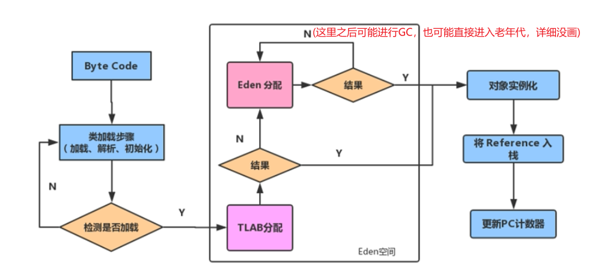 

#### 2.2.6.12. 堆空间的参数设置小结

> 面试有。并且调优时肯定会用

[官网说明]( https://docs.oracle.com/javase/8/docs/technotes/tools/unix/java.html)
> 一共600多个


- -XX:+PrintFlagsInitial : 查看**所有**的参数的默认初始值
- -XX:+PrintFlagsFinal ：查看**所有**的参数的最终值（可能会存在修改，不再是初始值）
  - 具体查看指定进程某个参数的指令：
    - jps：查看当前运行中的进程
    - jinfo -flag 参数名称 进程 id
- -Xms：初始堆空间内存 （默认为物理内存的 1/64）
- -Xmx：最大堆空间内存（默认为物理内存的 1/4）
- -Xmn：设置新生代的大小。(初始值及最大值)
- -XX:NewRatio：配置新生代与老年代在堆结构的占比
- -XX:SurvivorRatio：设置新生代中 Eden 和 S0/S1 空间的比例
  - Eden所占比例过大的话，
    - 就会导致Survivor区过小
    - Survivor非常容易满，使大多数对象直接进入老年区
    - 从而使Minor GC失去意义
  - Eden所占比例过小的话，
    - Eden区进行Minor GC频率就会变高
    - 会使STW时间过多，降低执行效率
- -XX:MaxTenuringThreshold：设置新生代垃圾的最大年龄(默认15)
  > 一般不怎么修改
- -XX:+PrintGCDetails：输出详细的 GC 处理日志
- 打印 gc 简要信息(没什么用)：
  - -XX:+PrintGC
  - -verbose:gc
- -XX:HandlePromotionFailure：是否设置空间分配担保

- 空间分配担保说明：
  - 在发生Minor GC之前，虚拟机会检查老年代最大可用的连续空间是否大于新生代所有对象的总空间。
    - 如果大于，则此次Minor GC是安全的
    - 如果小于，则虚拟机会查看-XX:HandlePromotionFailure设置值是否允许担保失败。
      - 如果HandlePromotionFailure=true,那么会继续检查**老年代最大可用连续空间**是否大于**历次晋升到老年代的对象的平均大小**。
        - 如果大于，则尝试进行一次Minor GC,但这次Minor GC依然是有 风险的；
        - 如果小于，则改为进行一次Fu11 GC。
      - 如果HandlePromotionFailure=false,则改为进行一次Fu11 GC。
  ```
  在JDK6 Update24之后（JDK7),HandlePromotionFailure参数不会再影响到
  虚拟机的空间分配担保策略，观察openJDK中的源码变化，虽然源码中还定义了
  HandlePromotionFailure参数，但是在代码中已经不会再使用它。

  JDK6 Updat 24之后的规则变为只要老年代的连续空间大于新生代对象总大小或者历次晋升的平均大
  小就会进行Minor GC,否则将进行Fu11 GC。（相当于固定设为true）
  ```


#### 2.2.6.13. 拓展：逃逸分析

????到底分配到了栈上的哪里

```
在《深入理解Java虚拟机》中关于Java堆内存有这样一段描述：
随着JIT编译期的发展与逃逸分析技术逐渐成熟，栈上分配、标量替换优化技术将会导
致一些微妙的变化，所有的对象都分配到堆上也渐渐变得不那么"绝对"了。
```

- 对象的分配：
  - 普通情况：在Java虚拟机中，对象是在Java堆中分配内存的
  - 特殊情况： 
    - 那就是如果经过**逃逸分析（Escape Analysis)**后发现，
    - 一个对象并没有 逃逸出方法的话，那么就可能被优化成栈上分配。
    - 这样就无需在堆上分配内存，也无须进行垃圾回收了。
    - 这也是最常见的堆外存储技术。

- 逃逸分析
  > 通过逃逸分析，Java Hotspot编译器能够分析出一个新的对象的引用的使用范围从而决定是否要将这个对象分配到堆上。
  - 作用：有效减少Java程序中同步负载和内存堆分配压力
  - 说明：
    - 当一个对象在方法中被定义后，对象只在方法内部使用，则认为没有发生逃逸。就可以将对象放在栈空间。
      ```java
      public void test1(){
        V v = new V();
        // use v
        // ....
        v=null;
      }
      ```
    - 当一个对象在方法中被定义后，它被外部方法所引用，则认为发生逃逸。对象会放在堆中
      ```java
      // 该示例在之前的线程安全问题中也有提到过
      public StringBuffer createStringBuffer(String s1,String s2){
        StringBuffer sb = new StringBuffer();
        sb.append(s1):
        sb.append(s2):
        return sb;
        // 发生逃逸，StringBuffer对象会放在堆中。
      }
      ```
      ```java
      public StringBuffer createStringBuffer(String s1,String s2){
        StringBuffer sb = new StringBuffer();
        sb.append(s1):
        sb.append(s2):
        return sb.toString();
        // 此时 sb 会分配到栈上。
        // 而新生成的字符串对象会分配到堆上。
      }
      ```
- 示例：
  ```java
/**
 * 逃逸分析
 *
 * 如何快速的判断是否发生了逃逸分析，就看new的对象实体是否有可能在方法外被调用。
 */
public class EscapeAnalysis {

    public EscapeAnalysis obj;

    /*
    方法返回EscapeAnalysis对象，发生逃逸
     */
    public EscapeAnalysis getInstance(){
        return obj == null? new EscapeAnalysis() : obj;
    }
    /*
    为成员属性赋值，发生逃逸
     */
    public void setObj(){
        this.obj = new EscapeAnalysis();
    }
    // 思考：如果当前的obj引用声明为static的？仍然会发生逃逸。
    // 如果为静态成员变量赋值，也会发生逃逸，没有区别

    /*
    对象的作用域仅在当前方法中有效，没有发生逃逸
     */
    public void useEscapeAnalysis(){
        EscapeAnalysis e = new EscapeAnalysis();
    }
    /*
    引用成员变量的值，发生逃逸
     */
    public void useEscapeAnalysis1(){
        EscapeAnalysis e = getInstance();
        //getInstance().xxx()同样会发生逃逸
    }
}
  ```
- 开启：
  - 在JDK 6u23版本之后，HotSpot中默认就已经开启了逃逸分析。
    - 注意：
      - 要添加 -Server选项以服务端模式开启。
      - 不过在64位电脑上默认启动的就是 Server VM。
      - 倒不用添加 -Server 参数
  - 如果使用的是较早的版本，开发人员则可以通过：
    - 选项-XX:+DoEscapeAnalysis显式开启逃逸分析
      > 通过选项-XX:-DoEscapeAnalysis显式关闭逃逸分析(对jdk 6u23之后的版本也有用)
    - 通过选项-XX:+PrintEscapeAnalysis查看逃逸分析的筛选结果。

- 扩展：
  ```
  此外，前面提到的基于openJDK深度定制的TaoBaoVM,其中创新的GCIH(GC
  invisible heap)技术实现off-heap,将生命周期较长的Java对象从heap中移至heap外，
  并且GC不能管理GCIH内部的Java对象，以此达到降低GC的回收频率和提升
  GC的回收效率的目的。
  ```

**开发中能使用局部变量的，就不要使用在方法外定义。**

#### 2.2.6.14. 逃逸分析-代码优化(编译器做的)

##### 2.2.6.14.1. 栈上分配

- 栈上分配
  - 说明：将堆分配转化为栈分配。
    - 如果一个对象在子程序中被分配，
    - 要使指向该对象的指针永远不会逃逸，对象可能是栈分配的候选，而不是堆分配。
  - 详解：
    ```
    JIT编译器在编译期间根据逃逸分析的结果，发现如果一个对象并没有逃
    逸出方法的话，就可能被优化成栈上分配。分配完成后，继续在调用栈内
    执行，最后线程结束，栈空间被回收，局部变量对象也被回收。这样就无
    须进行垃圾回收了。
    ```
  - 常见的栈上分配的场景
    - 给成员变量赋值
    - 方法返回值
    - 实例引用传递
  - 实际：
    - <p style="color:red">上面写的基本扯淡，那只是逃逸分析能带来的好处，了解一下即可</p>
    - <p style="color:red">因为逃逸分析技术太不成熟,HotSpot虚拟机中就没用逃逸分析技术。(具体看下面小结)</p>
    - <p style="color:red">下方示例代码之所以能变快，其实是因为 标量替换 </p>

```java
package com.atguigu.java2;

/**
 * 栈上分配测试
 * -Xmx256m -Xms256m -XX:-DoEscapeAnalysis -XX:+PrintGCDetails 
 * // 在关闭逃逸分析时，内存中会有1000万个对象(抽样器中查看)，会发生两次GC，耗时56ms
 *
 * -Xmx256m -Xms256m -XX:+DoEscapeAnalysis -XX:+PrintGCDetails 
 * // 在开启逃逸分析时，内存中不会有1000万个对象，不会发生GC，耗时4ms
 */
public class StackAllocation {
    public static void main(String[] args) {
        long start = System.currentTimeMillis();

        for (int i = 0; i < 10000000; i++) {
            alloc();
        }
        // 查看执行时间
        long end = System.currentTimeMillis();
        System.out.println("花费的时间为： " + (end - start) + " ms");
        // 为了方便查看堆内存中对象个数，线程sleep
        try {
            Thread.sleep(1000000);
        } catch (InterruptedException e1) {
            e1.printStackTrace();
        }
    }

    private static void alloc() {
        User user = new User();//未发生逃逸
    }

    static class User {

    }
}
```

##### 2.2.6.14.2. 同步省略

- 同步省略。
  - 说明：
    - 如果一个对象被发现只能从一个线程被访问到，
    - 那么对于这 个对象的操作可以不考虑同步。
      > 注意，字节码中依旧有同步的字节码指令，只是执行时JIT编译器进行优化
  - 原因：
    - 同步的代价是相当高的，
    - 同步的后果是降低并发性和性能
  - 详解：
    - 在动态编译同步块的时候，JIT编译器可以借助逃逸分析来判断同步块所使用的锁对象是否只能够被一个线程访问而没有被发布到其他线程。
    - 如果没有，那么JIT编译器在编译这个同步块的时候就会取消对这部分代码的同步。
    - 这样就能大大提高并发性和性能。这个取消同步的过程就叫同步省略，也叫**锁消除**。

```java
public class SynchronizedTest {
    public void f() {
        Object hollis = new Object();
        synchronized(hollis) {
            System.out.println(hollis);
        }
    }
}

// 会被jvm优化成：

public class SynchronizedTest {
    public void f() {
        Object hollis = new Object();
        System.out.println(hollis);
    }
}

```

##### 2.2.6.14.3. 标量替换

- 相关概念：
  - 标量（Scalar)：
    - 标量（Scalar)是指一个无法再分解成更小的数据的数据。
    - Java中的原始数据类型就是标量。
  - 聚合量（Aggregate)
    - 相对的，那些还可以分解的数据叫做聚合量（Aggregate),Java中的对象就是聚合量，因为他可以分解成其他聚合量和标量。

- 分离对象或标量替换。
  - 说明：
    - 有的对象可能不需要作为一个连续的内存结构存在也可以被访问到，
    - 那么对象的部分（或全部）可以不存储在内存，而是存储在CPU寄存器中。
  - 详解：
    - 在JIT阶段，如果经过逃逸分析，发现一个对象不会被外界访问的话，那么经过JIT优化，
    - 就会把这个对象拆解成若干个其中包含的若干个成员变量来代替。这个过程就是标量替换。
  - 好处：
    - 大大减少了堆的占用
    - 为栈上分配提供了良好的基础

```java
/**
 * 标量替换测试
 *  -Xmx100m -Xms100m -XX:-DoEscapeAnalysis -XX:+PrintGC -XX:-EliminateAllocations  
 *  // 57ms。有多次GC
 *  -Xmx100m -Xms100m -XX:+DoEscapeAnalysis -XX:+PrintGC -XX:-EliminateAllocations
 *  // 4ms。没有GC
 */
public class ScalarReplace {
    public static class User {
        public int id;
        public String name;
    }

    public static void alloc() {
        User u = new User();//未发生逃逸
        u.id = 5;
        u.name = "www.atguigu.com";
        // ----------------------------
        // 会优化成
        // int id = 5
        // String name = "www.atguigu.com";
    }

    public static void main(String[] args) {
        long start = System.currentTimeMillis();
        for (int i = 0; i < 10000000; i++) {
            alloc();
        }
        long end = System.currentTimeMillis();
        System.out.println("花费的时间为： " + (end - start) + " ms");
    }
}
```

#### 2.2.6.15. 逃逸分析小结

- 关于逃逸分析的论文在1999年就已经发表了，但直到JDK1.6才有实现，而且这项技 术到如今也并不是十分成熟的:
- 根本原因:
  - 就是无法保证逃逸分析的性能消耗一定能高于他的消耗。
  - 虽然经过逃逸分析可以做标量替换、栈上分配、和锁消除。
  - 但是逃逸分析自身也是需要进行一系列复杂的分析的，这其实也是一个相对耗时的过程。
    ```
    一个极端的例子，就是经过逃逸分析之后，发现没有一个对象是不逃逸的。那这个逃
    逸分析的过程就白白浪费掉了。
    ``` 
- 虽然这项技术并不十分成熟，但是它也是即时编译器优化技术中一个十分重要的手段。
  - 注意到有一些观点，认为通过逃逸分析，JVM会在栈上分配那些不会逃逸的对象，这在理论上是可行的，但是取决于JVM设计者的选择。
  - 但现在 Oracle Hotspot JVM中并未这么做，这一点在逃逸分析相关的文档里已经说明，**所以可以明确所有的对象实例都是创建在堆上**。
- 其他
  ```
  目前很多书籍还是基于JDK7以前的版本，JDK已经发生了很大变化，intern字符串
  的缓存和静态变量曾经都被分配在永久代上，而永久代已经被元数据区取代。但是，
  intern字符串缓存和静态变量并不是被转移到元数据区，而是直接在堆上分配，所以
  这一点同样符合前面一点的结论：对象实例都是分配在堆上。
  ```

#### 2.2.6.16. 堆是分配对象的唯一选择吗？

- 先否定。开始谈逃逸分析
- 再肯定，拿jvm规范,逃逸分析的不成熟，以及字符串缓存和静态变量的存储转移 说事儿

### 2.2.7. 方法区(重要)

#### 2.2.7.1. 栈，堆，方法区 交互关系

- 运行时数据区回顾：
  > 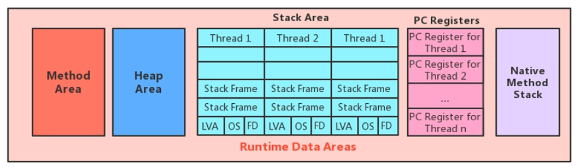 

- 从线程共享角度看：
  > 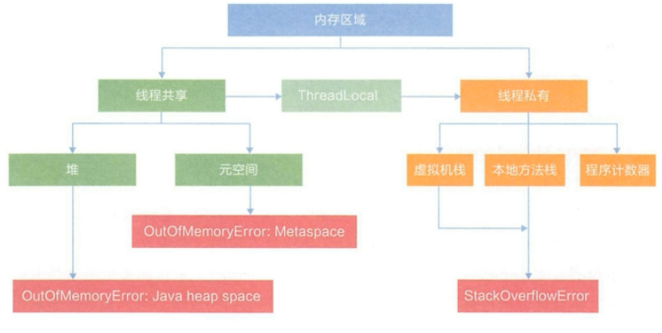 

- 当创建一个对象时：
  - 各部分存在位置：
    >  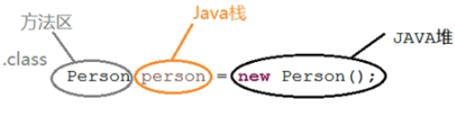 
  - 引用关系：
    > 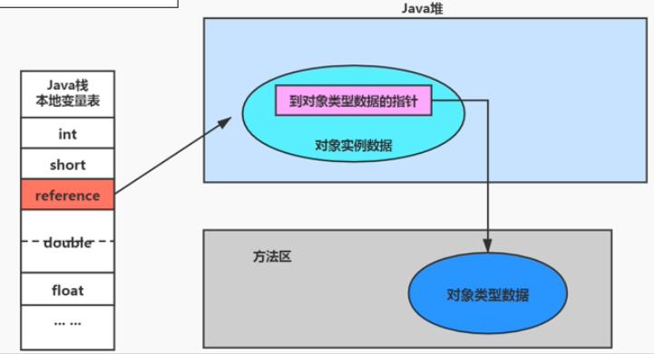 
    - 复习：java栈中的slot

#### 2.2.7.2. 方法区基本理解

- 方法区与堆的关系：
    > 也就是虚拟机规范中，把方法区看成堆的逻辑部分，但具体实现上，可以把两个结构分开
  - 《Java虚拟机规范》中明确说明：尽管所有的方法区在逻辑上是属于堆的一部分，但一些简单的实现可能不会选择去进行垃圾收集或者进行压缩。
  - 但对于HotSpotJVM而言，方法区还有一个别名叫做Non-Heap(非堆）,目的就是要和堆分开。
  - 所以，**方法区看作是一块独立于Java堆的内存空间。**

- 基本特点：
  - 线程共享：方法区（Method Area)与Java堆一样，是各个线程共享的内存区域。
  - 创建时机：方法区在JVM启动的时候被创建
  - 内存空间：
    - **方法区使用的是本地内存，而不是java虚拟机的内存**
      -  本地内存（Native memory），也称为C-Heap，是供JVM自身进程使用的。也就是物理机内存
      -  当Java Heap空间不足时会触发GC，但Native memory空间不够却不会触发GC。
    - 它的实际的物理内存空间中和Java堆区一样都可以是不连续的。
    - 方法区的大小，跟堆空间一样，可以选择固定大小或者可扩展。
    - 关闭JVM就会释放这个区域的内存。
- Error：
  - 出现原因： 
    - 方法区的大小决定了系统可以保存多少个类，如果系统定义了太多的类，导致方法区溢出，虚拟机同样会抛出内存溢出错误
    - 比如
      - 加载大量第三方jar包
      - Tomcat部署工程过多（30-50）
      - 大量动态生成反射类
  - 名称：
    - java.lang.OutofMemoryError: PermGen space(jdk1.7及之前)
      > jdk1.8之后把永久代更名为元空间
    - java.lang.OutofMemoryError:Metaspace (jdk1.8及之后)
  - 使用jvisualvm查看类的个数：
    > 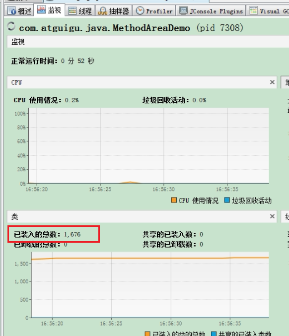 
 

- 基本演进：
  > 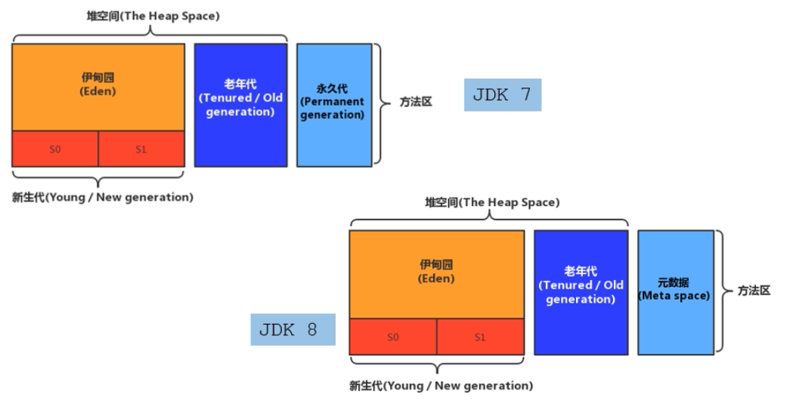 
  - 在jdk7及以前，习惯上把方法区，称为永久代。jdk8开始，使用元空间取代了永久代。
    > 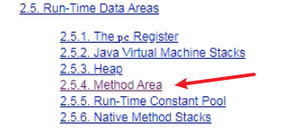 
    - 打个比方
    - **可以把方法区看成接口,把永久代和元空间看作接口的不同逻辑实现**
  - 现在来看，当年使用永久代，不是好的idea。导致Java程序更容易OOM(超过-XX:MaxPermSize上限）
  - 而到了JDK 8,hotspot终于完全废弃了永久代的概念，改用与JRockit、J9一样在本地内存中实现的元空间（Metaspace)来代替
  - 元空间的本质和永久代类似，都是对JVM规范中方法区的实现。不过元空间与永代最大的区别在于：**元空间不在虚拟机设置的内存中，而是使用本地内存**。
  - 永久代、元空间二者并不只是名字变了，**内部结构也调整了**。
    > 详细放后面
  - 根据《Java虚拟机规范》的规定，如果方法区无法满足新的内存分配需求时，将抛出OOM异常。

#### 2.2.7.3. 设置方法区大小

- 种类：
  - 方法区大小可以是不固定的
  - 也可以设置为固定的

- jdk7及之前
  - 通过-XX:PermSize来设置永久代初始分配空间。默认值是20.75M
  - -XX:MaxPermSize来设定永久代最大可分配空间。32位机器默认是64M,64位机器模式是82M
  - 当JVM加载的类信息容量超过了这个值，会报异常OutOfMemoryError:PermGen space .

- jdk8及之后
  - 说明：
    - 元数据区大小可以使用参数-XX:MetaspaceSize和-XX:MaxMetaspaceSize指定，替代上述原有的两个参数。
    - 默认值依赖于平台。 **windows下，-XX:MetaspaceSize是21M,-XX:MaxMetaspaceSize的值是-1,即没有限制。**
    - **与永久代不同，如果不指定大小，默认情况下，虚拟机会耗尽所有的可用系统内存。也就是没有最大值**
    - 如果元数据区发生溢出，虚拟机一样会抛出异常OutOfMemoryError:Metaspace
  - -xx:MetaspaceSize:设置初始的元空间大小。
    - 默认大小：
      - 对于一个64位的服务器端JVM来说，其默认的-XX:MetaspaceSize值为21MB。
    - GC与水位线:
      - MetaspaceSize就是是初始的高水位线，一旦触及这个水位线，Full GC将会被触发并卸载没用的类（即这些类对应的类加载器不再存活）,
      - 然后这个高水位线将会重置。新的高水位线的值取决于GC后释放了多少元空间。
      - 如果释放的空间不足，那么在不超过MaxMetaspaceSize时，适当提高该值。如果释放空间过多，则适当降低该值。
    - 建议：
      - 如果初始化的高水位线设置过低，上述高水位线调整情况会发生很多次。
      - 通过垃圾回收器的日志可以观察到Full GC多次调用。为了避免频繁地GC,建议将-XX:MetaspaceSize设置为一个相对较高的值。
  - -XX:MaxMetaspaceSize：设置最大的元空间大小
    - 一般不会修改
    - 即可以占用所有本地内存
 
- 测试代码：
    ```java
    /**
    *  测试设置方法区大小参数的默认值
    *
    *  jdk7及以前：
    *  -XX:PermSize=100m -XX:MaxPermSize=100m
    *
    *  jdk8及以后：
    *  -XX:MetaspaceSize=100m  -XX:MaxMetaspaceSize=100m
    * @author shkstart  shkstart@126.com
    * @create 2020  12:16
    */
    public class MethodAreaDemo {
        public static void main(String[] args) {
            System.out.println("start...");
    //        try {
    //            Thread.sleep(1000000);
    //        } catch (InterruptedException e) {
    //            e.printStackTrace();
    //        }

            System.out.println("end...");
        }
    }
    ```

#### 2.2.7.4. OOM

```java
import com.sun.xml.internal.ws.org.objectweb.asm.ClassWriter;
import jdk.internal.org.objectweb.asm.Opcodes;

/**
 * jdk6/7中：
 * -XX:PermSize=10m -XX:MaxPermSize=10m
 *
 * jdk8中：
 * -XX:MetaspaceSize=10m -XX:MaxMetaspaceSize=10m
 *
 * @create 2020  22:24
 */
public class OOMTest extends ClassLoader {
    public static void main(String[] args) {
        int j = 0;
        try {
            OOMTest test = new OOMTest();
            for (int i = 0; i < 10000; i++) {
                //创建ClassWriter对象，用于生成类的二进制字节码
                ClassWriter classWriter = new ClassWriter(0);
                //指明版本号，修饰符，类名，包名，父类，接口
                classWriter.visit(Opcodes.V1_6, Opcodes.ACC_PUBLIC, "Class" + i, null, "java/lang/Object", null);
                //返回byte[]
                byte[] code = classWriter.toByteArray();
                //类的加载
                test.defineClass("Class" + i, code, 0, code.length);//Class对象
                j++;
            }
        } finally {
            System.out.println(j);
        }
    }
}
```

- 如何解决OOM
  > 后面调优会细讲
  ```
  1、要解决OOM异常或heap space的异常，一般的手段是首先通过内存映像分析工具
  (如Eclipse Memory Analyzer)对dump出来的堆转储快照进行分析，重点是确认
  内存中的对象是否是必要的，也就是要先分清楚到底是出现了内存泄漏（Memory
  Leak)还是内存溢出（Memory Overflow)。
  2、如果是内存泄漏，可进一步通过工具查看泄漏对象到GC Roots的引用链。于是就
  能找到泄漏对象是通过怎样的路径与GC Roots相关联并导致垃圾收集器无法自动回收
  它们的。掌握了泄漏对象的类型信息，以及GC Roots引用链的信息，就可以比较准确
  地定位出泄漏代码的位置。
  3、如果不存在内存泄漏，换句话说就是内存中的对象确实都还必须存活着，那就应当
  检查虚拟机的堆参数（-Xmx与-Xms),与机器物理内存对比看是否还可以调大，从代
  码上检查是否存在某些对象生命周期过长、持有状态时间过长的情况，尝试减少程序
  运行期的内存消耗。
  ```

#### 2.2.7.5. 方法区的内部结构

- 简图
  > 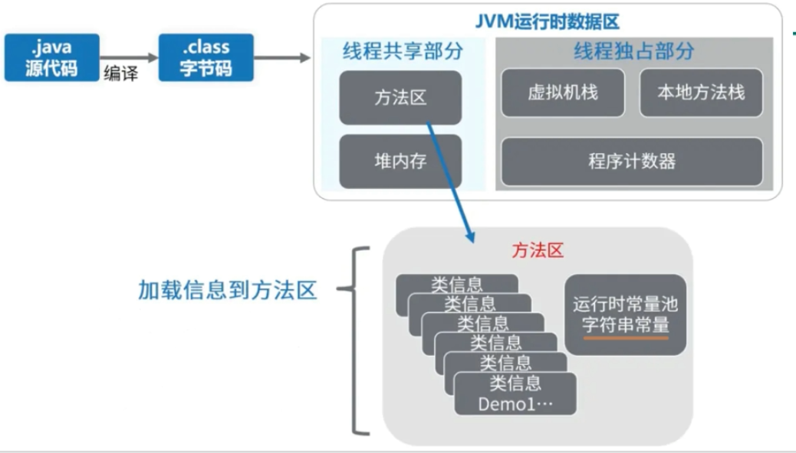 
  - 类信息：就是类型信息，下面有详细说明
  - 《深入理解Java虚拟机》书中对方法区（Method Area)存储内容描述如下：
    - 它用于存储已被虚拟机加载的**类型信息、常量、静态变量、即时编译器编译后的代码缓存等**。
      >  
      > 这是经典版本<br />
      > 现在，静态变量和StringTable存放位置都有些变化<br />
      > 在后面细节演进会细说

- 存储信息说明：
  - 类型信息：
    > 对每个加载的类型（类class、接口interface、枚举enum、注解annotation),JVM必须在方法区中存储以下类型信息：
    - 这个类型的完整有效名称（全名=包名.类名）
    - 这个类型直接父类的完整有效名（对于interface或是java.lang.Object,都没有父类）
    - 这个类型的修饰符（public,abstract,final的某个子集）
    - 这个类型直接接口的一个有序列表
  - 域(field)信息：
    - JVM必须在方法区中保存类型的所有域的相关信息以及域的声明顺序。
    - 域的相关信息包括：域名称、域类型、域修饰符（public,private, protected, static, final, volatile, transient的某个子集）
  - 方法信息：
    > JVM必须保存所有方法的以下信息，同域信息一样包括**声明顺序**：
    - 方法名称
    - 方法的返回类型（或void)
    - 方法参数的数量和类型（按顺序）
    - 方法的修饰符（public,private,protected,static,final,synchronized,native,abstract的一个子集）
    - 方法的字节码（bytecodes)、操作数栈、局部变量表及大小（abstract和native方法除外）
    - 异常表（abstract和native方法除外）
      > 每个异常处理的开始位置、结束位置、代码处理在程序计数器中的偏移地址、被捕获的异常类的常量池索引

- 测试代码：
  > 使用javap -v -p 进行反编译
  > > -p 会显示所有权限的结构。
  > > 如果没有-p私有成员就无法显示出来
  ```java
  import java.io.Serializable;

  /**
  * 测试方法区的内部构成
  */
  public class MethodInnerStrucTest extends Object implements Comparable<String>,Serializable {
      //属性
      public int num = 10;
      private static String str = "测试方法的内部结构";
      //构造器。这里可以没有写
      //方法
      public void test1(){
          int count = 20;
          System.out.println("count = " + count);
      }
      public static int test2(int cal){
          int result = 0;
          try {
              int value = 30;
              result = value / cal;
          } catch (Exception e) {
              e.printStackTrace();
          }
          return result;
      }

      @Override
      public int compareTo(String o) {
          return 0;
      }
  }
  ```

  [javap -v -p反编译输出](./external_file/jvm_out1.txt)

  - 注意：反编译出来的文件中不包含classloader中的信息
  - 只有通过类加载子系统加载到内存后，方法区中才会保存classloader的信息

---

额外扩展点：

- non-final的类变量：
  - 说明：
    - 静态变量和类关联在一起，随着类的加载而加载，它们成为类数据在逻辑上的一部分。
    - 类变量被类的所有实例共享，即使没有类实例时你也可以访问它。
  - 示例代码：
    ```java
    /**
    * non-final的类变量
    */
    public class MethodAreaTest {
        public static void main(String[] args) {
            Order order = null;
            order.hello(); // 不会报错。
                           // 不过平时就很少用对象实例调用类方法
            System.out.println(order.count);
        }
    }

    class Order {
        public static int count = 1; // no-final
        public static final int number = 2; // final

        public static void hello() {
            System.out.println("hello!");
        }
    }
    ```

    [javap -v -p反编译输出](./external_file/jvm_out2.txt)

  - non-final类变量的初始化:
    > 查看反编译文件
    - 在Prepare环节会进行一个默认初始化为0
    - 然后再Initiallization赋值为1
    - 如果还在静态代码块中进行赋值，即就会在`<client>`中进行赋值。
    > 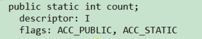 
  - final static的初始化:
    > 查看反编译文件
    - 被声明为final的类变量的处理方法则不同，每个全局常量在编译的时候就会被分配了。
    > 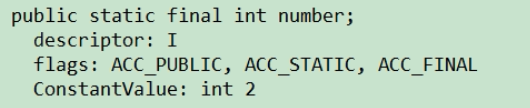 
    > (可以看见编译文件中有 2 )


#### 2.2.7.6. 常量池与运行时常量池

> 细节放到中篇来讲


> 要弄清楚方法区，需要理解清楚ClassFile,因为加载类的信息都在方法区。<br />
> 要弄清楚方法区的运行时常量池，需要理解清楚ClassFile中的常量池。

- 常量池和运行时常量池：
  - 常量池：
    - 是字节码文件的一部分，
    - **用于存放编译器生成的各种字面量与符号引用，这部分内容将在类加载后存放到方法区的运行时常量池中**
  - 运行时常量池：
    - 位置：方法区内部包含运行时常量池
    - 创建时机：在加载类或接口到虚拟机后，就会创建对应的运行时常量池。
    - 对应关系：JVM为每一个类，接口，注解，lambda表达式都维护一个运行时常量池。
    - 访问方式：运行时常量池中的数据项和数组项一样，都是通过**索引访问**的
    - 保存常量类型：
      - 运行时常量池中包含多种不同的常量
      - 包括编译期就已经明确的数值字面量，
      - 也包括到**运行期解析后才能够获得**的方法或者字段引用。此时不再是常量池中的符号地址了，这里**转换为真实地址**。
    - 动态性：运行时常量池，相对于class文件常量池的另一重要特征是：**具备动态性**，
      ```
      在Java语言中，并不要求常量只能在编译期间产生，运行期间一样也可以让新常量入池，
      像String类的intern()方法就能做到新常量入池的操作，这就是运行时常量池的动态性表现了。
      ```
    - 异常：当创建类或接口的运行时常量池时，如果构造运行时常量池所需的内存空间超过了方法 区所能提供的最大值，则JVM会抛OutOfMemoryError异常。

- 字节码文件内容：
  > 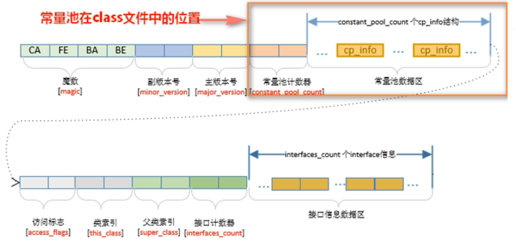 
  - 类的版本信息
  - 字段、方法以及接口等描述信息
  - 常量池表（Constant Pool Table),包括各种字面量和对类型、域和方法的**符号引用**。

- 符号引用的作用
  ```
  一个java源文件中的类、接口，编译后产生一个字节码文件。而Java中的字节码需要数据
  支持，通常这种数据会很大以至于不能直接存到字节码里，

  换另一种方式，可以存到常量池，把这些通过符号引用的方式存储到常量池中
  并非是真的类，比如应用String，就通过"java/lang/String"这个符号引用过去

  在动态链接的时候会就到运行时常量池，之前有介绍，复习看看。
  ```
  ```java
  public class SimpleClass{
    public void hello(){
      System.out.println("hello");
    }
  }
  ```
  - 上面一个类中有引用String, Printer等，
  - 编译后，class文件中不会有String,Printer的类结构
  - 而是使用一个符号引用，用来表名某处引用的Stiring，Printer
  - 真正执行时，符号引用会转换为直接引用了

- 示例：
  > 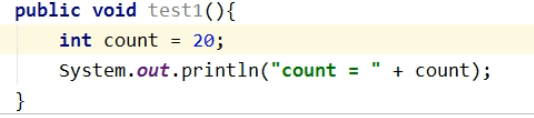 
  > 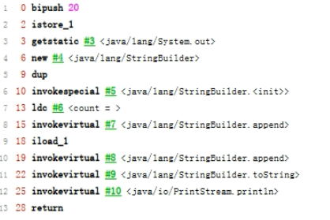 
  - `#数字` 就是指向常量池中的数据
  - **推荐查看上面javap的输出，自己对源码和反编译输出比对比对**

- 几种在常量池内存储的数据类型包括：
  > 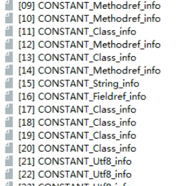 <br />
  > 自己拿jclasslib搞搞试试
  - 数量值
  - 字符串值
  - 符号引用
    - 类引用
      > 包括类，接口，注解等
    - 字段引用
    - 方法引用

#### 2.2.7.7. 方法区使用示例

- 代码
  ```java
  public class MethodAreaDemo{
    public static void main(String[] args){
      int x = 500;
      int y = 100;
      int a = x/y;
      int b = 50;
      System.out.println(a+b);
    }
  }
  ```
- 反编译结果； [javap -v -p反编译输出](./external_file/jvm_out3.txt)

- 过程图解：
  > 为了简单起见，这里没有new对象，所以没有堆。否则堆空间中的对象中部分信息还要指向方法区中的类型信息。对象实例化与内存布局讲
  >
  > 左侧为反编译后的指令
  >
  > **注意程序计数器中的地址**
  - 将500压入操作数栈
    > 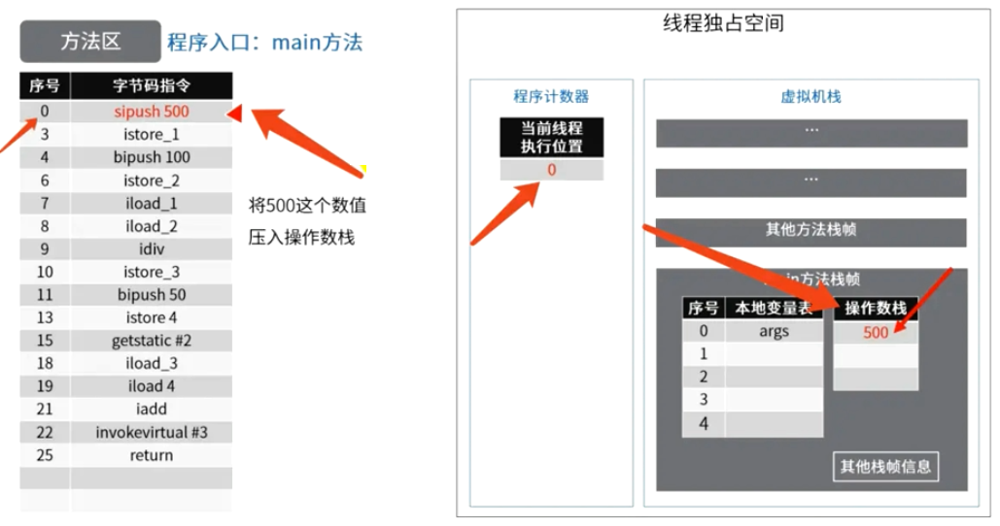
  - 弹出操作数栈中的500，存入到本地变量表位置 index 为 1 的位置（复习：如果是非静态方法的话，index为0的地方放的是this）
    > 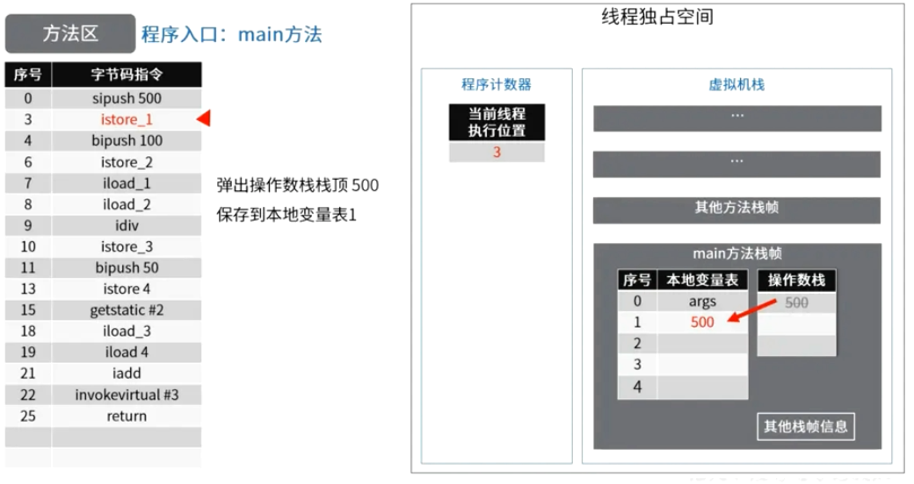 
  - 把100压入操作数栈
    > 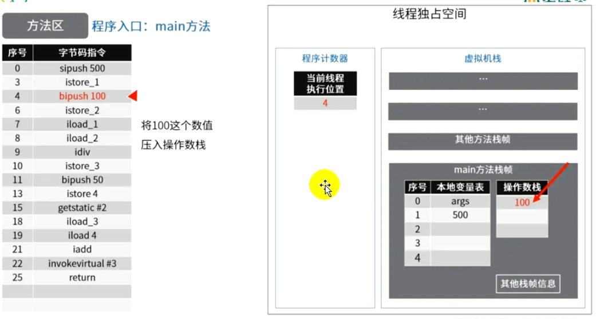 
  - 弹出1操作数栈中的100，存入到本地变量表中
    > 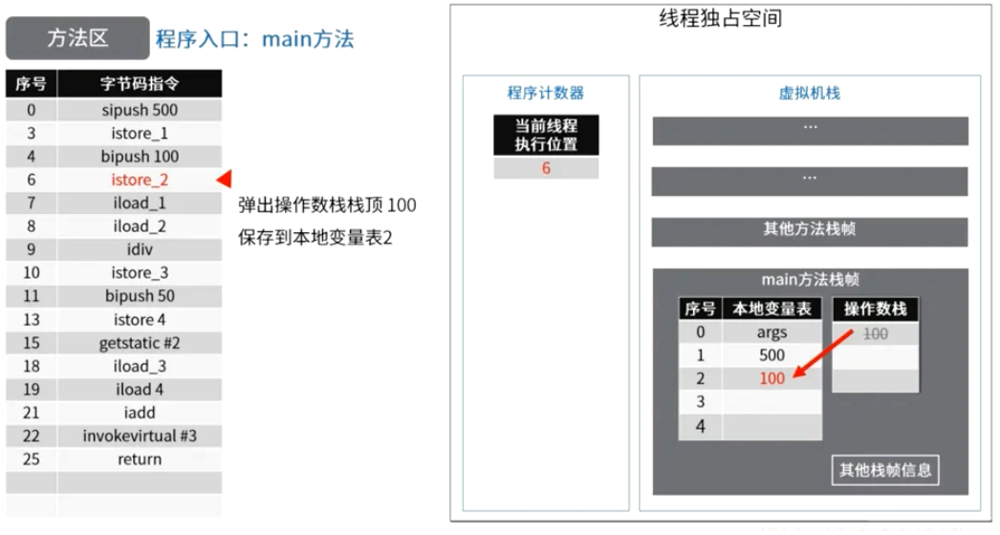 
  - 读取本地变量表中的500，压入操作数栈
    > 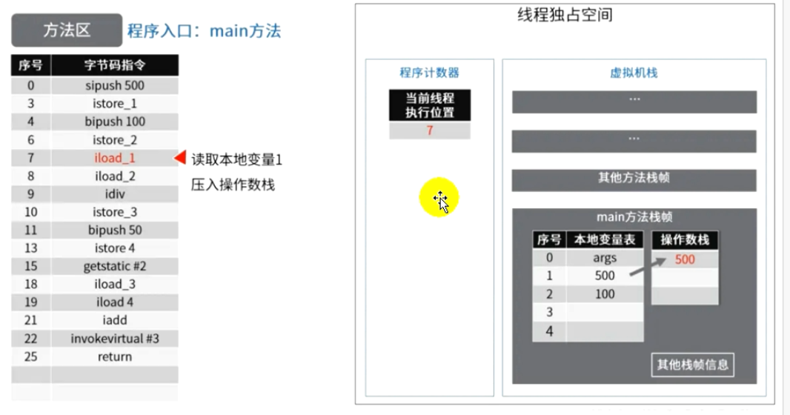 
  - 读取本地变量表中的100，压入操作数栈
    > 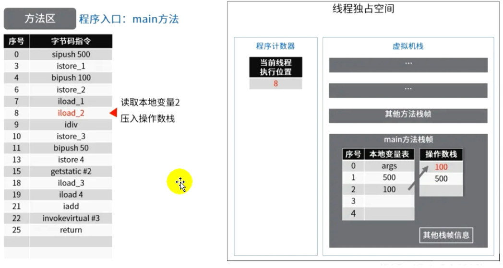 
  - 弹出操作数栈中的500和100，进行除法操作，然后把结果压入栈
    > 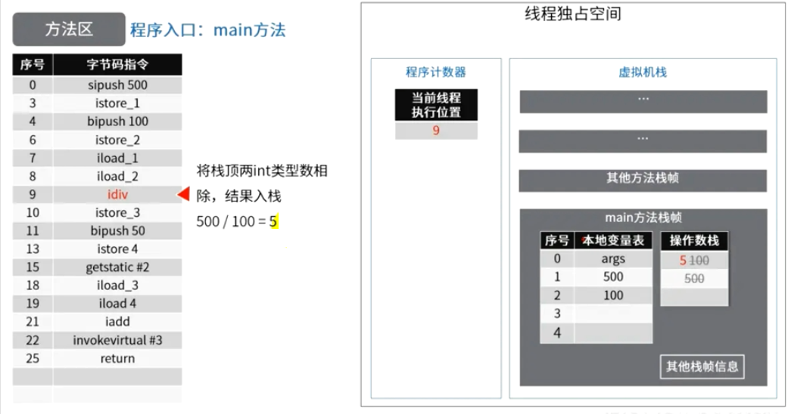 
  - 将50压入操作数栈
    > 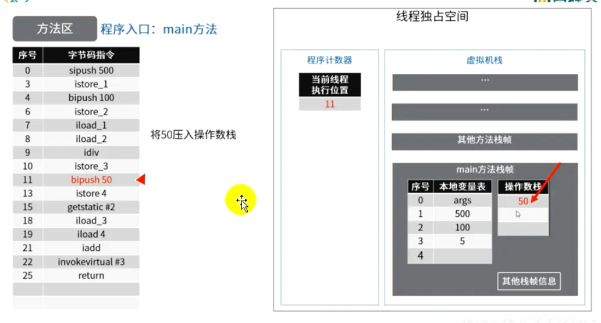 
  - 弹出操作数栈中的50，存到本地变量表当中
    > 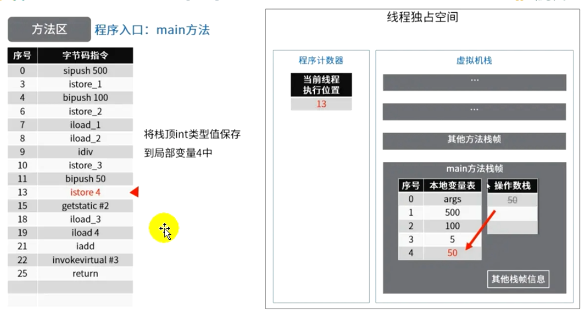 
  - 对应`System.out.println(a+b)`。获取类或接口字段的值并将其推入操作数栈，**自己查一下**
    > 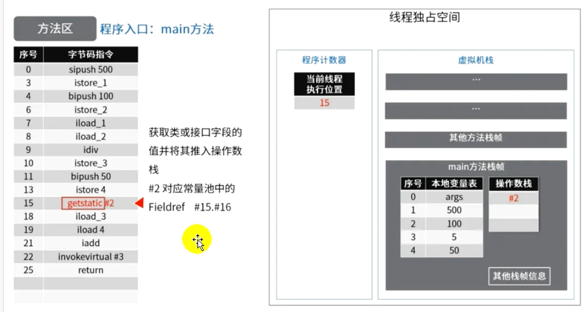 
  - 将本地变量表索引位置为3的值压入操作数栈
    > 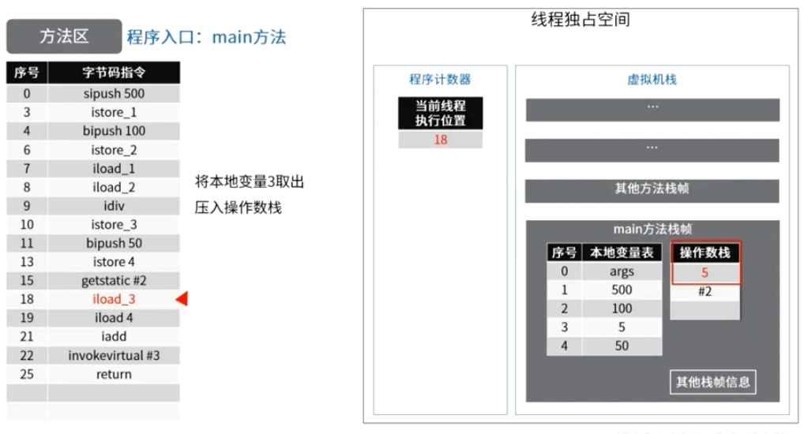 
  - 将本地变量表索引位置为4的值压入操作数栈
    > 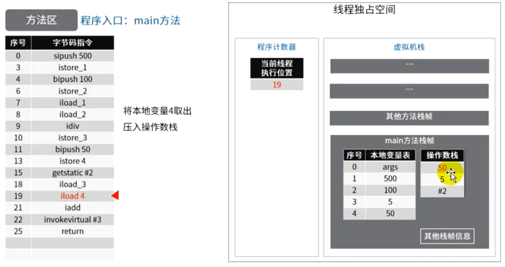 
  - 进行相加运算，结果入栈
    > 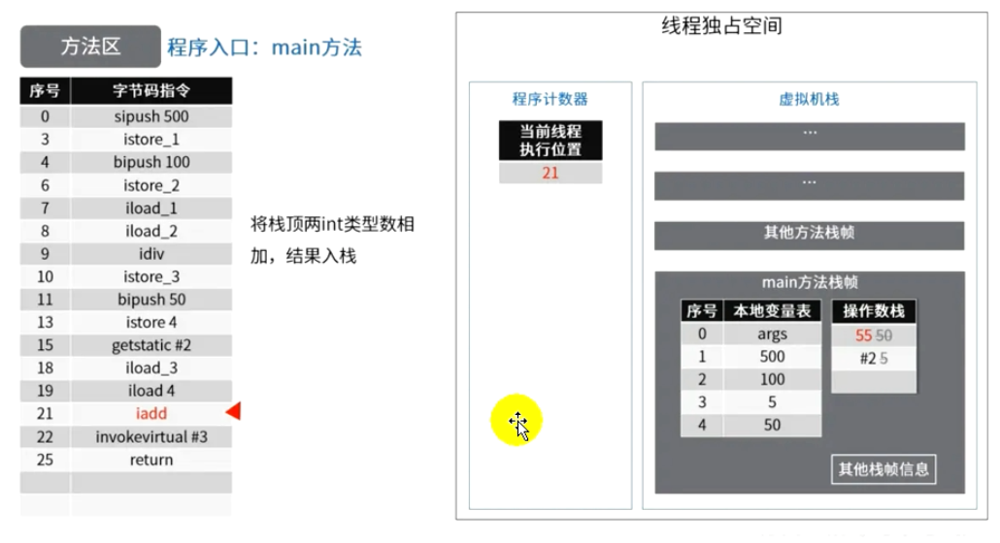 
  - 调用`System.out.println(a+b)`，输出结果
    > 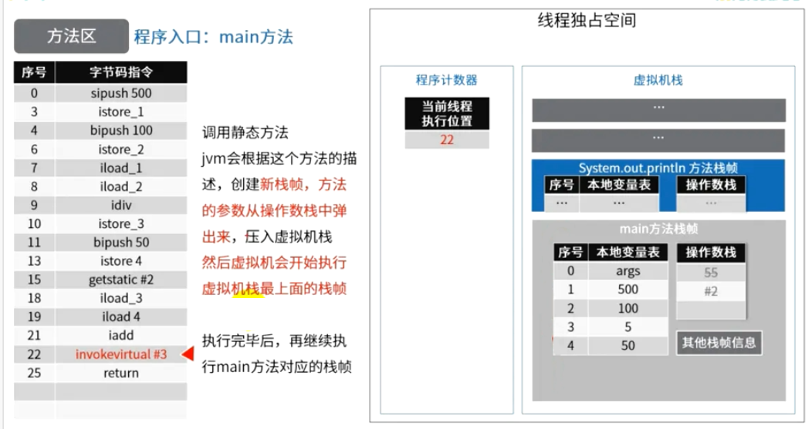 
  - return执行，main方法栈弹出

#### 2.2.7.8. 方法区细节演进（重要）

> 复习：堆的演进

---

- 关于永久代：
  - 只有 HotSpot 才有永久代
  - BEA,JRockit,IBM J9 等是不存在永久代的概念的。
  - 就像之前说的那样，永久代只是虚拟机中方法区的一种实现，并不要求同一

---

- HotSpot 中方法区实现的变化：
  - jdk6 及之前
    > 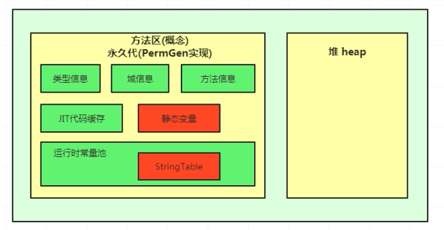 
    - 有永久代（permanent generation)
    - 静态变量存放在永久代上
  - jdk7
    > 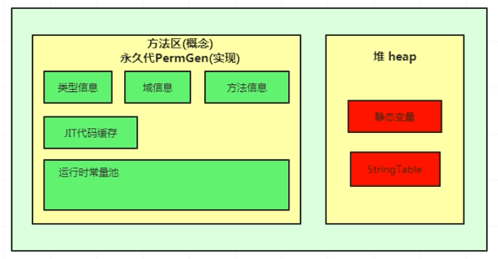 
    - 有永久代，但已经逐步“去永久代”。（方法区用的依旧是虚拟机的内存，而不是本地内存。）
    - 字符串常量池、静态变量移除，保存在堆中
  - jdk8 及之后
    > 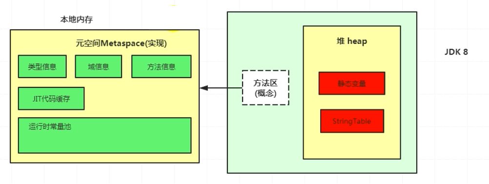 
    - 无永久代。
    - 类型信息、字段、方法、常量保存在本地内存的元空间
    - 但 **字符串常量池、静态变量仍在堆**

---

- 为什么要移除永久代
  ```
  随着Java8 的到来，HotSpot VM中再也见不到永久代了。但是这并不意味着类
  的元数据信息也消失了。这些数据被移到了一个与堆不相连的本地内存区域，这个
  区域叫做元空间（Metaspace)。

  由于类的元数据分配在本地内存中，元空间的最大可分配空间就是系统可用内存空
  间
  ```
  - 官方解释原因： 
    - [移除永久代的原因](http://openjdk.java.net/jeps/122)
    - 简单总结就是为了HotSpot和JRockit进行融合，而JRockit没有永久代
  - 深入理解原因：
    - **为永久代设置大小是很难确定的**
      ```
      在某些场景下，如果动态加载类过多，容易产生永久代区的Full GC以及OOM。
      比如某个实际Web工程中，因为功能点比较多，在运行过程中，要不断动态加载很多类，经常出现致命错误。
      ``` 
      ```
      而元空间和永久代之间最大的区别在于：元空间并不在虚拟机中，而是使用本地内存。
      因此，默认情况下，元空间的大小仅受本地内存限制。
      ```
    - **对永久代进行调优是很困难的**
      ```
      就是Full GC要回收永久代中的内容时， 判断是否要进行回收十分耗时
      需要三个条件校验以及参数的控制。

      具体看 方法区垃圾回收 一节
      ``` 

---

- StringTable(字符串常量池)为什么放到堆中
  > 后面会有单独一个章节进行说明
  - jdk7中将stringTable放到了堆空间中。
  - 因为永久代的回收效率很低，在full gc的时候才会触发。
  - 而full gc是老年代的空间不足、永久代不足时才会触发。
  - 这就导致stringTable回收效率不高。
  - 而我们开发中会有大量的字符串被创建，回收效率低，导致永久代内存不足。放到堆里，能及时回收内存。

---

**接下来是通过代码查看静态变量和对象的位置**

---

- 静态变量位置
  - 测试代码：
    ```java
    /**
    * 结论：
    * 静态引用对应的对象实体始终都存在堆空间
    *
    * jdk6和jdk7：
    * -Xms200m -Xmx200m -XX:PermSize=300m -XX:MaxPermSize=300m -XX:+PrintGCDetails
    * jdk 8：
    * -Xms200m -Xmx200m -XX:MetaspaceSize=300m -XX:MaxMetaspaceSize=300m -XX:+PrintGCDetails
    */
    public class StaticFieldTest {
        private static byte[] arr = new byte[1024 * 1024 * 100];//100MB
        public static void main(String[] args) {
            System.out.println(StaticFieldTest.arr);
        }
    }
    ```
  - 打印结果
    - jdk6打印日志
      > 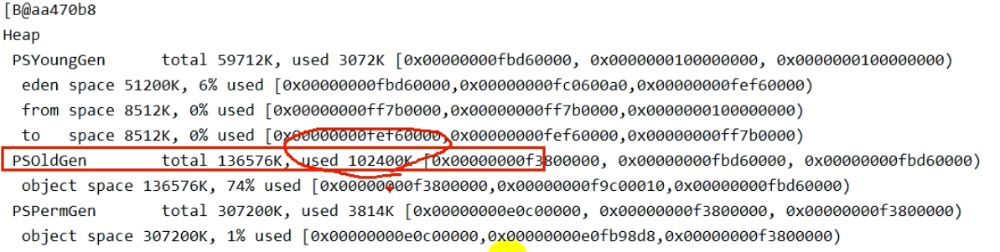 
    - jdk7打印日志
      > 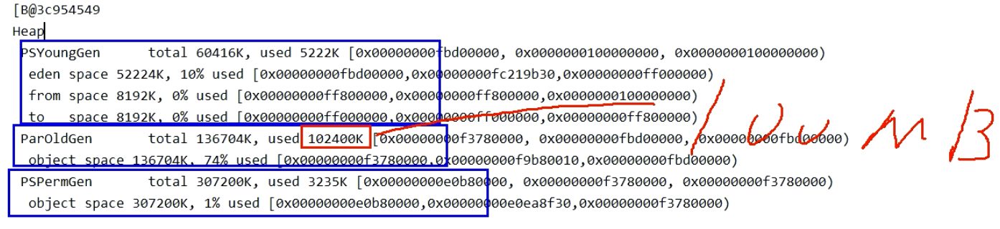 
    - jdk8打印日志
      > 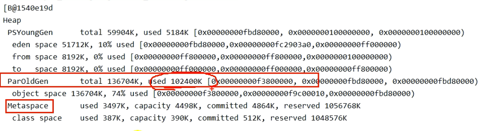 
  - 结论： **静态引用对应的对象实体始终都存在堆空间**

---

- 对象位置：
  > staticObj、instanceObj、localObj存放在哪里？
  - 测试代码：
    ```java
    public class StaticObjTest {
        static class Test {
            static ObjectHolder staticObj = new ObjectHolder(); // 静态属性 staticObj
            ObjectHolder instanceObj = new ObjectHolder();  // 非静态属性  instanceObj

            void foo() {
                ObjectHolder localObj = new ObjectHolder(); // 方法内局部变量 localObj
                System.out.println("done");
            }
        }

        private static class ObjectHolder {
        }

        public static void main(String[] args) {
            Test test = new StaticObjTest.Test();
            test.foo();
        }
    }
    ```
  - 分别对应的引用位置：
    - staticobj随着Test的类型信息存放在方法区
    - instanceobj随着Test的对象实例存放在Java堆
    - localobject则是存放在foo()方法栈帧的局部变量表中。
  - 查看工具：`jhsdb`
    > jdk9出现的官方工具，具体使用在性能监控与调优时详细说，这里稍微用下
  - 结果：
    > 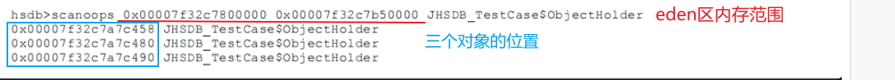 
    - 测试发现：三个对象的数据在内存中的地址都落在Eden区范围内
    - 所以结论：只要是对象实例必然会在Java堆中分配。
  - 深入
    > 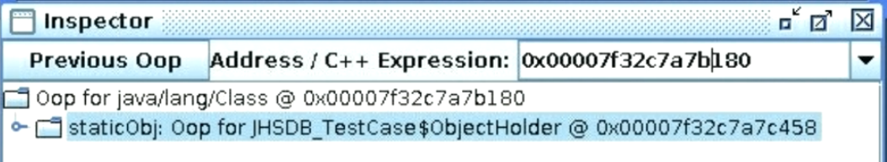 
    - 接着，找到了一个引用该staticobj对象的地方，是在一个java.lang.class的实例里，并且给出了这个实例的地址
    - 通过Inspector查看该对象实例，可以清楚看到这确实是一个 java.lang.Class类型的对象实例，里面有一个名为staticobj的实例字段：
    - 从《Java虚拟机规范》所定义的概念模型来看，所有class相关的信息都应该存放在方法区之中
      > 但方法区该如何实现，《Java虚拟机规范》并未做出规定，这就成了一件允许不同虚拟机自己灵活把握的事情。
    - 通过该实验可以证明： **JDK7及其以后版本的HotSpot虚拟机选择把静态变量与类型在Java语言一端的映射Class对象存放在一起，存储于Java堆之中**
      > 通俗一点说，静态变量的对象实例和类的模版Class都存放在堆当中。（对象的引用该在哪在哪儿）
      >
      > 也可以参考这篇博客[JDK 1.8 下的 java.lang.Class 对象和 static 成员变量在堆还是方法区？](https://blog.csdn.net/Xu_JL1997/article/details/89433916)

#### 2.2.7.9. 方法区垃圾回收

- 方法区（包括永久代和元数据区）是否要垃圾回收
  > 费力不讨好
  - 《Java虚拟机规范》对方法区的约束是非常宽松的，提到过可以不要求虚拟机在方法区中实现垃圾收集。
  - 事实上也确实有未实现或未能完整实现方法区类型卸载的收集器存在(如JDK11时期的ZGC收集器就不支持类卸载）。
  - 一般来说这个区域的**回收效果比较难令人满意，尤其是类型的卸载，条件相当苛刻。**
  - 但是这部分区域的回收**有时又确实是必要的**。以前Sun公司的Bug列表中，曾出现过的若干个严重的Bug就是由于低版本的HotSpot虚拟机对此区域未完全回收而导致内存泄漏。

---

- 方法区垃圾回收两部分：
  - **常量池中废弃的常量**
    - 常量主要构成：(方法区中主要存放两大类常量)：
      - **字面量**:字面量比较接近Java语言层次的常量概念，如文本字符串、被声明为final的常量值等。
      - **符号引用**:而符号引用则属于编译原理方面的概念，包括下面三类常量：
        - 类和接口的全限定类名
        - 字段的名称和描述符
        - 方法的名称和描述符
    - 回收策略：只要常量池中的常量没有被任何地方引用，就可以被回收
      > 更为详细的在垃圾回收章节
  - **不再使用的类**
    - 判断不再使用需要满足条件：
      - 该类**所有的实例都已经被回收**，也就是Java堆中不存在该类及其任何派生子类的实例。
      - **加载该类的类加载器**已经被回收，这个条件除非是经过精心设计的可替换类加载器的场景，如OSGi、JSP的重加载等，否则通常是很难达成的。
        > 复习：编译得到的.class文件中没有记录类加载器。把.class文件加载到内存后，
        >
        > 方法区中中会记录该类加载器
        >
        > 类加载器也记录了加载过哪个类
        >
        > > 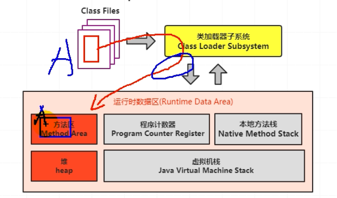 
      - 该类对应的java.lang.Class对象没有在任何地方被引用，无法在任何地方通过反射访问该类的方法。

#### 2.2.7.10. 面试题

```
百度
三面：说一下JVM内存模型吧，有哪些区？分别干什么的？
```

---

```
Java8的内存分代改进
JVM内存分哪几个区，每个区的作用是什么？
一面：JVM内存分布/内存结构？栈和堆的区别？堆的结构？为什么两个survivor区？
二面：Eden和Survior的比例分配
```

---

```
小米：
jvm内存分区，为什么要有新生代和老年代
字节跳动：
二面：Java的内存分区
二面：讲讲jvm运行时数据库区
什么时候对象会进入老年代？
```

---

```
京东：
JVM的内存结构，Eden和Survivor比例。
JVM内存为什么要分成新生代，老年代，持久代。新生代中为什么要分为Eden和Survivor。
```

---

```
天猫：
一面：Jvm内存模型以及分区，需要详细到每个区放什么。
一面：JVM的内存模型，Java8做了什么修改
```

---

```
拼多多：
JVM内存分哪几个区，每个区的作用是什么？
```

---

```
美团：
java内存分配
jvm的永久代中会发生垃圾回收吗？
一面：jvm内存分区，为什么要有新生代和老年代？
```

### 2.2.8. 对象的实例化内存布局和访问定位(重要)※

#### 2.2.8.1. 对象的实例化

- 创建对象的方式
  - new
    - 最普通的形式
    - 单例模式，调用静态方法
    - 工厂模式，XxxBuilder/XxxFactory的静态方法
  - Class的newInstance(Xxx):反射的方式，就只能调用空参的构造器，权限必须是public。jdk8中可以用，jdk9中就已经标注已过时。
  - Constructor的newInstance(Xxx):反射的方式，可以调用空参和带参的构造器，权限没有要求。
  - 使用clone():不会调用任何构造器，但要求当前类实现Cloneable接口，实现clone()方法，实现对象的复制
  - 使用反序列化:从文件或网络中获取一个对象的二进制流
  - 第三方库Objenesis：可以动态生成Constructor对象

---

- 创建对象的步骤（六步）
  > 有些书或者帖子可能会合并几步。
  - 判断对象对应的类是否加载，链接，初始化。（加载类元信息）
    - 虚拟机遇到一条new指令，首先去检查这个指令的参数能否在Metaspace的常量池中定位到一个类的符号引用，
    - 并且检查这个符号引用代表的类是否已经被加载、解析和初始化。（即判断类元信息是否存在）。
    - 如果没有，那么在双亲委派模式下，使用当前类加载器以classLoader+包名+类名为Key进行查找对应的.class文件。
      - 如果没有找到文件，则抛出ClassNotFoundException异常，
      - 如果找到，则进行类加载，并生成对应的Class类对象
  - 为对象分配内存：
    ```
    首先计算对象占用空间大小，接着在堆中划分一块内存给新对象。
    如果实例成员变量是引用变量，仅分配引用变量空间即可，即4个字节大小。
    ```
    - 说明
      ```
      说明：选择哪种分配方式由Java堆是否规整决定，而Java堆是否规整又由所采用的垃圾收集
      器是否带有压缩整理功能决定。
      ```
    - 如果内存规整--指针碰撞
      - 如果内存是规整的，那么虚拟机将采用的是指针碰撞法（Bump The Pointer)来为对象分配内存
        - 意思是所有用过的内存在一边，空闲的内存在另外一边，中间放着一个指针作为分界点的指示器，
        - 分配内存就仅仅是把指针向空闲那边挪动一段与对象大小相等的距离罢了。
          > 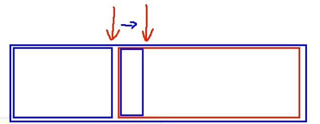 
      - 垃圾收集器对应算法：带有整理过程的算法，如Serial、ParNew算法
        > 一般使用带有compact(整理）过程的收集器时，内存都是规整的，使用指针碰撞
        - 基于压缩算法
        - 会解决碎片化问题，使内存比较规整，因此虚拟机会采用指针碰撞方式分配内存
    - 如果内存不规整,虚拟机需要维护一个列表,空闲列表分配
      - 如果内存不是规整的，已使用的内存和未使用的内存相互交错，那么虚拟机将采用的是空闲列表法来为对象分配内存。
        - 意思是虚拟机维护了一个列表，记录上哪些内存块是可用的，在分配的时候从列表中找到一块足够大的空间划分给对象实例，并更新列表上的内容。
        - 这种分配方式成为“空闲列表（Free List)”。
      - 垃圾回收器对应算法：标记清除算法，使用标记清楚算法的有CMS垃圾回收器
  - 处理并发安全问题
    ```
    在分配内存空间时，另外一个问题是及时保证new对象时候的线程安全性：创建对象是非常
    频繁的操作，虚拟机需要解决并发问题。虚拟机采用了两种方式解决并发问题：
    ```  
    - 采用CAS(Compare And Swap)，失败重试，区域加锁：保证指针更新操作的原子性
    - 每个线程预先分配一块TLAB
      ```
      TLAB 把内存分配的动作按照线程划分在不同的空间之中进行，即每个线程在Java堆中
      预先分配一小块内存，称为本地线程分配缓冲区，(TLAB,Thread Local
      Allocation Buffer)虚拟机是否使用TLAB,可以通过-XX:+/-UseTLAB参数来设定。
      ``` 
  - 初始化分配到的空间
    > 所有属性设置默认值，保证对象实例字段在不赋值时可以直接使用
    >
    > （复习）属性初始化方式：1.默认初始化；2.显式初始化；3.代码块中初始化；4.构造器中初始化
    ```
    内存分配结束，虚拟机将分配到的内存空间都初始化为零和null值（不包括对象头）。这一步保
    证了对象的实例字段在Java代码中可以不用赋初始值就可以直接使用，程序能访问到这些
    字段的数据类型所对应的零值。
    ```
  - 设置对象的对象头
    ```
    将对象的所属类（即类的元数据信息）、对象的HashCode和对象的GC信息、锁信息等数
    据存储在对象的对象头中。这个过程的具体设置方式取决于JVM实现。

    在下一节内存布局会详细说明对象头
    ```
  - 执行init方法进行初始化
    > `<init>`方法中包括三种初始化： 2.显式初始化；3.代码块中初始化；4.构造器中初始化
    > > 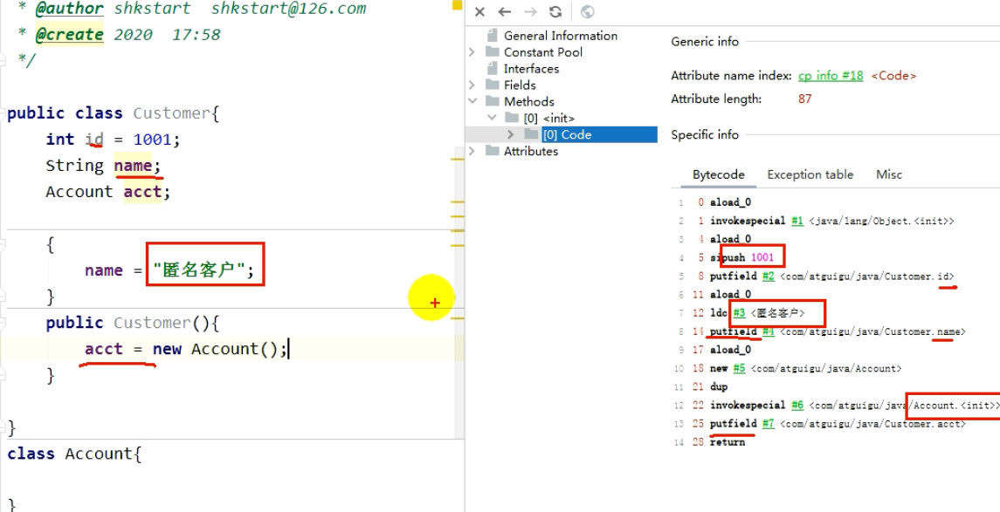 
    ```
    在Java程序的视角看来，初始化才正式开始。初始化成员变量，执行实例化代码块，调
    用类的构造方法，并把堆内对象的首地址赋值给引用变量。
    因此一般来说（由字节码中是否跟随有invokespecial指令所决定）,new指令之后会接
    着就是执行方法，把对象按照程序员的意愿进行初始化，这样一个真正可用的对象才算完
    全创建出来。
    ```

---

对象创建步骤实例：

- 代码：
  ```java
  public class ObjectTest {
      public static void main(String[] args) {
          Object obj = new Object(); // 创建object对象
      }
  }
  ```
- 反编译得到的字节码：
  ```
  Classfile /D:/learn/jvm视频教程/jvm上篇/代码/JVMDemo/chapter10/ObjectTest.class
    Last modified 2021-2-13; size 277 bytes
    MD5 checksum 1fce2fdca026a982cb2f14013b964b59
    Compiled from "ObjectTest.java"
  public class ObjectTest
    minor version: 0
    major version: 52
    flags: ACC_PUBLIC, ACC_SUPER
  Constant pool:
    #1 = Methodref          #2.#12         // java/lang/Object."<init>":()V
    #2 = Class              #13            // java/lang/Object
    #3 = Class              #14            // ObjectTest
    #4 = Utf8               <init>
    #5 = Utf8               ()V
    #6 = Utf8               Code
    #7 = Utf8               LineNumberTable
    #8 = Utf8               main
    #9 = Utf8               ([Ljava/lang/String;)V
    #10 = Utf8               SourceFile
    #11 = Utf8               ObjectTest.java
    #12 = NameAndType        #4:#5          // "<init>":()V
    #13 = Utf8               java/lang/Object
    #14 = Utf8               ObjectTest
  {
    public ObjectTest();
      descriptor: ()V
      flags: ACC_PUBLIC
      Code:
        stack=1, locals=1, args_size=1
          0: aload_0
          1: invokespecial #1                  // Method java/lang/Object."<init>":()V
          4: return
        LineNumberTable:
          line 1: 0

    public static void main(java.lang.String[]);
      descriptor: ([Ljava/lang/String;)V
      flags: ACC_PUBLIC, ACC_STATIC
      Code:
        stack=2, locals=2, args_size=1
          0: new           #2                  // class java/lang/Object
                                               // new操作符会判断对象对应的类是否加载，链接，初始化，再为对象分配内存，再对对象中的属性进行默认初始化
          3: dup                               // 进行复制，当前生成的变量的引用会在操作数栈有一份，经过该命令后会再复制一份，栈底的用来复制，复制的那个作为句柄调用相关的一些方法
                                               // 设计虚拟机指令设计原则，了解一下即可
          4: invokespecial #1                  // Method java/lang/Object."<init>":()V
                                               // 调用init方法
          7: astore_1                          // 从操作数栈中取出对象变量引用，存到局部变量表中。也就是把obj放到索引为1的位置
          8: return
        LineNumberTable:
          line 3: 0
          line 4: 8
  }
  ```

#### 2.2.8.2. 对象的内存布局

> 对象存在于堆空间中

- 组成：
  > 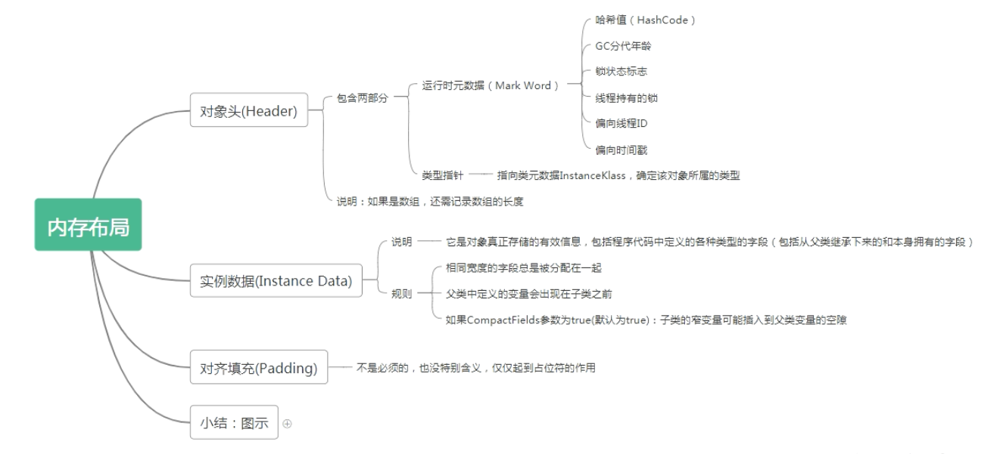
- 图示
  ```java
  public class CustomerTest{
    public static void main(String[] args){
      Customer cust = new Customer();
    }
  }
  ```
  > 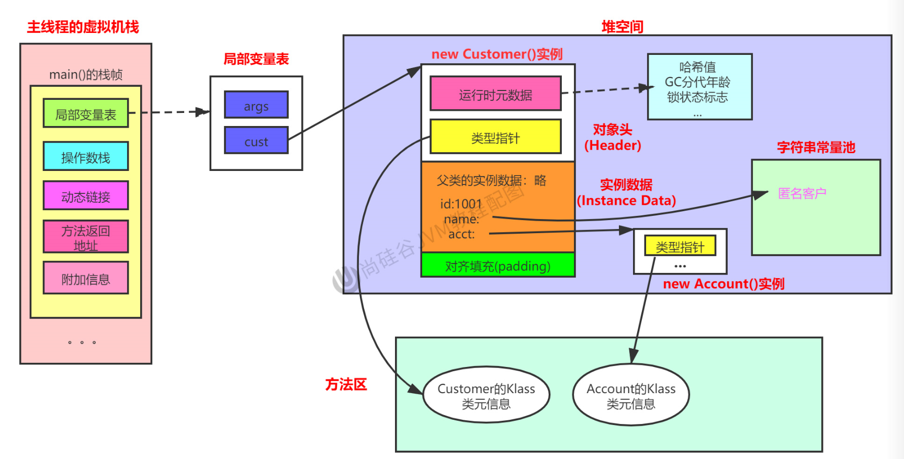

---

- 对象头(Header)
  - 说明：如果是数组，还要记录数组长度
  - 组成：
    - 运行时元数据
      - 哈希值（HashCode）：即对象所在堆空间的地址，或者引用指向的地址
      - GC分代年龄：通过年龄计数器，记录在Servivor区的年龄
      - 锁状态标志：是否作为一个锁，锁的状态
      - 线程持有的锁
      - 偏向线程ID
      - 偏向时间戳
    - 类型指针：指向元数据InstanceKlass，确定该对象所属类型。getClass()能获取Class对象就是因为该指针。
      > 不是所有的对象都会保留类型指针
- 实例数据(Instance Data)
  - 说明；
    - 它是对象真正存储的有效信息，包括程序代码中定义的各种类型的字段
    - 包括从父类继承下来的和本身拥有的字段
  - 规则：
    - 相同宽度的字段总是被分配到一起。比如int和引用类型都是4字节
    - 父类中定义的变量会出现在子类之前。因为创建对象时都是先加载父类。
    - 如果CompactField参数为true（默认为true），子类的窄变量可能插入到父类变量的空隙。节省空间
- 对齐填充（Padding）
  - 说明：不是必须的，也没有特殊含义，仅仅起到占位符的作用

---

拓展：[jvm底层-类加载与oop-klass模型](https://blog.csdn.net/qq_33873431/article/details/112851125)

#### 2.2.8.3. 对象的访问定位

- JVM是如何通过栈帧中的对象引用访问到其内部的对象实例？
  - 图示
    > 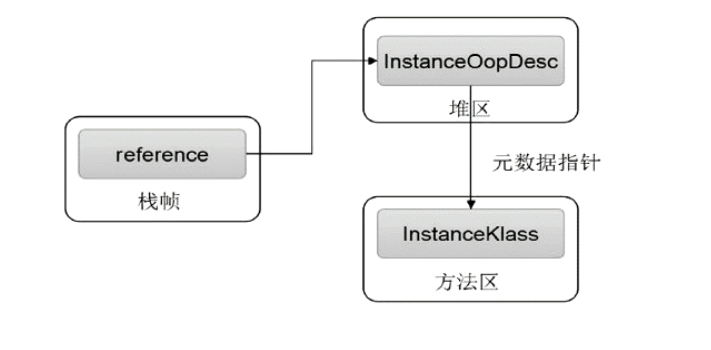 
  - 对象访问的两种方式；
    > JVM虚拟机规范中并没有明确说必须采用哪种方式
    - 句柄访问
      - 图示
        > 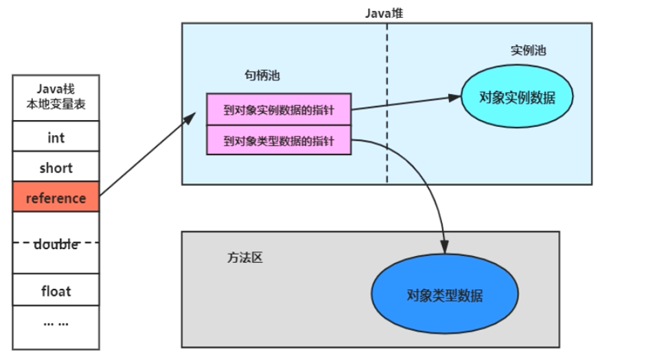 
      - 缺点：
        - 需要访问两次，效率低
      - 优点：
        - reference中存储稳定句柄地址，对象被移动（垃圾回收器移动对象很普遍）时只改变句柄中实例数据指针即可，reference本身不需要被修改
    - 直接指针（HotSpot使用）
      - 图示
        > 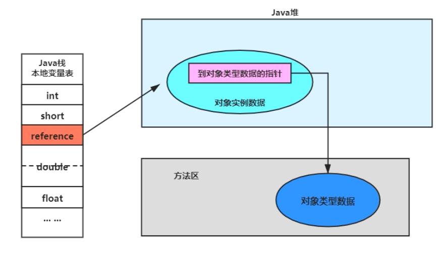 
      - 缺点：
        - 对象被移动时需要修改引用地址
      - 优点：
        - 通过引用直接访问对象，效率高

#### 面试题

```
美团：
对象在JVM中是怎么存储的？
对象头信息里面有哪些东西？
```

```
蚂蚁金服：
二面：java对象头里有什么
```

### 2.2.9. 直接内存

## 2.3. 下层 执行引擎

### 2.3.1. String Table

### 2.3.2. 解释器和即时编译器

> 面试很爱问

### 2.3.3. 垃圾回收

HotSpot里面也出 现了不采用分代设计的新垃圾收集器

#### 2.3.3.1. 垃圾回收概述

#### 2.3.3.2. 垃圾回收相关算法

#### 2.3.3.3. 垃圾回收相关概念

#### 2.3.3.4. 垃圾回收器

# 3. 字节码与类的加载


#### 3.0.3.5. 学习路线回顾

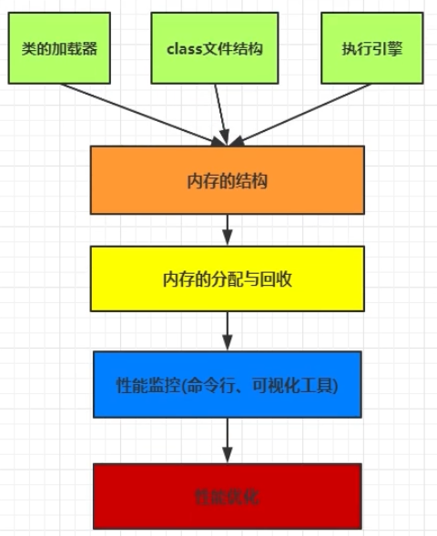
- 最终目的是性能调优(下篇)
- 所以学会使用性能监测工具(下篇)
- 要想看得懂可视化工具显示的数据，就要懂内存的分配和回收(上篇)
- 想懂内存的分配和回收，就要懂内存的结构(上篇)
- 为了更好得理解内存结构，分配位置，内存中的数据是干什么的等等，要
  - 学习类的加载器(上篇简单谈一下，中篇深入)
  - 执行引擎(上篇)
  - class文件结构和字节码指令(中篇)
    > 在上篇也会简单涉及

# 4. 性能监控与调优
