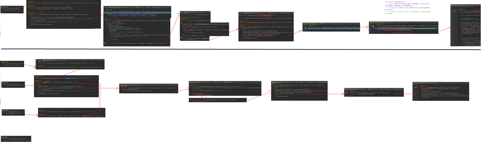
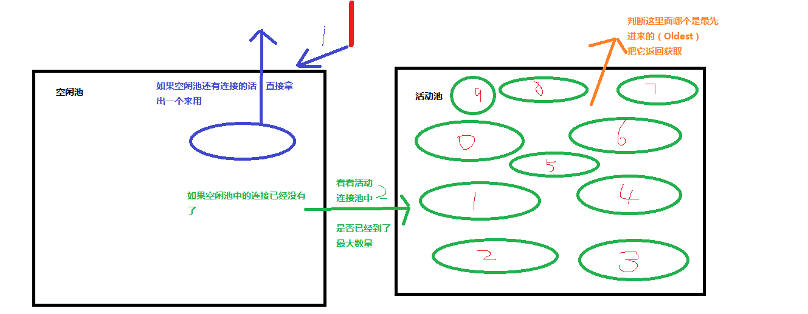

# 1. mybatis

## 1.1. 基础

### 1.1.1. mubatis入门

- 框架：
	- 概念：
		- 半成品软件
		- 封装了很多细节，使开发者可以通过极简的方式实现功能，提高效率
	- 目的：对三层架构的封装
    - 三层架构
      > 
		- 持久层解决方案（非框架）
			- jdbc -- 规范
			- Spring的JDBCTemplate -- 简单封装
			- Apache的DBUtils
    - 持久层总图
      > 
- mybatis概述
	- 持久层框架，java编写
	- 封装了很多jdbc细节，使开发者只用关注sql语句本身，而不用关注注册驱动等繁杂过程
	- 它使用了ORM思想，实现了结果集的封装
		- Object Relation Mapping对象关系映射
		- 把数据库表和实体类及实体类的属性对应起来，使操作实体类就能操作数据库表
			> 实体类中的属性和数据库表中的字段名保持一致

### 1.1.2. mybatis环境搭建

> 此处主要是使用xml，注解会在后面演示
- mybatis环境搭建
	- maven导入包
		- mybatis
		- mysql-connect-java
		- log4j（也要导入配置文件）
		- junit
	- 创建实体类（实现Serializable接口？）
	- 创建dao接口
		```java
		package com.itheima.dao;

		import com.itheima.domain.User;

		import java.util.List;

		/**
		* @author 黑马程序员
		* @Company http://www.ithiema.com
		*
		* 用户的持久层接口
		*/
		public interface IUserDao {

				/**
				* 查询所有操作
				* @return
				*/
				List<User> findAll();
		}
		```
	- 创建一个xml文件（习惯名称：SqlMapConfig.xml）
	- 添加xml文件的mybatis约束
		```xml
		<?xml version="1.0" encoding="UTF-8"?>
		<!DOCTYPE configuration  
			PUBLIC "-//mybatis.org//DTD Config 3.0//EN"  
			"http://mybatis.org/dtd/mybatis-3-config.dtd">

		```
	- 配置xml文件
		```xml
		<?xml version="1.0" encoding="UTF-8"?>
		<!DOCTYPE configuration
						PUBLIC "-//mybatis.org//DTD Config 3.0//EN"
						"http://mybatis.org/dtd/mybatis-3-config.dtd">
		
		<!-- mybatis的主配置文件 -->
		<configuration>
				<!-- 配置环境 -->
				<environments default="mysql"> <!-- 默认使用配置名称 -->

						<!-- 配置mysql的环境-->
						<environment id="mysql">
								<!-- 配置事务的类型-->
								<transactionManager type="JDBC"></transactionManager>

								<!-- 配置数据源（连接池） -->
								<!-- 一共有三种类型，后面再讲 -->
								<dataSource type="POOLED">

										<!-- 配置连接数据库的4个基本信息 -->
										<property name="driver" value="com.mysql.jdbc.Driver"/>
										<property name="url" value="jdbc:mysql://localhost:3306/eesy_mybatis"/>
										<property name="username" value="root"/>
										<property name="password" value="1234"/>
								</dataSource>
						</environment>
				</environments>

				<!-- 指定映射配置文件的位置，映射配置文件指的是每个dao独立的配置文件 -->
				<mappers>
						<mapper resource="com/itheima/dao/IUserDao.xml"/><!-- mapper路径 -->
				</mappers>
		</configuration>

		```
	- 创建mapper文件，添加mapper约束
		```xml
		<?xml version="1.0" encoding="UTF-8"?>
		<!DOCTYPE mapper
						PUBLIC "-//mybatis.org//DTD Mapper 3.0//EN"
						"http://mybatis.org/dtd/mybatis-3-mapper.dtd">
		```
	- 添加配置
		```xml
		<?xml version="1.0" encoding="UTF-8"?>
		<!DOCTYPE mapper
						PUBLIC "-//mybatis.org//DTD Mapper 3.0//EN"
						"http://mybatis.org/dtd/mybatis-3-mapper.dtd">

		<mapper namespace="com.itheima.dao.IUserDao">

				<!--配置查询所有-->
				<select id="findAll" resultType="com.itheima.domain.User"> <!-- 这里一定要与方法名称相对应，以及一定要告知封装到的实体类 -->
						select * from user;
				</select>
		</mapper>
		```
	- 注意事项
		- mybatis中将持久层（dao层）的操作接口名称叫做mapper，比如`UserDao`和`UserMapper`是相同意思
		- 在映射配置文件中要指明封装到的实体类的全限定类名
		- mybatis映射文件位置必须和dao接口的包结构相同。
			```
			├─src
			│  ├─main
			│  │  ├─java
			│  │  │  └─com
			│  │  │      └─itheima
			│  │  │          ├─dao
			│  │  │          │      IUserDao.java
			│  │  │          │
			│  │  │          └─domain
			│  │  │                  User.java
			│  │  │
			│  │  └─resources
			│  │      │  log4j.properties
			│  │      │  SqlMapConfig.xml
			│  │      │
			│  │      └─com
			│  │          └─itheima
			│  │              └─dao
			│  │                      IUserDao.xml
			│  │
			│  └─test
			│      └─java
			│          └─com
			│              └─itheima
			│                  └─test
			│                          MybatisTest.java
			```
		- 映射配置文件的mapper标签，nampspace属性取值，必须是dao接口的全限定类名
		- 映射配置文件的操作配置，id属性的取值必须是dao接口的方法名
		- **遵从后三个条件后，就不用再写dao的实现类，而只通过mybatis实现**


### 1.1.3. mybatis入门案例

```java
/**
 * @author 黑马程序员
 * mybatis的入门案例
 */
public class MybatisTest {

    /**
     * 入门案例
     * @param args
     */
    public static void main(String[] args)throws Exception {
        //1.读取配置文件
				// 注意，配置文件路径的读取是按照编译后资源文件所在位置，而不是开发的目录结构。maven会把资源文件放到target/classes下，而不会按照开发目录编写
        InputStream in = Resources.getResourceAsStream("SqlMapConfig.xml");
        //2.创建SqlSessionFactory工厂
        SqlSessionFactoryBuilder builder = new SqlSessionFactoryBuilder();
        SqlSessionFactory factory = builder.build(in);
        //3.使用工厂生产SqlSession对象
        SqlSession session = factory.openSession();
        //4.使用SqlSession创建Dao接口的代理对象
        IUserDao userDao = session.getMapper(IUserDao.class);
        //5.使用代理对象执行方法
        List<User> users = userDao.findAll();
        for(User user : users){
            System.out.println(user);
        }
        //6.释放资源
        session.close();
        in.close();
    }
}


```
- 图解
	> 
- 注意：
	- **配置文件路径的读取是按照编译后资源文件所在位置，而不是开发的目录结构。**
	- **maven会把资源文件放到target/classes下，而不会按照开发目录编写**
	- 所以这里会有`InputStream in = Resources.getResourceAsStream("SqlMapConfig.xml");`

- 基于注解的入门案例
	- 把IUserDao.xml移除，在dao接口方法上使用@Select注解并且指定sql语句
	- 在SqlMapConfig.xml中配置mapper标签时，修改使用class属性指定dao接口的权限定类名
		```xml
		<mapper resource="com/itheima/dao/IUserDao.xml"/>
		<!-- 改为 -->
		<mapper class="com.ithema.IUserDao">
		```

### 1.1.4. 自定义实现dao类入门（了解）

- 明确：
	- 在实际开发中，越简便越好
	- 尽管使用mybatis框架，也支持自己写实现类
	- 但通常不采用使用dao实现类的方式，直接使用框架
	- 使用自定义实现类演示（看看就行）：
		```java
		// test.java
		public static void main(String[] args)throws Exception {
						//1.读取配置文件
						InputStream in = Resources.getResourceAsStream("SqlMapConfig.xml");
						//2.创建SqlSessionFactory工厂
						SqlSessionFactoryBuilder builder = new SqlSessionFactoryBuilder();
						SqlSessionFactory factory = builder.build(in);

						// 3将工厂传进去
						userdao = new UserDaoImpl(factory);

						//6.使用对象执行方法
						List<User> users = userDao.findAll();
						for(User user : users){
								System.out.println(user);
						}
						//7.释放资源
						session.close();
						in.close();
		}
		```
		```java
		//实现类
		/**
		* @author 黑马程序员
		*/
		public class UserDaoImpl implements IUserDao {

				private SqlSessionFactory factory;

				public UserDaoImpl(SqlSessionFactory  factory){
						this.factory = factory;
				}

				public List<User> findAll(){
						//4.使用工厂创建SqlSession对象
						SqlSession session = factory.openSession();
						//5.使用session执行 查询所有 方法
						// * 注意：这里使用的是namespage.id 只有id时不行的。指定这个是为了找到配置的sql语句
						List<User> users = session.selectList("com.itheima.dao.IUserDao.findAll");
						session.close();
						//返回查询结果
						return users;
				}
		}
		
		```

### 1.1.5. 自定义mybatis框架

> 为了了解执行细节

- 分析
  - 基本思路分析
  	> 
	- 流程图
		> 
- 在source/src下有相关实现代码。因为比较复杂这里就没细说

## 1.2. 基本使用

### 1.2.1. 单表crud操作

#### 1.2.1.1. xml内容

- 查询
	- 单个查询（前面）
	- 模糊查询
		- 两种方式：
			- `select * from user where username like #{name}`
			- `select * from user where username like '%${value}%'`（不推荐）
		- 两种方式区别：
			> 
		```xml
			<!-- 根据名称模糊查询 -->
			<select id="findByName" parameterType="string" resultType="com.ithema.domain.User">
						<!-- 百分号要在调用时提供 -->
						select * from user where username like #{name}

					<!-- 也可以写成下面那样，百分号写到sql中，但是${}中只能写'value'，并且不安全。不推荐。 -->
					<!-- select * from user where username like '%${value}%'-->
			</select>
		```
	- 使用聚合函数
		```xml
			<!-- 获取用户的总记录条数 -->
			<select id="findTotal" resultType="int">
					select count(id) from user;
			</select>
		```
- 插入
	- 使用`#{属性名}`来获取值（属性定义见javabean）
	- 注意：默认不会自动提交，需要调用`sqlSession.commit();`;
	- 示例：
	```xml
    <!-- 保存用户 -->
    <insert id="saveUser" parameterType="com.itheima.domain.User">
        <!-- 配置插入操作后，获取插入数据的id -->
        <selectKey keyProperty="id" keyColumn="id" resultType="int" order="AFTER">
				<!-- 
					keyProperty:对应类中的名称。saveUser(user)，后会读取对象数据进行插入，同时也会为对象中的id属性值
					keyColumn:想要查询的数据库中的字段名称
					resultType:返回值类型
					order：什么时候进行这个操作（after就是指执行完下面的插入语句后）
				 -->
            select last_insert_id();
						<!-- last_insert_id()为mysql中的一个函数 -->
        </selectKey>
				<!--上面一块只有在想获得插入记录的id时需要写上（id自增长）。 -->

        insert into user(username,address,sex,birthday)values(#{userName},#{userAddress},#{userSex},#{userBirthday});
    </insert>
	```
- 更新
	- 参数类型名为全类名
	- 里面的要为属性名
	- 同样要进行手动提交
	- 示例
		```xml
    <!-- 更新用户 -->
    <update id="updateUser" parameterType="com.itheima.domain.User">
        update user set username=#{userName},address=#{userAddress},sex=#{userAex},birthday=#{userBirthday} where id=#{userId}
    </update>
		```
- 删除
	- 传入id删除用户
	- `parameterType`的类型可以是`int`,`Integer`,`java.lang.Integer`。
		> 原因在`typeAliases`标签
	- 当只有一个参数时`#{占位符}`，就行，占位符没有任何名称要求
	- 示例
	```xml
    <!-- 删除用户-->
    <delete id="deleteUser" parameterType="java.lang.Integer">
        delete from user where id = #{uid}
    </delete>
	```

#### 1.2.1.2. java测试代码（全部）
```java
/**
* 测试mybatis的crud操作
*/
public class MybatisTest {

		private InputStream in;
		private SqlSession sqlSession;
		private IUserDao userDao;

		@Before//用于在测试方法执行之前执行
		public void init()throws Exception{
				//1.读取配置文件，生成字节输入流
				in = Resources.getResourceAsStream("SqlMapConfig.xml");
				//2.获取SqlSessionFactory
				SqlSessionFactory factory = new SqlSessionFactoryBuilder().build(in);
				//3.获取SqlSession对象
				sqlSession = factory.openSession();
				//4.获取dao的代理对象
				userDao = sqlSession.getMapper(IUserDao.class);
		}

		@After//用于在测试方法执行之后执行
		public void destroy()throws Exception{
				//手动提交事务
				sqlSession.commit();
				//6.释放资源
				sqlSession.close();
				in.close();
		}

		/**
		* 测试查询所有
		*/
		@Test
		public void testFindAll(){
				//5.执行查询所有方法
				List<User> users = userDao.findAll();
				for(User user : users){
						System.out.println(user);
				}

		}

		/**
		* 测试保存操作
		*/
		@Test
		public void testSave(){
				User user = new User();
				user.setUserName("modify User property");
				user.setUserAddress("北京市顺义区");
				user.setUserSex("男");
				user.setUserBirthday(new Date());
				System.out.println("保存操作之前："+user);
				//5.执行保存方法
				userDao.saveUser(user);

				System.out.println("保存操作之后："+user);
		}

		/**
		* 测试更新操作
		*/
		@Test
		public void testUpdate(){
				User user = new User();
				user.setUserId(50);
				user.setUserName("mybastis update user");
				user.setUserAddress("北京市顺义区");
				user.setUserSex("女");
				user.setUserBirthday(new Date());

				//5.执行保存方法
				userDao.updateUser(user);
		}

		/**
		* 测试删除操作
		*/
		@Test
		public void testDelete(){
				//5.执行删除方法
				userDao.deleteUser(48);
		}

		/**
		* 测试删除操作
		*/
		@Test
		public void testFindOne(){
				//5.执行查询一个方法
				User  user = userDao.findById(50);
				System.out.println(user);
		}

		/**
		* 测试模糊查询操作
		*/
		@Test
		public void testFindByName(){
				//5.执行查询一个方法
				List<User> users = userDao.findByName("%王%");
		//        List<User> users = userDao.findByName("王");
				for(User user : users){
						System.out.println(user);
				}
		}

		/**
		* 测试查询总记录条数
		*/
		@Test
		public void testFindTotal(){
				//5.执行查询一个方法
				int count = userDao.findTotal();
				System.out.println(count);
		}
}

```

### 1.2.2. 参数和返回值

- ognl表达式（Object Graphic Navigation Language）
	> 对象名导航语言。<br>
	> 使用方式和jsp中的el表达式差不多
	- apache开发出的
	- 通过对象的取值方法获取数据。在写法上把get省略
		- 类中：`user.getUsername()`
		- ognl：`user.username`
	- mybatis中，因为parameterType已经提供了属性所属的类，所以直接使用`#{username}`即可
- parameterType
	- 传递简单对象
	- 传递pojo对象（javabean对象）
		- mybatis使用ognl表达式解析对象字段的值
	- 传递pojo包装对象（pojo对象作为某个对象的属性）
		```xml
			<!-- 根据queryVo的条件查询用户 -->
			<select id="findUserByVo" parameterType="com.itheima.domain.QueryVo" resultType="com.ithema.domain.User">
					select * from user where username like #{user.username}
					<!-- 相当于vo.getUser().getUsername() -->
			</select>
		```
		```java
			/**
			* 测试使用QueryVo作为查询条件
			*/
			@Test
			public void testFindByVo(){
					QueryVo vo = new QueryVo();
					User user = new User();
					user.setUserName("%王%");
					vo.setUser(user);
					//5.执行查询一个方法
					List<User> users = userDao.findUserByVo(vo);
					for(User u : users){
							System.out.println(u);
					}
			}
		```
- 返回值
	- 当对象中属性名称和数据库字段名称不相同时就会无法将数据封装
	- 解决方式：
		> 最好还是能属性名和列名相同
		- 查询时在sql语句中起别名。**执行效率高**
			> `select name as useName from user`
		- xml中进行配置。**效率低，但开发效率高**
			- 配置查询结果的列名和实体类的属性名的对应关系
				```xml
					<!-- 配置 查询结果的列名和实体类的属性名的对应关系 -->
					<!-- id为这个映射的名称，type表示对应实体类。 -->
					<!-- 因此一个map映射就能表示一张表到一个实体类的封装 -->
					<resultMap id="userMap" type="com.ithema.domain.User">
							<!-- 主键字段的对应 -->
							<id property="userId" column="id"></id>
							<!-- property对应java中的属性名，严格区分大小写 -->
							<!--非主键字段的对应。-->
							<result property="userName" column="username"></result>
							<result property="userAddress" column="address"></result>
							<result property="userSex" column="sex"></result>
							<result property="userBirthday" column="birthday"></result>
					</resultMap>
				```
			- 下面标签中的`resultType`属性换为`resultMap`属性
				```xml
					<!-- 当数据库字段名和类中属性名相同时会一一对应，不需要额外映射，使用resultType即可。 -->
					<!-- 但不相同时 -->
					<!-- 这里需要指定使用那个 resultMap -->
					<select id="findByName" parameterType="string" resultMap="userMap">
						select * from user where username like #{name}
					</select>
				```

### 1.2.3. dao编写（了解）

> 不多说了，了解即可
```java
package com.itheima.dao.impl;

import com.itheima.dao.IUserDao;
import com.itheima.domain.User;
import org.apache.ibatis.session.SqlSession;
import org.apache.ibatis.session.SqlSessionFactory;

import java.util.List;

/**
 * @author 黑马程序员
 * @Company http://www.ithiema.com
 */
public class UserDaoImpl implements IUserDao {

    private SqlSessionFactory factory;

    public UserDaoImpl(SqlSessionFactory factory){
        this.factory = factory;
    }

    @Override
    public List<User> findAll() {
        //1.根据factory获取SqlSession对象
        SqlSession session = factory.openSession();
        //2.调用SqlSession中的方法，实现查询列表
        List<User> users = session.selectList("com.itheima.dao.IUserDao.findAll");//参数就是能获取配置信息的key
        //3.释放资源
        session.close();
        return users;
    }

    @Override
    public void saveUser(User user) {
        //1.根据factory获取SqlSession对象
        SqlSession session = factory.openSession();
        //2.调用方法实现保存
        session.insert("com.itheima.dao.IUserDao.saveUser",user);
        //3.提交事务
        session.commit();
        //4.释放资源
        session.close();
    }

    @Override
    public void updateUser(User user) {
        //1.根据factory获取SqlSession对象
        SqlSession session = factory.openSession();
        //2.调用方法实现更新
        session.update("com.itheima.dao.IUserDao.updateUser",user);
        //3.提交事务
        session.commit();
        //4.释放资源
        session.close();
    }

    @Override
    public void deleteUser(Integer userId) {
        //1.根据factory获取SqlSession对象
        SqlSession session = factory.openSession();
        //2.调用方法实现更新
        session.update("com.itheima.dao.IUserDao.deleteUser",userId);
        //3.提交事务
        session.commit();
        //4.释放资源
        session.close();
    }

    @Override
    public User findById(Integer userId) {
        //1.根据factory获取SqlSession对象
        SqlSession session = factory.openSession();
        //2.调用SqlSession中的方法，实现查询一个
        User user = session.selectOne("com.itheima.dao.IUserDao.findById",userId);
        //3.释放资源
        session.close();
        return user;
    }

    @Override
    public List<User> findByName(String username) {
        //1.根据factory获取SqlSession对象
        SqlSession session = factory.openSession();
        //2.调用SqlSession中的方法，实现查询列表
        List<User> users = session.selectList("com.itheima.dao.IUserDao.findByName",username);
        //3.释放资源
        session.close();
        return users;
    }

    @Override
    public int findTotal() {
        //1.根据factory获取SqlSession对象
        SqlSession session = factory.openSession();
        //2.调用SqlSession中的方法，实现查询一个
        Integer count = session.selectOne("com.itheima.dao.IUserDao.findTotal");
        //3.释放资源
        session.close();
        return count;
    }
}

```

- 自定义dao实现类mybatis源码执行过程分析(**※重要**)：
	> 
- mybatis使用源码执行过程(**※重要**)：
	> 
	> 到达selectList的过程与自己写的dao实现类代码相对应

### 1.2.4. 配置细节

#### 1.2.4.1. properties标签

- 可以在`configuration`标签内写。然后再进行调用
	```xml
		<properties>
        <property name="driver" value="com.mysql.jdbc.Driver"></property>
        <property name="url" value="jdbc:mysql://localhost:3306/eesy_mybatis"></property>
        <property name="username" value="root"></property>
        <property name="password" value="1234"></property>
    </properties>

	<!--配置环境-->
    <environments default="mysql">
        <!-- 配置mysql的环境-->
        <environment id="mysql">
            <!-- 配置事务 -->
            <transactionManager type="JDBC"></transactionManager>

            <!--配置连接池-->
            <dataSource type="POOLED">
                <property name="driver" value="${driver}"></property>
                <property name="url" value="${url}"></property>
                <property name="username" value="${username}"></property>
                <property name="password" value="${password}"></property>
            </dataSource>
        </environment>
    </environments>
	```
- 也可以使用外部文件
	- resource:直接用类路径就好（注意，是按照编译后的路径。）
	- url：
		- http，https协议
		- file协议
	```properties
	jdbc.driver=com.mysql.jdbc.Driver
	jdbc.url=jdbc:mysql://localhost:3306/eesy_mybatis
	jdbc.username=root
	jdbc.password=1234
	```
	```xml
	<!-- 配置properties
        可以在标签内部配置连接数据库的信息。也可以通过属性引用外部配置文件信息
        resource属性： 常用的
            用于指定配置文件的位置，是按照类路径的写法来写，并且必须存在于类路径下。
        url属性：
            是要求按照Url的写法来写地址
            URL：Uniform Resource Locator 统一资源定位符。它是可以唯一标识一个资源的位置。
            它的写法：
                http://localhost:8080/mybatisserver/demo1Servlet
                协议      主机     端口       URI

            URI:Uniform Resource Identifier 统一资源标识符。它是在应用中可以唯一定位一个资源的。
    -->
    <properties url="file:///D:/IdeaProjects/day02_eesy_01mybatisCRUD/src/main/resources/jdbcConfig.properties">
    </properties>

		<!-- 在下方进行调用 -->
	```

#### 1.2.4.2. typeAliases

- 之所以String等类型可以写成好多种方式，是因为mybatis内部配置了别名
	> 
- 使用typeAliases标签配置别名.**只能配置domain中类的别名**
	- `typeAlias`标签
	- `package`标签
	```xml
    <!--使用typeAliases配置别名，它只能配置domain中类的别名 -->
    <typeAliases>
        <!--typeAlias用于配置别名。type属性指定的是实体类全限定类名。alias属性指定别名，当指定了别名就再区分大小写 
        <typeAlias type="com.itheima.domain.User" alias="user"></typeAlias>-->

        <!-- 用于指定要配置别名的包，当指定之后，该包下的实体类都会注册别名，并且类名就是别名，不再区分大小写-->
        <package name="com.itheima.domain"></package>
    </typeAliases>
	```

#### 1.2.4.3. mappers

- `mappers`内也可以配置`package`标签。**为整个包下的接口设置resource或class**
	```xml
    <mappers>
        <!--<mapper resource="com/itheima/dao/IUserDao.xml"></mapper>-->
        <!-- package标签是用于指定dao接口所在的包,当指定了之后就不需要在写mapper以及resource或者class了 -->
        <package name="com.itheima.dao"></package>
    </mappers>
	```

## 1.3. 深入

### 1.3.1. 连接池（原理了解）

- 连接池复习：
	> 
- mybatis连接池配置方式：
	- SqlMapConfig中的dataSource标签，type属性
		- 取值：
			- POOLED：采用传统的javax.sql.DataSource规范中的连接池
			- UNPOOLED：采用传统获取连接方式，虽然也实现了javax.sql.DataSource接口，但是并没有使用池的思想
			- JNDI：采用服务器提供的JNDI技术实现，来获取DataSource对象，不同服务器所能拿到的DataSource是不同的。**注意；如果不是web或maven的war工程是不能使用的**
				> 课程中用的tomcat服务器，采用的连接池是dbcp连接池
	- POOLED和UNPOOLED日志输出对比
		> 
	- POOLED源码过程分析
		> <br>
		> 
	- JDNI见扩展资料

### 1.3.2. 事务


### 1.3.3. 动态sql（会用即可）

### 1.3.4. 多表查询（掌握使用）

#### 1.3.4.1. 一对多

#### 1.3.4.2. 一对一（？）

#### 1.3.4.3. 多对多

## 1.4. 缓存和注解开发

### 1.4.1. 缓存和注解开发

### 1.4.2. mybatis加载时机

### 1.4.3. 一级缓存和二级缓存

### 1.4.4. 注解开发
