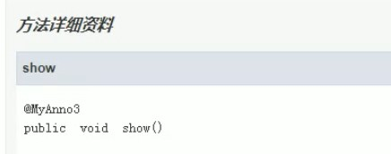
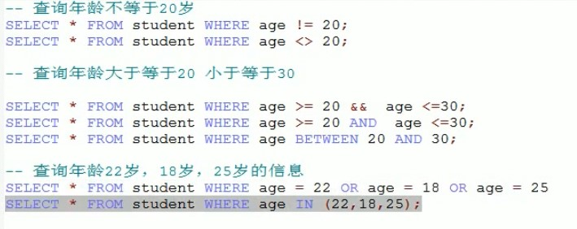
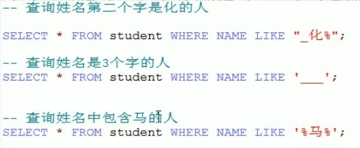
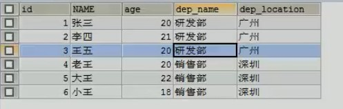
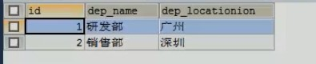
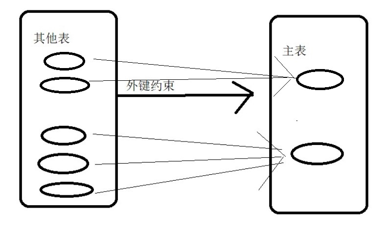

# 1. 反射：框架设计的灵魂

> 也要看看代码，很重要

## 1.1. 基本知识

- 框架：半成品软件。在框架的基础上 进行软件开发，简化代码。开发框架用得到反射，但是使用框架并不太能用到，但能加深理解
- 反射：将类的各个组成部分封装为其他对象，这就是反射机制
  - 好处：
    1. 可以在程序运行的过程中操作这些对象。
    2. 可以降低程序耦合性，提高可扩展性
- 获取 Class 类对象的三种方式：
  1. 从第一个阶段：Class.forName("全类名")：将字节码文件加载近内存，返回 Class 对象
     - 多用于配置文件，将类名定义在配置文件中，读取文件加载类
  2. 从第二个阶段：通过类名的属性 Class
     - 多用于参数的传递
  3. 从第三个阶段：对象.getClass()(封装到 Object 类中)
     - 多用于对象获取字节码的方式
  - 结论：同一个字节码文件（.class）在一次程序运行过程中，只会被加载一次，不论通过哪一种方式获取的 class 对象
- Class 对象功能

  - 获取功能：
    1. 获取成员变量
       - Field getDeclaredField(String name) 获取所有成员变量中，以 name 命名的成员变量
       - Field[] getDeclaredFields() 获取所有的成员变量，包括 private
       - Field getField(String name) 指定名称的 public 修饰的成员变量
       - Field[] getFields() 获取所有 public 修饰的成员变量
    2. 获取构造方法
       - Constructor<?>[] getConstructors()
       - Constructor<T> getConstructor(类<?>...parametertypes)
       - Constructor<T> getDeclaredConstructor(类<?>...parametertypes)
       - Constructor<?>[] getDeclaredConstructors()
    3. 获取成员方法
       - Method[] getMethods()
       - Method getMethod(String name,类<?>...parametertypes)
       - Method[] getDeclaredMethods()
       - Method getDeclaredMethod(String name,类<?>...parametertypes)
    4. 获取类名
       - getName()

- Field 对象功能

  - 获取 Object get(Object obj)
  - 设置 void set(Object obj, Object value)
  - 忽略访问权限修饰符的安全检查 void setAccessible(boolean flag)//Methods inherited from class java.lang.reflect.AccessibleObject

- Constructor：构造方法
  - 创建对象 newInstance(Object initargs)
  - 当要使用**无参**构造方法进行创建对象时，既可以通过 Class 对象获得构造器来获得，也可以通过 Class 类中的 newInstance()来获得
- Method：成员方法
  - 执行方法 invoke(Object obj, Object... args) 参数是对象以及方法参数列表
  - 获取方法名称 String getName()
- 案例：
  - 需求：写一个“框架”，可以帮我们创建任意类的对象并且执行任意方法
    - 实现：在不改变该类任意代码的前提下，但可以创建任意类对象并执行任意方法
      1. 配置文件
      2. 反射
    - 步骤：
      1. 将需要创建的对象的全类名和需要执行的方法定义在配置文件中
      2. 在程序中加载和读取配置文件
      3. 使用反射技术来加载类文件进入内存
      4. 创建对象
      5. 执行方法

## 1.2. 原理图解


> Field Constructor Method 都是类。Class 类中有这三个类

# 2. 注解：

## 2.1. 基本概念

- 注解与注释
  - 注解概念：说明程序的，给电脑看。
    - 进一步：注解是一系列元数据，它提供数据用来解释程序代码，但是注解并非是所解释的代码本身的一部分。注解对于代码的运行效果没有直接影响。
  - 注释概念：用文字描述程序，给程序员看

## 2.2. 作用

1. 编译检查
   ```java
   @Override
   public String toString() {
     return name+"   "+age;
   }
   /*
   此处的overide用来检查toString是否是复写了父类的方法。
   */
   ```
2. 代码分析，通过代码里标识的注解对代码进行分析，（使用反射）
3. 编写文档：通过代码中标识的注解生成 doc 文档

## 2.3. java 中预定义注解

- @Overrides :检测被该注解标注的方法是否重写父类方法(或实现接口接口)
- @Deprecated :将该注解标注的内容以过时，有更好的替代内容
- @SuppressWarnings :压制警告
  
  - 一般添加"all"参数，@SuppressWarnings("all")，放在类或者方法上面，使不显示警告
- @SafeVarargs：参数安全类型注解。它的目的是提醒开发者不要用参数做一些不安全的操作,它的存在会阻止编译器产生 unchecked 这样的警告。它是在 Java 1.7 的版本中加入的。

  ```java
  @SafeVarargs // Not actually safe!
      static void m(List<String>... stringLists) {
      Object[] array = stringLists;
      List<Integer> tmpList = Arrays.asList(42);
      array[0] = tmpList; // Semantically invalid, but compiles without warnings
      String s = stringLists[0].get(0); // Oh no, ClassCastException at runtime!
  }
  /* 上面的代码中，编译阶段不会报错，但是运行时会抛出 ClassCastException 这个异常，所以它虽然告诉开发者要妥善处理，但是开发者自己还是搞砸了。

  Java 官方文档说，未来的版本会授权编译器对这种不安全的操作产生错误警告。 */
  ```

- @FunctionalInterface：函数式接口注解，这个是 Java 1.8 版本引入的新特性。函数式编程很火，所以 Java 8 也及时添加了这个特性。函数式接口 (Functional Interface) 就是一个具有一个方法的普通接口。

  ```java
  @FunctionalInterface
  public interface Runnable {
      /**
       * When an object implementing interface <code>Runnable</code> is used
       * to create a thread, starting the thread causes the object's
       * <code>run</code> method to be called in that separately executing
       * thread.
       * <p>
       * The general contract of the method <code>run</code> is that it may
       * take any action whatsoever.
       *
       * @see     java.lang.Thread#run()
       */
      public abstract void run();
  }
  /* 我们进行线程开发中常用的 Runnable 就是一个典型的函数式接口，上面源码可以看到它就被 @FunctionalInterface 注解。

  可能有人会疑惑，函数式接口标记有什么用，这个原因是函数式接口可以很容易转换为 Lambda 表达式。这是另外的主题了，自己去查 */
  ```

## 2.4. 自定义注解

- 格式：
  元注解
  public @interface 注解名称{
  属性列表;
  }
- 本质：注解就是一个接口，该接口默认继承下面一个接口<br>
  public interface myAnnotation extends java.lang.annotation.Annotation{}
- 属性：
  - 定义：接口中可以定义的成员方法
  - 要求返回值类型只能以下几种 ：
    - 基本数据类型
    - String
    - 枚举
    - 注解
    - 以上数据类型的数组
  - 赋值：
    1. 定义了属性，在使用时需要给属性赋值，但也可以通过 default 关键字给属性默认初始化值，那么在使用注解时，就不必要进行赋值。
    2. 但如果只有一个属性值，那么在赋值时只要在括号中填入值即可
    3. 当为数组中只有一个值时，大括号可以省略。
    ```java
    @myAnnotation(age=2,name="Anna",anno=@myannno2,strs={"aa","bb"})
    @myAnnotation(2)
    ```

## 2.5. 元注解

> 元注解是可以注解到注解上的注解，或者说元注解是一种基本注解，但是它能够应用到其它的注解上面。(前两个较常用)

- @Target：用于描述注解能作用的位置,前三个重要,后面的 6 个可以自己查看源文档

  ```java
  摘自javadoc文档前三个：
      /** Class, interface (including annotation type), or enum declaration */
      TYPE,//类上

      /** Field declaration (includes enum constants) */
      FIELD,//成员变量上

      /** Method declaration */
      METHOD,//方法上

  全部：
      ElementType.ANNOTATION_TYPE 可以给一个注解进行注解
      ElementType.CONSTRUCTOR 可以给构造方法进行注解
      ElementType.FIELD 可以给属性进行注解
      ElementType.LOCAL_VARIABLE 可以给局部变量进行注解
      ElementType.METHOD 可以给方法进行注解
      ElementType.PACKAGE 可以给一个包进行注解
      ElementType.PARAMETER 可以给一个方法内的参数进行注解
      ElementType.TYPE 可以给一个类型进行注解，比如类、接口、枚举
  ```

- @Retention:描述注解被保留的一个阶段
  - @Retention(value = RetentionPolicy.RUNTIME):当前描述的注解会保留到 class 字节码文件中并被 jvm 读取到,所以在程序运行时可以获取到它们。（一般是这个）
  - 如果是 CLASS,那么会被加载到字节码文件中，但不会被 jvm 读取到
  - 如果是 SOURCE,那么不会加载到字节码文件中。
- @Documented：描述注解是否被抽取到 doc 文档中，如果在注解的定义中有标注@Documented，那么就会被加到 doc 文档中<br>
- @Inherited：描述注解是否被子类继承。@myAnnotation 被@Inherited 描述，那么如果@myAnnotation 描述一个类，那么这个类的子类也会从父类继承这个注解。
- @Repeatable：表示注解中属性值可以取多个，其中要了解容器注解。
  ```java
  //什么是容器注解呢？就是用来存放其它注解的地方。它本身也是一个注解。
  @interface Persons {//容器注解
      Person[]  value();
  }
  ```


    @Repeatable(Persons.class)//括号中填入容器注解
    @interface Person{
        String role() default "";
    }


    @Person(role="artist")
    @Person(role="coder")
    @Person(role="PM")
    public class SuperMan{
    
    }
    ```

## 2.6. 使用（解析）注解

- 本质：获取注解中定义的属性值，把配置文件的工作交给注解来完成，简化配置操作。后期注解大多数用来替换配置文件。
- 步骤：

  1. 获取注解定义位置的对象（Class,Method,Field 等）
  2. 获取指定的注解（getAnnotation）
  3. 调用注解中的抽象方法获取配置属性值

  ```java
   //摘抄部分代码，详情可以去看代码文件

   // 1 解析注解
      // 获取该类的字节码文件对象
      Class<AnnotationTest> annotationTestClsss = AnnotationTest.class;

      // 2获取上边的注解对象
      ProAnnotation pro = annotationTestClsss.getAnnotation(ProAnnotation.class);// 其实就是在内存中区生成了一个该注解接口的子类实现对相关
      /*
      相当于：
      public class proImp1 implements ProAnnotation{
          public String className(){
              return "_1_java_base.base_strengthen.annotation.case_test.Person";
          }
          public String methodName(){
              return "eat";
          }
      }
      也就是说在调用getAnnotation时，就会把上面的那个类创建一个对象病返回给你，在通过接口接收
       */
  ```


        // 3调用注解对象中定义的抽象方法（也就是属性）获取返回值
        String className = pro.className();
        String methodName = pro.methodName();
    ```

## 2.7. 小结

- 以后大多数时候是使用注解而不是自定义注解
- 使用者：
  1. 编译器（检测程序是否编译正确，如@Override）
  2. 解析（测试）程序用（比如那个 TestCheck,如果没有这个程序，注解毫无意义）。
     - 进一步：当开发者使用了 Annotation 修饰了类、方法、Field 等成员之后，这些 Annotation 不会自己生效，必须由开发者提供相应的代码来提取并处理 Annotation 信息。这些处理提取和处理 Annotation 的代码统称为 APT（Annotation Processing Tool)。
- 注解基本上认为不是程序的一部分，可以理解为相当于一个标签
- 本次这里有两个 case，一个是通过注解代替配置文件，一个是通过注解检测是否有 bug 并输出到 bug.txt

# 3. 函数式接口

- 笔记文件
  [笔记文件](pdf/函数式接口-笔记.pdf)

# 4. Stream 流，方法引用

- 笔记文件
  [笔记文件](pdf/Stream流、方法引用-笔记.pdf)

# 5. MySQL

## 5.1. 数据库基本概念

1. 英文名称：Database
2. 什么是数据库：
   - 用于存储和管理数据的仓库
3. 数据可特点：
   1. 持久化存储数据，其实数据库就是一个文件系统
   2. 方便存储和管理数据，使用了统一的方式操作数据库--SQL
4. 常用数据库软件：
   

## 5.2. 基本命令

- cmd->services.msc 打开服务
- MySQL 打开与关闭（cmd 下）
  1. net start mysql 开启 mysql（管理员权限打开 cmd）
  2. net stop mysql 关闭 mysql（管理员权限打开 cmd）
- 登陆与退出（cmd 下）
  - 本地：
    1. 登陆：mysql -uroot -proot
       > -u:user，后面直接加用户名 -p:password,后面直接加密码
       > 也可以写成--user=root --password=root
       > 或者不直接加，只输入-p（即：mysql -uroot -p,之后输入密码会以\*反显）
    2. 退出：exit
  - 远程：
    1. 登陆： mysql -h127.0.0.1 -uroot -proot
       
       > -h 后直接加上 ip 地址，本机为 127.0.0.1
    2. 退出：exit 或者 quit
    3. 登陆： mysql --host=127.0.0.1 --user=root --password=root
       
       > 相当于全称，这里有两个-

## 5.3. 数据结构


- 安装目录
  - 配置文件 my.ini
- 数据目录
  - 计算机硬件和 MySQL 软件合称 MySQL 服务器
  - 一个数据库就是一个文件夹
  - 一个数据库中可以存放多张表，表对应文件夹中的.frm 结尾文件
  - 每个表中存放多条数据记录

# 6. SQL

## 6.1. 什么是 SQL

    Structured Query Language：结构话查询语言。
    其实就是操作所有关系型数据库(Relational DBMS)的规则
    每一种数据库操作方式存在不一样的地方，称为“方言”

## 6.2. 通用语法

1. SQL 可以单行或者多行书写，以分号结尾
2. 使用 table 制表符增强可读性
3. 数据库不区分大小写，但关键字推荐使用大写
4. 3 种注释
   1. 单行注释：
      1. -- 内容（两个横杠和**一个空格**）
      2. #内容 （方言 MySQL 特有书写方式，不必要加空格）
   2. 多行注释：/_ 内容 _/

## 6.3. SQL 语句分类

1. DDL(data definition Language)
   用来定义数据库对象：数据库，表，列等。关键字：Creat，drop，alter 等
2. DML(Data Manipulation Language)
   用来对数据库中的数据进行增删。关键字：insert，delete，update 等。
3. DQL(Data Query Language)
   用来查询表中的记录（数据）。关键字 select，where 等
4. DCL(Data Control Language)
   数据控制语言，用来定义数据库访问权限和安全级别，及创建用户。关键字：GRANT，REVOKE 等
   

## 6.4. 数据类型


## 6.5. 语法

### 6.5.1. DDL(操作数据库)

- 对数据库整体
  1. C(Create) 创建
     - create database 数据库名
       
       > 重名时会报错
     - create database if not exists 数据库名
       
       > 当指定数据库名不存在时才创建，存在也不会报错
     - create database 数据库名 character set gbk
       
       > 以指定字符集创建数据库，这里为 gbk
  2. R(Retrieve) 查询
     - show databases;
       > 额外知识：
       > information_schema 用来 MySQL 中的一些信息，里面存放的是视图（以后才学），而不是表，并且并不对应物理文件
       > mysql 用来存放数据库中的核心数据
       > performance_schema 用来存放调整数据库性能的一些数据
       > 这是三个都最好不要改
     - show creat database 数据库名称
       
       > 查看某一个数据库字符集：查询某个数据库创建语句
  3. U(Update) 修改
     - alter database 数据库名称 character set 字符集名称
       
       > 修改某个数据库字符集（utf8，没有-）
  4. D(Delete) 删除
     - drop database 数据库名称
       
       > 一般不会做的操作
     - drop database if exists
       
       > 当数据库存在时才删除
  5. 使用数据库
     - select database()
       
       > 查询正在使用的数据库名称
     - use 数据库名称
       
       > 使用数据库，相当于进入数据库
- 对表整体
  1. C(Create) 创建
     - create table (if not exists) 表名(
       列名 1 数据类型 1,
       列名 2 数据类型 2,
       列名 3 数据类型 3,
       ......
       列名 n 数据类型 n;
       );
       > 创建表，注意小括号和逗号，最后一列没有逗号
       ```sql
       //常用数据类型例：
       age int
       score double(5,2)//最多有5位，小数点后保留两位
       riqi date 2000-12-12
       jjutiriqi datetime //格式举例：2000-12-12 12:12:12
       shijianchuo timestamp //格式举例：2000-12-12 12:12:12
       //时间戳：如果不给这个字段赋值，那么默认使用当前系统时间赋值
       name varchar(20)
       //字符串类型，最多20个字符
       ```
       ```sql
       //例：
       create table student(
           id int,
           name varchar(32),
           age int,
           score double(4,1),
           birthday date,
           inserttime timestamp
       );
       ```
     - create 新表 like 已经存在表
       
       > 创建一个新的表和已经存在的一个表结构相同，也就是赋值表
  2. R(Retrieve) 查询
     - show tables
       
       > 查询一个数据库中所有表的名称
     - desc 表名
       
       > 查询表结构
     - show create table 表名
       
       > 查询表的字符集
  3. U(Update) 修改<p id="DML_update"> </p>
     - alter table 表名 rename to 新表名;
       
       > 修改表名
     - alter table 表名 character set 字符集;
       
       > 修改表的字符集
     - alter table 表名 add 列名 数据类型;
       
       > 增加一列
     - alter table 表名 drop 列名;
       
       > 删除列
     - alter table 表名 change 旧列名 新列名 新列名类型
       
       > 修改列名称，类型
     - alter table 表名 modify 列名 新的类型
       
       > 只修改列的类型
  4. D(Delete) 删除
     - drop table (if exists) 表名
       
       > 删除表
     - truncate table 表名
       > 删除整个表再创建一个一模一样结构的表
       > 相当于一下两条语句整合
       > create 新表 like 已经存在表;
       > drop table 表名

### 6.5.2. DML(增删改表中数据)

1. 添加数据
   - insert into 表名(列名 1,列名 2.....列名 n) values(值 1,值 2...值 n),(值 1,值 2...值 n).....;
     > 往表中插入数据
     - 注意：
       1. 列名和值要一一对应
       2. 如果表名后没有写列名，那么默认给所有列添加值。但建议都写上，不要偷懒
       3. 除了数字类型，其他数据类型都要使用引号引起来，单引号双引号都行
2. 删除数据
   - delete from 表名 [where 条件]
     > 把满足条件的数据从指定表中删除。例： delete from student where id=1;
     - 注意：
       1. !!!!!如果不加条件，就会删除表中所有数据!!!!!!
       2. 但不推荐上述操作，因为会一条一条删除，效率太低，推荐使用 **truncate table 表名**;--删除整个表，然后再创建一个一模一样的空表
3. 修改数据
   - update 表名 set 列名 1=值 1,.....[where 条件];
     > 例：UPDATE student SET age=20,score=100 WHERE id=2;
     - 注意：
       1. 如果不加任何条件，就会把所有表中所有记录都修改，比如把 score 都改为 100

### 6.5.3. DQL(表内数据查询)

- select \* from 表名
  
  > 查询表中所有数据

1. 整体语法： >所有语句都涉及到

   <pre>
       select 
           字段列表
       from
           表名列表
       where
           条件列表
       group by
           分组字段
       having
           分组之后的条件
       order by
           排序
       limit
           分页限定
   </pre>

2. 基础查询：
   1. 多个字段查询
      - select 字段名 from 表名;
        > 例：-- 查询姓名和年龄：SELECT NAME,age FROM student;
        > 一般不使用\*号，阅读性太差,也可以分分行，多加些注释
        > 
   2. 去除重复结果集
      - select distinct 字段名 from 表名;
        
        > 如果指定的多个字段名都相同，才可以去重
   3. 计算列
      - select 字段 1+字段 2 from 表名;
        > 计算两个字段相加结果,这里可以进行四则运算。
        > 例：SELECT id,score+age FROM student;
        > 
        > 如果有 null 参与的运算结果都是 null，因此有下面表达式：
      - select 字段 1+ifnull(表达式 1,表达式 2) from 表名;
        > 表达式 1：判断那个字段为 null。
        > 表达式 2：为 null 时的替换值。
        > 例：select id+ifnull(score,0) from student;
   4. 起别名
      - select 字段 1+字段 2 as 新名称 from 表名;
        > 将某个结果（列名字段或者表名）起一个别名用来显示出来,as 也能用**一个或者多个空格**表示。
        > 此时多分行比较好
3. 条件查询
   1. where 条件
   2. 运算符
      >  >
      > 例：select \* from student where age>15
      > 
   3. 注意：
      - null 不能使用=和<>来判断，应该使用 is 和 is not.
        > 例：select _ from student where age is null
        > select _ from student where age is not null
   4. like：
      - \_:单个任意字符
      - %:多个任意字符
        > 例： select name from student where '李%'
        > 
4. 排序查询
   - select 字段 from 表名 order by 排序字段 1 排序方式 1,排序字段 2 排序方式 2....;
     > 排序方式：
     > ASC:升序（默认）
     > DESC:降序
     > 越靠后，排序优先度越低，只有靠第一种排序相同时，那么才考虑之后的排序方式
5. 聚合函数:将一列数据作为一个整体，进行**纵向**的计算。
   1. count:计算个数
      - 一般选择非空的列
      - 或者使用 count(\*)（不推荐）
        
        > count (distinct nam) 来去重（mysql是否可用未证实） 
   2. max:计算最大值
   3. min:计算最小值
   4. sum:计算和；
   5. avg:计算平均值
   - 注意：聚合函数计算会自动**排除 null 值**，可以通过 ifnull()来避免
   - 语法：select 函数(字段名) from 表名
     或者 select 函数(ifnull(字段名,值)) from 表名
     > 例：
     > 
6. 分组查询
   - group by 分组字段;
     > 例：select sex,AVG(math),count(id) from student group by sex;
     > selct 后有什么，后面就显示什么
     > <br>
     > 注意：分组之后查询字段：分组字段(比如 sex,如果用每个人都不同的字段分组，就没有意义了)，聚合函数
     > 例：<br>
   - 添加判断语句：
     > 普通 where 添加在前面，分组之后条件判断加载后面并且用 having 关键字
     > where 和 having 区别（**面试会考**）：
     1. where 在分组之前进行限定，不满足条件不参与分组， having 在分组之后进行限定，不满足条件不会被查询出来
     2. where 不可以进行聚合函数的判断，而 having 可以
        > [查看格式](#453-dql表内数据修改查询)
        > 例：
        > 
7. 分页查询
   - limit 开始的索引,每页查询的条数
     > 例：<br>select _from student limit 0,3;-- 从 0 开始查，显示三条记录。（第一页）
     > select _ from student limit 3,3;-- 从 3 开始，显示 3 条，（第二页）
     > 开始索引=（当前页码-1）\*每页显示条数
   - limit 这个语法是 SQL 的一个**方言**

### 6.5.4. DCL

[跳转](#611-dcl)

## 6.6. 约束

### 6.6.1. 概念

> 对表中的数据进行限定，保证数据的正确性，有效性和完整性

### 6.6.2. 分类

- 主键约束 pramary key
- 非空约束 not null
- 唯一约束 unique
- 外键约束 foreign key

### 6.6.3. 非空约束

1. 在创建表是添加约束
   - 在数据定义后面加 空格+not null
     例：
     `SQL creat table stu{ id int, name varchar(20) not null -- name为非空约束 };`
2. 删除非空约束(就是修改表的一个字段)
   - alter table 表名 modify 字段名 字段类型
     > 也就是说后面什么都不加，就取消掉了约束
     > [跳转到列数据类型修改](#DML_update)
3. 创建表后添加非空约束
   - alter table 表名 modify 字段名 字段类型 not null
     
     > 和上面同理

### 6.6.4. 唯一约束

- 注意：MySQL 中唯一约束限定的列的值可以有多个 null

1. 创建表是添加唯一约束
   - 在数据定义后面加 空格和 unique
     ```SQL
     creat table ste{
         id int,
         phont_number varchar(20) unique
     };
     ```
2. 删除唯一约束
   - alter table 表名 drop index 字段名
     > 唯一约束有时候也称为唯一索引，所有有 drop index
     > [跳转到列数据类型修改](#DML_update)
3. 创建表后添加唯一约束
   - alter table 表名 modify 字段名 字段类型 unique
     
     > 和非空约束添加同理，但当添加时，该列数据必须不能有重复的，否则会报错

### 6.6.5. 主键约束

- 含义：非空且唯一。是表中记录的唯一标识
- 限制：一张表只能有一个字段为主键

1. 创建表时添加主键约束
   - 后面加 primary key 即可
     ```SQL
     creat table stu(
         id int primary key,
         name varchar(20)
     );
     ```
2. 删除主键约束
   - alter table 表名 drop primary key;
     
     > 主键只有一个，所以不需要指定
3. 创建表后添加主键
   - alter table 表名 modify 字段名 字段类型 primary key;
     
     > 不能有重复数据以及空数据。
4. 自动增长
   - 概念：如果某一列是数值类型的，使用 auto_increment 可以完成值的自动增长
   - 基本上都是和主键一起使用，但也可以分开使用，但是这种情况很少
   - 语法：
     ```SQL
     creat table stu(
         id int primary key auto_increment,
         name varchar(20)
     );
     ```
     > 也可以手动设置，但每次增长是上次数据+1（也就是等价于最大值+1）

### 6.6.6. 外键约束

- 情景
  > 有时数据会有冗余
  > 例：
  > 
  > 每个部门就在一个地方，不需要每条员工信息都记一次
  > <br>解决办法：
  > 创建两张表
  > 一张表记员工信息（employee 表），一张表记部门所在地（department 表）
  >  
  > 此时如果删除一个部门，另一张表中还有人对应那个部门，显然不合理。应该先删除人员。
- 为解决上述问题使用外键约束，即让表与表之间产生关系，从而确保数据的正确性。

1. 添加表时添加外键

   ```SQL
   creat table 表名(
       ...
       外键列
       constraint 外键名称(自己起名，不能重复) foreign key 外键列名称 references 主表名称(主表列名称)
       -- 一般都关联主键列，当然也能关联其他列
       -- 主表必须先存在，此处主表为部门表
       -- 必须先删除关联表记录，再删除主表记录
       -- 在多的一方建立外键，指向一的一方的主键
       -- contraint 外键名称 这部分也可以不写，系统会自动分配外键名称
   )

   -- 例：
   creat table employee(
       ...
       dep_id int, -- 外键对应主表的主键   --注意，此时该句不是最后一句，要加逗号
       constraint emp_dept foreign key (dep_id) references  department(id)
   )
   ```

   大致图解：
   

   > 此时若其他表记录与主表记录相互关联，那么就不能对该条主表记录进行删除
   > 同样，新加的其他表记录也必须与主表关联记录的所有数据中来取。例如这里新建员工体条目 dep_id 只能取 1 和 2 或者保留为 null

2. 删除外键
   
   - alter table 其他表的名 drop foreign key 外键名（自己起的那个）
3. 创建表之后，添加外键
   - alter table 其他表的名 add constraint 外键名称（自己起名，不能重复） foreign key 外键列名称 references 主表名称(主表列名称)
     
     > 中文括号是备注，英文括号中需要填东西
4. 级联操作
   - 情景
     
     > 当修改主表中的记录时，必须先修改与之关联的记录。为了方便修改数据，就有了级联操作。也就是修改一的同时自动修改多
   - 概念：当修改主表中的记录时，其他表中的记录也会跟着修改（使用一定要谨慎）
     
     > 比如这里修改 department 表中的一个 id 为 5，employee 表中对应 dep_id 也会修改为 5
   - 添加级联更新：
     
     - 在添加外键语句后 加上：on update cascade
   - 添加级联删除：
     - 在添加外键语句后 加上：on delete cascade

       例：

     ```SQL
     -- 先取消键的关联
     alter table employee drop foreign key emp_dept
     -- 再重新加上外键，此时添加级联更新语句和级联删除语句
     alter table employee add constraint emp_dept foreign key dem_id references department(id) on
 	update cascade on delete cascade
     ```

## 6.7. 数据库设计

### 6.7.1. 多表间关系

1. 多表间关系：
   - 一对一（了解）：
     - 如人的身份证
       
       > 一个人只能有一个身份证
   - 一对多（多对一）：
     - 如部门和部门
       > 一个部门能有多个员工
       > 一个员工只能在一个部门
   - 多对多
     - 如大学生选择课程
       > 一个学生能选多门课程，
       > 一个课程能被多个学生选择
2. 实现关系：
   - 一对多（多对一）
     - 实现方式：在多的一方建立外键，指向一的一方的主键
       
   - 多对多
     - 实现方式：通过中间表
       
   - 一对一（实际开发基本不会使用）
     - 实现方式：
     - 基本上会合成一张表，如果必须要用两张表的话：
     1. <br> 
     2. 使两表主键（id）相同

### 6.7.2. 范式

- 概念：在设计数据库是需要遵循的规范，要遵循后面的范式要求，必须要遵循前面所有范式。
  范式（数据库设计范式，数据库的设计范式）是符合某一种级别的关系模式的集合。构造数据库必须遵循一定的规则。在关系数据库中，这种规则就是范式。关系数据库中的关系必须满足一定的要求，即满足不同的范式。
- 分类(一般前三个就足够)：

  1. 第一范式（1NF）：每一列都是不可分割的原子数据项
     
     > 即每列不可分割。所有的表创建出来后都满足该范式
  2. 第二范式（2NF）：在 1NF 的基础上，非码属性必须依赖于候选码（在 1NF 基础上消除非主属性对主码的部分函数依赖）
     - 函数依赖：通过 A 的属性的值，可以确定唯一 B 的属性的值（A-->B），则称 B 依赖于 A。
     - 属性组：如果（A,B）-->C，则（A,B）称为一个属性组，合称为 D。
     - 完全函数依赖：如果 D 是一个**属性组**，通过 D 中所有属性才能确定 B 属性的唯一值，那么则称 B 完全依赖于 D
     - 部分函数依赖：如果 D 是一个**属性组**，通过 D 中部分属性便可以确定 B 属性的唯一的值，那么称 B 部分依赖于 D
     - 传递函数依赖：A-->B,B-->C(A,是属性或者属性组，B,C 是属性)，则称属性 C 函数传递依赖于 A
     - 码：如果一个属性或者属性组在一张表中被其他所有属性完全依赖，则称该属性或属性组为该表的**码**。比如学号和课程名称组合可以称为码
       _ 主属性：码属性组中的所有属性
       _ 非主属性：除码属性组中的所有属性
       
       > 即消除部分函数依赖
  3. 第三范式（3NF）：在 2NF 的基础上，任何非主属性不依赖于其他非主属性。（在 2 范式的基础上消除传递依赖。）
  4. Boyce-Codd 范式（BCNF）
  5. 第四范式（4NF）
  6. 第五范式（5NF）

- 情景举例：
  1. 第一范式所存在问题：
     
  2. 通过分表实行第二范式，解决第一个问题：
     
  3. 通过分表实行第三范式，解决第二三个问题。
     

## 6.8. 数据库备份和还原

> 其实就是将所有数据还原为命令行

1. 命令行
   - 备份（不用登陆）： mysqldump -u 用户名 -p 密码 指定数据库 > 保存的路径
   - 还原：
     1. 登陆数据库
     2. 创建数据库
     3. 使用数据库
     4. 执行文件：source 文件路径
2. 直接右键备份还原。

## 6.9. 多表查询

### 6.9.1. 小知识点

- 单表查询语法回顾：

    <pre>
        select 
            字段列表
        from
            表名
        where
            条件列表
        group by
            分组字段
        having
            分组之后的条件
        order by
            排序
        limit
            分页限定
    </pre>

- 多表查询查询出来的内容称为**笛卡尔积**
  > 即多个表的所有记录的所有组合，个数为 n*m *.....
  > 要完成多表查询，需要消除无用的数据

### 6.9.2. 多表查询分类

#### 6.9.2.1. 内连接查询

1. 隐式内连接

   - from 后有多个表，使用 where 条件消除无用的数据。表名.'列名' 来表示某表某列，单引号加不加都行

     > 例：emp.'dept_id'=dept.'id'

     ```SQL
     -- 例：
     select
         t1.name,
         t1.sex,
         t2.name  -- 2
     from
         employee t1,
         department t2   -- 1 先起别名，避免表名过长过于麻烦
     where
         t1.id=t2.id -- 3
     -- 格式仿照这样写，多分行方便加注释
     ```

2. 显式内连接

   - select 字段列表 from 表名 inner join 表名 2 on 条件

     > 将其他表加入到主表中,这样会显示其他表的所有信息而不能指定只显示哪几项，通过 where 进行记录筛选。效果与隐式内连接相同

     ```SQL
     -- 例：
     select
         *
     from
         employee t1
     [inner] join
         department t2
     where
         t1.id=t2.id;
     ```

- 内连接查询注意：
  1. 从那些表中查数据
  2. 查询条件是什么
  3. 查询那些字段

#### 6.9.2.2. 外连接查询

1. 左外连接：
   - select 查询字段列表 from 表 1 left [outer] join 表 2 on 条件
   - 查询的是左表(语句中表的位置)所有记录与笛卡尔积中满足条件记录的和，不满足条件的左表记录，对应其他表数据会以 null 显示。
     
   ```SQL
   -- 例：
   select
       t1.*,t2.name
   from
       employee t1
   left join
       department t2
   on
       t1.id=t2.id
   ```
2. 右外连接：
   - select 查询字段列表 from 表 1 right [outer] join 表 2 on 条件
   - 查询的是右表中所有记录与笛卡尔积中满足条件记录的和，不满足条件的右表记录，对应其他表的数据会以 null 显示

- 可以注意到，只要掌握一个即可，把两个表换换位置就能从左变右，从右变左

#### 6.9.2.3. 子查询

- 概念：查询中嵌套查询，称嵌套查询为子查询。

  ```SQL
  -- 如计算工资最高的人的姓名：
  select max(salary) from employee
  select * from employee where salary=9000 -- 不一定是9000，看上一条语句执行结果

  --上两条语句整合为：
  select * from employee where employee.'salary'=(select max(salary) from employee)
  -- 括号内为子查询
  -- 单个表时在列字段前面加不加表限定都行
  ```

- 不同情况

  1. 子查询结果是单行单列
     - 子查询可以作为条件（或者单个数值），使用运算符来进行判断
       
       > 例：上面
  2. 子查询结果是多行单列

     - 使用运算符 in 来进行所有值的 or 操作：

       ```SQL
       -- 格式不知道是否规范！

       -- 查询两个部门对应的所有员工的信息
       select
           *
       from
           employee
       where
           id
       in
           (
           select
               id
           from
               department
           where
               name='财务部'
               or name='市场部'
           )
       ```

  3. 子查询结果是多行多列
     - 将子查询得到的结果也作为一个表来进行处理
       ```SQL
       -- 查询入职日期是2000-2-22之后的员工的信息
       -- 普通内连接
       select
           *
       from
           employee t1,
           department t2
       where
           t1.dept_id=t2.id
           and t1.join_date>'2000-2-22'
       -- 子表查询
       select
           *
       from
           employee t1,
           (
               select
                   *
               from
                   employee
               where
                   employee.join_date>'2000-2-22'
           ) t2
       where
           t1.id=t2.id
       ```

- 多表查询练习，再看下视频？
  
  - 自关联映射（不会的话看 30 分钟处）

## 6.10. 事务

### 6.10.1. 基本介绍

- 概念：
  - 如果一个包含多个步骤的业务操作，被事务管理，那么这些操作会同时成功或者同时失败
    
    > 拿 java 类比：
    > 被事务管理：编译。如果有语法错误，整个类都不会被编译
    > 不被事务管理：异常。出现异常后停止执行后面代码，前面代码已经执行
- 操作：

  1. 开启事务 start transaction
  2. 回滚 rollback
  3. 提交 commit

  ```SQL
  -- 例：张三给李四转500

  -- 0 开启事务
      start transaction;

  -- 1 张三账户-500
      update account set balance=balance-500 where name='zhangsan';

  --  **假设此处可能出错**

  -- 2 李四账户+500
      update account set balance=balance+500 where name='lisi';

  -- 中间没有发生错误，进行提交
      commit;

  -- 发现有错误，回滚.此时会回滚到开启事务之前
  -- 也可以说提交后没有事务开启了，此时rollback什么也不会发生
      rollback;
  ```

- 提交
  - 提交方式：
    1. mysql 默认是自动提交的，一条 DML（增删改）语句会自动提交一次.（oracle 是默认手动提交事务）
    2. 当开启事务后，就不会自动提交了，如果不进行手动提交数据不会被修改
  - 查看默认提交方式：
    > select @@autocommit;
    > 结果为 1 代表自动提交，0 代表手动提交<br>
    > set @@autocommit =0
    > 关闭自动提交

### 6.10.2. 四大特征

1. 原子性：是不可分割的最小操作单位，要么同时成功，要么同时失败
2. 持久性：如果事务一旦提交或者回滚，数据库会持久更新数据。
3. 隔离性：多个事务之间相互独立。但一般会相互影响。
4. 一致性：表示事务操作前后数据总量不变。

### 6.10.3. 隔离等级（了解）

- 概念：多个事务之间，是相互独立的。但如果多个事务操作**同一批数据**，也就是并发操作，则会引发一些问题，设置不同的隔离级别就可以解决这些问题
- 存在问题：
  1. 脏读：一个事务读取到另一个事务中没有提交的数据
  2. 不可重复读（虚读）：同一个事务中，两次读取的数据不一样
  3. 幻读：一个事务操作（DML）数据表中所有记录，而此时另一个事务添加了一条数据，导致第一个事务查询不到自己的修改（MySQL 中并不存在该问题）
- 隔离级别：
  - 隔离级别从小到大安全性越来越高，效率越来越低
  1. read uncommitted:读未提交（事务 1 修改的数据未提交时，事务 2 会读到修改后的数据）
     - 产生问题：脏读，不可重复读，幻读
  2. read committed:读已提交（事务 1 只有提交了修改数据，事务 2 才可以读到已经修改改的数据，否则只会读到修改前数据）（oracle 默认）
     - 产生问题：不可重复读，幻读
  3. repeatalbe read:可重复读（事务 1 只有提交了修改数据，事务 2 也提交后，才可以读到已修改数据，否则只会读到修改前数据）（MySQL 默认）
     - 产生问题：幻读
  4. serializable（只有事务 1 提交后才可以读到数据，否则事务 2 会一直等待，不会读取任何数据）:串行化
     - 可以解决所有问题
- 隔离级别设置与查询：

  ```SQL
  -- 查询：
  select @@tx_isolation

  -- 设置：
  set global transaction isolation level 级别字符串
  -- 设置后必须重新关闭打开数据库才能生效
  ```

## 6.11. DCL

- 注意：
  基本上不常用，因为会有 DBA（数据库管理员）专门管一个公司的数据库，并且分配给职员账户，所以 DCL 了解即可

- 管理用户
  1. 添加用户
     - creat user '用户名'@'主机名' identified by '密码'
       
       > 主机名可以写 localhost 和%等
  2. 删除用户
     
     - drop user '用户名'@'主机名'
  3. 修改用户密码
     1. 普通修改密码
        - update user set password=password('新密码') where user='用户名'
          
          > password()是 MySQL 密码加密函数
        - set password for '用户名'@'主机名'=password('新密码')
          
          > 同样效果，DCL 特有方式。
     2. 当忘记 root 账户密码
        1. cmd --> net stop mysql
           
           > 停止 MySQL 服务
        2. mysqld --skip-grant-tables
           
           > 使用无验证方式打开 MySQL 服务，此时光标会卡住
        3. 打开一个新的 cmd，输入 mysql 回车，登录成功
        4. 通过命令行修改密码，关闭两个窗口
           
           - update user set password=password('新密码') where user='root'
        5. 打开任务管理器，手动结束 mysqld.exe 这一进程
        6. 打开新 cmd，正常登陆
  4. 查询用户：
     mysql 数据库-->user 表
     
     localhost 是本地主机，%时通配符，表示任意主机，可以用来远程登陆
     数据库中密码会进行加密
- 权限管理
  - 查询权限
    
    - show grants for '用户名'@'主机名';
  - 授予权限
    - grant 权限列表 on 数据库名.表名 to '用户名'@'主机名';
      > 所有权限关键字：all
      > 所有数据库和表：_ ._ ><br>所有权限分类：SELECT, INSERT, UPDATE, DELETE, CREATE, DROP, RELOAD, SHUTDOWN, PROCESS, FILE, REFERENCES, INDEX, ALTER, SHOW DATABASES, SUPER, CREATE TEMPORARY TABLES, LOCK TABLES, EXECUTE, REPLICATION SLAVE, REPLICATION CLIENT, CREATE VIEW, SHOW VIEW, CREATE ROUTINE, ALTER ROUTINE, CREATE USER
  - 撤销权限
    
    - revoke 权限列表 on 数据库名.表名 from '用户名'@'主机名';

# 7. JDBC

## 7.1. JDBC 基本概念

- 概念：Java DataBase Connectivity :java 数据库连接，即通过 java 语言操作数据库。
- 本质：其实是官方（sun 公司）定义的一套操作所有关系型数据库的规则，即一套接口
  各个数据库厂商提供去实现这套接口，提供数据库驱动 jar 包，我们可以用这套接口编程，但真正执行的代码是驱动 jar 包中的实现类
  

## 7.2. JDBC 快速入门

- 步骤：
  1. 导入驱动 jar 包
     1. 复制到 lib 目录下，方便管理
     2. vscode：修改.classpath 文件；idea:add as library
  2. 编写代码， 注册驱动
  3. 获取数据库连接对象 Connection
  4. 定义 sql 语句
  5. 获取执行 sql 语句的对象 Statement
  6. 执行 sql，接收返回结果
  7. 处理结果
  8. 释放资源

## 7.3. JDBC 相关接口

> java 包中以下除 DriverManger 都是接口

- DriverManager:驱动管理对象
  - 功能：
    1. 注册驱动
       - static void registerDriver(Driver driver)
         > 写代码使用：Class.forName("com.mysql.jdbc.Driver");来进行驱动注册
         > 此后 Driver 类没有再使用过，查看源码发现
         > 是因为在类加载进内存时，会有代码自动执行，其中就包括 static void registerDriver(Driver driver)
         > （通过静态代码块）
         > 在 5 版本之后，如果没有注册驱动，jar 包中会自动注册驱动
         > 
         > 但最好写上
    2. 获取数据库连接
       - static Connection getConnection(String url, String user, String password)
         - url:指定连接的路径（包括 ip 端口以及数据库名称）
           - jdbc://ip 地址（域名）:端口号/数据库名称
             
             > 例："jdbc:mysql://localhost:3306/student"
           - 如果连接的是本机的 mysql 服务器，并且默认端口为 3306，那么可以简写为 jdbc:///student（即把 localhost:3306 省略）
         - user:
         - password:
- Connection：数据库连接对象
  - 功能：
    1. 获取执行 sql 的对象
       - Statement createStatement()
       - PreparedStatement prepareStatement(String sql)
    2. 管理事务
       - 开启事务：void setAutoCommit(boolean autoCommit) //设置为 false 即可
       - 提交事务：commit()
       - 回滚事务：rollback()
- Statement：执行（静态）sql 对象
  - 执行 sql：
    - boolean execute(String sql) //了解即可，不常用
    - int executeUpdate(String sql)
      > 执行 DML 语句语句以及 DDL 语句。
      > 返回值是影响的行数。可以通过判断是否大于 0 来判断是否执行成功
    - ResultSet executeQuery(String sql)
      
      > 返回结果集对象
  - 练习：见 JDBCDemo2_Practice
- ResultSet：结果集对象，封装查询结果
  - boolean next():游标向下移动一行（默认一开始会指向表头，不会指向任何一行数据），返回值代表移动之后的游标指向的行是否有数据
  - getXxx():获取数据（get 后接 java 中的数据类型）
    > 如 getInt()会返回 int 类型的值
    - 参数：
      1. int 类型：代表列的编号，从 1 开始的！！！
      2. String 类型：代表列的名称
  - 注意：
    - 使用步骤：
      1. 游标向下一定一行
      2. 判断是否有数据
      3. 获取数据或结束
      - 也就是一个循环遍历
- PreparedStatement：Statement 的子类，执行（动态/预编译）sql 的对象，功能更强大
  - SQL 注入问题：在拼接 sql 时，有一些 sql 的特殊关键字参与字符串的拼接。会造成安全问题（JDBCDemo6）
    > sql="select _ from account where username='"+ username +"' and where password='"+password+"'";
    > 用户名随便输入，然后密码输入：a' or 'a'='a 这里首尾无引号
    > sql:select _ from account where username='adfjiohae' and password='a' or 'a'='a'
    > 最后构成： 式 1 and 式 2 or 式 3。 导致最后结果一直为 ture，会查出所有账户
  - 解决：通过 PreparedStatemnet
    
    - 预编译 SQL:参数通过?作为占位符替代
  - 步骤：
    1. 导入驱动 jar 包
    2. 编写代码， 注册驱动
    3. 获取数据库连接对象 Connection
    4. 定义 sql 语句
       - 注意：sql 的参数使用?作为占位符
         
         > select \* from account where username=? and password=?
    5. 获取执行 sql 语句的对象 PreparedStatement
       \*Connection 接口中： PreparedStatement prepareStatement(String sql)
    6. 给？赋值：
       - 方法：（PreparedStatement 中）
         - setXxx(参数 1,参数 2)
           - Xxx 是数值类型
           - 参数 1：?的位置
           - 参数 2：?的值
    7. 执行 sql，处理结果（不需要传递 sql 语句，传参是其父类 Statement 的）
       
       - 方法和 Statement 同名
    8. 释放资源
  - 注意：以后会一直使用 PreparedStatement 来完成操作
    - 可以防止 SQL 注入问题
    - 效率更高

## 7.4. JDBC 控制事务

> JDBCDemo7

- 事务定义：[跳转](#610-事务)
- 通过 Connection 对象来管理事务

1. 开启事务
   - setAutoCommit(boolean autoCommit):设置为 false 开启事务
2. 提交事务
   - 在 sql 都执行完后进行提交 conn.commit()
3. 回滚事务
   - 在 catch 中回滚事务 conn.rollback()

## 7.5. JDBC 练习

### 7.5.1. 工具类练习

- 目的：简化书写
- 分析：
  1. 注册驱动
  2. 抽取一个方法获取连接对象
     - 不传递参数但要保证工具类通用性：通过配置文件。
  3. 抽取一个方法释放资源

### 7.5.2. 登陆练习

- 目的：了解并通过 PreparedStatement 来解决 JDBC 注入问题

### 7.5.3. JDBC 控制事务

- 了解在哪里开启，在哪里提交，在哪里回滚。[](#74-jdbc控制事务)

## 7.6. 数据库连接池

### 7.6.1. 概念等

- 情景：
  > 获取连接的操作是向系统底层申请资源，是非常耗时的。而上几个 Demo 中，一直都是使用时创建连接对象，不用后关闭连接对象，十分耗时间
  > 因此可以一开始将连接对象放入到一个容器中，使用时拿出来，不用后放回去
- 概念：其实就是一个容器（集合），存放数据库连接。
  > 当系统初始化好后，容器被创建，容器中会申请一些连接对象，当用户访问数据库时，从容器中获取连接对象，当用户访问完后，会讲连接对象归还给容器
  - 好处：
    1. 节约资源
    2. 用户访问高效
- 实现
  - 标准接口：javax.sql.DataSource
    - 方法：
      - 获取连接：getConnection()
        
        > 会不断获取下一个连接
      - 归还连接：如果连接对象 conn 是从连接池中获取的，则 conn.close()不会关闭连接而是归还连接
  - 有数据库厂商来实现，不用我们实现（已两个为例）
    1. C3P0:数据库连接池技术(较老)
    2. Druid:数据库连接池技术，由阿里巴巴开发(较新)(最好的数据库连接池技术之一)

### 7.6.2. C3P0

- 步骤：
  1. 导入 jar 包 c3p0-0.9.5.2.jar mchange-commons-java-0.2.12.jar（为依赖包）
  2. 定义 c3p0.properties 或 c3p0-config.xml
     > 会自动寻找这两个文件
     > 路径：src 目录文件下（classpath 指的就是 src 目录）
     > 一般不使用硬编码（就是把一些设置直接卸载代码中），维护太麻烦。推荐使用配置文件
  3. 创建核心对象：ComboPooledDataSource 数据库连接池对象
     
     > 该对象实现的 DataSource 接口
  4. 获取连接：getConnection()
     
     > 会不断获取下一个连接
- 复习笔记需要查阅文件：
  - JDBCDemo8_C3P0.java
  - c3p0-config.xml
  - 本文件

### 7.6.3. Druid

- 步骤：
  1. 导入 jar 包
  2. 定义配置文件
     > properties 形式
     > 可以交任意名称，可以放在任意目录下
     > 需要手动加载
  3. 加载配置文件 properties
  4. 获取数据库连接池对象
     
     > 通过工厂类 DruidDataSourceFactory 的 静态方法 createDataSource(properties 对象)来获取
  5. 通过 getConnection 获取连接

### 7.6.4. 练习：工具类

1. 定义一个类 JDBCUtils
2. 提供静态代码块进行加载配置文件，初始化连接池对象
3. 提供方法：
4. 获取连接方法
5. 释放资源
6. 获取连接池方法
   
   > 某些框架仅需要连接池即可

## 7.7. Spring JDBC

### 7.7.1. 概念

- 是 Spring 对 JDBC 的简单封装，提供了 JdbcTemplate 来简化 JDBC 的开发
  
  > Spring 是 javaEE 的灵魂框架，这只是 Spring 的一小部分，之后会有 Spring 的专题

### 7.7.2. 步骤

1. 导入 jar 包
2. 创建 JdbcTemplate 对象，依赖于数据源 DataSource
   - JdbcTemplate template=new Jdbctemplate(ds);
     
     > 只需要传入 DataSource，而申请连接和释放资源以及归还到连接池都在框架内部自己做的。
3. 调用方法：
   - update:执行 DML 语句
   - queryForMap():查询结果，将结果集封装为 map 集合
   - queryForList():查询结果，将结果集封装为 list 集合
   - query():查询结果，将结果封装为 JavaBean 对象
     - 传入参数：
       - sql：命令语句
       - RowMapper 接口：
         - 可以自己实现，完成一条记录到一个类的映射
         - 可以使用 BeanPropertyRowMapper<自己定义的类>(自己定义的类.class);
           - 注意!：此处使用的自己定义的类中成员变量最好使用 Integer 和 Double，而不要使用基本数据类型，否则无法接收 null 会导致很多问题
             > 参见 JDBCDemo11_DML_DQL.java 文件
             > 其中自己定义的类要满足与数据库每个字段的映射
   - queryForObject():查寻结果，将结果封装为对象
     
     - 一般用于聚合函数的查寻

### 7.7.3. 练习

- 注意：要使用 Junit 的话，必须要在 public class 中。一般不会看输出，而看颜色判断是否能成功运行

1. 修改 id 为 1 的 student 分数为 111
2. 添加一条记录
3. 删除刚刚添加的记录
4. 查询 id 为 1 的记录封装为 map 集合
   - 查询的结果集数量只能是一个
   - 字段名当作 key，字段值当作 value，封装为 Map。
5. 查询所有记录封装为 list 集合
   - 将每一条记录封装为 map 集合，再将 map 集合封装到 list 中
6. 查询所有记录，将其封装为 JDBC_11_Student 对象的 List 集合（较常见）
7. 查询总记录数

# 8. 代码生成(Emmet)

- 子：>
- 父：^
- 兄弟：+
- 分组(也就是局部)：()
- 内容：后面跟{}表示内容。如 ul>li{1}+li{2}+li{0}\*4
- 属性赋值：[]，一个中括号中只能有一个属性键值对。可以多写几个中括号
- 自增符号：\$
- 生成多个相同的：\*
- 随机文本：Lorem
- 输入 link:css 引入 css 样式文件，输入 script:src 引入 js
- ctrl+p（vscode）试试代码补全：
- 对于个别标签':'也有用 比如确定 input 类别 input:button 与 input[type=button]效果相同
- 生成带有类名的 div: . 直接加类名
- 生成带有 id 名的 div: # 直接加 id 名
- 生成带有 id 的某一类标签：标签类 + # + id 名
  > div>(header>ul>li\*4)+footer>p
  > p>(div#1>p)+div+div^p
  > 不在括号中加>是整个层次降低一次，比如 P>（各种样式），后面的各种样式都在 p 中。括号中是局部。有多个元素的括号后不能加>和^，因为无法分辨是哪个下面，那个上面
  > 多练才行，意外得十分不熟

# 9. XML

## 9.1. 概念

1. Extensible Markup Language 可扩展标记语言
   1. 可扩展：标签都是自定义的\<people\>
2. 功能
   1. 存储数据
      1. 各种配置文件
      2. 在网络中传输
3. xml 与 html 区别
   1. 发展：
      1. w3c 早期只发布 html
      2. 浏览器竞争导致 html 发展不顺利
      3. 提高‘兼容性’，尽管没有结束标签，没有引号也能正常解析
      4. 导致语法松散
      5. w3c 打算放弃 html，同时代替推出 xml，xml 语法要求十分严格
      6. 因为语法严格，并且效果普通，没有流行起来
      7. 转方向，向存储信息方向发展，与 properties 竞争
   2. 具体区别
      1. xml 标签都是自定义的，html 标签是预定义的
      2. xml 语法十分严格，html 语法松散
      3. xml 是存储数据的，html 是展示数据的

## 9.2. 语法

1. 基本语法
   1. xml 文档后缀名.xml
   2. 第一行必须定义为文档声明，不能有空行
   3. 必须有且只有一个根标签
   4. 属性值必须用引号引起来，单双都行
   5. 标签必须正确关闭 （自闭合的也行 如<br/>（此处不会渲染为换行））
   6. html 标签不区分大小写，而 xml 区分大小写
2. 组成部分
   1. 文档声明
   1. 格式：<?xml version="1.0" encoding="UTF-8"?>
      1. version：版本号。必须要写，有 1.1 版本，但不向下兼容，因此 1.0 为主流
      2. encoding 编码方式。非必须。告知解析引擎文档使用字符集。默认 ISO-8859-1
      3. standalone：是否独立。非必须，大多数不设置
         1. 取值：
            1. yes：不依赖其他文件（但尽管 yes 也能以来其他文件）
            2. no：依赖其他文件（约束）
   1. 指令（了解）
      1. 相当于 css，现在基本不用
   1. 标签
      1. 命名规则
         1. 名称可以含字母、数字以及其他的字符
         2. 名称不能以数字或者标点符号开始
         3. 名称不能以字符 “xml”（或者 XML、Xml）开始
         4. 名称不能包含空格
         5. 可使用任何名称，没有保留
   1. 属性
      1. id 属性唯一。标签中的 id 不代表 id。只有还要学约束
   1. 文本
      1. CDATA 区
         1. 该区域中的内容会被原样展示，不用&amp 表示空格
         2. 格式：<![CDATA[ ]]>
3. 快速入门

## 9.3. 约束

- 背景：
  

- 概念：规定 xml 的书写规则
- 要求：
  1. 能够在 xml 中引入约束文档
  2. 能够读懂约束文档（IDE 能够自动读取给出提示）
- 分类：

  1. DTD：简单的约束技术（可以做到标签的限定）

     1. 内部 dtd：将约束规则定义到 xml 中（不常用）

        ```dtd
        <!DOCTYPE students [
           <!ELEMENT students (student*)>
           <!ELEMENT student (name,age,sex)>
           <!ELEMENT name (#PCDATA)>
           <!ELEMENT age (#PCDATA)>
           <!ELEMENT sex (#PCDATA)>
           <!ATTLIST student number ID #REQUIRED>
        ]>

        ```

     2. 外部 dtd：将 dtd 约束规则定义到 dtd 文件中
        1. 本地：<!DOCTYPE student(根标签名) SYSTEM "./student.dtd"（dtd本地文件目录）>
        2. 网络：<!DOCTYPE student(根标签名) PUBLIC "dtd文件名字，随便" "dtd文件位置 url">

  2. Schema：一种复杂的约束技术（进一步可以做到内容的限定）

     1. 后缀名：xsd
     2. 引用方式：

        1. 填写 xml 文档的根元素
        2. 引入 xsi 前缀，xmlns:xsi="http://www.w3.org/2001/XMLSchema-instance"
        3. 引入 xsd 文件命名空间(可以引入多个文件)。 xsi:schemaLocation="http://www.itcast.cn/xml(这是命名) student.xsd(这是路径)"
        4. 为每个 xsd 约束声明一个前缀，作为标识 xmlns="http://www.itcast.cn/xml"

        ```
        当引入多个约束文档时加前缀就变得很有用此时：

        如果有命名空间的话
        应该写成
        <http://www.itcast.cn/xml:students>
          <http://www.itcast.cn/xml:student>
          </http://www.itcast.cn/xml:student>
        </http://www.itcast.cn/xml:/students>
        每个标签前都要写（注意结束标签是在/后）

        因此可以简化书写，为命名空间起前缀： xmlns:a="http://www.itcast.cn/xml"
        之后写成
        <a:students>
        </a:students>

        当只有一个约束文档时，这样太麻烦，那么写成xmlns="http://www.itcast.cn/xml"
        就成了空前缀，默认前缀。直接写成：
        <student>
        </student>
        ```

        ```

        整体示例：
        <students xmlns="http://www.w3.org/2001/XMLSchema-instance"
                  xsi:schmelLocation="
                          http://www.itcast.cn/xml student.xsd
                          http://www.itcast1.cn/xml student1.xsd    "
                  xmlns:a="http://www.itcast.cn/xml"
                  xmlns:b="http://www.itcast1.cn/xml"
        >
        </students>
        ```

        

## 9.4. 解析

- 概念：操作 xml 文档，将文档中的数据读取到内存中
- 操作 xml 文档：

  - 解析（读取），将文档中的数据读取到内存中
  - 写入：将内存中的数据保存到 xml 文档中。持久化的存储

- 解析方式：

  - DOM：将标记语言文档一次性加载进内存，内存中会形成一颗 DOM 树（服务端使用）
    - 优点：操作比较方便，并且可以对文档进行 CRUD 的所有操作
    - 缺点：消耗内存
      - 注：如果代码写的不好，文档解析出的 DOM 树是文档体积的 1000-10000 倍左右
  - SAX：逐行读取，基于事件驱动的（移动端使用）
    - 优点：不占内存。读取一行，释放一行
    - 缺点：只能读取，不能增删改

- xml 常用解析器：
  - JAXP:sun 公司提供的解析器，支持 dom 和 sax 两种思想
    
    > 挺烂的，每人用
  - DOM4J:一款优秀的解析器
  - Jsoup:java 的 Html 解析器。但也可以用来解析 xml
  - PULL:Android 操作系统内置解析器 sax 方式

* JsouP

  - 快速入门
    1. 导入 jar 包
    2. 获取 Document 对象
    3. 获取对应标签 Element 对象
    4. 获取数据
  - 对象使用

    > 多查文档，这里知识列举比较重要的

    - Jsoup：工具类，parse()方法可以解析 html 或者 xml 文档，返回 Document
      - parse()方法：解析 html 和 xml
        1. parse(File in,String charseName) ：File 对象和字符集名称
        2. parse(String html):解析 xml 或 html 字符串（直接整个文档即可）
        3. parse​(URL url, int timeoutMillis)： 通过网络路径获取指定的 xml 或 html 文档,timeoutMillis 是超时时间
           
           > parse(new URL("https://www.w3school.com.cn"),10000)
    - Document；文档对象。代表内存中的 Dom 树
      > 继承 Element 类
      - 获取 Element 方法（从 Element 对象中继承的）
        - Element getElementById​(String id)：xml 中 id 是一个属性，用的不是特别多
        - Elements getElementsByTag​(String tagName)
        - Elements getElementsByAttribute​(String key)
        - Elements getElementsByAttributeValue​(String key, String value)根据属性键值对获得
        - ......
    - Elements：元素 Element 对象的集合，可以作为 ArrayList<Element>来使用
    - Element：元素对象，可以获得元素属性，名称，文本等
      - 获取子 element 方法（同上）：
        - Element getElementById​(String id)：xml 中 id 是一个属性，用的不是特别多
        - Elements getElementsByTag​(String tagName)
        - Elements getElementsByAttribute​(String key)
        - Elements getElementsByAttributeValue​(String key, String value)根据属性键值对获得
        - ......
      - 获取属性值
        - public String attr​(String attributeKey)
          
          > 属性名称不区分大小写。（该方法继承自 Node）
      - 获取文本内容
        - String Text() 获取**所有**子标签纯文本内容
        - String html() 获取 InnerHtml，即标签中的所有内容，包括子标签
  - Node：节点对象，是上面四个对象的父类
      
      - 是 Document 和 Element 的父类，非常多的常用函数都是 Node 中的
  
  - 快捷查询方式（两种都行，喜欢哪个用哪个）
    - selector：选择器（即 css）
      - Element select(String cssQuery)
        - 语法：参考 Selector 类来写选择器
    - Xpath ：w3c 提供的快捷查询 xml 的语法。XPath 即为 XML 路径语言（XML Path Language），它是一种用来确定 XML 文档中某部分位置的语言。
      - 使用 Jsoup 的 Xpath，需要独立导入 jar 包
      - JXpath 语法要额外学
        
        > [跳转](https://www.w3school.com.cn/xpath/xpath_syntax.asp)

# 10. tomcat

## 10.1. 回顾

1. 软件架构
   1. C/S：客户端/服务端
   2. B/S：浏览器端/服务端（javaee 开发大部分基于此）
2. 资源分类
   1. 静态资源：所有用户访问后得到结果相同，
      1. 如：html，css，JavaScrip
      2. 访问后直接返回给客户端，浏览器有静态资源解析引擎
   2. 动态资源：每个用户访问相同资源 ，可能得到的结果不相同
      1. 如：Servlet/jsp,php,asp。必须依赖 web 服务器
      2. 访问后会先将动态资源转换为静态资源，再返回给客户端
         
         > 
3. 网络通信三要素
   1. IP：电子设备（计算机）在网络中唯一标识。
   2. 端口：应用程序在计算机中的唯一标识 0~63356
      
      > 端口 0-65535 可以任选，但是 0-1024 一般被系统程序保留，比如 web 服务：80，tomcat 服务器：8080，数据库：3306。程序端口可以自动改
   3. 传输协议：规定了数据通信规则
      1. 基础协议
         1. tcp：安全协议 三次握手 速度稍慢
         2. udp：不安全协议，速度快

## 10.2. web 服务器软件

### 10.2.1. 概念

- 服务器：安装了服务器软件的计算机
- 服务器软件：接收用户的请求，处理请求做出响应
- web 服务器软件：接受用户请求，处理请求，做出响应
  - 在 web 服务器软件中，可以部署 web 项目，让用户通过浏览器来访问这些项目。比如 html 界面，css 资源等
  - 因为动态资源依赖 web 服务器软件，因此也被称为 web 容器
- 常见 java 相关 web 服务器软件
  - webLogic:oracle 公司，大型 javaEE 服务器，收费，支持所有 javaEE 规范
    
    > javaEE 是 java 语言在企业级开发中使用的技术规范总和，一共规定了 13 项大的规范
  - webSphere：IBM 公司，大型 javaEE 服务器，收费，支持所有 javaEE 规范
  - JBoss：JBoss 公司，大型 javaEE 服务器，收费，支持所有 javaEE 规范
  - tomcat：Apache 基金组织，中小型 javaEE 服务器，仅支持少量 javaEE 规范。开源免费

### 10.2.2. tomcat

- 开始
  - 下载
    - tomcat 官网
  - 安装
    - 解压即可（建议目录不要有空格和中文）
  - 卸载
    - 删除即可
- 目录结构（大多数项目目录结构差不多，因此很重要）
  - bin\：存放可执行文件（sh 在 linux 下可执行）
  - conf\：存放配置文件(xml 以及 properties 等)
  - lib\：存放依赖 jar 包
  - logs\：存放日志文件
  - temp\：存放临时数据
  - webapps\：存放 web 项目
  - work\：存放运行时数据。之后学 jsp 后再看
- 启动：双击 bin 下的 startup.bat
  > 其实以后不常用这种方式，因为有 ide
  - 出现问题：
    1. 窗口一闪而过：JAVA_HOME 没有正确配置
    2. 启动报错：8080 被占用
       1. 杀死占用 8080 端口的进程
          1. netstat -ano
          2. 找到对应 PID（一个数字）
             
             > 
          3. 去任务管理器关闭那个进程
       2. 改变端口号
          1. conf 文件夹
          2. server.xml 文件
          3. 找 Connector 元素，里面有相关属性，有访问端口号
          4. 端口号改的不是一个两个，把所有 port 属性改了
          - 一般会降 tomcat 默认端口号修改为 80。是 http 协议默认端口号，在访问时就不用输入端口号了
  - 访问：
    - 本地：http://localhost:8080
    - 别人：http://【ip】:8080
  - 关闭：
    - 强制关闭：点击窗口叉号（不推荐）
    - 正常关闭：
      - bin 目录下 shutdown.bat
      - 窗口上按 ctrl+c
- 配置
  - 部署项目的方式：
    - 将文件夹放到 webapps 下
      - 直接
        - /hello：项目的访问路径-->虚拟目录
          
          > 该方式下虚拟路径名称与文件路径名称必须相同
      - 简化部署：打包成 war 包后，再放到 webapps 下（可以 winrar 压缩为 zip 后再改名）
        
        - 会自动解压缩，删除后也会自动删除解压文件夹
    - 配置 xml 文件
      1. xml 文件最下面 host 标签中 添加 Context 标签
      ```xml
      <!--
         docBase:文件存放路径
      路径名称
      可以不同
       		 	-->
      <Context docBase="" Path=""/>
      <!--
        缺点：在核心配置文件中添加木梳项目可能导致整个服务器崩溃
              一般不会在这里配置
       -->
      ```
    - 热部署方式（推荐）
      - conf/Catalina/localhost 下创建任意名称 xml 文件
      - 写一个 Context 标签，不能加 Path 属性
      - 虚拟目录是 xml 文件名称
        > 可以将 xml 文件删除或者后缀名加\_bak 来禁止访问一个项目
        > 修改后不需要重启服务器，而修改 serve 文件需要重启
      - ROOT.xml的话则会作为**主目录**
  - 静态项目和动态项目
    - 目录结构
      - java 动态项目
        - 项目根目录
          - web-inf 目录
            - web.xml:web 项目核心配置文件
            - classes 目录：防止字节码文件
            - lib 目录：存放依赖 jar 包
          - 其他文件
  * 与 idea 集成
    - 添加 tomcat
      - 步骤：
        1. Run
        2. Edit Configurations
        3. Defaults
        4. Tomcat Server
        5. Local
        6. 选择 Tomcat 安装目录
    - 创建 web 项目
      1.  file
      2.  New
      3.  Moudle
      4.  Java EnterPrise（jsp3.0 对应 javaEE7）
      5.  此时 Application Server 默认 tomcat
      6.  下面 web Application 打上勾
      7.  勾上最下面 Creat web.xml （Server3.1 规范中，不勾也没事儿）
    - 改为热部署
      1. Run
      2. Edit Configurations
      3. tomcat 下某个服务器
      4. on update action 选项和 on frame deactivation
      5. 改为 Update resources
      6. （其实就是添加资源刷新，但因为 java 代码改得较多，所以不加 updata Classes 了）

# 11. 快捷键

<table>
<thead>
<tr>
<th style="text-align:center">快捷键</th>
<th>英文说明</th>
<th>中文说明</th>
</tr>
</thead>
<tbody>
<tr>
<td style="text-align:center">Ctrl + Space（我改为了ctrl+alt+/）</td>
<td>Basic code completion (the name of any class, method or variable)</td>
<td>补全代码，由于经常与操作系统的输入法的切换冲突，所以实际很少用。一般直接在 idea 中开启输入自动补全机制。</td>
</tr>
<tr>
<td style="text-align:center">Ctrl + Shift + Space</td>
<td>Smart code completion (filters the list of methods and variables by expected type</td>
<td>在列出的可选项中只显示出你所输入的关键字最相关的信息。（常用）</td>
</tr>
<tr>
<td style="text-align:center">Ctrl + Shift + Enter</td>
<td>Complete statement</td>
<td>代码补全后，自动在代码末尾添加分号结束符。（vscode中没有）</td>
</tr>
<tr>
<td style="text-align:center">Ctrl + P</td>
<td>Parameter info (within method call arguments)</td>
<td>在某个方法中，调用该按键后，会展示出这个方法的调用参数列表信息。（vscode中是查询文件）</td>
</tr>
<tr>
<td style="text-align:center">Ctrl + Q</td>
<td>Quick documentation lookup</td>
<td>展示某个类或者方法的 API 说明文档<br />（不用）</td>
</tr>
<tr>
<td style="text-align:center">Ctrl + mouse</td>
<td>over code Brief Info</td>
<td>跳进到某个类或者方法源代码中进行查看。<br />vscode是f12（常用）</td>
</tr>
<tr>
<td style="text-align:center">Alt + Insert</td>
<td>Generate code… (Getters, Setters, Constructors, hashCode/equals, toString)</td>
<td>自动生成某个类的 Getters, Setters, Constructors, hashCode/equals, toString 等代码。<br />（常用）</td>
</tr>
<tr>
<td style="text-align:center">Ctrl + O</td>
<td>Override methods</td>
<td>展示该类中所有覆盖或者实现的方法列表，注意这里是字母小写的 O！</td>
</tr>
<tr>
<td style="text-align:center">Ctrl + Alt + T</td>
<td>Surround with… (if..else,try..catch, for, synchronized, etc.)</td>
<td>自动生成具有环绕性质的代码，比如：if..else,try..catch, for, synchronized 等等，使用前要先选择好需要环绕的代码块。（常用）</td>
</tr>
<tr>
<td style="text-align:center">Ctrl + /</td>
<td>Comment/uncomment with line comment</td>
<td>对单行代码，添加或删除注释。分为两种情况：如果只是光标停留在某行，那么连续使用该快捷键，会不断注释掉下一行的代码；如果选定了某行代码（选定了某行代码一部分也算这种情况），那么连续使用该快捷键，会在添加或删除该行注释之间来回切换。（常用）</td>
</tr>
<tr>
<td style="text-align:center">Ctrl + Shift + /</td>
<td>Comment/uncomment with block comment</td>
<td>对代码块，添加或删除注释。它与 Ctrl + / 的区别是，它只会在代码块的开头与结尾添加注释符号！（常用）</td>
</tr>
<tr>
<td style="text-align:center">Ctrl + W</td>
<td>Select successively increasing code blocks</td>
<td>选中当前光标所在的代码块，多次触发，代码块会逐级变大。（常用）</td>
</tr>
<tr>
<td style="text-align:center">Ctrl + Shift + W</td>
<td>Decrease current selection to previous state</td>
<td>是 Ctrl + W 的反向操作，多次触发，代码块会逐级变小，最小变为光标。</td>
</tr>
<tr>
<td style="text-align:center">Alt + Q</td>
<td>Context info</td>
<td>展示包含当前光标所在代码的父节点信息，比如在 java 方法中调用，就会展示方法签名信息。<br />（不用）</td>
</tr>
<tr>
<td style="text-align:center">Alt + Enter</td>
<td>Show intention actions and quick-fixes</td>
<td>展示当前当前光标所在代码，可以变化的扩展操作<br />vscode中为重构</td>
</tr>
<tr>
<td style="text-align:center">Ctrl + Alt + L</td>
<td>Reformat code</td>
<td>格式化代码&nbsp;（常用）</td>
</tr>
<tr>
<td style="text-align:center">Ctrl + Shift + L</td>
<td>Reformat code</td>
<td>格式化选中代码&nbsp;此处为vscode特有</td>
</tr>
<tr>
<td style="text-align:center">Ctrl + Alt + O</td>
<td>Optimize imports</td>
<td>去除没有实际用到的包，这在 java 类中特别有用。（常用）</td>
</tr>
<tr>
<td style="text-align:center">Ctrl + Alt + I</td>
<td>Auto-indent line(s)</td>
<td>按照缩进的设定，自动缩进所选择的代码段。</td>
</tr>
<tr>
<td style="text-align:center">Tab / Shift + Tab</td>
<td>Indent/unindent selected lines</td>
<td>缩进或者不缩进一次所选择的代码段。（常用）</td>
</tr>
<tr>
<td style="text-align:center">Ctrl + X 或 Shift Delete</td>
<td>Cut current line or selected block to clipboard</td>
<td>剪切当前代码。&nbsp;（常用）</td>
</tr>
<tr>
<td style="text-align:center">Ctrl + C 或 Ctrl + Insert</td>
<td>Copy current line or selected block to clipboard</td>
<td>拷贝当前代码。&nbsp;（常用）</td>
</tr>
<tr>
<td style="text-align:center">Ctrl + V 或 Shift + Insert</td>
<td>Paste from clipboard</td>
<td>粘贴之前剪切或拷贝的代码。（常用）</td>
</tr>
<tr>
<td style="text-align:center">Ctrl + Shift + V</td>
<td>Paste from recent buffers…</td>
<td>从之前的剪切或拷贝的代码历史记录中，选择现在需要粘贴的内容。（常用）</td>
</tr>
<tr>
<td style="text-align:center">Ctrl + D</td>
<td>Duplicate current line or selected block</td>
<td>复制当前选中的代码。（常用）</td>
</tr>
<tr>
<td style="text-align:center">Ctrl + Y</td>
<td>Delete line at caret</td>
<td>删除当前光标所在的代码行。（常用）</td>
</tr>
<tr>
<td style="text-align:center">Ctrl + Shift + J</td>
<td>Smart line join</td>
<td>把下一行的代码接续到当前的代码行。</td>
</tr>
<tr>
<td style="text-align:center">Ctrl + Enter</td>
<td>Smart line split</td>
<td>当前代码行与下一行代码之间插入一个空行，原来所在的光标不变。（常用）</td>
</tr>
<tr>
<td style="text-align:center">Shift + Enter</td>
<td>Start new line</td>
<td>当前代码行与下一行代码之间插入一个空行，原来光标现在处于新加的空上。（常用）</td>
</tr>
<tr>
<td style="text-align:center">Ctrl + Shift + U</td>
<td>Toggle case for word at caret or selected block</td>
<td>所选择的内容进行大小写转换。。（常用）</td>
</tr>
<tr>
<td style="text-align:center">Ctrl + Shift + ]/[</td>
<td>Select till code block end/start</td>
<td>从当前光标所在位置开始，一直选择到当前光标所在代码段起始或者结束位置。</td>
</tr>
<tr>
<td style="text-align:center">Ctrl + Delete</td>
<td>Delete to word end</td>
<td>删除从当前光标所在位置开始，直到这个单词的结尾的内容。</td>
</tr>
<tr>
<td style="text-align:center">Ctrl + NumPad(+/-)</td>
<td>Expand/collapse code block</td>
<td>展开或收缩代码段。&nbsp;（常用）</td>
</tr>
<tr>
<td style="text-align:center">Ctrl + Shift + NumPad(+)</td>
<td>Expand all</td>
<td>展开所有代码段。</td>
</tr>
<tr>
<td style="text-align:center">Ctrl + Shift + NumPad(-)</td>
<td>Collapse all</td>
<td>收缩所有代码段。</td>
</tr>
<tr>
<td style="text-align:center">Ctrl + F4 </td>
<td>Close active editor tab</td>
<td>关闭当前标签页。</td>
</tr>
<tr>
<td style="text-align:center">Shift + F6</td>
<td></td>
<td>修改名字。（常用）</td>
</tr>
<tr>
<td style="text-align:center">Ctrl + N </td>
<td></td>
<td>打开类查询框（常用）</td>
</tr></tr>
<tr>
<td style="text-align:center">Ctrl + Alt + 右箭头/左箭头</td>
<td></td>
<td>在曾经浏览过的代码行中来回跳（常用）</td>
</tr>

</tbody>
</table>

<main class="page"> <div class="theme-default-content content__default"><h4 id="通用类快捷键"><a href="#通用类快捷键" class="header-anchor">#</a> 通用类快捷键</h4> <p><strong>方法参数提示</strong> <code>ctrl + p</code></p> <blockquote><p>非常实用的快捷键, 有的时候我们自己写的方法, 或者在看一些源码时, 都非常有用</p></blockquote> <p><strong>折叠代码/展开代码</strong></p> <div class="language- extra-class"><pre class="language-text"><code>ctrl + - / ctrl + +
</code></pre></div><p><strong>全局查找文本</strong></p> <div class="language- extra-class"><pre class="language-text"><code>ctrl + shift + F
</code></pre></div><p><strong>快速查找和打开最近使用过的文件码</strong></p> <div class="language- extra-class"><pre class="language-text"><code>ctrl + E
</code></pre></div><p><strong>自动代码片</strong></p> <div class="language- extra-class"><pre class="language-text"><code>ctrl + j
</code></pre></div><p><strong>实现接口方法</strong></p> <div class="language- extra-class"><pre class="language-text"><code>ctrl + i
</code></pre></div><p><strong>查看当前类的子类</strong></p> <div class="language- extra-class"><pre class="language-text"><code>ctrl + h
</code></pre></div><p><strong>将当前行和下一行进行合并</strong></p> <div class="language- extra-class"><pre class="language-text"><code>ctrl + shfit + j
</code></pre></div><p><strong>将光标跳到当前行的上一行</strong></p> <blockquote><p>有时候在写完一行代码的时候需要添加注释, 或者为类属性添加注释的时候需要跳到当前行的上一行, 这个快捷键就非常方便</p></blockquote> <div class="language- extra-class"><pre class="language-text"><code>ctrl + alt + enter
</code></pre></div><p></p> <p><strong>idea git 提交</strong></p> <div class="language- extra-class"><pre class="language-text"><code>ctrl + k
</code></pre></div><p><strong>删除当前行</strong></p> <div class="language- extra-class"><pre class="language-text"><code>ctrl + y
</code></pre></div><p><strong>重写 或者 实现接口或父类方法</strong></p> <div class="language- extra-class"><pre class="language-text"><code>ctrl + o
</code></pre></div><p><strong>显示类之间的关系</strong></p> <div class="language- extra-class"><pre class="language-text"><code>ctrl + alt + u
</code></pre></div><p><strong>删除类中没有用到的 package</strong></p> <div class="language- extra-class"><pre class="language-text"><code>ctrl + alt + o
</code></pre></div><p><strong>进入设置界面</strong></p> <div class="language- extra-class"><pre class="language-text"><code>ctrl + alt + s
</code></pre></div><p><strong>在当前光标在的这样一行的下一行添加一行</strong></p> <div class="language- extra-class"><pre class="language-text"><code>ctrl + shfit + enter
</code></pre></div><p><strong>弹出， 当前类中的方法集合</strong></p> <div class="language- extra-class"><pre class="language-text"><code>ctrl + F12
</code></pre></div><blockquote><p>最常用的快捷键之一, 快速的查找方法</p></blockquote> <p><strong>添加书签</strong></p> <div class="language- extra-class"><pre class="language-text"><code>ctrl + f11
</code></pre></div><p><strong>搜索文件</strong></p> <div class="language- extra-class"><pre class="language-text"><code>ctrl + shift + n
</code></pre></div><p><strong>搜索类合</strong></p> <div class="language- extra-class"><pre class="language-text"><code>ctrl + n
</code></pre></div><blockquote><p>最常用的快捷键之一, 项目慢慢的变大, 文件越来越多, 每次用鼠标去找 就太低效了</p></blockquote> <h5 id="快速生成-try-if-等语句"><a href="#快速生成-try-if-等语句" class="header-anchor">#</a> 快速生成 <code>try, if</code> 等语句</h5> <div class="language- extra-class"><pre class="language-text"><code>alt + shift + t
</code></pre></div><blockquote><p>当你试用了之后, 你会爱上这个快捷键的</p></blockquote> <p><strong>抽取局部变量</strong></p> <div class="language- extra-class"><pre class="language-text"><code>ctrl + alt + v
</code></pre></div><blockquote><p>将当前选中的代码抽取为一个局部变量</p></blockquote> <p><strong>进入到实现子类中</strong></p> <div class="language- extra-class"><pre class="language-text"><code>ctrl + alt + b
</code></pre></div><blockquote><p>在使用<code>mvc</code>框架的时候, 往往我们只有一个接口的实例 这个快捷键可以直接到实现类中</p></blockquote> <p><strong>格式化代码</strong></p> <div class="language- extra-class"><pre class="language-text"><code>ctrl + alt + L
</code></pre></div><blockquote><p>让代码变得优美, 是每个程序员都应该注意的事, 方便自己和他人阅读, 利人利己</p></blockquote> <p><strong>idea 多光标选择</strong></p> <div class="language- extra-class"><pre class="language-text"><code>按下滚轮上下拖动鼠标即可，
</code></pre></div><h5 id="idea-批量修改相同内容"><a href="#idea-批量修改相同内容" class="header-anchor">#</a> idea 批量修改相同内容</h5> <blockquote><p>有的时候数据需要批量处理, 比如, 正常来说我们的实体类, 在使用<code>mybatis</code> 等逆向工程进行生成的时候, 一般属性是有注释的, 但是在针对如果我们使用了<code>swagger</code> 等插件需要来显示传递实体所代表的含义的时候, 就需要我们自己一个个的去写, 就会显得异常麻烦</p></blockquote> <div class="language- extra-class"><pre class="language-text"><code>ctrl + alt + shift + j
</code></pre></div><p><a href="http://images.atomblogs.com/test.gif" target="_blank" rel="noopener noreferrer">演示<svg xmlns="http://www.w3.org/2000/svg" aria-hidden="true" x="0px" y="0px" viewBox="0 0 100 100" width="15" height="15" class="icon outbound"><path fill="currentColor" d="M18.8,85.1h56l0,0c2.2,0,4-1.8,4-4v-32h-8v28h-48v-48h28v-8h-32l0,0c-2.2,0-4,1.8-4,4v56C14.8,83.3,16.6,85.1,18.8,85.1z" data-darkreader-inline-fill="" style="--darkreader-inline-fill:currentColor;"></path> <polygon fill="currentColor" points="45.7,48.7 51.3,54.3 77.2,28.5 77.2,37.2 85.2,37.2 85.2,14.9 62.8,14.9 62.8,22.9 71.5,22.9" data-darkreader-inline-fill="" style="--darkreader-inline-fill:currentColor;"></polygon></svg></a></p> <p><strong>运行当前类</strong></p> <div class="language- extra-class"><pre class="language-text"><code>ctrl + shift + F10
</code></pre></div><blockquote><p>在写一些测试代码的时候 这个快捷键就显得特别方便</p></blockquote> <p><strong>从多项目中启动一个 debug 模式</strong></p> <div class="language- extra-class"><pre class="language-text"><code>alt + shfit + F9
</code></pre></div><blockquote><p>在微服务中 多个工程在一个项目中的时候, 这个方法就比较的好用, 这样就不用自己一个一个的去点省去很多没必要的操作</p></blockquote> <p><strong>从多项目中启动一个 正常模式</strong></p> <div class="language- extra-class"><pre class="language-text"><code>alt + shfit + F10
</code></pre></div><h5 id="重新编译当前项目"><a href="#重新编译当前项目" class="header-anchor">#</a> 重新编译当前项目</h5> <div class="language- extra-class"><pre class="language-text"><code>ctrl + shift + F9
</code></pre></div><blockquote><p>当你发现有的问题 特别的奇怪, 命名表面上没问题, 但就是项目运行不了的时候, 重新编译一下获取就好了</p></blockquote> <p>查看当前类在哪些地方被使用过</p> <h5 id="快速的查看选中类-选中方法的定义"><a href="#快速的查看选中类-选中方法的定义" class="header-anchor">#</a> 快速的查看选中类, 选中方法的定义</h5> <blockquote><p>有的时候我们不想进入方法内部, 或者进入类的内部查看细节, 想要在外面就探查清楚, 就可以使用此种方法</p></blockquote> <div class="language-java extra-class"><pre class="language-java"><code>ctrl <span class="token operator">+</span> shift <span class="token operator">+</span> i
</code></pre></div><p></p> <p>比较强大的几个快捷键之一 <code>Ctrl + ~</code>(感叹号旁边的按键)</p> <div class="language- extra-class"><pre class="language-text"><code>ctrl + ~
</code></pre></div><p><strong>共有五种可供选择的操作</strong></p> <p><strong>Switch Code Formatter (切换代码格式化程序)</strong></p> <p><strong>1. Color Scheme (配色方案)</strong></p> <p>可以设置一些常用的配色, 字体样式, 可以一键切换</p> <p></p> <p><strong>2. <code>Code Style Scheme</code></strong></p> <p><strong>3. <code>Keymap</code> (快捷键列表)</strong></p> <p></p> <p><strong>4. View Mode (显示模式)</strong></p> <p></p> <p><strong>5. Look and Feel (设置软件主题)</strong></p> <p><strong>idea 调出版本控制操作</strong></p> <div class="language- extra-class"><pre class="language-text"><code>alt + ~
</code></pre></div></div> <footer class="page-edit"><!----> <!----></footer> <div class="page-nav"><p class="inner"><span class="prev">
      ←
      <a href="/idea/" class="prev router-link-active">
        开源项目
      </a></span> <span class="next"><a href="/idea/IDEA 常用设置.html" class="">
        IDEA 常用设置
      </a>
      →
    </span></p></div> </main>

# 12. Servlet

## 12.1. 概念

- server applet:运行在服务端的小程序
  - servlet 就是一个接口，定义了 java 类被浏览器访问到（或被服务器识别到）的规则
  - 将来要自定义一个类，实现 Servlet 接口，复写方法。
- 图示

  > 

## 12.2. 快速入门

1. 创建 javaee 项目，勾选 web application,勾选 web.xml（Servlet3.0 版本后面再说）
2. 定义一个类，实现 Servlet 接口
3. 实现 5 个抽象方法
4. 配置 Servlet

> 实质就是让一个虚拟路径映射到一个实现Servlet接口的类。类中有相关方法。

## 12.3. 执行原理

1. 当服务器接收到客户端浏览器的请求后，会解析 url 请求的路径，获取访问的 servlet 的资源路径
2. 查找 web.xml 文件是否有对应的<url-pattern>标签及内容
3. 如果有，则再找到对应的<servlet-class>全类名
4. tomcat 会将字节码文件加载进内存，并创建其对象
5. 调用其方法
6. 图示

   > 

## 12.4. Servlet 中的生命周期

- init()方法：初始化方法，再 Servlet 创建时被执行，只执行一次

  - 什么时候被创建：

    - 默认情况下第一次被访问时，Servlet 被创建
    - web.xml 中修改可以改变设置
      ```xml
      <servlet>
      <servlet-name>demo1</servlet-name>
      <servlet-class>ServletTest</servlet-class><!--全类名-->
      <!--
      指定被创建时间，
      1. 第一次被访问时
          * load-on-startup为负数（默认-1）
      2. 在服务器启动时
          * load-on-startup为非负数即可
      		-->
      <load-on-startup>1</load-on-startup>
      </servlet>
      ```

  - Servlet 的 init()方法只执行一次，说明一个 Servlet 在内存中只存在一个对象，Servlet 时单例的
    - 多个用户同时访问时，可能存在线程安全问题
    - 解决：
      - 加锁。才怪。性能影响太严重。根本不可能这样干
      - 尽量不要在 Servlet 中定义成员变量，而使用局部变量。即使定义了成员变量，也不要对其进行赋值

- service()方法：提供服务方法，每一次 Servlet 被访问时执行。执行多次
- destory()：销毁方法，在 Servlet 被销毁前执行（也就是服务器**正常**关闭时）
- 其他方法
  - servletConfig()：获取 ServletConfig 对象，也就是 ServletConfig 配置对象
  - getServletInfo()：获取 servlet 的一些信息，比如版本，作者（一般不会实现）

## 12.5. Servlet3.0

> 背景：
> 当有多个 Servlet 的时候需要重复配置很多次

- 好处：
  - 支持注解配置。可以不需要 web.xml

    > 复习：如果一个注解中有一个名称为 value 的属性，且你只想设置 value 属性(即其他属性都采用默认值或者你只有一个 value 属性)，
    > 那么可以省略掉“value=”部分。

* 步骤：
  1. 创建 Javaee，选择 Servlet3.0 以上，不用勾选 web.xml
     
     > javaee6 开始才支持 Servlet3.0
  2. 定义一个类，实现 Servlet 接口
  3. 复写方法
  4. 在类上使用注解进行配置
     
     > @WebServlet("资源路径") 。例：@WebServlet("/demo")

## 12.6. IDEA 与 tomcat 配置

- IDEA 会为每一个 tomcat 部署的项目单独建立一根配置

  ```
  tomcat log日志：
  Using CATALINA_BASE:   "C:\Users\稀落的星\.IntelliJIdea2019.3\system\tomcat\Tomcat_8_5_51_笔记"
  Using CATALINA_HOME:   "D:\learn\tomcat\apache-tomcat-8.5.51"
  Using CATALINA_TMPDIR: "D:\learn\tomcat\apache-tomcat-8.5.51\temp"
  Using JRE_HOME:        "D:\learn\ideaIU-2019.2.4.win\jbr"
  Using CLASSPATH:       "D:\learn\tomcat\apache-tomcat-8.5.51\bin\bootstrap.jar;D:\learn\tomcat\apache-tomca
  ```

  - C:\Users\稀落的星\.IntelliJIdea2019.3\system\tomcat\Tomcat*8_5_51*笔记 就是当前项目配置的位置
  - 可以发现，修改配置后 conf 中的端口后 service.xml 会改变
  - 以及 conf/Catalina/localhost 下也有热部署 xml 文件

- 工作空间项目（源码） 和 tomcat 部署的 web 项目（.java 编译后，以及 html，jsp 复制过去，在 out 目录下） 不再同一路径
  - tomcat 访问的是 tomcat 部署的 web 项目
    - 寻找设置文件夹下热部署的xml文件可以发现有这个属性：docBase="D:\learn\IdeaProject\笔记\out\artifacts\servlet_war_exploded"
  - WEB-INF 下的资源是不能被浏览器直接访问的（有其他技术可以访问到）
  - tomcat 中断点调试方式：在 Servlet 方法中打断点。然后 debug 方式启动
  ```
      某project下层级关系示例：（分辨一下对应关系）
      （通过指令 tree /f）
    ├─.idea
    │  │  encodings.xml
    │  │  misc.xml
    │  │  modules.xml
    │  │  uiDesigner.xml
    │  │  workspace.xml
    │  │
    │  ├─artifacts
    │  │      servlet_war_exploded.xml
    │  │
    │  ├─dictionaries
    │  │      .xml
    │  │
    │  └─inspectionProfiles
    │          Project_Default.xml
    │
    ├─out
    │  ├─artifacts
    │  │  └─servlet_war_exploded
    │  │      │  index.jsp
    │  │      │
    │  │      └─WEB-INF
    │  │          └─classes
    │  │              │  ServletTest.class
    │  │              │  ServletTest2.class
    │  │              │  ServletTest3.class
    │  │              │
    │  │              └─META-INF
    │  │                      servlet.kotlin_module
    │  │
    │  └─production
    │      └─servlet
    │          │  ServletTest.class
    │          │  ServletTest2.class
    │          │  ServletTest3.class
    │          │
    │          └─META-INF
    │                  servlet.kotlin_module
    │
    └─servlet
        │  servlet.iml
        │
        ├─src
        │      ServletTest.java
        │      ServletTest2.java
        │      ServletTest3.java
        │
        └─web
            │  index.jsp
            │
            └─WEB-INF
  ```

## 12.7. Servlet 体系结构

> 背景：每次都要把所有 5 个方法都重载

- Servlet 接口

  - GenericServlet 抽象类（其实并不用这个）
    - httpServlet 抽象类（而用这个）

- GenericcServlet
  - 原理：复写了 Servlet 的方法，将 service 做了抽象，而其他都是空实现（类似适配器）
  
- HttpServlet
  - 实质：对http协议的一种封装，简化操作。
  - 该类使用原因：
    - 如果使用Servlet的话，当接受表单提交数据时，要判断提交方式为post/get，再进行不同的处理
    - 为了方便，所以出现了httpServlet类，在内部进行了判断
  - 使用方式：
    1. 定义继承HttpServlet的类
    2. 复写doGet()和doPost方法（类似于Servlet接口中的service方法）
       1. 浏览器访问时的直接请求是get方式
       2. 表单可以实现post方式，其他方式以后会学
          ```html
          <!-- 实现HttpServlet接口的类上注解内容为： @WebServlet("/demo3") -->
          <form action="/demo3" method="post"><!-- 通过这里的action属性来指定目的地 -->
          <input name="username">
          <input type="submit" value="提交">
          </form>
          ``` 

- Servlet相关配置
  1. urlpatten:Servlet访问路径
     1. 一个Servlet可以定义多个访问路径
        > @WebServlet({"/d4","/dd4"})
        > 一般只会定义一个访问路径
  2. 路径定义规则
     1. /xxx
     2. /xxx/xxx:多层路径，目录结构
        1. 也有`/xxx/*，/*`。  * 表示的是通配符
        2. 但当有`/*`以及`/demo`时，/demo优先要更高
     3. *.xxx：看似是文件，后缀名自定

## 12.8. HTTP：

### 12.8.1. 基础概念

> 在old中有笔记，可以看看那里的，这里是复习+补充

- 概念：Hyper Text Transfer Protocol超文本传输协议
- 传输协议：定义了客户端与服务端发送数据时的格式
- 特点：
  1. 基于tcp/ip的高级协议
  2. http默认端口是80
  3. 基于请求响应模型，一次请求，一次响应
    > 当访问一个网页时，请求次数不只为一次，每个单独的资源要访问一次
    > 
    > 上面的每一项都是一次请求和响应
  
  4. **无状态的：每次请求之间相互独立，不能交互数据**
- 历史版本
  - 1.0（每次请求响应后都会断开，在新建连接）
  - 1.1（复用连接，不会立马断掉，如果一段时间没有数据传输才会断开）

### 12.8.2. http请求消息

- 请求消息数据格式
  - 例：（被chrome解析整理过了）
    >  
    > 
    > 字符串格式示例：
    > 
    > POST/login.htmlHTTP/1.1
    > Host:localhost
    > User-Agent:Mozilla/5.0(windows NT 6.1;Win64;x64;rv:60.0)Gecko/20100101 > Firefox/60.0
    > Accept:text/html,application/xhtml+xml,application/xml;q=0.9,\*/\*;q=0.8
    > Accept-Language:zh-CN,zh;q=0.8,zh-TW;q=0.7,zh-HK;q=0.5,en-US;q=0.3,en;q=0.2
    > Accept-Encoding:gzip,deflate
    > Regerer: http://localhost/login.html
    > Connection:keep-alive
    > Upgrade-Insecure-Requests:1
    > 
    > username="1111"
  1. 请求行
     1. 格式： 请求方式 请求url 请求协议/版本
        > 例:GET /login.html HTTP/1.1
     2. 请求方式：（http有7种，常用的有两种）
        1. GET：
           1. 请求参数在请求行中（也就是url后），后面会加上  ?键=值
           2. 请求的url长度有限制
           3. 不太安全
        2. POST：
           1. 请求参数在请求体中
           2. 请求ur长度没有限制。（因此文件上传用post方式）
           3. 相对安全（但拦截了请求消息头也能提取信息）
  2. 请求头
     1. 格式：
        > 请求头名称1 : 请求头值1 
        > 请求头名称2 : 请求头值2-1,请求头值2-2     (有多个值用逗号隔开) 
        > 请求头名称3 : 请求头值3 
     2. 常见请求头：
        1. User-Agent:浏览器告诉服务器自己的浏览器版本信息。
           1. 可以在服务器端获取该信息来解决浏览器的兼容性问题。
        2. Accept:告诉服务器该浏览器可以响应的什么样的文件格式
        3. Accept-Language：支持语言环境
        4. Referer:客户端浏览器告诉服务器，我（当前请求）从哪里来。
           > 在www.baidu.com转到一个链接时referer="http://www.baidu.com"。当直接在地址栏输入时referer为null
           1. 作用：
              1. 防盗链：
                 ```java
                 if(referer.equals("自家网页")){
                   //返回有效资源
                 }else{
                   //草泥马的，盗链可耻
                 }
                 ``` 
              2. 统计工作：
                 ```java
                 //统计花钱去别的网站打广告，过来访问的次数有多少
                 if(referer.equals("打广告所在网站1")){
                   打广告所在网站++;
                 }
                 ``` 
        5. Connectiong:keep-alive就是连接不会断，可以复用
  3. 请求空行
     1. 就是一个空行，用来分隔请求头和请求体。但是绝对必要
  4. 请求体 （正文）
     1. 格式：参数名=参数值
     2. 用处：用来封装POST请求消息的一些请求参数。
        > GET是没有请求体的，POST有。
        ```html
        <!-- 例： -->
          <form action="/demo3" method="post">
          <input name="username">
          <input type="submit" value="提交">
          </form>
          <!-- 点击提交后，请求体中会有 username=填入内容 -->
        ```
        
  

### 12.8.3. http响应消息

- 响应消息数据格式


## 12.9. Request对象，Response对象

### 12.9.1. 原理：
 
1. request和response对象是由服务器创建的，我们来使用它们
2. request对象是用来获取请求消息的，response对象是用来设置响应消息

### 12.9.2. Request

* 继承体系结构：
  * ServeltRequest接口
    * HttpServletRequest子接口
      * org.apache.catalina.connector.RequestFacade 类  
        > //通过System.out.println(rep);得到。tomcat中实现HttpServletRequest接口的类。tomcat是apache公司的

* Request功能：
  > **以下方法都是来自HttpServletRequest及ServletRequest** 
  * 获取请求消息
    * 获取请求行数据
      ```java
      //以GET /test/demo1?username=111 HTTP/1.1

      //获取请求方式
      String getMethod()

      //(重要)获取虚拟目录 /test
      String getContextPath()

      //获取Servlet路径 /demo1 
      String getSErvletPath()

      //获取get方式请求参数 username=111
      String getQueryString()

      //(重要)获取请求uri test/demo1
      String getRequestURI()

      //（重要）获取请求URL http://localhost/test/demo1
      StringBuffer getRequestURL()

      //获取协议及其版本 HTTP/1.1
      String getProtocol()

      //获取客户机ip地址
      String getRemoteAddr()

      /*
      URL：统一资源定位符
      URI：统一资源标识符 代表范围更大
      */
      ``` 
    * 获取请求头数据
      ```java
      //(重要)通过请求头名称获取请求头的值
      String getHeader(String name)

      //获取所有请求头名称。返回一个枚举（其实就是一个简易版的迭代器）
      Enumeration<String> getHeadNames()

      //使用举例：
      //1. 遍历列出
      Enumeration<String> headNames=req.getHeaderNames();
      while(headNames.hasMoreElements()){
        String name=headNames.nextElement();
        System.out.println(req.getHeader(name));
      }

      //2. 防盗链
      String referer=req.getHeader("referer");
      if(!"http://www.zijia.com".equals(referer)){//判断条件用referer.contains("某网址片段")也行
        //通过response 一顿操作
      }else{
        //正常返回数据（通过response）
      }
      ``` 
    * 获取请求体数据
      > 只有POST请求方式，才有请求体，在请求体中封装了POST请求的请求参数
      > 其中将请求体数据封装成了流
      > 步骤：
      1. 获取流对象
      2. 再从流中获取数据
      ```java
      //获取字符输入流，只能操作字符数据
      BufferReader getReader()

      //获取字节输入流,可以操作所有类型的数据。返回值当作InputStream使用就行，因为它继承了InputStream （在文件上传中再进行讲解）
      ServletInpputStream getInputStream();


      //----------------------------------------------------------------------
      @WebServlet("/demo5")
      public class ServletTest3 extends HttpServlet {
          @Override
          protected void doGet(HttpServletRequest req, HttpServletResponse resp) throws ServletException, IOException {
          }

          @Override
          protected void doPost(HttpServletRequest req, HttpServletResponse resp) throws ServletException, IOException {
              //获取请求消息体

              //1 获取字符流
              BufferedReader reader = req.getReader();
              //2 获取读取数据
              String line=null;
              while((line=reader.readLine())!=null){
                  System.out.println(line);
              }
          }

      }

      //结果为：username=131&passowrd=231312
      //和get方式中的格式相同
      ```

  * 其他功能（都很常用）
    * 获取请求参数（通用，get，post都适用）：
      ```java
      总结：get方式时，通过获取请求行数据中的 String getQueryString()方法 来获取请求参数。
      Post方式时,通过获取请求体数据中的 BufferReader getReader()方法 来获得请求参数的流
      ------------------------------------
      因为通用函数，get和post代码基本就相同了。可以在doGet中调用 this.doPost(req,resp) 来减少代码量
      ```
      * String getParameter（String name）:根据参数名称获取参数值 username=111&password=222
      * String[] getParameterValues(String name)：根据参数名称返回获取参数值的数组(有多个值时使用。复选框时也可以用) hobby=game&hobby=boll
        > 此时使用getParameter也不会报错，但是只会返回一个值
        ```html
        <form>
          <input type="checkbox" name=hobby value="game">游戏
          <input type="checkbox" name=hobby value="boll">球
          <input type="submit" value="注册">
        </form>
        <!-- 两个都选中且当点击提交时，会有hobby=game&hobby=boll -->
        ``` 
        
      * Enumeration<String> getParameterNames():获取所有请求的参数名称
      * Map<String,String[]> getParameterMap():获取所有键值对
        > 值为数组是为了避免有的键有多个值。
        ```java
        //例：
        Map<String,String[]> map=req.getParameterMap();
        Set<String> set=map.keySet();
        for(String name:set){
          System.out.println(name);
          String[] values=map.get(name);
          for(String str:values){
            System.out.println(str);
          }
          System.out.println("----------------");
        }
        ```
      * 中文乱码问题：
        > tomcat8已经将get方式的中文乱码问题解决了
        > post方式依旧会乱码 
        > **解决：**在获取参数前，添加一句：req.setCharacterEncoding("utf-8")//此处的编码与网页编码一致
        > 原理：post方式时，getParameter()内部依旧使用流的方式
    * 请求转发
      > 一种在服务器内部的资源跳转方式   
      * 示意图：
         
      * 步骤：
        1. 通过 ServeltRequest中的方法：RequestDispatcher getRequestDispatcher(String s) 获取请求转发器对象
        2. 使用RequestDispatcher进行转发：使用该对象中的forward(ServeltRequest request,ServeltResponse response)方法进行转发
      * 示例
        ```java
        @WebServlet("/demo6")
        class ServletTest6 extends HttpServlet {
          @Override
          protected void doGet(HttpServletRequest req, HttpServletResponse resp) throws ServletException, IOException {
            this.doPost(req,resp);
          }

          @Override
          protected void doPost(HttpServletRequest req, HttpServletResponse resp) throws ServletException, IOException {
            System.out.println("ServletTest6被访问了,要转到ServletTest7");
            
            RequestDispatcher rp=req.getRequestDispatcher("/demo7");
            rp.forward(req,resp);
          }
        }

        @WebServlet("/demo7")
        class ServletTest7 extends HttpServlet {
          @Override
          protected void doGet(HttpServletRequest req, HttpServletResponse resp) throws ServletException, IOException {
            System.out.println("ServletTest7被访问了");
          }

          @Override
          protected void doPost(HttpServletRequest req, HttpServletResponse resp) throws ServletException, IOException {
             this.doGet(req,resp);
          }
        }
        ``` 
      * 特点（面试）：
        1. 浏览器地址栏路径一直是最初的路径，不会发生变化
        2. 只能转发到当前服务器内部资源中。（比如转发到www.baidu.com就不行）
        3.  多个资源间，使用的是同一个请求。（也就是访问最开始那个资源时的请求）
    * 共享数据
      > 
      > 红线圈住的是request域。
      * 域对象：一个有作用范围的对象，可以在范围内共享数据
      * request域：代表一次请求的范围，一般用于请求转发的多个资源中共享数据（比如ServeltA转发到ServletB，那么该次请求的request域为这两个Servlet）
      * 方法：(ServletRequest中)
        1. void setAttribute(String name,Object obj)存储数据
        2. Object getAttribute(String name)根据键获取值
        3. void removeAttribute(String name)根据键移除键值对

    * 获取ServletContext
      > 该对象后面会讲使用
      * ServletContext getServletContext(); 

> 当两个Servlet类的对应虚拟地址相同时，服务器开启时会报错。

### 12.9.3. Request案例

* 用户需求：
  1. 编写login.html登陆界面
    > username和password两个输入框
  2. 使用Druid连接池技术，操作mysql，存放用户数据
  3. 使用jdbcTemplate技术封装JDBC
  4. 登陆成功跳转SuccessServlet展示：登陆成功！ 用户名，欢迎您
  5. 登陆失败跳转FailServlet展示：登录失败，用户名或密码错误

* 案例分析：
   