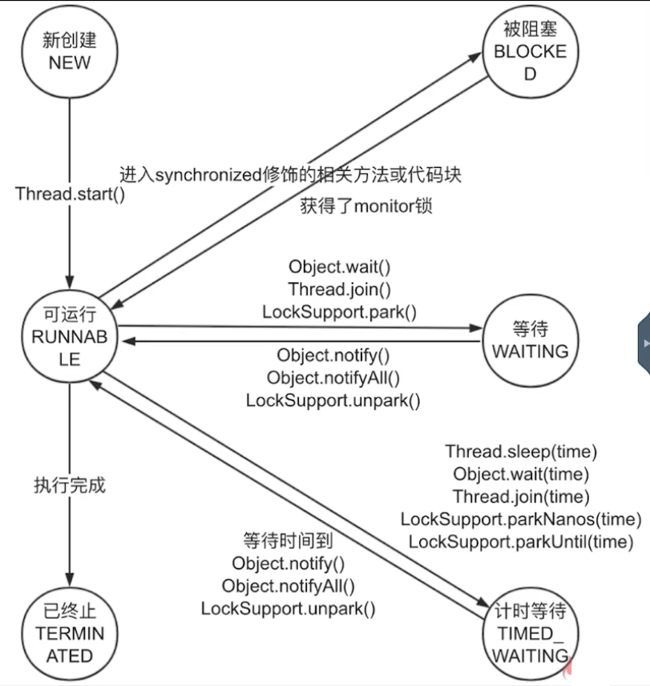
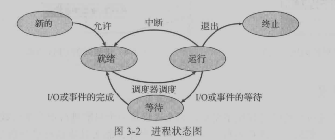
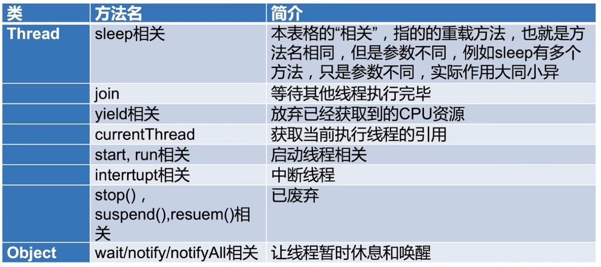

# 1. 并发基础

## 1.1. 创建线程方式

### 1.1.1. 方式

> 准确地讲，创建线程只有一种方式，就是构造Thread类。儿实现线程的执行单元有两种方式
- 继承Thread类，并重写run方法；
- 实现Runnable接口的run方法；

### 1.1.2. 两者区别

> 通常优先使用“实现Runnable接口”这种方式来自定义线程类。
- 如果使用线程时不需要使用Thread类的诸多方法，显然使用Runnable接口更为轻量。
  > 使用Thread会建立一个独立的线程，而Runnable可以放入线程池，节约资源
- Runnable接口出现，降低了线程对象和线程任务的耦合性。
- 由于Java“单继承，多实现”的特性，Runnable接口使用起来比Thread更灵活。
- Runnable接口出现更符合面向对象，将线程单独进行对象的封装。

## 1.2. 启动线程

### 1.2.1. 启动方式：

- 错误方式：直接调用run()方法，会由main线程执行
- 正确方式：调用strat方法：会启动新线程

### 1.2.2. 源码解析

### 1.2.3. 面试题

```
一个线程两次调用start()方法会出现什么情况？为什么？

既然start()方法会调用run()方法，为什么我们选择调用
start()方法，而不是直接调用run()方法呢？
```


## 1.3. 停止线程

### 1.3.1. 原理介绍

- **使用Interrupt来通知，而不是强制**
  - 是一种合作机制，
  - 用一个线程通知一个线程停止工作
  - Java没有能力强行停止线程，是否停止交给线程本身判断。（通过isinterrupted方法判断是否有中断通知）
    > 原因：
    > 线程的调用者本身可能并不知道线程到底在干什么，
    > 因此把决定权交给线程本身。
    > 线程停止的时候可能会做一些扫尾工作

### 1.3.2. 最佳实践

- 代码执行过程中接受到interrupt通知
  - 代码执行过程中接受到interrupt通知，
  - 使用isinterrupted方法，判断是否有通知，跳转到return
  - 线程如果进行迭代运算的话，可以使用isinterrupted方法进行判断
- 线程在sleep等阻塞状态中接收到interrupt通知
  - 收到通知后，sleep方法会抛出异常
- 循环+阻塞的两种表现
    <details>
    <summary style="color:red;">情况1</summary>

    ```java
  /**
  * 描述：     try/catch里面放while，可以中断成功
  * 这种情况下，sleep会抛出异常，try/catch针对的是整个while，导致线程退出
  */
  public class RightWayStopThreadWithSleep {
      public static void main(String[] args) throws InterruptedException {
          Runnable runnable = () -> {
              int num = 0;
              try {
                  while (num <= 300 && !Thread.currentThread().isInterrupted()) {
                      if (num % 100 == 0) {
                          System.out.println(num + "是100的倍数");
                      }
                      num++;
                  }
                  Thread.sleep(1000);
              } catch (InterruptedException e) {
                  e.printStackTrace();
              }
          };
          Thread thread = new Thread(runnable);
          thread.start();
          Thread.sleep(500);
          thread.interrupt();
      }
  }
    ```
    </details>

  <details>
  <summary style="color:red;">情况2</summary>

  ```java
  /**
  * 描述：     如果while里面放try/catch，会导致中断失效
  * try/catch针对的是循环循环的单个执行，之后依旧有循环要执行
  * **而抛出异常时，会把interrupt通知的标记位清除。**
  */
  public class CantInterrupt {
      public static void main(String[] args) throws InterruptedException {
          Runnable runnable = () -> {
              int num = 0;
              while (num <= 10000 && !Thread.currentThread().isInterrupted()) {
                  if (num % 100 == 0) {
                      System.out.println(num + "是100的倍数");
                  }
                  num++;
                  try {
                      Thread.sleep(10);
                  } catch (InterruptedException e) {
                      e.printStackTrace();
                  }
              }
          };
          Thread thread = new Thread(runnable);
          thread.start();
          Thread.sleep(5000);
          thread.interrupt();
      }
  }
  ```
  </details>

#### 1.3.2.1. 通常的停止方式

#### 1.3.2.2. 正确方式interrupt方式

- 优先选择：传递中断。指编写函数调用接口时，要把Exception抛出，而调用代码中进行try/catch
  <details>
  <summary style="color:red;">代码</summary>

  ```java
  import threadcoreknowledge.createthreads.ThreadStyle;

  /**
  * 描述：     最佳实践：catch了InterruptedExcetion之后的优先选择：在方法签名中抛出异常 那么在run()就会强制try/catch
  */
  public class RightWayStopThreadInProd implements Runnable {

      @Override
      public void run() {
          while (true && !Thread.currentThread().isInterrupted()) {
              System.out.println("go");
              try {
                  throwInMethod();
              } catch (InterruptedException e) {
                  Thread.currentThread().interrupt();
                  //保存日志、停止程序
                  System.out.println("保存日志");
                  e.printStackTrace();
              }
          }
      }

      /**
      * 这里不能try/catch，
      * 否则在上面的while中，只会在一次执行时打印出异常信息， 剩下的照常执行
      *
      * 调用者也无法认知到异常的出现
      */
      private void throwInMethod() throws InterruptedException {
              Thread.sleep(2000);
      }

      public static void main(String[] args) throws InterruptedException {
          Thread thread = new Thread(new RightWayStopThreadInProd());
          thread.start();
          Thread.sleep(1000);
          thread.interrupt();
      }
  }
  ```
  </details>

- 不想或无法传递：恢复中断

- 不应屏蔽中断

### 1.3.3. 错误的停止方法

- 被弃用的stop,suspend和resume方法
- 用volatile设置标记位

### 1.3.4. 停止线程相关函数解析

- interupt方法原理
- 判断是否已经中断
  - static boolean interrupted()
  - boolean isinterrupted()

### 1.3.5. 常见概念

- JRE与JDK
- Java 7 和 Java SE 7
- JDK1.8和Java8

### 1.3.6. 面试题

```
如何停止一个线程
```

<br /><br />

```
如何处理不可中断的堵塞，（如抢锁时ReentrantLock.lock()或者SocketI/O时无法响应中断，那应该怎么让该线程）
```


## 1.4. 线程生命周期

### 1.4.1. 状态说明

- New:处于NEW状态的线程此时尚未启动
- Runnable:可以是等待cpu分配资源的状态，也可以是已经分配了资源正在运行中的状态
- Blocked:等待锁的释放以进入同步区域
- Waiting:没有设置
- Timed Waiting
- Terminated


### 1.4.2. 状态转化图示



---

<details>
<summary style="color:red;">操作系统线程状态对比</summary>


</details>


### 1.4.3. 阻塞状态

一般习惯而言，Blocked，Waiting，Timed Waiting三种情况都被称为阻塞状态

### 1.4.4. 面试题

```
Java线程有几种状态，生命周期是什么
```

## 1.5. Thread和Object相关重要方法

### 1.5.1. 方法概述



### 1.5.2. wait,notify,notifyAll方法

- 三个方法都是必须获得monitor锁后才能调用(也就是说在synchronized内)
- notify只能唤醒一个线程
- 三个方法都属于object类
- 类似于Condition的功能

---


### 1.5.3. sleep方法

- 作用：
  - 进入TIMED_WAITING状态
  - 只让线程在预期的时间执行，其他时候不要占用CPU资源

- 特点：不释放锁,synchronized和lock锁都不会释放

- sleep响应中断：
  > 前面也有提
  - 抛出InterruptedException
  - 清除中断状态

- 推荐写法：
  > 底层依旧是sleep方法
  ```java
  TimeUnit.SECONDS.sleep(1);
  ```
  - 支持秒，小时等单位。更容易阅读
  - 参数小于0也不会抛出异常
    > sleep参数小于0会抛异常

### 1.5.4. join 方法

- 作用：
  - 因为新的线程加入了我们，所以我们要等他执行完再出发
  - main等待thread1执行完毕，注意谁等谁
- 遇见中断
  <details>
  <summary style="color:red;">测试代码</summary>

  ```java
  /**
  * 描述：     演示join期间被中断的效果
  */
  public class JoinInterrupt {
      public static void main(String[] args) {
          Thread mainThread = Thread.currentThread();
          Thread thread1 = new Thread(new Runnable() {
              @Override
              public void run() {
                  try {
                      mainThread.interrupt();
                      Thread.sleep(5000);
                      System.out.println("Thread1 finished.");
                  } catch (InterruptedException e) {
                      System.out.println("子线程中断");
                  }
              }
          });
          thread1.start();
          System.out.println("等待子线程运行完毕");
          try {
              thread1.join();
          } catch (InterruptedException e) {
              System.out.println(Thread.currentThread().getName()+"主线程中断了");
              thread1.interrupt();
          }
          System.out.println("子线程已运行完毕");
      }
  }
  ```

  
  </details>

  - main线程等待thread-0运行完毕
  - thread-0的run方法中调用mian线程引用的interrupt方法
  - 主线程抛出异常，中断。作为解决方式，也将thread-0中断
  - 此时两个catch块中的代码是并行执行的

- join期间main方法的状态：**Waiting**

---

- join原理以及等价java代码

  !! 带补 !!

### 1.5.5. yield方法

- 作用：
  - 释放CPU时间片
  - 但不会释放自己的锁
- 定位；
  - JVM不保证遵循。
  - 实际开发中较少使用
  - （但是AQS等中使用较多）
- yield和sleep区别：
  - sleep后，线程会进入阻塞状态TIMED_WAITING
  - 但是调用yield方法后，依旧是Runnable状态

### 1.5.6. start和run

### 1.5.7. stop,suspend,resume方法

### 1.5.8. 面试题

```
为什么线程通信的方法wait(),notify()和notifyAll()被定义在
Object类里？而sleep定义在Thread类里？

如果调用Thread.wait会怎样
```

wait(),notify(),notifyAll()是锁级别的操作，而锁是属于对象的。而一个线程可以持有多把锁。

如果把这些方法定义在Thread类中，就无法实现以上逻辑

<br /><br />

线程退出时，会自动执行notify，会影响整体流程，因此不要使用Thread类作为锁对象。

---

```
用3种方式实现生产者模式
```

---

```
Java SE 8和Java 1.8和JDK 8是什么关系，是同一个东西吗？
```

---

```
Join和sleep和wait期间线程的状态分别是什么？为什么？
```

---

```
为什么wait()需要在同步代码块中使用，而sleep不需要
```
为了让通信变得可靠，防止死锁以及永久等待的发生。因为wait后，必须通过notify唤醒。线程间必须配合执行。

sleep基本就是作用于本身线程，和其他线程基本没有什么关系。

---

```
wait/notify,sleep异同
```

- 相同：
  - 阻塞
  - 响应中断
- 不同
  - wait/notify要在同步方法中
    > 原因说一下
  - wait/notify会释放锁
  - sleep必须指定时间，wait可以不指定时间
  - 所属类
    > 原因说一下

---

```
手写生产者，消费者模式
```

<details>
<summary style="color:red;">代码</summary>

```java
import java.util.ArrayList;
import java.util.Date;
import java.util.LinkedList;
import java.util.List;

/**
 * 描述：     用wait/notify来实现生产者消费者模式
 */
public class ProducerConsumerModel {
    public static void main(String[] args) {
        EventStorage eventStorage = new EventStorage();
        Producer producer = new Producer(eventStorage);
        Consumer consumer = new Consumer(eventStorage);
        new Thread(producer).start();
        new Thread(consumer).start();
    }
}

class Producer implements Runnable {

    private EventStorage storage;

    public Producer(
            EventStorage storage) {
        this.storage = storage;
    }

    @Override
    public void run() {
        for (int i = 0; i < 100; i++) {
            storage.put();
        }
    }
}

class Consumer implements Runnable {

    private EventStorage storage;

    public Consumer(
            EventStorage storage) {
        this.storage = storage;
    }

    @Override
    public void run() {
        for (int i = 0; i < 100; i++) {
            storage.take();
        }
    }
}

class EventStorage {

    private int maxSize;
    private LinkedList<Date> storage;

    public EventStorage() {
        maxSize = 10;
        storage = new LinkedList<>();
    }

    public synchronized void put() {
        while (storage.size() == maxSize) {
            try {
                wait();
            } catch (InterruptedException e) {
                e.printStackTrace();
            }
        }
        storage.add(new Date());
        System.out.println("仓库里有了" + storage.size() + "个产品。");
        notify();
    }

    public synchronized void take() {
        while (storage.size() == 0) {
            try {
                wait();
            } catch (InterruptedException e) {
                e.printStackTrace();
            }
        }
        System.out.println("拿到了" + storage.poll() + "，现在仓库还剩下" + storage.size());
        notify();
    }
}
```
</details>

---

```
一个线程只打印奇数，一个线程只打印偶数，交替打印
```

 <details>
 <summary style="color:red;">代码</summary>

 ```java
/**
 * 描述：     两个线程交替打印0~100的奇偶数，用wait和notify
 */
public class WaitNotifyPrintOddEveWait {

    private static int count = 0;
    private static final Object lock = new Object();

    public static void main(String[] args) {
        new Thread(new TurningRunner(), "偶数").start();
        new Thread(new TurningRunner(), "奇数").start();
    }

    //1. 拿到锁，我们就打印
    //2. 打印完，唤醒其他线程，自己就休眠
    static class TurningRunner implements Runnable {

        @Override
        public void run() {
            while (count <= 100) {
                synchronized (lock) {
                    //拿到锁就打印
                    System.out.println(Thread.currentThread().getName() + ":" + count++);
                    lock.notify();
                    if (count <= 100) {
                        try {
                            //如果任务还没结束，就让出当前的锁，并休眠
                            lock.wait();
                        } catch (InterruptedException e) {
                            e.printStackTrace();
                        }
                    }
                }
            }
        }
    }
}
 ```
 </details>

## 1.6. 线程属性

### 1.6.1. 总览


### 1.6.2. id

### 1.6.3. 名称

### 1.6.4. 守护线程

### 1.6.5. 线程优先级

### 1.6.6. 各属性总结

### 1.6.7. 面试题

```
什么时候我们需要设置守护线程？
```

---

```
我们应该如何应用线程优先级来帮助程序运行？有哪些禁忌？
```

---

```
不同的操作系统如何处理优先级问题？
```


## 1.7. 线程的未捕获异常

## 1.8. 多线程导致的问题

### 1.8.1. 线程安全

### 1.8.2. 性能问题

# 2. Java 内存模型

## 2.1. 三大结构模型

## 2.2. JMM 是什么

## 2.3. 重排序

## 2.4. 可见性

## 2.5. JMM 的抽象：本地内存和主内存

## 2.6. happens-before 原则

## 2.7. volatile 关键字

## 2.8. 并发编程三大特性

### 2.8.1. 可见性

### 2.8.2. 原子性

### 2.8.3. 有序性

# 3. 死锁

# 4. 常见问题


