# 基础

## fail-last 机制

[博客](https://juejin.cn/post/6879291161274482695)

## 枚举

[java guide]()

[菜鸟教程](https://www.runoob.com/java/java-enum.html)

[Java 枚举(enum) 详解7种常见的用法](https://blog.csdn.net/qq_27093465/article/details/52180865)

```java
enum Color 
{ 
    RED, GREEN, BLUE; 
} 
```

**等价于**

```java
class Color
{
     public static final Color RED = new Color();
     public static final Color BLUE = new Color();
     public static final Color GREEN = new Color();
}
```

## 静态内部类与非静态内部类

[博客](https://blog.csdn.net/yaomingyang/article/details/79363631)


- 非静态内部类不可以使用static，只有静态内部类才能够定义静态的成员变量与成员方法。

- 在外部类的成员的访问上，有比较大的限制。
  - 一般的非静态内部类，可以随意的访问外部类中的成员变量与成员方法。即使这些成员方法被修饰为private(私有的成员变量或者方法)。
  - 静态内部类只能引用外部类中的静态的成员（变量或方法），而不能够访问非静态的变量。

- 最大区别
  - 通常情况下，在一个类中创建成员内部类的时候，有一个强制性的规定，即内部类的实例一定要绑定在外部类的实例中。非静态内部类在编译完成之后会隐含地保存着一个引用，该引用是指向创建它的外围类，
  - 但是静态内部类没有指向外部类的引用,也就是说
    - 它的创建是不需要依赖外围类的创建。
    - 它不能使用任何外围类的非static成员变量和方法。
  - example
    <details>
    <summary>代码</summary>

    ```java
    public class Singleton {

        //声明为 private 避免调用默认构造方法创建对象
        private Singleton() {
        }

      // 声明为 private 表明静态内部该类只能在该 Singleton 类中被访问
        private static class SingletonHolder {
            private static final Singleton INSTANCE = new Singleton();
        }

        public static Singleton getUniqueInstance() {
            return SingletonHolder.INSTANCE;
        }
    }
    ```
    当 Singleton 类加载时，静态内部类 SingletonHolder 没有被加载进内存。只有当调用 getUniqueInstance() 方法从而触发 SingletonHolder.INSTANCE 时 SingletonHolder 才会被加载，此时初始化 INSTANCE 实例，并且 JVM 能确保 INSTANCE 只被实例化一次。

    这种方式不仅具有延迟初始化的好处，而且由 JVM 提供了对线程安全的支持。
    </details>


```
牢记两个差别：

一、如是否可以创建静态的成员方法与成员变量(静态内部类可以创建静态的成员，而非静态的内部类不可以)

二、对于访问外部类的成员的限制(静态内部类只可以访问外部类中的静态成员变量与成员方法，而非静态的内部类即可以访问所有的外部类成员方法与成员变量)。
```


## hashcode与equals

两个不同的对象可能会返回相同的hashcode

Java 程序设计中一个重要原则：

如果两个对象是相等的，它们的 equals() 方法应该要返回 true，它们的 hashCode() 需要返回相同的结果。

但有时候面试不会问得这么直接，他会问你：两个对象的 hashCdoe() 相同，它的 equals() 方法一定要返回 true，对吗？

那答案肯定不对。因为我们不能保证每个程序设计者，都会遵循编码约定。

有可能两个不同对象的hashCode()会返回相同的结果，但是由于他们是不同的对象，他们的 equals() 方法会返回false。

如果两个对象的 hashCode() 相同，将来就会在散列表中产生哈希冲突，但是它们不一定是相同的对象呀。

当产生哈希冲突时，我们还得通过 equals() 方法进一步判断两个对象是否相同，equals() 方法不一定会返回 true。

这也是为什么 Java 官方推荐我们在一个类中，最好同时重写 hashCode() 和 equals() 方法的原因。


## IO

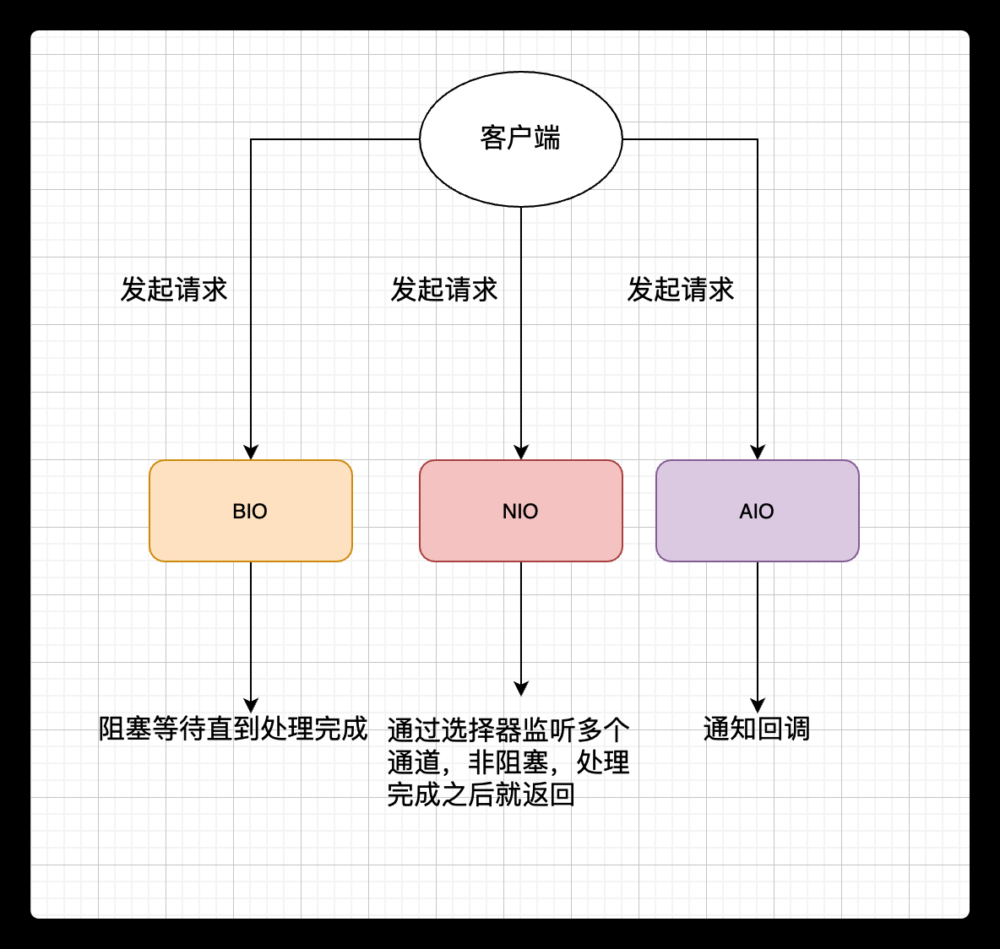

bio(jdk1.0) -> nio(jdk1.4) -> aio(jdk1.7)

- bio
  > 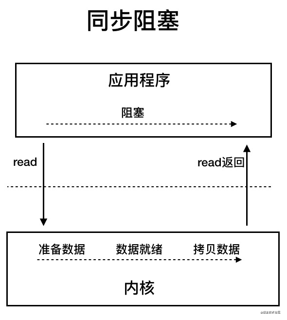 
  > 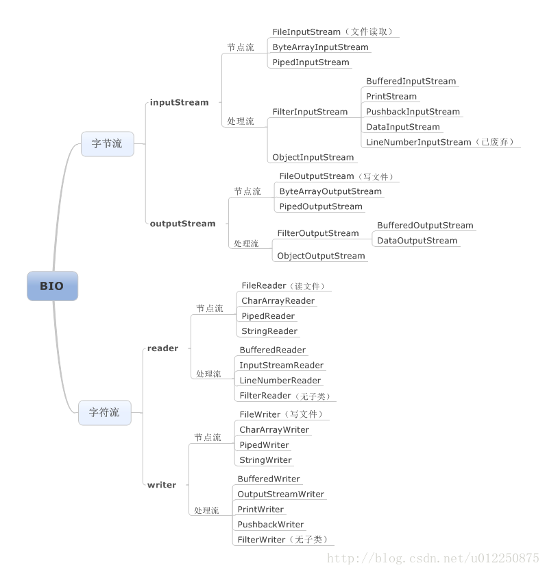
- nio
  > 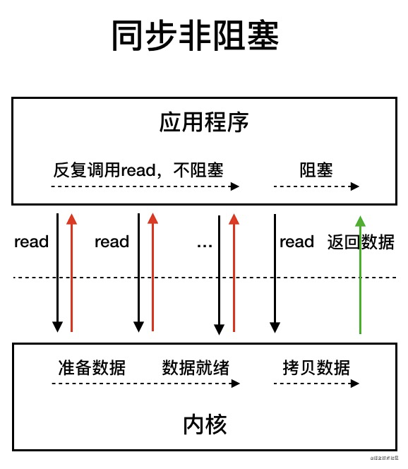 
- aio
  > 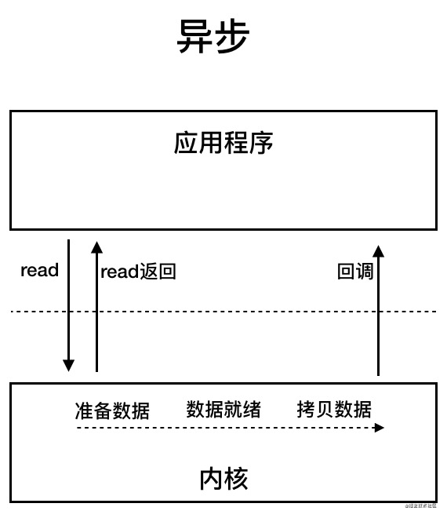 

## 集合

- 区别
  - Arraylist 和 Vector 的区别?
  - Arraylist 与 LinkedList 区别?
  - ConcurrentHashMap 和 Hashtable 的区别
  - 比较 HashSet、LinkedHashSet 和 TreeSet 三者的异同
  - HashMap和HashTable区别
  - HashMap与HashSet区别（HashSet底层基于HashMap）
  - HashMap和TreeMap区别

- 线程安全(不安全--安全)
  - ArrayList--vector
  - LinkedList--SynchronizedList
  - HashMap--ConcurrentHashMap/HashTable

- ArrayList扩容机制

- HashMap拉链法，以及链表-->红黑树的条件
- HashMap 的长度为什么是 2 的幂次方
- HashMap多线程死循环问题

## Java内存模型（简称JMM）

> Java Memory Model

### 摘抄1

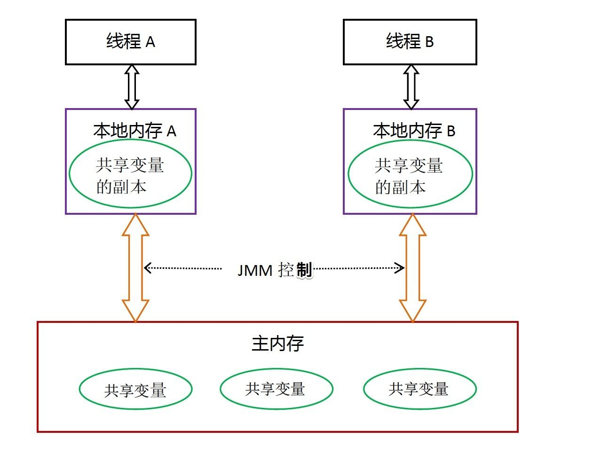

- 所有的共享变量都存在主内存中。
- 每个线程都保存了一份该线程使用到的共享变量的副本。
- 如果线程A与线程B之间要通信的话，必须经历下面2个步骤：
  - 线程A将本地内存A中更新过的共享变量刷新到主内存中去。
  - 线程B到主内存中去读取线程A之前已经更新过的共享变量。

**所以，线程A无法直接访问线程B的工作内存，线程间通信必须经过主内存。**

注意，**根据JMM的规定，线程对共享变量的所有操作都必须在自己的本地内存中进行，不能直接从主内存中读取**。

所以线程B并不是直接去主内存中读取共享变量的值，而是先在本地内存B中找到这个共享变量，发现这个共享变量已经被更新了，然后本地内存B去主内存中读取这个共享变量的新值，并拷贝到本地内存B中，最后线程B再读取本地内存B中的新值。

JMM通过控制主内存与每个线程的本地内存之间的交互，来提供内存可见性保证。

---

- JMM和Java运行时内存区域差别与联系：
  - 区别
    - 两者是不同的概念层次。
    - JMM是抽象的，他是用来描述一组规则，通过这个规则来控制各个变量的访问方式，围绕原子性、有序性、可见性等展开的。
    - 而Java运行时内存的划分是具体的，是JVM运行Java程序时，必要的内存划分。
  - 联系
    - 都存在私有数据区域和共享数据区域。
    - 一般来说，JMM中的主内存属于共享数据区域，他是包含了堆和方法区；
    - 同样，JMM中的本地内存属于私有数据区域，包含了程序计数器、本地方法栈、虚拟机栈。

---

多线程情况下的 运行时内存模型的表现？？？

---

### 笔记1

#### JMM与volatile

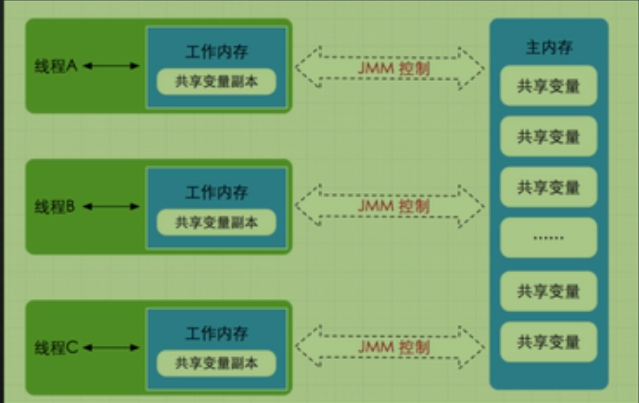


- volatile作用:
    <details>
    <summary style="color:red;">如何答得全面</summary>

    ```
    解释一下volatile

    首先简单地说一下作用
    谈一下JMM
    谈一下JMM原子操作
    说一下volatile底层原理：MESI缓存一致性协议以及总线嗅探机制
    ```
    </details>

  - 保证变量的内存可见性
    - 保证多线程之间的共享变量的内存可见性
    - 如果一个变量用volatile修饰
    - 尽管每个线程都有该变量的副本，
    - 但是任一线程修改了自己变量副本的值
    - 其他线程都可以马上感知到
  - 禁止volatile变量与普通变量重排序
    <details>
    <summary style="color:red;">原理与说明</summary>

    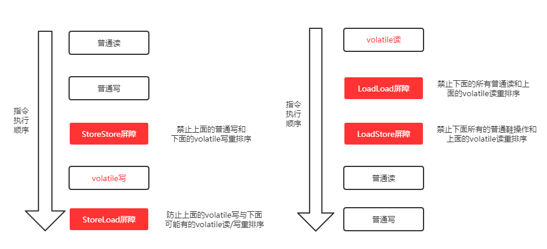
    > 再逐个解释一下这几个屏障。注：下述Load代表读操作，Store代表写操作

    - LoadLoad屏障：对于这样的语句Load1; LoadLoad; Load2，在Load2及后续读取操作要读取的数据被访问前，保证Load1要读取的数据被读取完毕。
    - StoreStore屏障：对于这样的语句Store1; StoreStore; Store2，在Store2及后续写入操作执行前，这个屏障会把Store1强制刷新到内存，保证Store1的写入操作对其它处理器可见。
    - LoadStore屏障：对于这样的语句Load1; LoadStore; Store2，在Store2及后续写入操作被刷出前，保证Load1要读取的数据被读取完毕。
    - StoreLoad屏障：对于这样的语句Store1; StoreLoad; Load2，在Load2及后续所有读取操作执行前，保证Store1的写入对所有处理器可见。它的开销是四种屏障中最大的（冲刷写缓冲器，清空无效化队列）。在大多数处理器的实现中，这个屏障是个万能屏障，兼具其它三种内存屏障的功能

    <br /><br />

    - volatile与普通变量的重排序规则:
      - 如果第一个操作是volatile读，那无论第二个操作是什么，都不能重排序；
      - 如果第二个操作是volatile写，那无论第一个操作是什么，都不能重排序；
      - 如果第一个操作是volatile写，第二个操作是volatile读，那不能重排序。

    ```java
    // step 1，是普通变量的写，step 2是volatile变量的写，那符合第2个规则，这两个steps不能重排序。而step 3是volatile变量读，step 4是普通变量读，符合第1个规则，同样不能重排序。
    
    // 声明变量
    int a = 0; // 声明普通变量
    volatile boolean flag = false; // 声明volatile变量

    // 以下两个变量的读操作是可以重排序的
    int i = a; // 普通变量读
    boolean j = flag; // volatile变量读
    ```
    </details>

- volatile与锁
  - 在保证内存可见性这一点上，volatile有着与锁相同的内存语义，所以可以作为一个“轻量级”的锁来使用。
  - 但由于volatile仅仅保证对单个volatile变量的读/写具有原子性，而锁可以保证整个临界区代码的执行具有原子性。
  - **所以在功能上，锁比volatile更强大；在性能上，volatile更有优势。**

- JMM数据原子操作
  > <details>
  > <summary style="color:red;">示例展示</summary>
  > 
  > 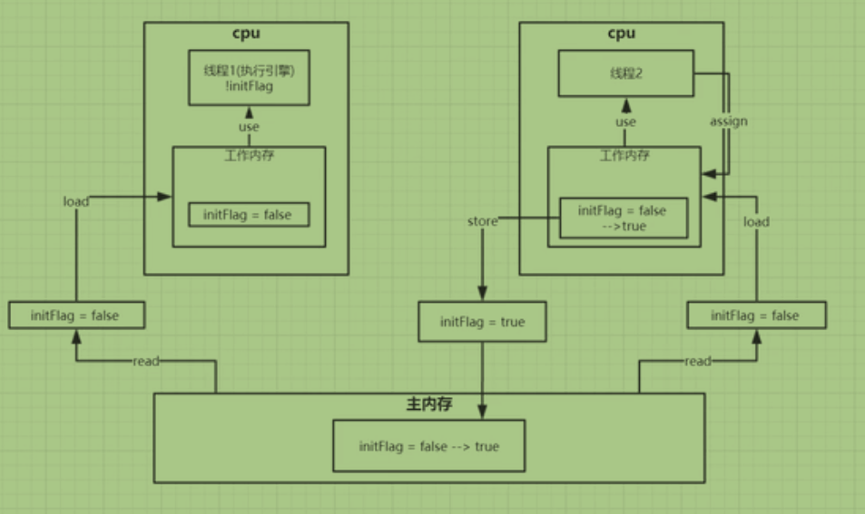 
  > 
  > > **线程与线程之间是无法交互的。只有通过主内存才可以交互**
  > </details>
  - read(读取）:从主内存读取数据
  - load(载入）:将主内存读取到的数据写入工作内存
  - use(使用）:从工作内存读取数据来计算
  - assign(赋值）:将计算好的值重新赋值到工作内存中
  - store(存储）:将工作内存数据写入主内存
  - write(写入）:将store过去的变量值赋值给主内存中的变量
  - lock(锁定）:将**主内存变量**加锁，标识为线程独占状态。其他线程将无法读或写
  - unlock(解锁）:将主内存变量解锁，解锁后其他线程可以锁定该变量

- JMM 缓存不一致性问题解决方式：
  - 总线加锁
    ```
    cpu从主内存读取数据到高速缓存，会在总线对这个数据加锁，这样其它cpu没法
    去读或写这个数据，直到这个cpu使用完数据释放锁之后其它cpu才能读取该数据
    ```
  - MESI缓存一致性协议+cpu总线嗅探机制

- volatile内存可见性原理：
  > 三个方面：MESI缓存一致性协议， cpu总线嗅探机制， lock
  > 
  > <details>
  > <summary style="color:red;">图解</summary>
  > 
  > 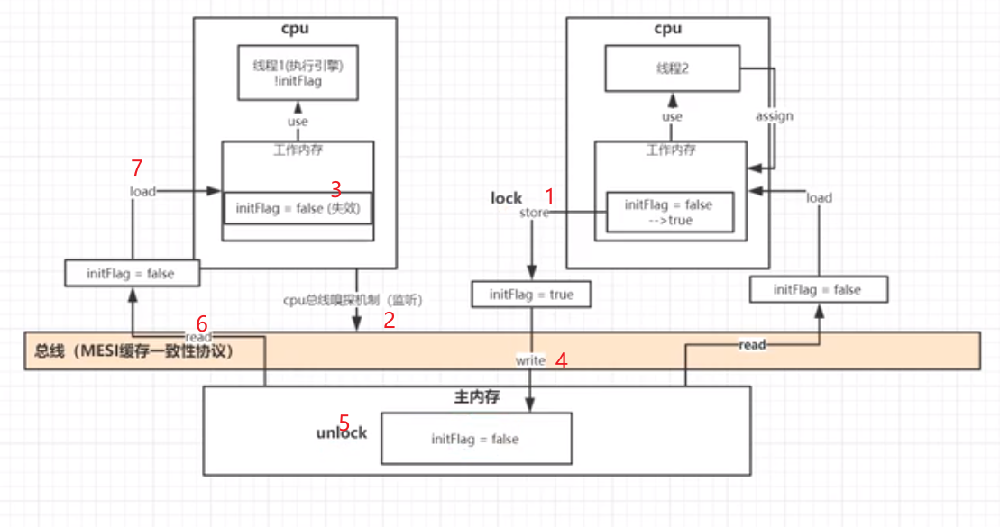 
  > > 图解
  > </details>
  - volatile底层实现主要是通过汇编lock前缀指令。
  - lock会将当前处理器缓存行的数据**立即写回到系统内存**
    - cpu和内存间的数据交互都会经过总线
    - 当一个线程执行store原子操作时。数据会通过总线到主内存。
    - store时会进行一个lock原子操作
  - 这个写回内存的操作会引起在其他CPU里缓存了该内存地址的数据无效（MESI）
    - 上面也提到了，会经过总线
    - MESI缓存一致性性协议中有一个cpu总线嗅探机制
    - cpu总线嗅探机制会一直监控着经过总线的数据流动
    - 如果经过总线的数据，在其他的cpu的工作内存中也有副本，那么其他cpu中的副本就会被置为无效
    - 因为被设置为了无效，其他cpu会重新从主内存中重新read。如果有锁会等待
      > 注意，这就是上面进行lock的原因。如果不进行lock，在回写之前进行read，会读到原来的值
    - 回写(write原子操作)完后会进行unlock原子操作。之后unlock后才能被读取到

- 并发编程**三大特性**
  > volatile可以保证可见性与有序性，但不保证原子性。保证原子性需要synchronized锁机制
  - 原子性：就是说一个操作不能被打断，要么执行完要么不执行，类似事务操作，Java 基本类型数据的访问大都是原子操作，long 和 double 类型是 64 位，在 32 位 JVM 中会将 64 位数据的读写操作分成两次 32 位来处理，所以 long 和 double 在 32 位 JVM 中是非原子操作，也就是说在并发访问时是线程非安全的，要想保证原子性就得对访问该数据的地方进行同步操作，譬如 synchronized 等。
  - 可见性：就是说当一个线程对共享变量做了修改后其他线程可以立即感知到该共享变量的改变，从 Java 内存模型我们就能看出来多线程访问共享变量都要经过线程工作内存到主存的复制和主存到线程工作内存的复制操作，所以普通共享变量就无法保证可见性了；Java 提供了 volatile 修饰符来保证变量的可见性，每次使用 volatile 变量都会主动从主存中刷新，除此之外 synchronized、Lock、final 都可以保证变量的可见性。
  - 有序性：就是说 Java 内存模型中的指令重排不会影响单线程的执行顺序，但是会影响多线程并发执行的正确性，所以在并发中我们必须要想办法保证并发代码的有序性；在 Java 里可以通过 volatile 关键字保证一定的有序性，还可以通过 synchronized、Lock 来保证有序性，因为 synchronized、Lock 保证了每一时刻只有一个线程执行同步代码相当于单线程执行，所以自然不会有有序性的问题；除此之外 Java 内存模型通过 happens-before 原则如果能推导出来两个操作的执行顺序就能先天保证有序性，否则无法保证，关于 happens-before 原则可以查阅相关资料。

- volatile不保证原子性
  ```
  情景：10个线程，同时对一个volatile标志的变量num进行1000次++。最后num为多少？

  小于等于10000
  ```
  - 现在以2个线程A,B进行说明
  - A线程对工作内存中的num进行++，为1。
  - B线程也对工作内存中的num进行了++，为1
  - 可能A线程较快完成++操作，最先加锁，因此B线程工作内存中的num的值失效。此次失效，**导致了一次`++`的丢失。**
  - 如果下一次B进行第二次++（A和B总共三次），且抢到了锁，那么回写为2，而不是3（丢失一次++）
  - 也就是说**MESI缓存一致性协议中经过总线的数据会导致其他cpu工作内存副本失效**这一点会导致volatile不保证原子性

#### 重排序

- 指令重排序：
  >  
  - 在不影响单线程程序执行结果的前提下，计算机为了最大限度的发挥机器性能，会对机器指令重排序优化
  - 代码示例
    ```java
    for(int i = 0;i<1000000;i++){
      x = 0;
      y = 0;
      a = 0;
      b = 0;
      Thread one = new Thread(()->{
        a = y;
        x = 1;
      });
      Thread two = new Thread(()->{
         b = x;
         y = 1;
      });
    }
    // 最终结果可能有三种：
    // a = 0;b = 0，两个线程争抢资源,执行了前面的代码，后才执行赋1操作
    // a = 1;b = 0，one线程执行了赋1操作后，再执行two线程的b = x
    // a = 1;b = 1，发生了重排序
    ```

##### 重排序规范：as-if-serial

不管怎么重排序，**单线程**程序的执行结果不能被改变。

也就是说编译器和处理器不会对**存在数据依赖关系**的操作做重排序。

比如以下代码：

```java
a = x;
y = a;
```

##### 重排序规范：happens-before

```
是一个给程序员使用的规则，只要程序员在写代码的时候遵循happens-before规则，JVM就能保证指令在多线程之间的顺序性符合程序员的预期。
```

- 引入：就像上面发生重排序的例子。
  - 一方面，程序员需要JMM提供一个强的内存模型来编写代码；
    > 指的是有更多规定，意外情况越少越好。
  - 另一方面，编译器和处理器希望JMM对它们的束缚越少越好，这样它们就可以最可能多的做优化来提高性能，希望的是一个弱的内存模型。
    > 指的是希望通过重排序优化性能
  - 而对于程序员，JMM提供了happens-before规则（JSR-133规范），满足了程序员的需求--**简单易懂，并且提供了足够强的内存可见性保证**。
  - 换言之，程序员只要遵循happens-before规则，那他写的程序就能保证在JMM中具有强的内存可见性。

- happens-before关系的定义如下：
  - 如果一个操作happens-before另一个操作，那么第一个操作的执行结果将对第二个操作可见，而且第一个操作的执行顺序排在第二个操作之前。
  - **两个操作之间存在happens-before关系，并不意味着Java平台的具体实现必须要按照happens-before关系指定的顺序来执行。如果重排序之后的执行结果，与按happens-before关系来执行的结果一致，那么JMM也允许这样的重排序。**

```
happens-before关系本质上和as-if-serial语义是一回事。

as-if-serial语义保证单线程内重排序后的执行结果和程序代码本身应有的结果是一致的，
happens-before关系保证正确同步的多线程程序的执行结果不被重排序改变。
```

- 原则：
  - 1.程序顺序原则：即在一个线程内必须保证语义串行性，也就是说按照代码顺序执行。
  - 2.锁规则：解锁（unlock)操作必然发生在后续的同一个锁的加锁（lock)之前，也就是说，如果对于一个锁解锁后，再加锁，那么加锁的动作必须在解锁动作之后（同一个锁）。
  - 3.volatile规则：volatile变量的写，先发生于读，这保证了volatile变量的可见性，简单的理解就是，volatile变量在每次被线程访问时，都强迫从主内存中读该变量的值，而当该变量发生变化时，又会强迫将最新的值刷新到主内存，任何时刻，不同的线程总是能够看到该变量的最新值。
  - 4.线程启动规则：线程的start()方法先于它的每一个动作，即如果线程A在执行线程B的start方法之前修改了共享变量的值，那么当线程B执行start方法时，线程A对共享变量的修改对线程B可见
  - 5.传递性：A先于B,B先于C那么A必然先于C
  - 6.线程终止规则：线程的所有操作先于线程的终结，Thread.join()方法的作用是等待当前执行的线程终止，假设在线程B终止之前，修改了共享变量，线程A从线程B的join方法成功返回后，线程B对共享变量的修改将对线程A可见。
  - 7.线程中断规则：对线程interrupt()方法的调用先行发生于被中断线程的代码检测到中断事件的发生，可以通过Thread.interrupted()方法检测线程是否中断。
  - 8.对象终结规则：对象的构造函数执行，结束先于finalize()方法

```
程序次序规则：一段代码在单线程中执行的结果是有序的。注意是执行结果，因为虚拟机、处理器会对指令进行重排序（重排序后面会详细介绍）。虽然重排序了，但是并不会影响程序的执行结果，所以程序最终执行的结果与顺序执行的结果是一致的。故而这个规则只对单线程有效，在多线程环境下无法保证正确性。

锁定规则：这个规则比较好理解，无论是在单线程环境还是多线程环境，一个锁处于被锁定状态，那么必须先执行unlock操作后面才能进行lock操作。

volatile变量规则：这是一条比较重要的规则，它标志着volatile保证了线程可见性。通俗点讲就是如果一个线程先去写一个volatile变量，然后一个线程去读这个变量，那么这个写操作一定是happens-before读操作的。

传递规则：提现了happens-before原则具有传递性，即A happens-before B , B happens-before C，那么A happens-before C

线程启动规则：假定线程A在执行过程中，通过执行ThreadB.start()来启动线程B，那么线程A对共享变量的修改在接下来线程B开始执行后确保对线程B可见。

线程终结规则：假定线程A在执行的过程中，通过制定ThreadB.join()等待线程B终止，那么线程B在终止之前对共享变量的修改在线程A等待返回后可见。
```

# 设计模式

## 代理

- 动态代理
- 动态代理
- cglib代理

# 并发

## ThreadLocal

[ThreadLocal详解](https://www.cnblogs.com/fsmly/p/11020641.html)

<br /><br />


ThreadLocal提供了线程内存储变量的能力，这些变量不同之处在于每一个线程读取的变量是对应的互相独立的。通过get和set方法就可以得到当前线程对应的值。

ThreadLocal的静态内部类ThreadLocalMap为每个Thread都维护了一个数组table，ThreadLocal确定了一个数组下标，而这个下标就是value存储的对应位置。。

<br /><br />

- 对于某一ThreadLocal来讲，他的索引值i是确定的，在不同线程之间访问时访问的是不同的table数组的同一位置即都为table[i]，只不过这个不同线程之间的table是独立的。
- 对于同一线程的不同ThreadLocal来讲，这些ThreadLocal实例共享一个table数组，然后每个ThreadLocal实例在table中的索引i是不同的。

<br /><br />

- ThreadLocal和Synchronized都是为了解决多线程中相同变量的访问冲突问题，不同的点是
  - Synchronized是通过线程等待，牺牲时间来解决访问冲突
  - ThreadLocal是通过每个线程单独一份存储空间，牺牲空间来解决冲突，并且相比于Synchronized，ThreadLocal具有线程隔离的效果，只有在线程内才能获取到对应的值，线程外则不能访问到想要的值。

## Callable Future FutureTask

## java线程状态

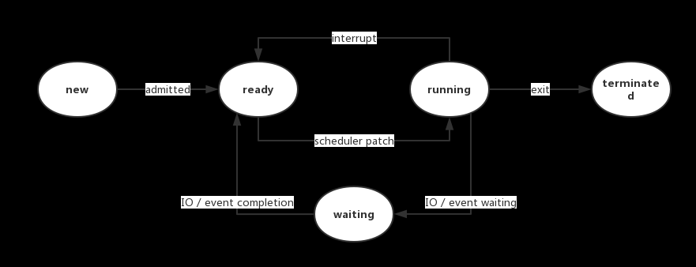

- NEW:处于NEW状态的线程此时尚未启动。这里的尚未启动指的是还没调用Thread实例的start()方法
- RUNNABLE:表示当前线程正在运行中。处于RUNNABLE状态的线程在Java虚拟机中运行，也有可能在等待CPU分配资源。
  > Java线程的RUNNABLE状态其实是包括了传统操作系统线程的ready和running两个状态的。
- BLOCKED:处于BLOCKED状态的线程正等待锁的释放以进入同步区
- WAITING:等待状态。处于等待状态的线程变成RUNNABLE状态需要其他线程唤醒。调用如下3个方法会使线程进入等待状态：
  - Object.wait()：使当前线程处于等待状态直到另一个线程唤醒它；
  - Thread.join()：等待线程执行完毕，底层调用的是Object实例的wait方法；
  - LockSupport.park()：除非获得调用许可，否则禁用当前线程进行线程调度。
- TIMED_WAITING:超时等待状态。线程等待一个具体的时间，时间到后会被自动唤醒。调用如下方法会使线程进入超时等待状态：
  - Thread.sleep(long millis)：使当前线程睡眠指定时间；
  - Object.wait(long timeout)：线程休眠指定时间，等待期间可以通过notify()/notifyAll()唤醒；
  - Thread.join(long millis)：等待当前线程最多执行millis毫秒，如果millis为0，则会一直执行；
  - LockSupport.parkNanos(long nanos)： 除非获得调用许可，否则禁用当前线程进行线程调度指定时间；
  - LockSupport.parkUntil(long deadline)：同上，也是禁止线程进行调度指定时间；
- TERMINATED:终止状态。此时线程已执行完毕。

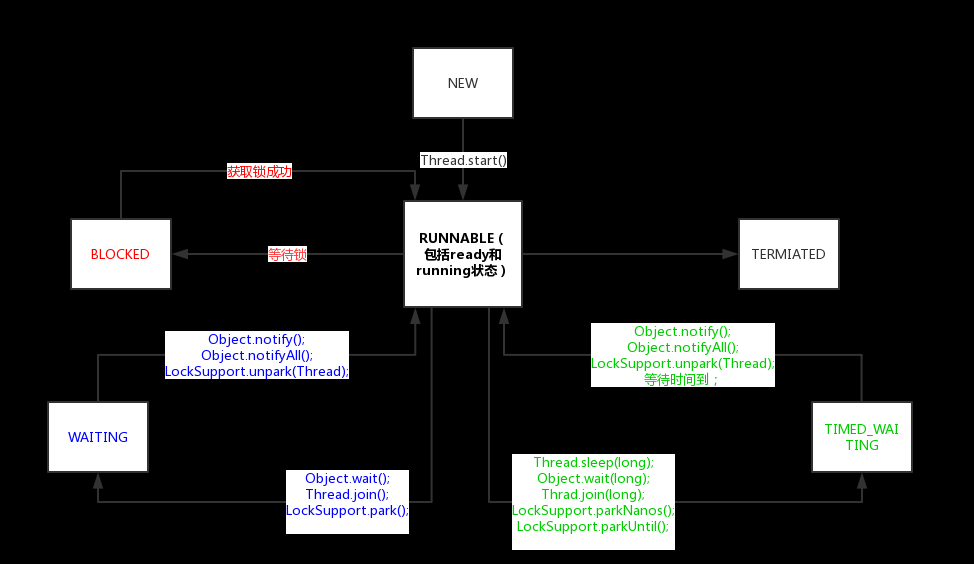

## ThreadGroup与优先级

默认将父线程（当前执行new Thread的线程）线程组设置为自己的线程组。

ThreadGroup管理着它下面的Thread，ThreadGroup是一个标准的向下引用的树状结构，这样设计的原因是防止"上级"线程被"下级"线程引用而无法有效地被GC回收。

Java中线程优先级可以指定，范围是1~10。但是并不是所有的操作系统都支持10级优先级的划分（比如有些操作系统只支持3级划分：低，中，高），Java只是给操作系统一个优先级的参考值，线程最终在操作系统的优先级是多少还是由操作系统决定。

Java默认的线程优先级为5，线程的执行顺序由调度程序来决定，线程的优先级会在线程**被调用之前设定**。

通常情况下，高优先级的线程将会比低优先级的线程有**更高的几率**得到执行。我们使用方法Thread类的setPriority()实例方法来设定线程的优先级。

**Java程序中对线程所设置的优先级只是给操作系统一个建议，操作系统不一定会采纳。而真正的调用顺序，是由操作系统的线程调度算法决定的。**

守护线程默认的优先级比较低。一个线程默认是非守护线程，可以通过Thread类的setDaemon(boolean on)来设置为守护线程。

线程组的优先级会限制线程的优先级。也就是说，如果某个线程优先级大于线程所在线程组的最大优先级，那么该线程的优先级将会失效，取而代之的是线程组的最大优先级。

- 线程组作用
  - 获取当前的线程组名字
  - 复制线程组 enumerate
  - 线程组统一异常处理。重写uncaughtException

总结来说，线程组是一个树状的结构，每个线程组下面可以有多个**线程**或者**线程组**。线程组可以起到统一控制线程的优先级和检查线程的权限的作用。

## 通信模型

- 有两种并发模型
  - 消息传递并发模型
  - 共享内存并发模型

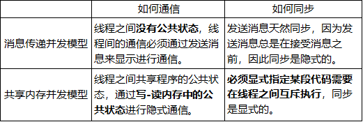

**在Java中，使用的是共享内存并发模型。**

## 锁

- 偏向锁
  - 出现原因：大多数情况下**锁不仅不存在多线程竞争，而且总是由同一线程多次获得**
  - 作用：
    ```
    大白话就是对锁置个变量，如果发现为true，代表资源无竞争，则无需再走各种加锁/解锁流程。
    如果为false，代表存在其他线程竞争资源，那么就会走后面的流程。
    ```
    - 偏向锁会偏向于第一个访问锁的线程，
    - 如果在接下来的运行过程中，该锁没有被其他的线程访问，则持有偏向锁的线程将永远不需要触发同步。
    - 也就是说，**偏向锁在资源无竞争情况下消除了同步语句，连CAS操作都不做了，提高了程序的运行性能**。
  - 实现原理

- 轻量锁
- 重量锁


<br /><br />


- 锁记录
  - 位置：JVM会为每个线程在**当前线程的栈帧中**创建用于存储**锁记录**的空间，我们称为Displaced Mark Word
  - 作用：对于轻量锁对象，如果锁


