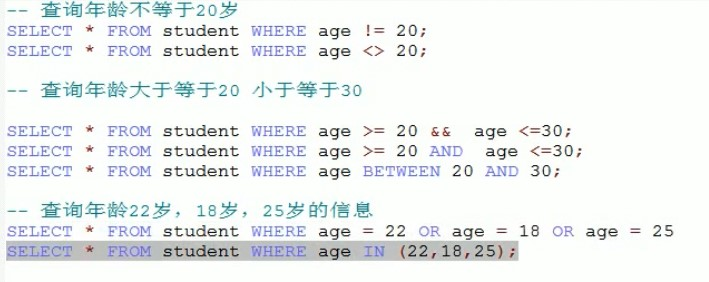
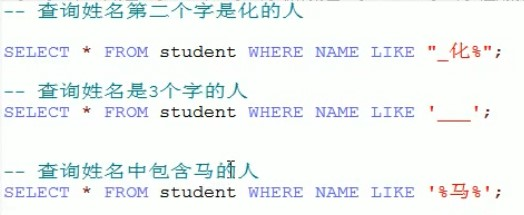
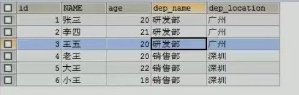
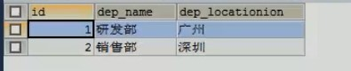
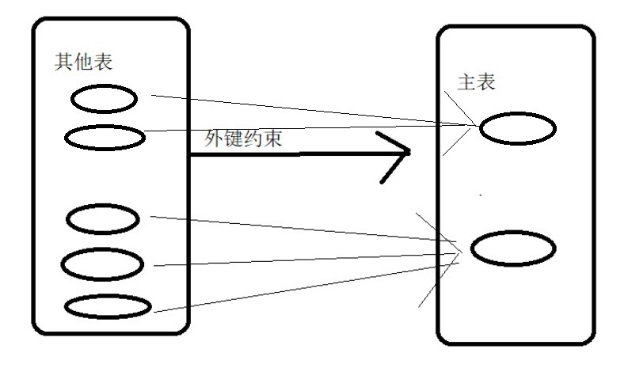

# 1. 反射：框架设计的灵魂
>也要看看代码，很重要

## 1.1. 基本知识
* 框架：半成品软件。在框架的基础上 进行软件开发，简化代码。开发框架用得到反射，但是使用框架并不太能用到，但能加深理解
* 反射：将类的各个组成部分封装为其他对象，这就是反射机制
    * 好处：
        1. 可以在程序运行的过程中操作这些对象。
        2. 可以降低程序耦合性，提高可扩展性
* 获取Class类对象的三种方式：
    1. 从第一个阶段：Class.forName("全类名")：将字节码文件加载近内存，返回Class对象
        * 多用于配置文件，将类名定义在配置文件中，读取文件加载类
    2. 从第二个阶段：通过类名的属性Class
        * 多用于参数的传递
    3. 从第三个阶段：对象.getClass()(封装到Object类中)
        * 多用于对象获取字节码的方式
    * 结论：同一个字节码文件（.class）在一次程序运行过程中，只会被加载一次，不论通过哪一种方式获取的class对象
* Class对象功能
    * 获取功能：
        1. 获取成员变量
            * Field	getDeclaredField(String name) 获取所有成员变量中，以name命名的成员变量
            * Field[]	getDeclaredFields() 获取所有的成员变量，包括private
            * Field	getField(String name) 指定名称的public修饰的成员变量
            * Field[]	getFields() 获取所有public修饰的成员变量
        2. 获取构造方法
            * Constructor<?>[] getConstructors()
            * Constructor<T> getConstructor(类<?>...parametertypes)
            * Constructor<T>  getDeclaredConstructor(类<?>...parametertypes)
            * Constructor<?>[]  getDeclaredConstructors()
        3. 获取成员方法
            * Method[] getMethods()
            * Method getMethod(String name,类<?>...parametertypes)
            * Method[] getDeclaredMethods()
            * Method getDeclaredMethod(String name,类<?>...parametertypes)
        4. 获取类名
            * getName()

* Field对象功能
    * 获取 Object	get(Object obj)
    * 设置 void	set(Object obj, Object value)
    * 忽略访问权限修饰符的安全检查 void	setAccessible(boolean flag)//Methods inherited from class java.lang.reflect.AccessibleObject

* Constructor：构造方法
    * 创建对象 newInstance(Object initargs)
    * 当要使用**无参**构造方法进行创建对象时，既可以通过Class对象获得构造器来获得，也可以通过Class类中的newInstance()来获得
* Method：成员方法
    * 执行方法 	invoke(Object obj, Object... args) 参数是对象以及方法参数列表
    * 获取方法名称 String getName()
* 案例：
    * 需求：写一个“框架”，可以帮我们创建任意类的对象并且执行任意方法
        * 实现：在不改变该类任意代码的前提下，但可以创建任意类对象并执行任意方法
            1. 配置文件
            2. 反射
        * 步骤：
            1. 将需要创建的对象的全类名和需要执行的方法定义在配置文件中
            2. 在程序中加载和读取配置文件
            3. 使用反射技术来加载类文件进入内存
            4. 创建对象
            5. 执行方法

## 1.2. 原理图解
 
>Field Constructor Method 都是类。Class类中有这三个类
# 2. 注解：

## 2.1. 基本概念
* 注解与注释
    * 注解概念：说明程序的，给电脑看。
        * 进一步：注解是一系列元数据，它提供数据用来解释程序代码，但是注解并非是所解释的代码本身的一部分。注解对于代码的运行效果没有直接影响。
    * 注释概念：用文字描述程序，给程序员看
## 2.2. 作用
1. 编译检查
    ```java
    @Override
    public String toString() {
      return name+"   "+age;
    }
    /*
    此处的overide用来检查toString是否是复写了父类的方法。
    */
    ```
2. 代码分析，通过代码里标识的注解对代码进行分析，（使用反射）
3. 编写文档：通过代码中标识的注解生成doc文档

## 2.3. java中预定义注解
* @Overrides :检测被该注解标注的方法是否重写父类方法(或实现接口接口)
* @Deprecated :将该注解标注的内容以过时，有更好的替代内容
* @SuppressWarnings :压制警告
    * 一般添加"all"参数，@SuppressWarnings("all")，放在类或者方法上面，使不显示警告
* @SafeVarargs：参数安全类型注解。它的目的是提醒开发者不要用参数做一些不安全的操作,它的存在会阻止编译器产生 unchecked 这样的警告。它是在 Java 1.7 的版本中加入的。
    ```java
    @SafeVarargs // Not actually safe!
        static void m(List<String>... stringLists) {
        Object[] array = stringLists;
        List<Integer> tmpList = Arrays.asList(42);
        array[0] = tmpList; // Semantically invalid, but compiles without warnings
        String s = stringLists[0].get(0); // Oh no, ClassCastException at runtime!
    }
    /* 上面的代码中，编译阶段不会报错，但是运行时会抛出 ClassCastException 这个异常，所以它虽然告诉开发者要妥善处理，但是开发者自己还是搞砸了。

    Java 官方文档说，未来的版本会授权编译器对这种不安全的操作产生错误警告。 */
    ```
* @FunctionalInterface：函数式接口注解，这个是 Java 1.8 版本引入的新特性。函数式编程很火，所以 Java 8 也及时添加了这个特性。函数式接口 (Functional Interface) 就是一个具有一个方法的普通接口。
    ```java
    @FunctionalInterface
    public interface Runnable {
        /**
         * When an object implementing interface <code>Runnable</code> is used
         * to create a thread, starting the thread causes the object's
         * <code>run</code> method to be called in that separately executing
         * thread.
         * <p>
         * The general contract of the method <code>run</code> is that it may
         * take any action whatsoever.
         *
         * @see     java.lang.Thread#run()
         */
        public abstract void run();
    }
    /* 我们进行线程开发中常用的 Runnable 就是一个典型的函数式接口，上面源码可以看到它就被 @FunctionalInterface 注解。

    可能有人会疑惑，函数式接口标记有什么用，这个原因是函数式接口可以很容易转换为 Lambda 表达式。这是另外的主题了，自己去查 */
    ```
## 2.4. 自定义注解
* 格式：
    元注解
    public @interface 注解名称{
        属性列表;
    }
* 本质：注解就是一个接口，该接口默认继承下面一个接口<br>
    public interface myAnnotation extends java.lang.annotation.Annotation{}
* 属性：
     * 定义：接口中可以定义的成员方法
     * 要求返回值类型只能以下几种   ：
        * 基本数据类型
        * String
        * 枚举
        * 注解
        * 以上数据类型的数组
     * 赋值：
        1. 定义了属性，在使用时需要给属性赋值，但也可以通过default关键字给属性默认初始化值，那么在使用注解时，就不必要进行赋值。
        2. 但如果只有一个属性值，那么在赋值时只要在括号中填入值即可
        3. 当为数组中只有一个值时，大括号可以省略。
        ```java
        @myAnnotation(age=2,name="Anna",anno=@myannno2,strs={"aa","bb"})
        @myAnnotation(2)
        ```
## 2.5. 元注解
> 元注解是可以注解到注解上的注解，或者说元注解是一种基本注解，但是它能够应用到其它的注解上面。(前两个较常用)

* @Target：用于描述注解能作用的位置,前三个重要,后面的6个可以自己查看源文档
    ```java
    摘自javadoc文档前三个：
        /** Class, interface (including annotation type), or enum declaration */
        TYPE,//类上

        /** Field declaration (includes enum constants) */
        FIELD,//成员变量上

        /** Method declaration */
        METHOD,//方法上

    全部：
        ElementType.ANNOTATION_TYPE 可以给一个注解进行注解
        ElementType.CONSTRUCTOR 可以给构造方法进行注解
        ElementType.FIELD 可以给属性进行注解
        ElementType.LOCAL_VARIABLE 可以给局部变量进行注解
        ElementType.METHOD 可以给方法进行注解
        ElementType.PACKAGE 可以给一个包进行注解
        ElementType.PARAMETER 可以给一个方法内的参数进行注解
        ElementType.TYPE 可以给一个类型进行注解，比如类、接口、枚举
    ```
* @Retention:描述注解被保留的一个阶段
    * @Retention(value = RetentionPolicy.RUNTIME):当前描述的注解会保留到class字节码文件中并被jvm读取到,所以在程序运行时可以获取到它们。（一般是这个）
    * 如果是CLASS,那么会被加载到字节码文件中，但不会被jvm读取到
    * 如果是SOURCE,那么不会加载到字节码文件中。
* @Documented：描述注解是否被抽取到doc文档中，如果在注解的定义中有标注@Documented，那么就会被加到doc文档中<br>
* @Inherited：描述注解是否被子类继承。@myAnnotation被@Inherited描述，那么如果@myAnnotation描述一个类，那么这个类的子类也会从父类继承这个注解。
* @Repeatable：表示注解中属性值可以取多个，其中要了解容器注解。
    ```java
    //什么是容器注解呢？就是用来存放其它注解的地方。它本身也是一个注解。
    @interface Persons {//容器注解
        Person[]  value();
    }


    @Repeatable(Persons.class)//括号中填入容器注解
    @interface Person{
        String role() default "";
    }


    @Person(role="artist")
    @Person(role="coder")
    @Person(role="PM")
    public class SuperMan{

    }
    ```

## 2.6. 使用（解析）注解

* 本质：获取注解中定义的属性值，把配置文件的工作交给注解来完成，简化配置操作。后期注解大多数用来替换配置文件。
* 步骤：
    1. 获取注解定义位置的对象（Class,Method,Field等）
    2. 获取指定的注解（getAnnotation）
    3. 调用注解中的抽象方法获取配置属性值

    ```java
     //摘抄部分代码，详情可以去看代码文件

     // 1 解析注解
        // 获取该类的字节码文件对象
        Class<AnnotationTest> annotationTestClsss = AnnotationTest.class;

        // 2获取上边的注解对象
        ProAnnotation pro = annotationTestClsss.getAnnotation(ProAnnotation.class);// 其实就是在内存中区生成了一个该注解接口的子类实现对相关
        /* 
        相当于：
        public class proImp1 implements ProAnnotation{
            public String className(){
                return "_1_java_base.base_strengthen.annotation.case_test.Person";
            }
            public String methodName(){
                return "eat";
            }
        }
        也就是说在调用getAnnotation时，就会把上面的那个类创建一个对象病返回给你，在通过接口接收
         */


        // 3调用注解对象中定义的抽象方法（也就是属性）获取返回值
        String className = pro.className();
        String methodName = pro.methodName();
    ```

## 2.7. 小结

* 以后大多数时候是使用注解而不是自定义注解
* 使用者：
    1. 编译器（检测程序是否编译正确，如@Override）
    2. 解析（测试）程序用（比如那个TestCheck,如果没有这个程序，注解毫无意义）。
        * 进一步：当开发者使用了Annotation修饰了类、方法、Field 等成员之后，这些 Annotation 不会自己生效，必须由开发者提供相应的代码来提取并处理 Annotation 信息。这些处理提取和处理 Annotation 的代码统称为 APT（Annotation Processing Tool)。
* 注解基本上认为不是程序的一部分，可以理解为相当于一个标签
* 本次这里有两个case，一个是通过注解代替配置文件，一个是通过注解检测是否有bug并输出到bug.txt


# 3. MySQL

## 3.1. 数据库基本概念
1. 英文名称：Database
2. 什么是数据库：
    * 用于存储和管理数据的仓库
3. 数据可特点：
    1. 持久化存储数据，其实数据库就是一个文件系统
    2. 方便存储和管理数据，使用了统一的方式操作数据库--SQL
4. 常用数据库软件：

## 3.2. 基本命令
* cmd->services.msc打开服务
* MySQL打开与关闭（cmd下）
    1. net start mysql 开启mysql（管理员权限打开cmd）
    2. net stop mysql 关闭mysql（管理员权限打开cmd）
* 登陆与退出（cmd下）
    * 本地：
        1. 登陆：mysql -uroot -proot 
            >-u:user，后面直接加用户名 -p:password,后面直接加密码
            >也可以写成--user=root --password=root
            >或者不直接加，只输入-p（即：mysql -uroot -p,之后输入密码会以*反显）
        2. 退出：exit
    * 远程：
        1. 登陆： mysql -h127.0.0.1 -uroot -proot
            >-h后直接加上ip地址，本机为127.0.0.1
        2. 退出：exit 或者 quit
        3. 登陆： mysql --host=127.0.0.1 --user=root --password=root
            >相当于全称，这里有两个-
## 3.3. 数据结构

* 安装目录
    * 配置文件 my.ini
* 数据目录
    * 计算机硬件和MySQL软件合称MySQL服务器
    * 一个数据库就是一个文件夹
    * 一个数据库中可以存放多张表，表对应文件夹中的.frm结尾文件
    * 每个表中存放多条数据记录

# 4. SQL

## 4.1. 什么是SQL
    Structured Query Language：结构话查询语言。
    其实就是操作所有关系型数据库(Relational DBMS)的规则
    每一种数据库操作方式存在不一样的地方，称为“方言”

## 4.2. 通用语法
1. SQL可以单行或者多行书写，以分号结尾
2. 使用table制表符增强可读性
3. 数据库不区分大小写，但关键字推荐使用大写
4. 3种注释
    1. 单行注释：
        1. -- 内容（两个横杠和**一个空格**）
        2. #内容 （方言 MySQL特有书写方式，不必要加空格）
    2. 多行注释：/* 内容 */

## 4.3. SQL语句分类
1. DDL(data definition Language)
    用来定义数据库对象：数据库，表，列等。关键字：Creat，drop，alter等
2. DML(Data Manipulation Language)
    用来对数据库中的数据进行增删。关键字：insert，delete，update等。
3. DQL(Data Query Language)
    用来查询表中的记录（数据）。关键字select，where等
4. DCL(Data Control Language)
    数据控制语言，用来定义数据库访问权限和安全级别，及创建用户。关键字：GRANT，REVOKE等

## 4.4. 数据类型

## 4.5. 语法
### 4.5.1. DDL(操作数据库)
* 对数据库整体
    1. C(Create) 创建
        * create database 数据库名
            >重名时会报错
        * create database if not exists 数据库名
            > 当指定数据库名不存在时才创建，存在也不会报错
        * create database 数据库名 character set gbk
            > 以指定字符集创建数据库，这里为gbk
    2. R(Retrieve) 查询
        * show databases;
            >额外知识：
            >information_schema用来MySQL中的一些信息，里面存放的是视图（以后才学），而不是表，并且并不对应物理文件
            > mysql用来存放数据库中的核心数据
            > performance_schema用来存放调整数据库性能的一些数据
            >这是三个都最好不要改
        * show creat database 数据库名称
            > 查看某一个数据库字符集：查询某个数据库创建语句
    3. U(Update) 修改
        * alter database 数据库名称 character set 字符集名称
            >修改某个数据库字符集（utf8，没有-）
    4. D(Delete) 删除
        * drop database 数据库名称
            >一般不会做的操作
        * drop database if exists 
            >当数据库存在时才删除
    5. 使用数据库
        * select database()
            >查询正在使用的数据库名称
        * use 数据库名称
            >使用数据库，相当于进入数据库
* 对表整体
    1. C(Create) 创建
        * create table 表名(
            列名1 数据类型1,
            列名2 数据类型2,
            列名3 数据类型3,
            ......
            列名n 数据类型n;
            );
            >创建表，注意小括号和逗号，最后一列没有逗号
            ```sql
            //常用数据类型例：
            age int
            score double(5,2)//最多有5位，小数点后保留两位
            riqi date 2000-12-12
            jjutiriqi datetime //格式举例：2000-12-12 12:12:12
            shijianchuo timestamp //格式举例：2000-12-12 12:12:12
            //时间戳：如果不给这个字段赋值，那么默认使用当前系统时间赋值
            name varchar(20)
            //字符串类型，最多20个字符 
            ```
            ```sql
            //例：
            create table student(
                id int,
                name varchar(32),
                age int,
                score double(4,1),
                birthday date,
                inserttime timestamp
            );
            ```
        * create 新表 like 已经存在表
            >创建一个新的表和已经存在的一个表结构相同，也就是赋值表
    2. R(Retrieve) 查询
        * show tables
            >查询一个数据库中所有表的名称
        * desc 表名
            >查询表结构
        * show create table 表名
            >查询表的字符集
    3. U(Update) 修改
        * alter table 表名 rename to 新表名;
            >修改表名
        * alter table 表名 character set 字符集;
            >修改表的字符集
        * alter table 表名 add 列名 数据类型;
            >增加一列
        * alter table 表名 drop 列名;
            >删除列
        * alter table 表名 change 旧列名 新列名 新列名类型
            >修改列名称，类型
        * alter table 表名 modify 列名 新的类型
            >只修改列的类型
    4. D(Delete) 删除
        * drop table (if exists) 表名
            >删除表
        * truncate table 表名
            >删除整个表再创建一个一模一样结构的表 
            >相当于一下两条语句整合
            >create 新表 like 已经存在表;
            >drop table 表名
### 4.5.2. DML(增删改表中数据)
1. 添加数据
    * insert into 表名(列名1,列名2.....列名n) values(值1,值2...值n),(值1,值2...值n).....;
        >往表中插入数据
        * 注意：
            1. 列名和值要一一对应
            2. 如果表名后没有写列名，那么默认给所有列添加值。但建议都写上，不要偷懒
            3. 除了数字类型，其他数据类型都要使用引号引起来，单引号双引号都行
2. 删除数据
    * delete from 表名 [where 条件]
        >把满足条件的数据从指定表中删除。例： delete from student where id=1;
        * 注意：
            1. !!!!!如果不加条件，就会删除表中所有数据!!!!!!
            2. 但不推荐上述操作，因为会一条一条删除，效率太低，推荐使用 **truncate table 表名**;--删除整个表，然后再创建一个一模一样的空表
3. 修改数据
    * update 表名 set 列名1=值1,.....[where 条件];
        >例：UPDATE student SET age=20,score=100 WHERE id=2;
        * 注意：
            1. 如果不加任何条件，就会把所有表中所有记录都修改，比如把score都改为100
### 4.5.3. DQL(表内数据修改查询)
* select * from 表名
    >查询表中所有数据
1. 整体语法：
    >所有语句都涉及到
<pre>
    select 
        字段列表
    from
        表名列表
    where
        条件列表
    group by
        分组字段
    having
        分组之后的条件
    order by
        排序
    limit
        分页限定
</pre>

2. 基础查询：
    1. 多个字段查询
        * select 字段名 from 表名;
            >例：-- 查询姓名和年龄：SELECT NAME,age FROM student;
            >一般不使用*号，阅读性太差,也可以分分行，多加写注释
            >
    2. 去除重复结果集
        * select distinct 字段名 from 表名;
            > 如果指定的多个字段名都相同，才可以去重
    3. 计算列
        * select 字段1+字段2 from 表名;
            >计算两个字段相加结果,这里可以进行四则运算。
            >例：SELECT id,score+age FROM student;
            >
            >如果有null参与的运算结果都是null，因此有下面表达式：
        * select 字段1+ifnull(表达式1,表达式2) from 表名;
            >表达式1：判断那个字段为null。
            >表达式2：为null时的替换值。
            >例：select id+ifnull(score,0) from student;
    4. 起别名
        * select 字段1+字段2 as 新名称 from 表名;
            >将某个结果起一个别名用来显示出来,as也能用**一个或者多个空格**表示。
            >此时多分行比较好
3. 条件查询
    1. where 条件
    2. 运算符
        >
        >
        >例：select * from student where age>15
        >
    3. 注意：
        * null不能使用=和<>来判断，应该使用 is和is not.
            >例：select * from student where age is null
            > select * from student where age is not null
    4. like：
        * _:单个任意字符
        * %:多个任意字符
        >例： select name from student where '李%'
        >
4. 排序查询
    * select 字段 from 表名 order by 排序字段1 排序方式1,排序字段2 排序方式2....;
        >排序方式：
        >ASC:升序（默认）
        >DESC:降序
        >越靠后，排序优先度越低，只有靠第一种排序相同时，那么才考虑之后的排序方式
5. 聚合函数:将一列数据作为一个整体，进行**纵向**的计算。
    1. count:计算个数
        * 一般选择非空的列
        * 或者使用 count(*)（不推荐）
    2. max:计算最大值
    3. min:计算最小值
    4. sum:计算和；
    5. avg:计算平均值
    * 注意：聚合函数计算会自动**排除null值**，可以通过ifnull()来避免
    * 语法：select 函数(字段名) from 表名
      或者select 函数(ifnull(字段名,值)) from 表名
        >例：
        >
        
6. 分组查询
    * group by 分组字段;
        >例：select sex,AVG(math),count(id) from student group by sex;
        >selct 后有什么，后面就显示什么
        ><br> 
        >注意：分组之后查询字段：分组字段(比如sex,如果用每个人都不同的字段分组，就没有意义了)，聚合函数
        >例：<br>
    * 添加判断语句：
        >普通where添加在前面，分组之后条件判断加载后面并且用having关键字
        >where和having区别（**面试会考**）：
        1. where在分组之前进行限定，不满足条件不参与分组， having在分组之后进行限定，不满足条件不会被查询出来
        2. where不可以进行聚合函数的判断，而having可以
        >[查看格式](#453-dql表内数据修改查询)
        >例：
        >
7. 分页查询
    * limit 开始的索引,每页查询的条数
        >例：<br>select *from student limit 0,3;-- 从0开始查，显示三条记录。（第一页）
        > select * from student limit 3,3;-- 从3开始，显示3条，（第二页）
        >开始索引=（当前页码-1）*每页显示条数
    * limit这个语法是SQL的一个**方言**
### 4.5.4. DCL
无

## 4.6. 约束
### 4.6.1. 概念
>对表中的数据进行限定，保证数据的正确性，有效性和完整性
### 4.6.2. 分类
* 主键约束 pramary key
* 非空约束 not null
* 唯一约束 unique
* 外键约束 foreign key
### 4.6.3. 非空约束
1. 在创建表是添加约束
    * 在数据定义后面加 空格+not null
    例：
    ```SQL
    creat table stu{
        id int,
        name varchar(20) not null -- name为非空约束
    };
    ```
2. 删除非空约束(就是修改表的一个字段)
    * alter table 表名 modify 字段名 字段类型
        >也就是说后面什么都不加，就取消掉了约束
        >[跳转到列数据类型修改](#451-ddl操作数据库)
3. 创建表后添加非空约束
    * alter table 表名 modify 字段名 字段类型 not null
        >和上面同理
### 4.6.4. 唯一约束
* 注意：MySQL中唯一约束限定的列的值可以有多个null
1. 创建表是添加唯一约束
    * 在数据定义后面加 空格和unique
        ```SQL
        creat table ste{
            id int,
            phont_number varchar(20) unique
        };
        ```
2. 删除唯一约束
    * alter table 表名 drop index 字段名
        >唯一约束有时候也称为唯一索引，所有有drop index
        >[跳转到列数据类型修改](#451-ddl操作数据库)
3. 创建表后添加唯一约束
    * alter table 表名 modify 字段名 字段类型 unique
        >和非空约束添加同理，但当添加时，该列数据必须不能有重复的，否则会报错
### 4.6.5. 主键约束
* 含义：非空且唯一。是表中记录的唯一标识
* 限制：一张表只能有一个字段为主键

1. 创建表时添加主键约束
    * 后面加primary key即可
        ```SQL
        creat table stu(
            id int primary key,
            name varchar(20)
        );
        ```
2. 删除主键约束
    * alter table 表名 drop primary key;
        >主键只有一个，所以不需要指定
3. 创建表后添加主键
    * alter table 表名 modify 字段名 字段类型 primary key;
        >不能有重复数据以及空数据。
4. 自动增长
    * 概念：如果某一列是数值类型的，使用auto_increment可以完成值的自动增长
    * 基本上都是和主键一起使用，但也可以分开使用，但是这种情况很少
    * 语法：
        ```SQL
        creat table stu(
            id int primary key auto_increment,
            name varchar(20)
        );
        ```
        >也可以手动设置，但每次增长是上次数据+1（也就是等价于最大值+1）
### 4.6.6. 外键约束
* 情景
    >有时数据会有冗余
    >例：
    >
    >每个部门就在一个地方，不需要每条员工信息都记一次
    ><br>解决办法：
    >创建两张表
    >一张表记员工信息（employee表），一张表记部门所在地（department表）
    > 
    >此时如果删除一个部门，另一张表中还有人对应那个部门，显然不合理。应该先删除人员。
* 为解决上述问题使用外键约束，即让表与表之间产生关系，从而确保数据的正确性。
1. 添加表时添加外键
    ```SQL
    creat table 表名(
        ...
        外键列
        constraint 外键名称(自己起名，不能重复) foreign key 外键列名称 references 主表名称(主表列名称)
        -- 一般都关联主键列，当然也能关联其他列
        -- 主表必须先存在，此处主表为部门表
        -- 必须先删除关联表记录，再删除主表记录
    )

    -- 例：
    creat table employee(
        ...
        dep_id int, -- 外键对应主表的主键   --注意，此时该句不是最后一句，要加逗号
        constraint emp_dept foreign key (dep_id) references  department(id)
    )
    ``` 
    大致图解：
    
    >此时若其他表记录与主表记录相互关联，那么就不能对该条主表记录进行删除
    >同样，新加的其他表记录也必须与主表关联记录的所有数据中来取。例如这里新建员工体条目dep_id只能取1和2
2. 删除外键
    * alter table 其他表的名 drop foreign key 外键名（自己起的那个）
3. 创建表之后，添加外键
    * alter table 其他表的名 add constraint 外键名称（自己起名，不能重复） foreign key 外键列名称 references 主表名称(主表列名称)
    >中文括号是备注，英文括号中需要填东西

## 4.7. 多表操作
## 4.8. 范式
## 4.9. 数据库备份和还原